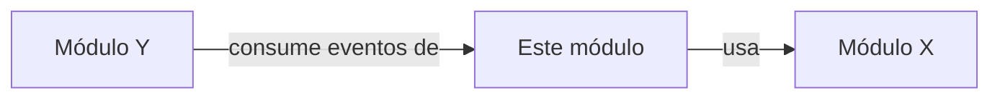

---
modulo: ""
owner: ""
estado: activo
version: ""
sla: ""
actualizado_en: ""
---

# Módulo: {Nombre del Módulo}

> **Owner**: {equipo o persona}
> **SLA**: {disponibilidad objetivo, ej: 99.9%}
> **Estado**: activo | deprecado | en-construccion

---

## Qué es

> Descripción en 2-3 frases del propósito del módulo.
> Qué problema de negocio resuelve y quién lo usa.

---

## Scope

**Responsabilidades de este módulo:**

- TODO

**Fuera del scope de este módulo:**

- TODO

---

## Conceptos clave

> Términos del dominio específicos de este módulo.
> Ver también `../../../99-glosario/glosario.md`.

| Término | Descripción |
| ------- | ----------- |
| TODO    |             |

---

## Relaciones con otros módulos

| Módulo | Tipo de relación              | Descripción |
| ------ | ----------------------------- | ----------- |
| TODO   | depende de / es consumido por |             |

---

## Documentación del módulo

| Documento                                | Contenido                               |
| ---------------------------------------- | --------------------------------------- |
| [modelo-dominio.md](./modelo-dominio.md) | Entidades, agregados, reglas de negocio |
| [arquitectura.md](./arquitectura.md)     | Diseño interno y patrones usados        |
| [api-referencia.md](./api-referencia.md) | Endpoints expuestos                     |
| [eventos.md](./eventos.md)               | Eventos emitidos y consumidos           |
| [modelo-datos.md](./modelo-datos.md)     | Esquema de datos propio                 |
| [integraciones.md](./integraciones.md)   | Sistemas externos que usa               |
| [decisiones/](./decisiones/)             | ADRs específicos del módulo             |

---

## Contacto y escalación

- **Owner técnico**: TODO
- **Canal de soporte**: TODO
- **Runbooks**: `../../../05-infraestructura/runbooks/`
