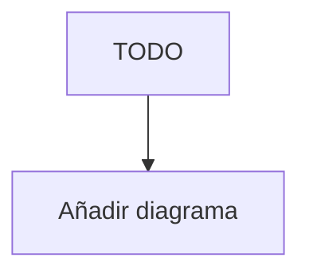

---
id: ""
tipo: feature
titulo: "TDD: {Título de la Feature}"
estado: borrador
tickets: []
epica: ""
responsable: ""
revisores: []
ai_context:
  dominios: []
  modulo_path: ""
  componentes: []
  etiquetas: []
  nivel_riesgo: bajo
creado_en: ""
actualizado_en: ""
---

# TDD: {ID_DESARROLLO} — {Título de la Feature}

> **Referencia al spec**: [spec.md](./spec.md)

## Resumen técnico

> Una o dos frases describiendo el enfoque técnico elegido.

## Diagrama de arquitectura / flujo



## Componentes afectados

| Componente | Tipo de cambio                 | Descripción       |
| ---------- | ------------------------------ | ----------------- |
| TODO       | nuevo / modificado / eliminado | Descripción breve |

## Diseño detallado

### Modelo de datos

> Cambios en el esquema de base de datos, nuevas entidades, migraciones necesarias.

```sql
-- TODO: DDL o pseudoesquema
```

### API / Contratos

> Endpoints nuevos o modificados. Formato de request/response.

```yaml
# TODO: OpenAPI snippet o descripción informal
```

### Lógica de negocio

> Descripción del flujo principal, reglas aplicadas, decisiones de implementación.

### Manejo de errores

> Errores esperados, cómo se propagan, qué devuelve el sistema al cliente.

## Alternativas descartadas

| Alternativa | Por qué se descartó        |
| ----------- | -------------------------- |
| TODO        | Razón técnica o de negocio |

## Riesgos e impacto

| Riesgo | Probabilidad | Mitigación |
| ------ | ------------ | ---------- |
| TODO   | media        | TODO       |

## Plan de testing

> Qué tipos de tests se añadirán. Casos de prueba clave.
> Referencia a `docs/04-ingenieria/estrategia-testing.md`.

- [ ] Tests unitarios: TODO
- [ ] Tests de integración: TODO
- [ ] Tests e2e: TODO (si aplica)

## Checklist de implementación

- [ ] Diseño técnico revisado y aprobado
- [ ] Migraciones de base de datos preparadas
- [ ] Tests escritos y pasando
- [ ] Documentación de API actualizada
- [ ] Módulo afectado actualizado en `docs/03-modulos/`
- [ ] Sin `TODO` sin resolver en este documento
