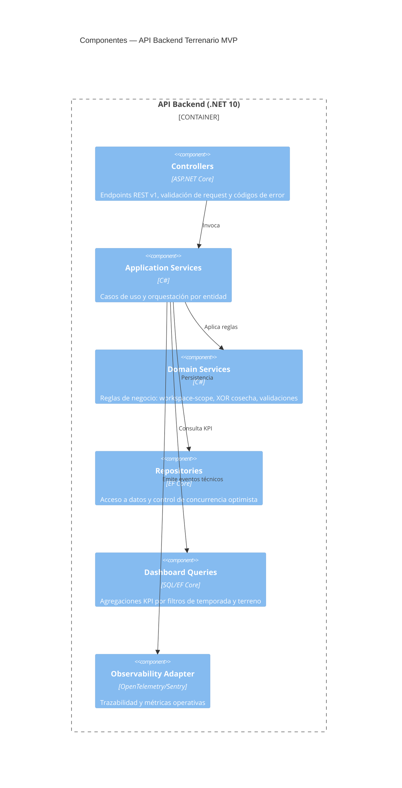

---
bloque: 02-arquitectura
documento: componentes
actualizado_en: "2026-07-18"
---

# Componentes del Sistema

> Diagrama C4 Nivel 3. Describe los componentes principales dentro de cada contenedor del MVP.
> Para el contexto del sistema completo, ver `vision-general.md`.

---

## Componente: API Core (MVP)

**Contenedor padre**: API Backend (`.NET 10 + ASP.NET Core Controllers`)
**Responsabilidad**: Exponer endpoints REST `/api/v1`, aplicar validación de entrada y control de acceso por Workspace.
**Owner**: equipo técnico del producto

### Interfaces expuestas

| Interfaz | Tipo | Descripción |
|----------|------|-------------|
| `/api/v1/terrenos` | REST | Alta, edición y consulta de terrenos |
| `/api/v1/temporadas` | REST | Alta, edición y consulta de temporadas |
| `/api/v1/trabajadores` | REST | Gestión de maestro de trabajadores |
| `/api/v1/actividades` | REST | Registro y consulta de actividad operativa |
| `/api/v1/cosechas` | REST | Registro y consulta de cosechas |
| `/api/v1/compras` | REST | Registro de compras e imputaciones |
| `/api/v1/dashboard/*` | REST | Agregaciones KPI por Workspace y temporada |

### Dependencias

| Componente / Servicio | Tipo de dependencia | Descripción |
|----------------------|---------------------|-------------|
| Auth Gateway (Google OIDC) | sincrónica | Validación de identidad y emisión/validación de sesión |
| PostgreSQL | sincrónica | Persistencia transaccional y consultas de lectura |
| Servicio de email | sincrónica | Invitaciones a miembros de Workspace |

---

## Diagrama de componentes

---

## Catálogo de servicios

> Ver detalle de infraestructura en `../05-infraestructura/entornos.md`.

| Servicio | Tipo | URL (prod) | Owner | SLA |
|----------|------|-----------|-------|-----|
| `terrenario-api` | API | pendiente de definir por entorno | equipo técnico | 99.9% |
| `google-oidc` | Integración externa | proveedor externo | seguridad | según proveedor |
| `email-service` | Integración externa | proveedor externo | producto/infra | según proveedor |
