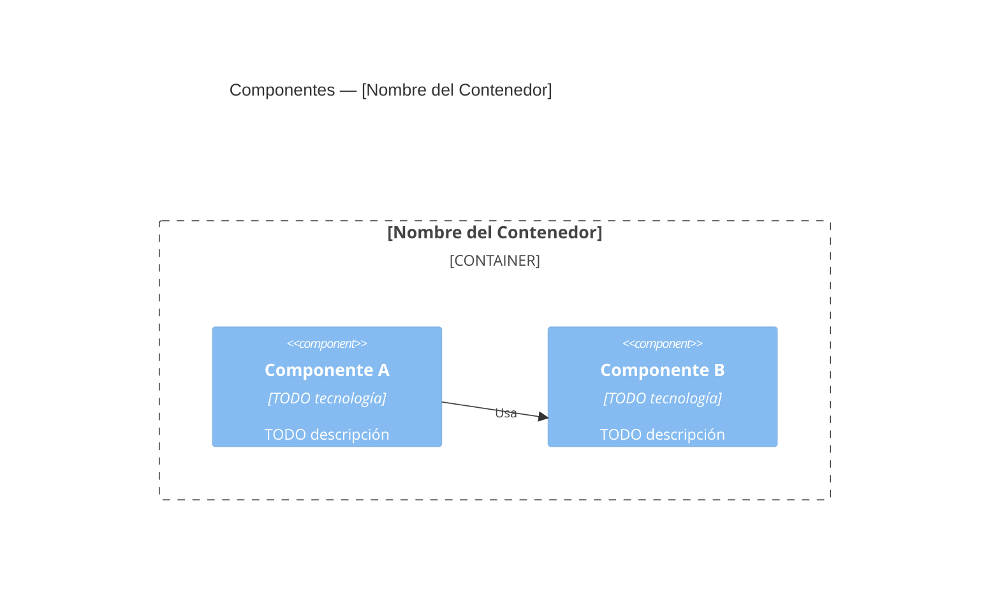

---
bloque: 02-arquitectura
documento: componentes
actualizado_en: ""
---

# Componentes del Sistema

> Diagrama C4 Nivel 3. Describe los componentes principales dentro de cada contenedor.
> Para el contexto del sistema completo, ver `vision-general.md`.

---

## Componente: {Nombre del componente}

**Contenedor padre**: TODO
**Responsabilidad**: TODO
**Owner**: TODO

### Interfaces expuestas

| Interfaz | Tipo | Descripción |
|----------|------|-------------|
| TODO | REST / gRPC / eventos | |

### Dependencias

| Componente / Servicio | Tipo de dependencia | Descripción |
|----------------------|---------------------|-------------|
| TODO | sincrónica / asincrónica | |

---

## Diagrama de componentes

---

## Catálogo de servicios

> Ver detalle de infraestructura en `../05-infraestructura/entornos.md`.

| Servicio | Tipo | URL (prod) | Owner | SLA |
|----------|------|-----------|-------|-----|
| TODO | API / Worker / Job | | | |
