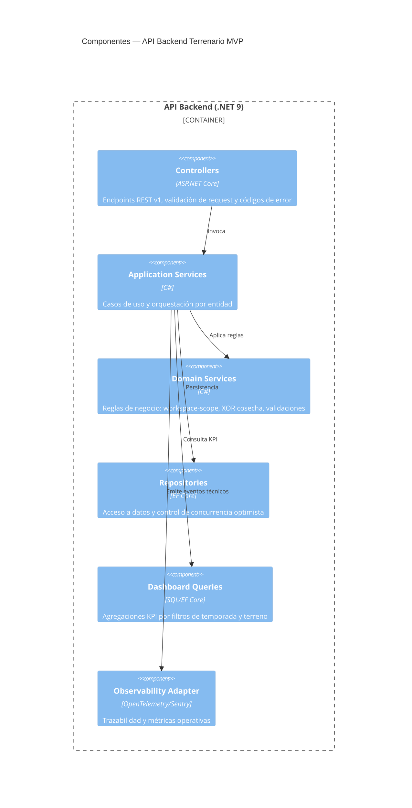

---
bloque: 02-arquitectura
documento: componentes
actualizado_en: "2026-08-09"
---

# Componentes del Sistema

> Diagrama C4 Nivel 3. Describe los componentes principales dentro de cada contenedor del MVP.
> Para el contexto del sistema completo, ver `vision-general.md`.

---

## Componente: API Core (MVP)

**Contenedor padre**: API Backend (`.NET 9 + ASP.NET Core Controllers`)
**Responsabilidad**: Exponer endpoints REST `/api/v1`, aplicar validación de entrada y control de acceso por Workspace.
**Owner**: equipo técnico del producto

### Interfaces expuestas

| Interfaz | Tipo | Descripción |
|----------|------|-------------|
| `/api/v1/auth` | REST | Intercambio del código de Google, refresco de sesión y cierre |
| `/api/v1/account` | REST | Datos de la cuenta y baja (MVP-503) |
| `/api/v1/workspaces` | REST | Alta del Workspace y consulta del Workspace activo |
| `/api/v1/workspace-members` | REST | Miembros y roles del Workspace activo |
| `/api/v1/workspaces/invitations` | REST | Emisión y listado de invitaciones del Workspace activo |
| `/api/v1/workspaces/reactivations` | REST | Solicitudes de reactivación de un Workspace dado de baja (MVP-206) |
| `/api/v1/invitations/{token}` | REST | Consulta y aceptación de una invitación recibida |
| `/api/v1/plots` | REST | Alta, edición y consulta de terrenos |
| `/api/v1/seasons` | REST | Alta, edición y consulta de temporadas |
| `/api/v1/workers` | REST | Gestión de maestro de trabajadores |
| `/api/v1/tasks` | REST | Catálogo de tareas habituales (MVP-205) |
| `/api/v1/activities` | REST | Registro y consulta de actividad operativa |
| `/api/v1/harvests` | REST | Registro y consulta de cosechas |
| `/api/v1/purchases` | REST | Registro de compras y sus imputaciones |
| `/api/v1/consumptions` | REST | Consumos por terreno, con o sin compra previa (MVP-304) |
| `/api/v1/diary` | REST | Diario unificado: labores, cosechas, compras y consumos en orden cronológico (MVP-305) |
| `/api/v1/dashboard/*` | REST | Agregaciones KPI por Workspace y temporada, incluida la lectura económica (MVP-707) |
| `/api/v1/feedback` | REST | Canal de sugerencias e incidencias del usuario (MVP-711) |
| `/api/v1/telemetry` | REST | Eventos de uso que solo conoce el cliente (MVP-601) |
| `/api/v1/ops` | REST | Revisión operativa, protegida por llave propia (MVP-602/603) |
| `/api/v1/health` | REST | Sonda de salud del despliegue |

> Rutas en inglés según [ADR-0009](./decisiones/ADR-0009--idioma-de-identificadores-en-codigo.md).
>
> La tabla se puso al día en la revisión de `MVP-007` (`P-094`): le faltaban **seis superficies vivas**
> y llevaba desde el 2026-07-24 sin tocarse. Se reconstruyó leyendo los atributos `[Route]` de los
> controladores, no la documentación anterior. El detalle de cada operación —verbos, parámetros y
> códigos de error— vive en [`contratos-api.md`](./contratos-api.md), que es su fuente de verdad; aquí
> solo se listan las superficies para el mapa C4.

### Dependencias

| Componente / Servicio | Tipo de dependencia | Descripción |
|----------------------|---------------------|-------------|
| Auth Gateway (Google OIDC) | sincrónica | Validación de identidad y emisión/validación de sesión |
| PostgreSQL | sincrónica | Persistencia transaccional y consultas de lectura |
| Servicio de email | sincrónica | Invitaciones a miembros de Workspace por SMTP genérico ([ADR-0010](./decisiones/ADR-0010--envio-de-email-transaccional-por-smtp.md)). La cuenta de envío se configura por entorno; sin ella, o si el envío falla, la invitación sigue siendo válida y se comparte por enlace |

---

## Diagrama de componentes

```mermaid
C4Component
    title Componentes — API Backend Terrenario MVP

    Container_Boundary(c1, "API Backend (.NET 9)") {
        Component(ctrl, "Controllers", "ASP.NET Core", "Endpoints REST v1, validación de request y códigos de error")
        Component(app, "Application Services", "C#", "Casos de uso y orquestación por entidad")
        Component(dom, "Domain Services", "C#", "Reglas de negocio: workspace-scope, XOR cosecha, validaciones")
        Component(repo, "Repositories", "EF Core", "Acceso a datos y control de concurrencia optimista")
        Component(qry, "Dashboard Queries", "SQL/EF Core", "Agregaciones KPI por filtros de temporada y terreno")
        Component(obs, "Observability Adapter", "OpenTelemetry/Sentry", "Trazabilidad y métricas operativas")
    }

    Rel(ctrl, app, "Invoca")
    Rel(app, dom, "Aplica reglas")
    Rel(app, repo, "Persistencia")
    Rel(app, qry, "Consulta KPI")
    Rel(app, obs, "Emite eventos técnicos")
```

---

## Catálogo de servicios

> Ver detalle de infraestructura en `../05-infraestructura/entornos.md`.
>
> La API y el cliente se sirven del **mismo origen**: no hay dos URLs públicas. El Hito F se publicó el
> 2026-08-05 en `app.terrenario.com`, y hasta entonces esta tabla decía «pendiente de definir por
> entorno» (`P-094`).

| Servicio | Tipo | URL (prod) | Owner | SLA |
|----------|------|-----------|-------|-----|
| `terrenario-api` | API | `https://app.terrenario.com` | equipo técnico | 99.9% |
| `google-oidc` | Integración externa | proveedor externo | seguridad | según proveedor |
| `email-service` | Integración externa | SMTP del proveedor, configurado por entorno | producto/infra | según proveedor |
