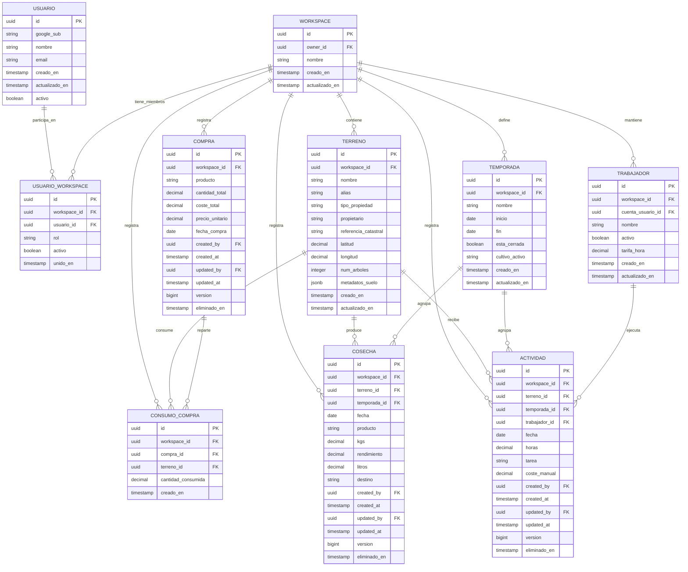

---
bloque: 02-arquitectura
documento: modelo-de-datos
actualizado_en: "2026-07-17"
---

# Modelo de Datos Global - Terrenario MVP

> Modelo de datos canonico para MVP online-first, alineado con ADR-0001..ADR-0006 y acuerdos de sesion.

---

## Diagrama entidad-relacion

---

## Entidades y reglas clave

### TRABAJADOR

| Campo | Tipo | Obligatorio | Descripcion |
|-------|------|-------------|-------------|
| `cuenta_usuario_id` | UUID (nullable) | No | Permite vincular un trabajador a una cuenta del sistema cuando exista |
| `tarifa_hora` | decimal(10,2) | No | Valor de referencia para sugerencia de coste; no sustituye `coste_manual` en actividad |

### COSECHA

| Campo | Tipo | Obligatorio | Descripcion |
|-------|------|-------------|-------------|
| `kgs` | decimal(10,2) | Si | Obligatorio en todo registro de cosecha |
| `rendimiento` | decimal(10,4) | No | Opcional. Si viene informado, `litros` no debe enviarse |
| `litros` | decimal(10,2) | No | Opcional. Si viene informado, `rendimiento` no debe enviarse |
| `destino` | enum | Si | Catalogo fijo: `venta_aceituna`, `aceite_para_venta`, `aceite_personal`, `desconocido` |
| `version` | bigint | Si | Control de concurrencia optimista para `If-Match` |

### ACTIVIDAD

| Campo | Tipo | Obligatorio | Descripcion |
|-------|------|-------------|-------------|
| `horas` | decimal(5,2) | Si | Debe ser `> 0` en MVP |
| `coste_manual` | decimal(10,2) | Si | Obligatorio en MVP. Se permite sugerir valor por tarifa y editar manualmente |
| `version` | bigint | Si | Control de concurrencia optimista para `If-Match` |

### COMPRA

| Campo | Tipo | Obligatorio | Descripcion |
|-------|------|-------------|-------------|
| `cantidad_total` | decimal(10,2) | Si | Cantidad total comprada |
| `coste_total` | decimal(10,2) | Si | Coste total pagado |
| `precio_unitario` | decimal(10,4) | Si | Derivado de `coste_total / cantidad_total` y persistido para trazabilidad |

### CONSUMO_COMPRA

| Campo | Tipo | Obligatorio | Descripcion |
|-------|------|-------------|-------------|
| `cantidad_consumida` | decimal(10,2) | Si | Cantidad imputada al terreno |

---

## Convenciones de persistencia (MVP)

| Convencion | Aplicacion |
|-----------|------------|
| Motor de base de datos | PostgreSQL |
| ORM y migraciones | EF Core code-first |
| Claves primarias | UUID |
| Trazabilidad minima | `created_by`, `created_at`, `updated_by`, `updated_at` |
| Concurrencia | `version` por registro operativo + `If-Match` |
| Borrado en entidades operativas | Logico mediante `eliminado_en` |
| Aislamiento multi-tenant | `workspace_id` obligatorio en entidades operativas |

---

## Reglas de consistencia funcional

1. El MVP opera 100% online. No existe esquema local de sincronizacion diferida.
2. El destino canonico no clasificado es `desconocido` (la UI puede mostrar alias "Sin destino").
3. Actividad siempre exige `coste_manual`; no se acepta modo solo calculado.
4. Cosecha exige `kgs` y acepta exactamente uno de `rendimiento` o `litros`.
5. El cierre de temporada no bloquea edicion de registros operativos.

---

## Evolucion post-MVP prevista

1. Introducir outbox/sync para escenarios offline con cola de errores.
2. Evaluar capa hibrida EF Core + Dapper en consultas analiticas de dashboard.
3. Endurecer estrategia de backup y restauracion con pruebas periodicas.
