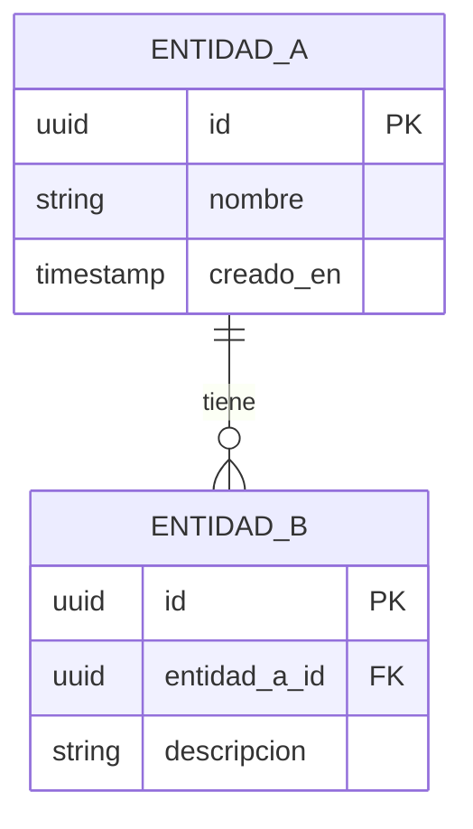

---
bloque: 02-arquitectura
documento: modelo-de-datos
actualizado_en: ""
---

# Modelo de Datos Global

> Este documento describe las entidades y relaciones del modelo de datos compartido.
> El modelo de datos específico de cada módulo está en `../03-modulos/{modulo}/modelo-datos.md`.

---

## Diagrama entidad-relación

---

## Entidades principales

### {NombreEntidad}

**Tabla**: `nombre_tabla`
**Módulo owner**: `../03-modulos/{modulo}/`

| Campo | Tipo | Obligatorio | Descripción |
|-------|------|------------|-------------|
| `id` | UUID | Sí | Identificador único |
| TODO | | | |

---

## Convenciones de base de datos

| Convención | Descripción |
|-----------|-------------|
| Naming de tablas | snake_case, plural (ej: `domain_entities`) |
| Primary keys | UUID v4 por defecto |
| Timestamps | `creado_en`, `actualizado_en` en todas las tablas |
| Soft deletes | Campo `eliminado_en` nullable (si aplica) |

## Migraciones

> Las migraciones se gestionan con TODO (Flyway / Liquibase / Alembic / etc.).
> Ver proceso en `../05-infraestructura/ci-cd.md`.
