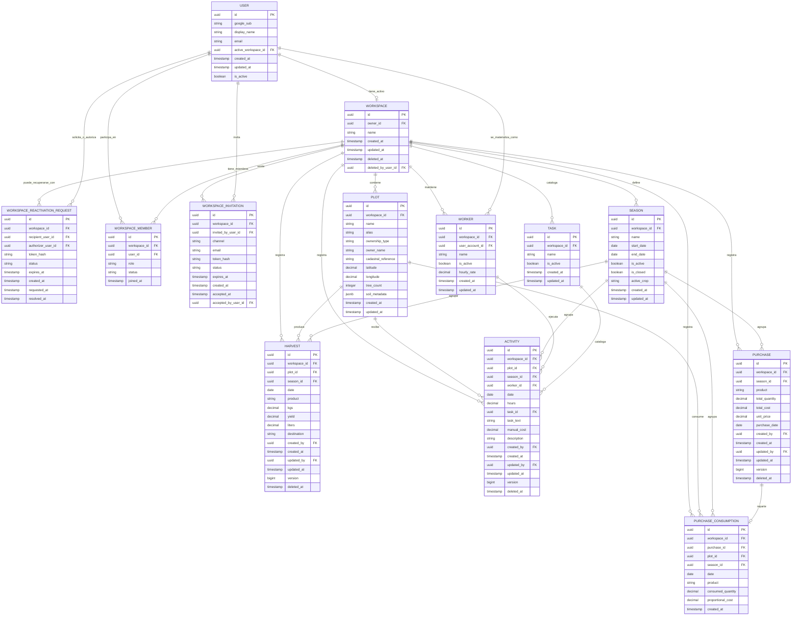

---
bloque: 02-arquitectura
documento: modelo-de-datos
actualizado_en: "2026-07-29"
---

# Modelo de Datos Global - Terrenario MVP

> Modelo de datos canonico para MVP online-first, alineado con ADR-0001..ADR-0006 y acuerdos de sesion.
>
> Los identificadores (entidades, tablas y columnas) se escriben en ingles segun
> [ADR-0009](./decisiones/ADR-0009--idioma-de-identificadores-en-codigo.md). La correspondencia con
> los terminos de dominio en espanol esta en `../99-glosario/glosario.md`.

---

## Diagrama entidad-relacion

```mermaid
erDiagram
    USER {
        uuid id PK
        string google_sub
        string display_name
        string email
        uuid active_workspace_id FK
        timestamp created_at
        timestamp updated_at
        boolean is_active
    }

    WORKSPACE {
        uuid id PK
        uuid owner_id FK
        string name
        timestamp created_at
        timestamp updated_at
        timestamp deleted_at
        uuid deleted_by_user_id FK
    }

    WORKSPACE_REACTIVATION_REQUEST {
        uuid id PK
        uuid workspace_id FK
        uuid recipient_user_id FK
        uuid authorizer_user_id FK
        string token_hash
        string status
        timestamp expires_at
        timestamp created_at
        timestamp requested_at
        timestamp resolved_at
    }

    WORKSPACE_MEMBER {
        uuid id PK
        uuid workspace_id FK
        uuid user_id FK
        string role
        string status
        timestamp joined_at
    }

    WORKSPACE_INVITATION {
        uuid id PK
        uuid workspace_id FK
        uuid invited_by_user_id FK
        string channel
        string email
        string token_hash
        string status
        timestamp expires_at
        timestamp created_at
        timestamp accepted_at
        uuid accepted_by_user_id FK
    }

    WORKER {
        uuid id PK
        uuid workspace_id FK
        uuid user_account_id FK
        string name
        boolean is_active
        decimal hourly_rate
        timestamp created_at
        timestamp updated_at
    }

    PLOT {
        uuid id PK
        uuid workspace_id FK
        string name
        string alias
        string ownership_type
        string owner_name
        string cadastral_reference
        decimal latitude
        decimal longitude
        integer tree_count
        jsonb soil_metadata
        timestamp created_at
        timestamp updated_at
    }

    TASK {
        uuid id PK
        uuid workspace_id FK
        string name
        boolean is_active
        timestamp created_at
        timestamp updated_at
    }

    SEASON {
        uuid id PK
        uuid workspace_id FK
        string name
        date start_date
        date end_date
        boolean is_active
        boolean is_closed
        string active_crop
        timestamp created_at
        timestamp updated_at
    }

    HARVEST {
        uuid id PK
        uuid workspace_id FK
        uuid plot_id FK
        uuid season_id FK
        date date
        string product
        decimal kgs
        decimal yield
        decimal liters
        string destination
        uuid created_by FK
        timestamp created_at
        uuid updated_by FK
        timestamp updated_at
        bigint version
        timestamp deleted_at
    }

    ACTIVITY {
        uuid id PK
        uuid workspace_id FK
        uuid plot_id FK
        uuid season_id FK
        uuid worker_id FK
        date date
        decimal hours
        uuid task_id FK
        string task_text
        decimal manual_cost
        string description
        uuid created_by FK
        timestamp created_at
        uuid updated_by FK
        timestamp updated_at
        bigint version
        timestamp deleted_at
    }

    PURCHASE {
        uuid id PK
        uuid workspace_id FK
        uuid season_id FK
        string product
        decimal total_quantity
        decimal total_cost
        decimal unit_price
        date purchase_date
        uuid created_by FK
        timestamp created_at
        uuid updated_by FK
        timestamp updated_at
        bigint version
        timestamp deleted_at
    }

    PURCHASE_CONSUMPTION {
        uuid id PK
        uuid workspace_id FK
        uuid purchase_id FK
        uuid plot_id FK
        uuid season_id FK
        date date
        string product
        decimal consumed_quantity
        decimal proportional_cost
        timestamp created_at
    }

    USER ||--o{ WORKSPACE_MEMBER : participa_en
    USER ||--o| WORKSPACE : tiene_activo
    WORKSPACE ||--o{ WORKSPACE_MEMBER : tiene_miembros
    WORKSPACE ||--o{ WORKSPACE_INVITATION : emite
    USER ||--o{ WORKSPACE_INVITATION : invita
    WORKSPACE ||--o{ WORKSPACE_REACTIVATION_REQUEST : puede_recuperarse_con
    USER ||--o{ WORKSPACE_REACTIVATION_REQUEST : solicita_o_autoriza
    WORKSPACE ||--o{ WORKER : mantiene
    USER ||--o{ WORKER : se_materializa_como
    WORKSPACE ||--o{ PLOT : contiene
    WORKSPACE ||--o{ SEASON : define
    WORKSPACE ||--o{ TASK : cataloga
    WORKSPACE ||--o{ HARVEST : registra
    WORKSPACE ||--o{ ACTIVITY : registra
    WORKSPACE ||--o{ PURCHASE : registra
    WORKSPACE ||--o{ PURCHASE_CONSUMPTION : registra
    PLOT ||--o{ HARVEST : produce
    PLOT ||--o{ ACTIVITY : recibe
    PLOT ||--o{ PURCHASE_CONSUMPTION : consume
    SEASON ||--o{ HARVEST : agrupa
    SEASON ||--o{ ACTIVITY : agrupa
    SEASON ||--o{ PURCHASE : agrupa
    SEASON ||--o{ PURCHASE_CONSUMPTION : agrupa
    WORKER ||--o{ ACTIVITY : ejecuta
    TASK ||--o{ ACTIVITY : cataloga
    PURCHASE ||--o| PURCHASE_CONSUMPTION : reparte
```

---

## Entidades y reglas clave

### WORKSPACE (ciclo de vida)

| Campo | Tipo | Obligatorio | Descripcion |
|-------|------|-------------|-------------|
| `owner_id` | UUID | Si | Persona propietaria actual. El traspaso lo actualiza junto al `role` de las membresias implicadas (MVP-206) |
| `deleted_at` | timestamptz (nullable) | No | Marca de **baja logica** (RN-039). Nunca hay borrado fisico: un Workspace con `deleted_at` deja de resolver contexto y de aparecer en el selector, pero conserva todos sus datos |
| `deleted_by_user_id` | UUID (nullable) | No | Quien dio de baja. Es la unica persona que puede autorizar la reactivacion o volver a levantarlo (RN-040), por lo que la FK es `ON DELETE RESTRICT` |

Restricciones: indice de apoyo en `owner_id` e indice parcial `ix_workspaces_live` sobre
`deleted_at` filtrado por `deleted_at IS NULL`, que es como consulta el 100% de la aplicacion.

El filtro de baja logica vive en el **puerto** `IWorkspaceRepository` (todas sus lecturas excluyen los
dados de baja salvo `FindIncludingDeletedAsync`), no en un filtro global de EF: los maestros de
MVP-202/203/204/205 heredan el comportamiento sin cambios porque resuelven su ambito a traves de ese
mismo puerto.

### WORKSPACE_REACTIVATION_REQUEST

| Campo | Tipo | Obligatorio | Descripcion |
|-------|------|-------------|-------------|
| `recipient_user_id` | UUID | Si | Miembro al que se envio el enlace: el unico que puede usarlo |
| `authorizer_user_id` | UUID | Si | Quien dio de baja el Workspace: la unica persona que puede resolver la solicitud (RN-040) |
| `token_hash` | string | Si | SHA-256 del token del enlace. El valor en claro solo viaja en el email, como en `WORKSPACE_INVITATION` |
| `status` | string | Si | Catalogo `reactivation_request_status`: `pendiente`, `solicitada`, `autorizada`, `denegada`, `cerrada` |
| `expires_at` | timestamptz | Si | La caducidad se deriva de esta fecha; no es un estado persistido |
| `requested_at` / `resolved_at` | timestamptz (nullable) | No | Trazabilidad de cuando se pidio y cuando se decidio |

Restricciones: indice unico en `token_hash` e indices de apoyo `(authorizer_user_id, status)` y
`(workspace_id, status)`. Se emite **una solicitud por miembro activo notificado**, no un enlace
comun: asi el traspaso queda atado a quien lo pide. El estado `cerrada` marca los enlaces que dejan
de servir porque el Workspace ya volvio por otra via, sin atribuir una decision que no hubo.

### WORKSPACE_MEMBER

| Campo | Tipo | Obligatorio | Descripcion |
|-------|------|-------------|-------------|
| `role` | string | Si | `workspace_owner` o `workspace_member`. Informativo en MVP por RN-034 |
| `status` | string | Si | Catalogo `worker_member_status`: `invitado`, `activo`, `revocado`. Solo `activo` da acceso y aparece en el selector (MVP-104) |

Restricciones: indice unico `(workspace_id, user_id)` (un usuario no puede tener dos membresias del mismo Workspace) e indice de apoyo `(user_id, status)` para el selector de Workspace activo.

MVP-204 expone estos estados en la vista de personas del Workspace y hace operativa la revocacion
(`activo` -> `revocado`, metodo `Revoke()`). El estado `invitado` **no** se materializa como fila de
`workspace_members` (su `user_id` es NOT NULL y el invitado por email puede no tener cuenta): se
proyecta desde las invitaciones por email pendientes (`workspace_invitations`), combinandolas con las
membresias reales, sin cambio de esquema.

### USER (contexto activo)

| Campo | Tipo | Obligatorio | Descripcion |
|-------|------|-------------|-------------|
| `active_workspace_id` | UUID (nullable) | No | Ultimo Workspace que el usuario dejo activo. Mantiene el contexto entre renovaciones de sesion (MVP-104). `ON DELETE SET NULL` si el Workspace desaparece |

### WORKSPACE_INVITATION

| Campo | Tipo | Obligatorio | Descripcion |
|-------|------|-------------|-------------|
| `channel` | string | Si | Catalogo `invitation_channel`: `email` o `enlace` |
| `email` | string(320) | No | Solo en el canal `email`. El enlace compartible no tiene destinatario |
| `token_hash` | string | Si | SHA-256 del token de invitacion. El valor en claro no se persiste |
| `status` | string | Si | Catalogo `invitation_status`: `pendiente`, `aceptada`, `rechazada` (MVP-107) o `anulada` (MVP-207) |
| `expires_at` | timestamptz | Si | La caducidad se deriva de esta fecha; no es un estado persistido |
| `accepted_by_user_id` | UUID (nullable) | No | Trazabilidad de quien entro con la invitacion |
| `rejected_at` / `rejected_by_user_id` | timestamptz / UUID (nullable) | No | La **persona invitada** declino la invitacion (MVP-107) |
| `cancelled_at` / `cancelled_by_user_id` | timestamptz / UUID (nullable) | No | El **Workspace emisor** retiro la invitacion pendiente (MVP-207, CA-4) |

Restricciones: indice unico en `token_hash` e indice de apoyo `(workspace_id, status)`. La
invitacion es de un solo uso: al aceptarse pasa a `aceptada` y no vuelve a ser valida.

Los tres estados terminales se distinguen por **quien** cerro la invitacion, porque las acciones de
recuperacion son distintas: `aceptada` creo membresia (se deshace revocando el acceso, MVP-204 CA-7),
`rechazada` la cerro la persona invitada y `anulada` la cerro el Workspace emisor. Solo se anula lo
que sigue `pendiente`; anular una caducada se permite (retira de la lista de personas a alguien que
ya no iba a entrar).

### PLOT

| Campo | Tipo | Obligatorio | Descripcion |
|-------|------|-------------|-------------|
| `name` | string(150) | Si | Alta minima (RN-028) |
| `ownership_type` | string(20) | Si | Alta minima (RN-028). Catalogo cerrado `plot_ownership_type`: `propia`, `cedida` |
| `alias` | string(60) | No | Codigo/alias corto de la parcela |
| `owner_name` | string(150) | No | Propietario informativo |
| `cadastral_reference` | string(50) | No | Referencia catastral sin validacion fuerte (fuera de alcance MVP) |
| `location` | string(200) | No | Ubicacion en texto libre. En MVP-202 **sustituye** a `latitude`/`longitude` del ER: los mapas y coordenadas quedan fuera de alcance |
| `tree_count` | integer | No | Opcional (RN-028). Su ausencia se trata como dato incompleto en dashboard (RN-010), no bloquea |
| `is_active` | boolean | Si | Estado de actividad. Los terrenos con historico se inactivan en vez de borrarse (MVP-202, CA-3). Anadido en MVP-202 (no estaba en el ER original) |

Restricciones: indice de apoyo `(workspace_id, is_active)` para el listado del maestro (filtra por
Workspace y estado) e indice **unico** `ux_plots_workspace_name` sobre `(workspace_id, lower(name))`
(MVP-207, CA-3), que impide dos terrenos con el mismo nombre en un Workspace ignorando mayusculas.
Los terrenos inactivos siguen ocupando su nombre; el `alias` no entra en la unicidad. Introducida en
MVP-202. `latitude`/`longitude` y `soil_metadata` (JSONB) del ER canonico **no se materializan** en
el MVP: coordenadas/mapas y metadatos de suelo quedan diferidos
(ver MVP-999, P-019).

### SEASON

| Campo | Tipo | Obligatorio | Descripcion |
|-------|------|-------------|-------------|
| `is_active` | boolean | Si | Temporada activa del Workspace (RN-021/RN-022). En MVP solo una por Workspace |
| `is_closed` | boolean | Si | Cierre informativo (RN-024); no bloquea altas ni ediciones |
| `end_date` | date (nullable) | No | Fecha fin estimada; opcional |
| `active_crop` | string (nullable) | No | Reservado para la evolucion por cultivo (RU-18/RU-19). No materializado en MVP-201 |

Restricciones: indice unico parcial `(workspace_id) WHERE is_active` (`ux_seasons_workspace_active`)
que materializa RN-022 en la base de datos, e indice **unico** `ux_seasons_workspace_name` sobre
`(workspace_id, lower(name))` (MVP-207, CA-3), que impide dos campanas con el mismo nombre en un
Workspace ignorando mayusculas. Las temporadas cerradas siguen ocupando su nombre: cerrar no lo
libera. Introducida en MVP-201 (creacion explicita y cancelable;
no se siembra por defecto). El maestro completo (estados `planificada/activa/cerrada`, derivados de
`is_active`/`is_closed` sin columna de estado ni cambio de esquema; alta de varias, edicion,
cierre/reapertura y cambio de temporada activa) se entrega en MVP-203. El cambio de activa desbanca a
la anterior de forma transaccional para no violar el indice ni transitoriamente. `active_crop` sigue
diferido (RU-18/RU-19): en MVP rige "una activa por Workspace".

### WORKER

| Campo | Tipo | Obligatorio | Descripcion |
|-------|------|-------------|-------------|
| `name` | string(150) | Si | Alta minima del maestro (MVP-204): es el unico campo obligatorio |
| `user_account_id` | UUID (nullable) | No | Cuenta del sistema a la que pertenece el responsable. **Materializado desde MVP-208** (CA-1): cada miembro activo del Workspace tiene su fila. Nulo en la cuadrilla sin cuenta. FK opcional a `users` con `ON DELETE SET NULL`, para que borrar la cuenta degrade la fila a cuadrilla en vez de perder al responsable de los registros que lo referencian |
| `hourly_rate` | decimal(10,2) (nullable) | No | Valor de referencia para sugerencia de coste; no sustituye `manual_cost` en actividad (RN-003). Editable en las dos clases: es dato operativo del Workspace |
| `is_active` | boolean | Si | Estado de actividad. Los trabajadores con historico se inactivan en vez de borrarse (MVP-204, CA-3). En un miembro no se toca a mano: lo gobierna su membresia (MVP-208, CA-4) |

Restricciones: indice de apoyo `(workspace_id, is_active)` para el listado del maestro, indice
**unico** `ux_workers_workspace_name` sobre `(workspace_id, lower(name))` (MVP-207, CA-3), que impide
dos responsables con el mismo nombre en un Workspace ignorando mayusculas —los inactivos siguen
ocupando su nombre—, e indice **unico parcial** `ux_workers_workspace_user_account` sobre
`(workspace_id, user_account_id) WHERE user_account_id IS NOT NULL` (MVP-208, CA-1), que hace de la
cuenta una identidad y no una etiqueta: una cuenta tiene como mucho una fila por Workspace.

`workers` es **el** maestro de responsables (RN-027) y cubre las dos clases de persona con un unico
espacio de identificadores, que es lo que permite que `ACTIVITY.worker_id` siga siendo una FK simple
(cierre de `P-034`):

- **Miembros del Workspace** (`user_account_id` no nulo): la fila nace al crearse el Workspace y al
  aceptarse una invitacion, y se inactiva al revocarse el acceso —por las **dos** vias que lo
  revocan: retirarlo a mano y ceder el Workspace en la baja con copropietarios (MVP-299, `R-25`)—.
  Su `name` llega de la identidad de Google (RN-036) y se resincroniza cuando cambia alli; no se
  edita en el maestro.
- **Cuadrilla sin cuenta** (`user_account_id` nulo): alta, edicion e inactivacion manuales (MVP-204).

Cuando el nombre de una cuenta choca con el de una fila existente, el desempate es asimetrico: la
cuadrilla se renombra con sufijo « (2)» y el miembro conserva el suyo; entre dos cuentas homonimas
—ninguna renombrable— el sufijo lo toma la que llega despues. Es la misma politica de datos
preexistentes que MVP-207: conservar y renombrar, nunca borrar.

`workspace_members` union `workspace_invitations` pendientes sigue siendo la vista de **accesos**
(estado de membresia, invitar, revocar), pero ya no es la fuente de responsables.

### TASK

Entidad **anadida en MVP-205**: el ER no la declaraba (la tarea aparecia solo como el campo
`task` de `ACTIVITY`) pese a que RN-026 exige un catalogo por Workspace y `contratos-api.md`
ya contrataba el recurso `/api/v1/tasks`.

| Campo | Tipo | Obligatorio | Descripcion |
|-------|------|-------------|-------------|
| `name` | string(120) | Si | Unico campo obligatorio del alta. El catalogo arranca **vacio** por Workspace (MVP-205, CA-2) |
| `is_active` | boolean | Si | Estado de actividad. Las tareas con historico se inactivan en vez de borrarse (MVP-205, CA-3) |

Restricciones: indice de apoyo `(workspace_id, is_active)` para el listado del maestro e indice
**unico** `ux_tasks_workspace_name` sobre `(workspace_id, lower(name))`, que impide dos tareas con el
mismo nombre en un Workspace ignorando mayusculas (prevencion de duplicados evidentes). Las tareas
inactivas siguen ocupando su nombre. **MVP-302 reutiliza esa misma comparacion** para guardar en el
catalogo una tarea escrita a mano durante el registro de una actividad: la consulta para *resolver* el
nombre —reutilizando la tarea existente, o reactivandola si estaba inactivada— en vez de chocar contra
el indice, de modo que la operativa diaria nunca se bloquea por un nombre ya usado.
Es el patron que **MVP-207 extiende** a `seasons`, `workers` y `plots`, de modo que los cuatro
maestros de la epica se comportan igual frente a los nombres repetidos.

Relacion con `ACTIVITY`: RN-025 admite tarea **del catalogo o en texto libre**, por lo que el
contrato de actividad preve `task_id?` + `task_text?`. **Resuelto en MVP-301** (cierre de `P-028`):
`ACTIVITY` materializa los dos campos como excluyentes y referencia `tasks` con `ON DELETE RESTRICT`,
de modo que una tarea del catalogo con historico no se puede borrar (solo inactivar, CA-3).

### HARVEST

| Campo | Tipo | Obligatorio | Descripcion |
|-------|------|-------------|-------------|
| `kgs` | decimal(10,2) | Si | Obligatorio en todo registro de cosecha |
| `yield` | decimal(10,4) | No | Opcional. Si viene informado, `liters` no debe enviarse |
| `liters` | decimal(10,2) | No | Opcional. Si viene informado, `yield` no debe enviarse |
| `destination` | enum | Si | Catalogo fijo: `venta_aceituna`, `aceite_para_venta`, `aceite_personal`, `desconocido` |
| `version` | bigint | Si | Control de concurrencia optimista para `If-Match` |

### ACTIVITY

| Campo | Tipo | Obligatorio | Descripcion |
|-------|------|-------------|-------------|
| `date` | date | Si | Fecha de negocio de la labor. Es la que ordena el diario (RN-033), distinta de `created_at` |
| `hours` | decimal(5,2) | Si | Debe ser `> 0` en MVP |
| `task_id` | uuid FK (nullable) | Excluyente | Tarea del catalogo del Workspace (`tasks`, MVP-205). `ON DELETE RESTRICT` |
| `task_text` | string(120) (nullable) | Excluyente | Tarea escrita al vuelo. Misma cota que `TASK.name` para que siempre quepa al guardarse en el catalogo (MVP-302) |
| `manual_cost` | decimal(10,2) | Si | Obligatorio en MVP. `0` es un valor valido (labor propia sin coste imputado). Se permite sugerir valor por tarifa y editar manualmente, nunca calcularlo (RN-003) |
| `description` | string(500) (nullable) | No | Nota libre de la actividad. Ya contratada como `description?` en `contratos-api.md` §5 y ausente de este ER hasta la 3a pasada de MVP-299 (hallazgo `G-6`); la materializa MVP-301 |
| `version` | bigint | Si | Control de concurrencia optimista para `If-Match` (ADR-0005) |
| `deleted_at` | timestamptz (nullable) | No | Marca de eliminacion logica (RN-037). Nunca hay borrado fisico |

`task_id` y `task_text` **cierran `P-028`** (MVP-301): el ER declaraba la tarea como un `string task`
suelto, anterior al catalogo de MVP-205, mientras `contratos-api.md` ya preveia los dos campos.
RN-025 admite tarea **del catalogo o en texto libre**, asi que el agregado exige **exactamente uno**:
guardar los dos permitiria que divergieran y el diario no sabria cual mostrar. La exclusividad la
garantiza el dominio, no una restriccion de datos, porque la condicion depende del texto ya
normalizado. La respuesta de API anade `task` ya resuelto (derivado, no columna).

Restricciones: indice **parcial** `ix_activities_live_by_date` sobre `(workspace_id, date)` filtrado
por `deleted_at IS NULL` —el 100% de las lecturas filtra por «vivo», como `ix_workspaces_live` en
MVP-206— e indices de apoyo `(workspace_id, plot_id)` y `(workspace_id, season_id)` para los filtros
del listado y el futuro dashboard. Las FKs a los maestros son `ON DELETE RESTRICT`: los maestros se
inactivan en vez de borrarse, asi que la semantica correcta es impedir que un borrado deje operativa
huerfana. El filtro de baja logica vive en el **puerto** `IActivityRepository`, no en un filtro global
de EF, siguiendo la misma decision que `IWorkspaceRepository` en MVP-206.

### PURCHASE

| Campo | Tipo | Obligatorio | Descripcion |
|-------|------|-------------|-------------|
| `season_id` | uuid FK | Si | Temporada a la que se imputa la compra (RN-021). **Añadido en la 3a pasada de MVP-299** (`P-050`) y **materializado en MVP-303**: `contratos-api.md` ya lo exigia como `season_id*` y el ER no lo declaraba. FK `ON DELETE RESTRICT`: las temporadas se cierran, no se borran |
| `purchase_date` | date | Si | Fecha de negocio de la compra. Es la que ordena el libro y el diario (RN-033), distinta de `created_at` |
| `total_quantity` | decimal(10,2) | Si | Cantidad total comprada. Estrictamente `> 0` |
| `total_cost` | decimal(10,2) | Si | Coste total pagado. Estrictamente `> 0` |
| `unit_price` | decimal(10,4) | Si | Derivado de `total_cost / total_quantity` y **persistido** para trazabilidad. Es la base del coste proporcional de las imputaciones (MVP-304) y lo que permite explicar una imputacion antigua aunque la compra se edite despues (RN-032, «no se recalculan historicos») |
| `product` | string(150) | Si | Material comprado, en **texto libre** (RN-031). No hay catalogo cerrado ni normalizacion: la UI sugiere valores del historico del Workspace (`GET /purchases/products`), pero «Abono NPK» y «abono npk» conviven |
| `version` | bigint | Si | Control de concurrencia optimista para `If-Match` (ADR-0005) |
| `deleted_at` | timestamptz (nullable) | No | Marca de eliminacion logica (RN-037). Lo eliminado sale del libro, del gasto acumulado y de las sugerencias, pero la fila permanece |

Restricciones: indice **parcial** `ix_purchases_live_by_date` sobre `(workspace_id, purchase_date)`
filtrado por `deleted_at IS NULL` —igual que en `ACTIVITY`— e indices de apoyo
`(workspace_id, season_id)` para el filtro por campaña y `(workspace_id, product)` para la agrupacion
de sugerencias. El filtro de baja logica vive en el **puerto** `IPurchaseRepository`.

### PURCHASE_CONSUMPTION

| Campo | Tipo | Obligatorio | Descripcion |
|-------|------|-------------|-------------|
| `purchase_id` | uuid FK | **No** | Compra de la que sale el material. Es **anulable** por RN-032: se puede registrar consumo sin compra previa, y entonces el coste imputado es `0`. Registrar la compra despues no recalcula lo ya guardado |
| `date` | date | Si | Fecha de negocio del consumo, distinta de `created_at`: el diario ordena por ella (RN-033) |
| `season_id` | uuid FK | Si | Temporada del consumo (RN-021). Al imputar sobre una compra se hereda de ella |
| `product` | string | Solo sin compra | Con compra se hereda de ella; sin compra hay que informarlo (texto libre, RN-031) |
| `consumed_quantity` | decimal(10,2) | Si | Cantidad imputada al terreno |
| `proportional_cost` | decimal(10,2) | Si | Coste proporcional derivado del `unit_price` de la compra; **`0` cuando no hay compra previa** |

> Los cuatro campos anteriores (`purchase_id` anulable, `date`, `season_id`, `product`) y
> `proportional_cost` se anadieron en la **3a pasada de MVP-299** (hallazgos `G-2` y `G-3`): el ER
> declaraba la imputacion como una fila colgada obligatoriamente de una compra y sin fecha propia, lo
> que hacia irrealizables el CA-3 de la epica MVP-003 y el diario cronologico de MVP-305.
>
> **Mecanismo decidido en MVP-303** (el spec de esa historia exigia cerrarlo *antes* de fijar el
> modelo de compras): se adopta la **columna `purchase_id` anulable sobre esta misma entidad**, y no
> una entidad de consumo propia. Una imputacion y un consumo sin compra son el **mismo hecho** —«se
> han consumido X unidades de Y en el terreno Z el dia D, con coste C»—; lo unico que cambia es de
> donde sale el coste, y separarlos obligaria al diario (MVP-305) y al dashboard (MVP-004) a unir dos
> tablas con las mismas columnas. Consecuencias: `PURCHASE.unit_price` se persiste (base del coste
> proporcional) y el consumo guarda **siempre** su propio `product`, copiado de la compra al imputar,
> de modo que la fila es autoexplicativa y editar la compra despues no reescribe lo ya consumido
> (RN-032).

---

## Convenciones de persistencia (MVP)

| Convencion | Aplicacion |
|-----------|------------|
| Motor de base de datos | PostgreSQL |
| ORM y migraciones | EF Core code-first |
| Idioma de identificadores | Ingles, segun ADR-0009 |
| Claves primarias | UUID |
| Trazabilidad minima | `created_by`, `created_at`, `updated_by`, `updated_at` |
| Concurrencia | `version` por registro operativo + `If-Match` en `PATCH`/`DELETE`, con `409 CONFLICT_VERSION_MISMATCH` (ADR-0005). Las entidades criticas son `ACTIVITY`, `HARVEST` y `PURCHASE`/`PURCHASE_CONSUMPTION`; lo implementan MVP-301/303/304 y MVP-401. Los maestros de MVP-002 no llevan `version`: su edicion no concurre sobre el mismo registro con la misma frecuencia y su invariante la protegen los indices unicos |
| Borrado en entidades operativas | Logico mediante `deleted_at`, con confirmacion explicita en la UI (RN-037, reformulada en la 3a pasada de MVP-299: decia «fisico» y contradecia a esta convencion). No hay papelera ni restauracion en el MVP; la purga se decide con la politica de retencion (`P-033`) |
| Aislamiento multi-tenant | `workspace_id` obligatorio en entidades operativas |
| Booleanos persistidos | Prefijo `is_` (`is_active`, `is_closed`) |

---

## Reglas de consistencia funcional

1. El MVP opera 100% online. No existe esquema local de sincronizacion diferida.
2. El destino canonico no clasificado es `desconocido` (la UI puede mostrar alias "Sin destino").
3. Actividad siempre exige `manual_cost`; no se acepta modo solo calculado.
4. Cosecha exige `kgs` y acepta exactamente uno de `yield` o `liters`.
5. El cierre de temporada no bloquea edicion de registros operativos.

---

## Estado de implementacion

| Entidad | Estado | Historia |
|---|---|---|
| `USER` | implementada | MVP-101 (contexto activo en MVP-104) |
| `WORKSPACE` | implementada | MVP-102 (ciclo de vida en MVP-206: renombrado, baja logica `deleted_at` y traspaso de `owner_id`) |
| `WORKSPACE_MEMBER` | implementada | MVP-102 (estados de membresia en MVP-104; promocion/degradacion de `role` por el traspaso en MVP-206) |
| `WORKSPACE_REACTIVATION_REQUEST` | implementada | MVP-206 (enlace de un solo uso para solicitar traspaso y reactivacion) |
| `WORKSPACE_INVITATION` | implementada | MVP-103 (reenvio en MVP-204: `Reissue` rota token y renueva caducidad) |
| `SEASON` | implementada | MVP-201 (temporada inicial + `is_active`); maestro completo en MVP-203 (estados `planificada/activa/cerrada` derivados; `active_crop` diferido) |
| `PLOT` | implementada | MVP-202 (alta minima RN-028, `is_active`; `location` en vez de coordenadas; `soil_metadata` diferido) |
| `WORKER` | implementada | MVP-204 (alta minima `name`, `hourly_rate` de referencia, `is_active`); MVP-208 materializa `user_account_id`: el maestro pasa a ser el de responsables (miembros + cuadrilla) y cierra `P-034` |
| `ACTIVITY` | implementada | MVP-301 (`task_id`/`task_text` excluyentes cierran `P-028`; estrena `version` + `If-Match` de ADR-0005 y la baja logica `deleted_at` de RN-037) |
| `PURCHASE` | implementada | MVP-303 (`season_id` cierra `P-050`; `unit_price` persistido como base del coste proporcional de MVP-304) |
| `PURCHASE_CONSUMPTION` | pendiente | MVP-304. **Mecanismo ya decidido en MVP-303**: `purchase_id` anulable sobre esta entidad, no una entidad de consumo propia (ver mas abajo) |
| `HARVEST` | pendiente | MVP-004 |

---

## Evolucion post-MVP prevista

1. Introducir outbox/sync para escenarios offline con cola de errores.
2. Evaluar capa hibrida EF Core + Dapper en consultas analiticas de dashboard.
3. Endurecer estrategia de backup y restauracion con pruebas periodicas.
