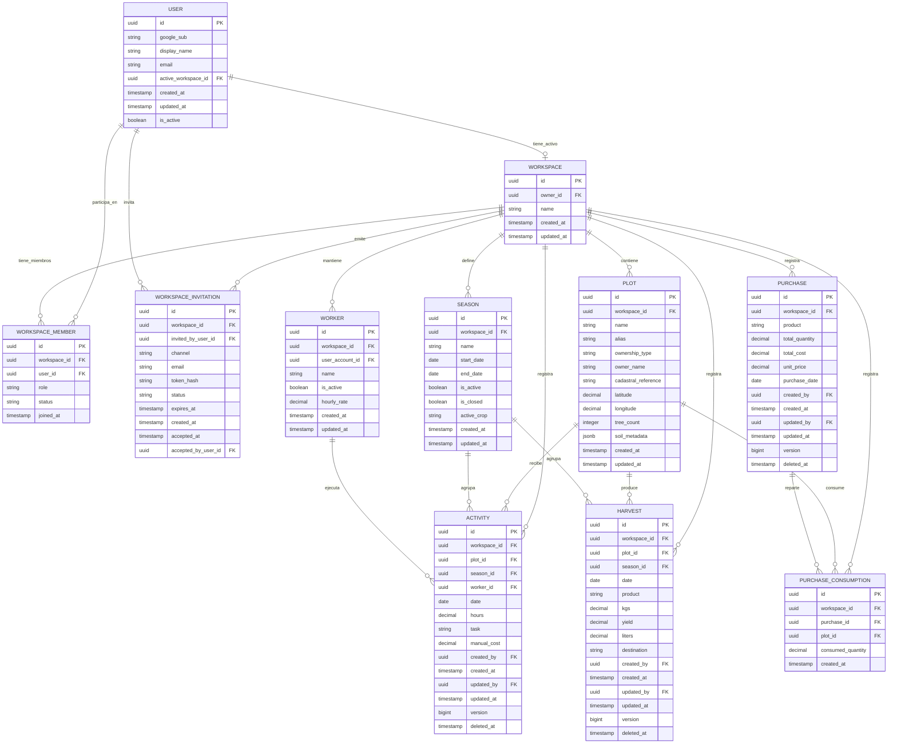

---
bloque: 02-arquitectura
documento: modelo-de-datos
actualizado_en: "2026-07-24"
---

# Modelo de Datos Global - Terrenario MVP

> Modelo de datos canonico para MVP online-first, alineado con ADR-0001..ADR-0006 y acuerdos de sesion.
>
> Los identificadores (entidades, tablas y columnas) se escriben en ingles segun
> [ADR-0009](./decisiones/ADR-0009--idioma-de-identificadores-en-codigo.md). La correspondencia con
> los terminos de dominio en espanol esta en `../99-glosario/glosario.md`.

---

## Diagrama entidad-relacion

```mermaid
erDiagram
    USER {
        uuid id PK
        string google_sub
        string display_name
        string email
        uuid active_workspace_id FK
        timestamp created_at
        timestamp updated_at
        boolean is_active
    }

    WORKSPACE {
        uuid id PK
        uuid owner_id FK
        string name
        timestamp created_at
        timestamp updated_at
    }

    WORKSPACE_MEMBER {
        uuid id PK
        uuid workspace_id FK
        uuid user_id FK
        string role
        string status
        timestamp joined_at
    }

    WORKSPACE_INVITATION {
        uuid id PK
        uuid workspace_id FK
        uuid invited_by_user_id FK
        string channel
        string email
        string token_hash
        string status
        timestamp expires_at
        timestamp created_at
        timestamp accepted_at
        uuid accepted_by_user_id FK
    }

    WORKER {
        uuid id PK
        uuid workspace_id FK
        uuid user_account_id FK
        string name
        boolean is_active
        decimal hourly_rate
        timestamp created_at
        timestamp updated_at
    }

    PLOT {
        uuid id PK
        uuid workspace_id FK
        string name
        string alias
        string ownership_type
        string owner_name
        string cadastral_reference
        decimal latitude
        decimal longitude
        integer tree_count
        jsonb soil_metadata
        timestamp created_at
        timestamp updated_at
    }

    SEASON {
        uuid id PK
        uuid workspace_id FK
        string name
        date start_date
        date end_date
        boolean is_active
        boolean is_closed
        string active_crop
        timestamp created_at
        timestamp updated_at
    }

    HARVEST {
        uuid id PK
        uuid workspace_id FK
        uuid plot_id FK
        uuid season_id FK
        date date
        string product
        decimal kgs
        decimal yield
        decimal liters
        string destination
        uuid created_by FK
        timestamp created_at
        uuid updated_by FK
        timestamp updated_at
        bigint version
        timestamp deleted_at
    }

    ACTIVITY {
        uuid id PK
        uuid workspace_id FK
        uuid plot_id FK
        uuid season_id FK
        uuid worker_id FK
        date date
        decimal hours
        string task
        decimal manual_cost
        uuid created_by FK
        timestamp created_at
        uuid updated_by FK
        timestamp updated_at
        bigint version
        timestamp deleted_at
    }

    PURCHASE {
        uuid id PK
        uuid workspace_id FK
        string product
        decimal total_quantity
        decimal total_cost
        decimal unit_price
        date purchase_date
        uuid created_by FK
        timestamp created_at
        uuid updated_by FK
        timestamp updated_at
        bigint version
        timestamp deleted_at
    }

    PURCHASE_CONSUMPTION {
        uuid id PK
        uuid workspace_id FK
        uuid purchase_id FK
        uuid plot_id FK
        decimal consumed_quantity
        timestamp created_at
    }

    USER ||--o{ WORKSPACE_MEMBER : participa_en
    USER ||--o| WORKSPACE : tiene_activo
    WORKSPACE ||--o{ WORKSPACE_MEMBER : tiene_miembros
    WORKSPACE ||--o{ WORKSPACE_INVITATION : emite
    USER ||--o{ WORKSPACE_INVITATION : invita
    WORKSPACE ||--o{ WORKER : mantiene
    WORKSPACE ||--o{ PLOT : contiene
    WORKSPACE ||--o{ SEASON : define
    WORKSPACE ||--o{ HARVEST : registra
    WORKSPACE ||--o{ ACTIVITY : registra
    WORKSPACE ||--o{ PURCHASE : registra
    WORKSPACE ||--o{ PURCHASE_CONSUMPTION : registra
    PLOT ||--o{ HARVEST : produce
    PLOT ||--o{ ACTIVITY : recibe
    PLOT ||--o{ PURCHASE_CONSUMPTION : consume
    SEASON ||--o{ HARVEST : agrupa
    SEASON ||--o{ ACTIVITY : agrupa
    WORKER ||--o{ ACTIVITY : ejecuta
    PURCHASE ||--o{ PURCHASE_CONSUMPTION : reparte
```

---

## Entidades y reglas clave

### WORKSPACE_MEMBER

| Campo | Tipo | Obligatorio | Descripcion |
|-------|------|-------------|-------------|
| `role` | string | Si | `workspace_owner` o `workspace_member`. Informativo en MVP por RN-034 |
| `status` | string | Si | Catalogo `worker_member_status`: `invitado`, `activo`, `revocado`. Solo `activo` da acceso y aparece en el selector (MVP-104) |

Restricciones: indice unico `(workspace_id, user_id)` (un usuario no puede tener dos membresias del mismo Workspace) e indice de apoyo `(user_id, status)` para el selector de Workspace activo.

### USER (contexto activo)

| Campo | Tipo | Obligatorio | Descripcion |
|-------|------|-------------|-------------|
| `active_workspace_id` | UUID (nullable) | No | Ultimo Workspace que el usuario dejo activo. Mantiene el contexto entre renovaciones de sesion (MVP-104). `ON DELETE SET NULL` si el Workspace desaparece |

### WORKSPACE_INVITATION

| Campo | Tipo | Obligatorio | Descripcion |
|-------|------|-------------|-------------|
| `channel` | string | Si | Catalogo `invitation_channel`: `email` o `enlace` |
| `email` | string(320) | No | Solo en el canal `email`. El enlace compartible no tiene destinatario |
| `token_hash` | string | Si | SHA-256 del token de invitacion. El valor en claro no se persiste |
| `status` | string | Si | Catalogo `invitation_status`: `pendiente` o `aceptada` |
| `expires_at` | timestamptz | Si | La caducidad se deriva de esta fecha; no es un estado persistido |
| `accepted_by_user_id` | UUID (nullable) | No | Trazabilidad de quien entro con la invitacion |

Restricciones: indice unico en `token_hash` e indice de apoyo `(workspace_id, status)`. La
invitacion es de un solo uso: al aceptarse pasa a `aceptada` y no vuelve a ser valida.

### SEASON

| Campo | Tipo | Obligatorio | Descripcion |
|-------|------|-------------|-------------|
| `is_active` | boolean | Si | Temporada activa del Workspace (RN-021/RN-022). En MVP solo una por Workspace |
| `is_closed` | boolean | Si | Cierre informativo (RN-024); no bloquea altas ni ediciones |
| `end_date` | date (nullable) | No | Fecha fin estimada; opcional |
| `active_crop` | string (nullable) | No | Reservado para la evolucion por cultivo (RU-18/RU-19). No materializado en MVP-201 |

Restricciones: indice unico parcial `(workspace_id) WHERE is_active` (`ux_seasons_workspace_active`)
que materializa RN-022 en la base de datos. Introducida en MVP-201 (creacion explicita y cancelable;
no se siembra por defecto). El maestro completo (estados `planificada/activa/cerrada`, derivables de
`is_active`/`is_closed`; alta de varias, edicion, cierre) es alcance de MVP-203.

### WORKER

| Campo | Tipo | Obligatorio | Descripcion |
|-------|------|-------------|-------------|
| `user_account_id` | UUID (nullable) | No | Permite vincular un trabajador a una cuenta del sistema cuando exista |
| `hourly_rate` | decimal(10,2) | No | Valor de referencia para sugerencia de coste; no sustituye `manual_cost` en actividad |

### HARVEST

| Campo | Tipo | Obligatorio | Descripcion |
|-------|------|-------------|-------------|
| `kgs` | decimal(10,2) | Si | Obligatorio en todo registro de cosecha |
| `yield` | decimal(10,4) | No | Opcional. Si viene informado, `liters` no debe enviarse |
| `liters` | decimal(10,2) | No | Opcional. Si viene informado, `yield` no debe enviarse |
| `destination` | enum | Si | Catalogo fijo: `venta_aceituna`, `aceite_para_venta`, `aceite_personal`, `desconocido` |
| `version` | bigint | Si | Control de concurrencia optimista para `If-Match` |

### ACTIVITY

| Campo | Tipo | Obligatorio | Descripcion |
|-------|------|-------------|-------------|
| `hours` | decimal(5,2) | Si | Debe ser `> 0` en MVP |
| `manual_cost` | decimal(10,2) | Si | Obligatorio en MVP. Se permite sugerir valor por tarifa y editar manualmente |
| `version` | bigint | Si | Control de concurrencia optimista para `If-Match` |

### PURCHASE

| Campo | Tipo | Obligatorio | Descripcion |
|-------|------|-------------|-------------|
| `total_quantity` | decimal(10,2) | Si | Cantidad total comprada |
| `total_cost` | decimal(10,2) | Si | Coste total pagado |
| `unit_price` | decimal(10,4) | Si | Derivado de `total_cost / total_quantity` y persistido para trazabilidad |

### PURCHASE_CONSUMPTION

| Campo | Tipo | Obligatorio | Descripcion |
|-------|------|-------------|-------------|
| `consumed_quantity` | decimal(10,2) | Si | Cantidad imputada al terreno |

---

## Convenciones de persistencia (MVP)

| Convencion | Aplicacion |
|-----------|------------|
| Motor de base de datos | PostgreSQL |
| ORM y migraciones | EF Core code-first |
| Idioma de identificadores | Ingles, segun ADR-0009 |
| Claves primarias | UUID |
| Trazabilidad minima | `created_by`, `created_at`, `updated_by`, `updated_at` |
| Concurrencia | `version` por registro operativo + `If-Match` |
| Borrado en entidades operativas | Logico mediante `deleted_at` |
| Aislamiento multi-tenant | `workspace_id` obligatorio en entidades operativas |
| Booleanos persistidos | Prefijo `is_` (`is_active`, `is_closed`) |

---

## Reglas de consistencia funcional

1. El MVP opera 100% online. No existe esquema local de sincronizacion diferida.
2. El destino canonico no clasificado es `desconocido` (la UI puede mostrar alias "Sin destino").
3. Actividad siempre exige `manual_cost`; no se acepta modo solo calculado.
4. Cosecha exige `kgs` y acepta exactamente uno de `yield` o `liters`.
5. El cierre de temporada no bloquea edicion de registros operativos.

---

## Estado de implementacion

| Entidad | Estado | Historia |
|---|---|---|
| `USER` | implementada | MVP-101 (contexto activo en MVP-104) |
| `WORKSPACE` | implementada | MVP-102 |
| `WORKSPACE_MEMBER` | implementada | MVP-102 (estados de membresia en MVP-104) |
| `WORKSPACE_INVITATION` | implementada | MVP-103 |
| `SEASON` | parcial | MVP-201 (temporada inicial + `is_active`); maestro completo en MVP-203 |
| `PLOT`, `WORKER` | pendiente | MVP-002 |
| `ACTIVITY`, `PURCHASE`, `PURCHASE_CONSUMPTION` | pendiente | MVP-003 |
| `HARVEST` | pendiente | MVP-004 |

---

## Evolucion post-MVP prevista

1. Introducir outbox/sync para escenarios offline con cola de errores.
2. Evaluar capa hibrida EF Core + Dapper en consultas analiticas de dashboard.
3. Endurecer estrategia de backup y restauracion con pruebas periodicas.
