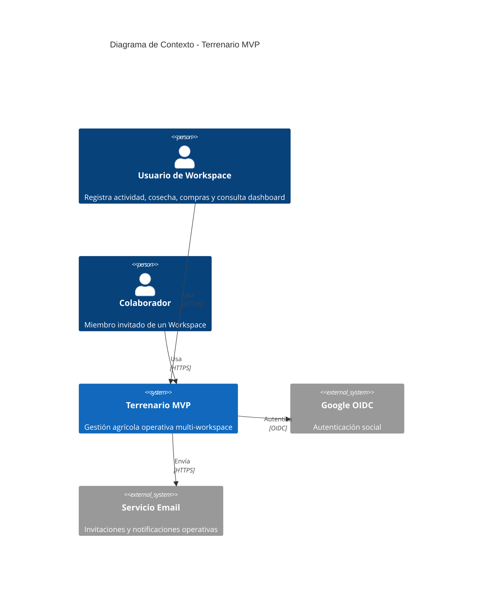
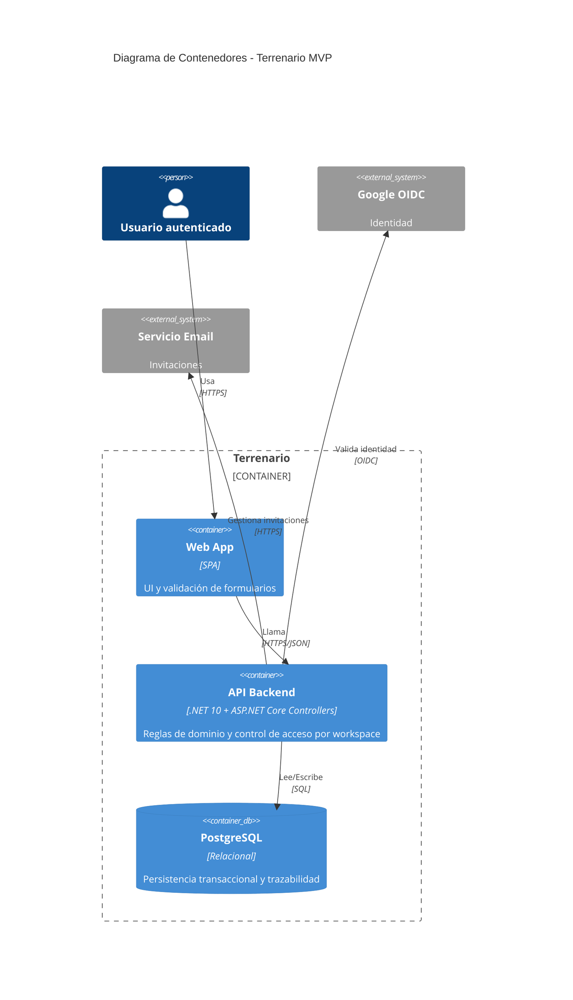

---
bloque: 02-arquitectura
documento: vision-general
actualizado_en: "2026-07-18"
---

# Visión General de la Arquitectura

> Baseline técnico implementable para el MVP de Terrenario.
> Fuente funcional: `../01-producto/definicion-requisitos-usuario.md`, `../01-producto/vision-y-objetivos.md`, `../01-producto/reglas-de-negocio.md`.
> Restricciones de seguridad y privacidad: `../07-seguridad/modelo-seguridad.md`, `../07-seguridad/privacidad-datos.md`.

---

## Resumen ejecutivo técnico

1. MVP orientado a captura operativa rápida por Workspace con trazabilidad completa por terreno y temporada.
2. Arquitectura web online-first con backend API transaccional en tiempo real.
3. Se mantiene PostgreSQL como fuente de verdad transaccional (ADR-0001 aceptada).
4. El ámbito de autorización es Workspace y se aplica en todas las entidades operativas.
5. Catálogo de destinos MVP cerrado y versionado en backend para evitar divergencias de cliente.
6. Modelo de costes del MVP se fija como manual para toda actividad/compra imputada.
7. Cosecha exige `kgs` obligatorio; `rendimiento` y `litros` son opcionales, y si se informa uno aplica exclusión mutua (no se informan ambos).
8. Dashboard MVP usa agregaciones por temporada activa y filtros persistentes en recarga.
9. Offline/sync diferido se mueve a backlog post-MVP para simplificar implementación y operación.
10. Backend autorizado para MVP: .NET 10 con ASP.NET Core Web API (Controllers).
11. Frontend autorizado para MVP: React + TypeScript + Vite.
12. Persistencia autorizada: SQL relacional con PostgreSQL.
13. Acceso a datos MVP autorizado: EF Core code-first con perspectiva de evolución a EF + Dapper post-MVP.
14. Concurrencia online autorizada: control optimista con versión y respuesta HTTP 409 ante conflicto.
15. Seguridad: OIDC Google, validación de esquema en bordes, cifrado en tránsito y reposo para PII.
16. Privacidad: minimización, base jurídica por tratamiento, anonimización operativa inmediata en bajas.
17. Evidencias legales mínimas se conservan separadas durante 24 meses.
18. Plan de implementación en incrementos para entregar valor desde el primer sprint técnico.

---

## Contradicciones residuales detectadas

| ID | Contradicción | Fuentes | Decisión aplicada en este baseline | Acción de gobierno |
|---|---|---|---|---|
| C-01 | Sin contradicciones abiertas en reglas cerradas del MVP | `../01-producto/vision-y-objetivos.md`, `../01-producto/reglas-de-negocio.md`, `contratos-api.md`, `modelo-de-datos.md` | Coste manual, regla XOR de cosecha y destino `desconocido` están alineados | Mantener validación en revisiones de cambio y ADRs nuevos |

---

## Nivel 1 - Diagrama de Contexto (C4)

---

## Nivel 2 - Diagrama de Contenedores (C4)

> Contenedores mínimos para MVP online (sin modo offline ni colas de sincronización diferida).

---

## Principios arquitecturales

| Principio | Descripción |
|-----------|-------------|
| Workspace-first | Toda entidad operativa incluye `workspace_id` y se autoriza por contexto activo |
| Validación en borde + dominio | Validaciones sintácticas en API y reglas de negocio en servicios de dominio |
| Simplicidad operativa MVP | Se prioriza flujo online síncrono y se evita complejidad de sincronización diferida |
| Concurrencia controlada | Se usa versión de registro para detectar colisiones de edición en flujo online |
| Trazabilidad explícita | Se conserva auditoría de cambios sin exponer PII en logs |
| Seguridad por defecto | Denegación por defecto, tokens verificados, cifrado y control de acceso por recurso |
| Privacidad por diseño | Minimización de datos, base jurídica trazable y políticas de retención aplicadas |

---

## Decisiones técnicas propuestas

| Decisión | Motivo | Impacto | Dependencias | Pros | Contras |
|---|---|---|---|---|---|
| Monolito modular online-first | Reducir complejidad de MVP y acelerar entrega | Menor coste operativo inicial | ADR de arquitectura base | Flujo simple y mantenible | Escalado independiente posterior |
| Backend .NET 10 + ASP.NET Controllers | Decisión por experiencia del equipo | Mayor velocidad de entrega y mantenibilidad | ADR de stack backend | Productividad con stack conocido | Mayor dependencia del ecosistema .NET |
| Frontend React + TypeScript + Vite | Equilibrar velocidad de entrega, ecosistema y mantenibilidad | Estandariza la SPA del MVP y acelera validación con usuarios | ADR-0007 | Ecosistema maduro, testing E2E directo y buen DX | Requiere gobernanza de librerías UI/estado para evitar deriva |
| Persistencia relacional única en PostgreSQL | Integridad fuerte y trazabilidad para reglas MVP | Esquema consistente y consultas KPI fiables | ADR-0001 | ACID, SQL analítico útil para dashboard | Requiere estrategia de migraciones disciplinada |
| EF Core code-first en MVP (evolución a EF + Dapper) | Agilizar implementación inicial y evolucionar lecturas complejas después | Menor fricción inicial con ruta de rendimiento post-MVP | ADR de acceso a datos | Productividad en CRUD y migraciones | Requiere gobernanza al introducir doble stack de acceso |
| API REST versionada `/api/v1` | MVP con integración simple cliente-servidor | Contratos claros y evolucionables | `contratos-api.md` | Curva de adopción baja | Menor eficiencia que protocolo binario |
| Costes manuales en MVP | Decisión de negocio cerrada #1 | Simplifica UX y evita dependencia de tarifas | Reglas MVP cerradas | Menos lógica de cálculo inicial | Mayor riesgo de error humano |
| Cosecha con `kgs` obligatorio y `rendimiento/litros` opcionales | Decisiones cerradas #2-#5 (ajuste validado) | Captura más flexible sin perder consistencia | Reglas MVP cerradas | Reduce fricción en entrada de datos | Menor completitud inicial de métricas |
| Catálogo destinos cerrado en backend | Evita taxonomías divergentes | KPIs comparables entre workspaces | Decisión cerrada #11 | Consistencia analítica | Menos flexibilidad inicial |
| Offline/sync fuera del MVP | Decisión de alcance para simplificar v1 | Menor complejidad de arquitectura y QA | Backlog post-MVP | Reduce tiempo a producción | No permite captura sin conectividad |
| Control optimista de concurrencia (HTTP 409) | Evitar sobrescrituras silenciosas en edición simultánea | Integridad funcional en operación online | ADR de concurrencia | Comportamiento explícito y auditable | Requiere resolver conflicto en cliente |
| Baja con anonimización inmediata y retención legal separada | Decisión cerrada #12 + RGPD/LOPDGDD | Cumplimiento legal y minimización | `../07-seguridad/privacidad-datos.md` | Reduce exposición de PII | Requiere particionar datos y evidencias |

---

## Propuesta de modelo de datos MVP

### Entidades núcleo

| Entidad | Clave primaria | Relaciones principales | Estados |
|---|---|---|---|
| `workspaces` | `id` UUID | 1:N con miembros, terrenos, temporadas, trabajadores, actividades, cosechas, compras | activo, archivado |
| `usuarios` | `id` UUID | N:M con workspaces, 1:1 opcional con trabajador | activo, baja_solicitada, anonimizado |
| `workspace_members` | `id` UUID | FK a usuario y workspace | invitado, activo, revocado |
| `terrenos` | `id` UUID | N:1 workspace, 1:N actividades/cosechas | activo, inactivo |
| `temporadas` | `id` UUID | N:1 workspace, 1:N actividades/cosechas/compras | planificada, activa, cerrada |
| `trabajadores` | `id` UUID | N:1 workspace, 1:N actividades | activo, inactivo |
| `actividades` | `id` UUID | N:1 workspace/terreno/temporada/trabajador | borrador, confirmada, anulada |
| `cosechas` | `id` UUID | N:1 workspace/terreno/temporada | borrador, confirmada, anulada |
| `compras` | `id` UUID | N:1 workspace/temporada, 1:N imputaciones | registrada, imputada_parcial, cerrada |
| `compra_imputaciones` | `id` UUID | N:1 compra, N:1 terreno | activa, anulada |

### Restricciones relacionales mínimas

| Regla | Implementación |
|---|---|
| Todo registro operativo pertenece a un workspace | FK obligatoria `workspace_id` en tablas operativas |
| Entidad hija debe heredar workspace del padre | Constraint y validación de dominio (`terreno.workspace_id == actividad.workspace_id`) |
| Un único terreno por actividad/cosecha | FK única por registro |
| Temporada válida para fecha de registro | Check de rango en dominio y validación API |

---

## Matriz de validaciones MVP

| Caso | Campo | Tipo | Regla |
|---|---|---|---|
| Alta terreno | `nombre` | Obligatorio | Longitud 3..120 |
| Alta terreno | `num_arboles` | Opcional | Entero >= 0 |
| Alta temporada | `inicio`, `fin` | Obligatorio/Obligatorio | `inicio <= fin` |
| Alta trabajador | `nombre` | Obligatorio | Longitud 3..120 |
| Alta actividad | `fecha`, `terreno_id`, `temporada_id`, `trabajador_id`, `horas`, `coste_manual` | Obligatorio | `horas > 0`, `coste_manual >= 0` |
| Alta actividad | `workspace_id` | Obligatorio | Debe coincidir con terreno, temporada y trabajador |
| Alta cosecha | `fecha`, `terreno_id`, `temporada_id`, `kgs`, `destino` | Obligatorio | `kgs > 0`, destino en catálogo cerrado |
| Alta cosecha | `rendimiento`, `litros` | Regla de negocio | Ambos opcionales; no se permite informar ambos a la vez |
| Alta compra | `producto`, `cantidad_total`, `coste_total` | Obligatorio | ambos > 0 |
| Imputación compra | `cantidad` | Obligatorio | `cantidad > 0`, suma imputaciones <= cantidad total |
| Dashboard | filtros | Opcional | Si no se informan: temporada activa + todos los terrenos |

Trazabilidad de reglas:

| Regla aplicada | Origen |
|---|---|
| Unidad base por terreno | RN-001 |
| Responsable y horas en actividad | RN-002 |
| Catálogo destinos cerrado | Decisión MVP #11 |
| Kgs obligatorio en cosecha | Decisión MVP #2 |
| Rendimiento/litros excluyentes | Decisiones MVP #3-#5 |
| Sin filtro propietario en dashboard | Decisión MVP #9 |
| Concurrencia por versión de registro | Decisión técnica autorizada (bloqueo optimista) |

---

## Reglas de cálculo de KPIs (dashboard MVP)

| Widget | Fórmula | Fuentes de datos | Notas |
|---|---|---|---|
| Resumen temporada | `kg_total = SUM(cosechas.kgs)` | `cosechas` filtradas por workspace + temporada | Excluye anuladas |
| Resumen temporada | `litros_total = SUM(cosechas.litros)` cuando exista | `cosechas` | Si no hay litros informados, se muestra parcial sin forzar cálculo |
| Resumen temporada | `rendimiento_medio = AVG(cosechas.rendimiento)` o derivado | `cosechas` | Unidad canónica L/100kg |
| Resumen temporada | `kg_por_arbol = SUM(kgs) / SUM(num_arboles_validos)` | `cosechas` + `terrenos` | Si terreno sin árboles: se excluye y se marca dato incompleto |
| Kg por destino | `SUM(kgs) GROUP BY destino` | `cosechas` | Incluye `desconocido` |
| Kg por terreno | `SUM(kgs) GROUP BY terreno ORDER BY kg DESC, nombre ASC` | `cosechas` + `terrenos` | Sin agrupación "Otros" |
| Evolución rendimiento | Serie temporal por periodo | `cosechas` | Orden por fecha ascendente |

---

## Offline y sincronización (backlog post-MVP)

En MVP v1 no se implementa captura offline ni sincronización diferida. Todo registro se confirma online contra API.

Alcance post-MVP documentado para backlog:

1. Outbox local con operaciones pendientes.
2. Idempotencia por identificador de operación.
3. Reintentos con backoff y bandeja de errores recuperables.
4. Política de resolución de conflictos con trazabilidad.

---

## Seguridad y privacidad aplicada

### Controles técnicos obligatorios

| Control | Aplicación MVP |
|---|---|
| Autenticación | OIDC Google en backend, sin contraseña local |
| Autorización | Verificación de pertenencia a workspace en cada operación |
| Validación de entrada | Esquema en controllers + reglas de dominio |
| Protección PII | Sin PII en URL/logs/errores; cifrado en reposo para tablas con datos personales |
| Auditoría | Trazas de cambios operativos con identificador de usuario |

### Checklist RGPD/LOPDGDD para flujos MVP

| Flujo | Base jurídica | Minimización | Retención | Derechos |
|---|---|---|---|---|
| Alta/login social | Ejecución de contrato | solo `sub`, nombre, email | activa mientras cuenta viva | acceso, rectificación, supresión |
| Gestión de trabajadores | Ejecución de contrato + interés legítimo operacional | sin datos extra no necesarios | mientras exista relación operativa | acceso, rectificación |
| Actividades/cosechas/compras | Ejecución de contrato | sin PII en campos libres | según política operativa vigente | acceso, supresión según límites legales |
| Baja de cuenta | Obligación legal + contrato | anonimización inmediata de datos operativos | evidencia legal separada 24 meses | supresión y oposición |

---

## Plan de implementación por incrementos

| Sprint técnico | Objetivo | Entregables | Riesgos | Mitigación |
|---|---|---|---|---|
| Sprint 1 | Fundaciones de dominio y seguridad | auth OIDC, workspaces, terrenos, temporadas, trabajadores | deriva de modelo por contradicciones de reglas | cerrar ADR de contradicciones en primera semana |
| Sprint 2 | Operativa diaria básica | actividades + compras + imputaciones + validaciones | calidad de datos manuales | validaciones fuertes y defaults seguros |
| Sprint 3 | Producción y dashboard | cosechas XOR, widgets KPI, filtros persistentes | inconsistencias históricas por unidad | normalización de unidades en API |
| Sprint 4 | Endurecimiento y cumplimiento | pruebas E2E, RGPD checklist, hardening seguridad | deuda técnica final de MVP | ventana de estabilización + criterios de salida |
| Post-MVP | Offline/sync y resiliencia | outbox, idempotencia, cola de errores, observabilidad | conflictos de sincronización | pruebas de conflicto + guías de resolución en UI |

---

## Plan de testing

| Nivel | Cobertura objetivo | Casos obligatorios MVP |
|---|---|---|
| Unitario | >= 80% lógica de dominio | XOR cosecha, validación workspace, reglas de KPI, catálogo destinos |
| Integración | Flujos principales CRUD + dashboard | alta/edición/listado por entidad, errores 400/403/409 |
| E2E | Flujos críticos de negocio | login, captura diaria, cosecha, compra/imputación, dashboard con filtros |
| Datos incompletos | Calidad visual y cálculo | KPI kg/árbol con terrenos sin árboles, destino desconocido, faltantes parciales |

Casos post-MVP (backlog): pruebas de reconexión, reintentos y resolución de conflictos offline.

---

## Preguntas bloqueantes priorizadas

1. Actualizar en producto/reglas globales RN-003, RN-004 y RN-012 para reflejar decisiones ya autorizadas (coste manual MVP, cosecha opcional excluyente, destino `desconocido`).
