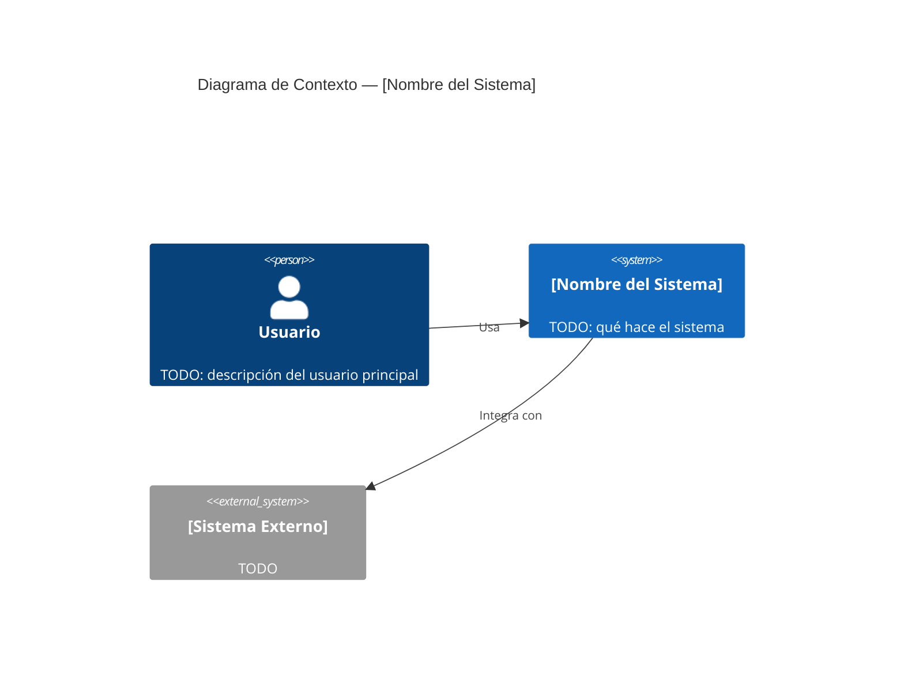
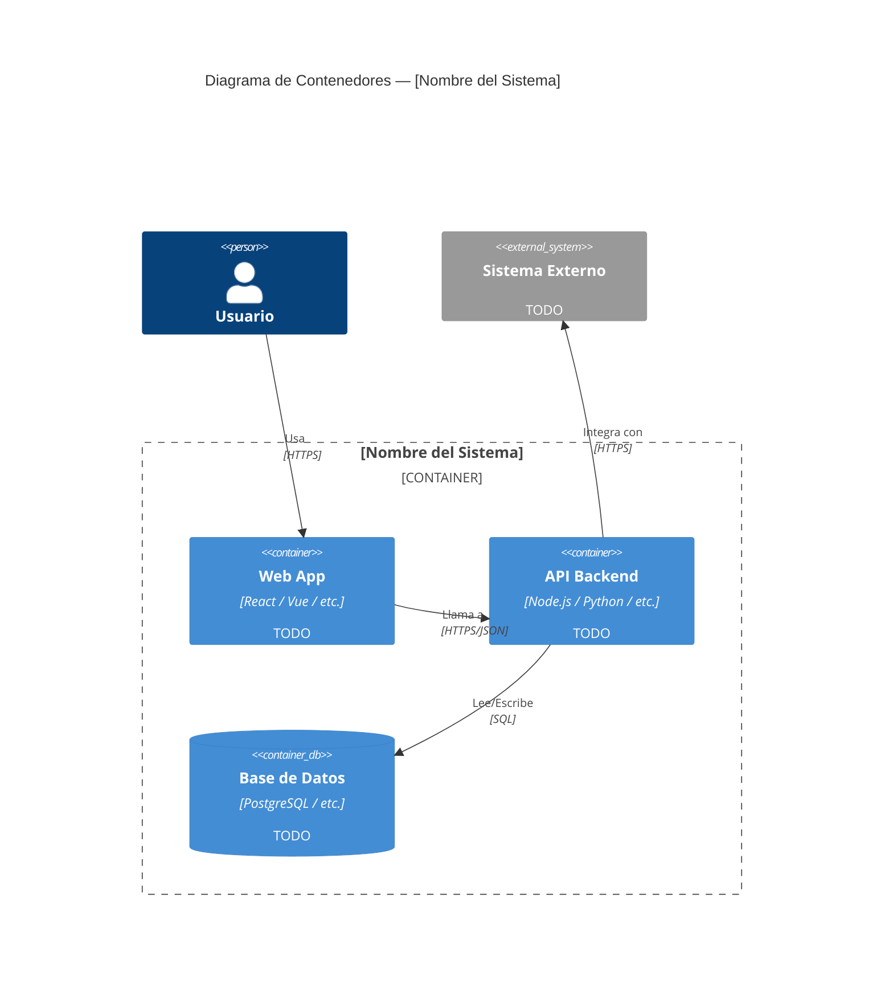

---
bloque: 02-arquitectura
documento: vision-general
actualizado_en: ""
---

# Visión General de la Arquitectura

> Diagrama C4 Nivel 1 (Contexto) y Nivel 2 (Contenedores).
> Para el detalle de componentes internos, ver `componentes.md`.
> Para decisiones técnicas, ver `decisiones/`.

---

## Nivel 1 — Diagrama de Contexto (C4)

> Muestra el sistema en relación con sus usuarios y sistemas externos.

---

## Nivel 2 — Diagrama de Contenedores (C4)

> Muestra los principales bloques tecnológicos del sistema.

---

## Principios arquitecturales

> Las decisiones que guían cómo se construye el sistema.
> Para el "por qué" de cada decisión, ver `decisiones/`.

| Principio | Descripción |
|-----------|-------------|
| TODO | |

## Restricciones

> Limitaciones técnicas, de negocio o de equipo que condicionan la arquitectura.

- TODO

## Stack tecnológico

> Ver detalle completo en `tech-stack.md`.

| Capa | Tecnología | Versión |
|------|-----------|---------|
| TODO | | |
