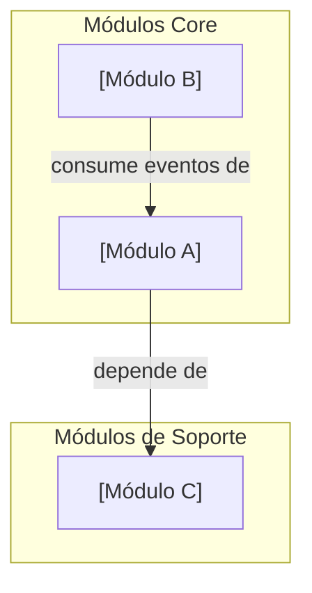

---
bloque: 03-modulos
documento: vision-general
actualizado_en: "2026-07-16"
---

# Módulos del Sistema — Visión General

> Este documento es el mapa de Bounded Contexts del sistema (DDD).
> Cada módulo es un dominio funcional autónomo con su propia documentación.
> En esta plantilla, el directorio `modulo-ejemplo/` se mantiene solo como contenedor de ejemplo estructural.
> No debe tratarse como un módulo real del proyecto y debe eliminarse al crear el primer módulo real.

---

## Mapa de módulos

---

## Catálogo de módulos

| Módulo | Descripción | Owner | Estado | Ruta |
|--------|-------------|-------|--------|------|
| `modulo-ejemplo` | Ejemplo de estructura documental neutra | plantilla | ejemplo | [03-modulos/modulo-ejemplo/](./modulo-ejemplo/README.md) |
| _(añadir módulos aquí)_ | | | | |

---

## Principios de diseño de módulos

1. **Alta cohesión, bajo acoplamiento**: cada módulo es responsable de su propio dominio
2. **API explícita**: los módulos se comunican por interfaces bien definidas (API o eventos)
3. **Base de datos por módulo**: cada módulo gestiona su propio esquema
4. **Sin acceso directo a tablas ajenas**: toda comunicación entre módulos pasa por la API o el bus de eventos

---

## Relaciones entre módulos

| Módulo origen | Módulo destino | Tipo | Descripción |
|--------------|---------------|------|-------------|
| TODO | TODO | API call / Evento / Shared kernel | |
