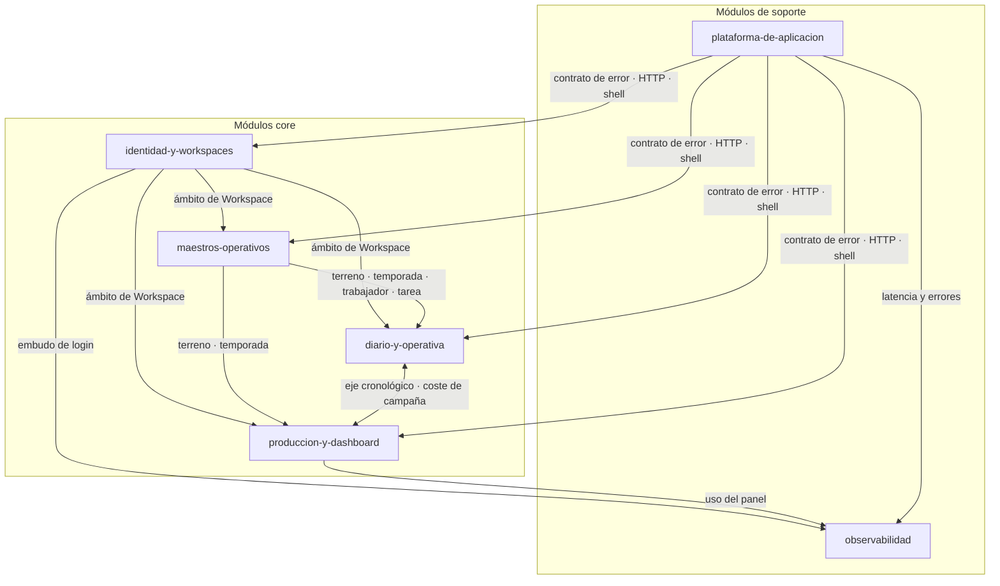

---
bloque: 03-modulos
documento: vision-general
actualizado_en: "2026-08-08"
---

# Módulos del Sistema — Visión General

> Este documento es el mapa de Bounded Contexts del sistema (DDD).
> Cada módulo es un dominio funcional autónomo con su propia ficha.

---

## Cómo leer este catálogo

Terrenario es un **monolito modular**
([ADR-0002](../02-arquitectura/decisiones/ADR-0002--arquitectura-monolito-modular-online-first.md)):
los módulos son límites de **responsabilidad y de documentación**, no unidades de despliegue. No hay
bus de eventos ni base de datos por módulo; todo comparte proceso y esquema, y las relaciones del
mapa son llamadas en el mismo proceso o lecturas de tablas vecinas.

El reparto sale del código entregado —`src/backend/Terrenario.Api` y
`src/frontend/terrenario-web/src`— y de las épicas que lo produjeron, no de un diseño previo. El
criterio es **una ficha por dominio con vocabulario propio**, no una por historia: el precedente lo
fijó `MVP-202` y lo consolidó
[`MVP-716`](../09-desarrollos/epicas/MVP-007--ajustes-mvp-01/MVP-716--consolidacion-del-catalogo-de-modulos/spec.md).

Cada ficha **enlaza** los `tech-design.md` de las historias que construyeron el módulo en vez de
reescribirlos: el diseño técnico vive junto a la historia que lo decidió, con su contexto y sus
alternativas descartadas.

---

## Mapa de módulos

```mermaid
flowchart TD
    subgraph Core["Módulos core"]
        ident["identidad-y-workspaces"]
        maestros["maestros-operativos"]
        diario["diario-y-operativa"]
        prod["produccion-y-dashboard"]
    end
    subgraph Support["Módulos de soporte"]
        plat["plataforma-de-aplicacion"]
        obs["observabilidad"]
    end

    ident -->|"ámbito de Workspace"| maestros
    ident -->|"ámbito de Workspace"| diario
    ident -->|"ámbito de Workspace"| prod
    maestros -->|"terreno · temporada · trabajador · tarea"| diario
    maestros -->|"terreno · temporada"| prod
    diario <-->|"eje cronológico · coste de campaña"| prod
    plat -->|"contrato de error · HTTP · shell"| ident
    plat -->|"contrato de error · HTTP · shell"| maestros
    plat -->|"contrato de error · HTTP · shell"| diario
    plat -->|"contrato de error · HTTP · shell"| prod
    ident -->|"embudo de login"| obs
    prod -->|"uso del panel"| obs
    plat -->|"latencia y errores"| obs
```

---

## Catálogo de módulos

| Módulo | Descripción | Owner | Estado | Ruta |
|--------|-------------|-------|--------|------|
| `identidad-y-workspaces` | Login con Google, sesión, ciclo de vida del Workspace, invitaciones, membresía y baja de cuenta | @andres | activo | [identidad-y-workspaces/](./identidad-y-workspaces/README.md) |
| `maestros-operativos` | Terrenos, temporadas, trabajadores, catálogo de tareas y onboarding | @andres | activo | [maestros-operativos/](./maestros-operativos/README.md) |
| `diario-y-operativa` | Actividades, compras, imputaciones y Diario de campo unificado | @andres | activo | [diario-y-operativa/](./diario-y-operativa/README.md) |
| `produccion-y-dashboard` | Cosechas, catálogo de destinos y Visión General con los KPI de campaña | @andres | activo | [produccion-y-dashboard/](./produccion-y-dashboard/README.md) |
| `plataforma-de-aplicacion` | Contrato de error, concurrencia, acceso a datos, cliente HTTP, shell y presencia pública | @andres | activo | [plataforma-de-aplicacion/](./plataforma-de-aplicacion/README.md) |
| `observabilidad` | Embudo de login, métricas de uso, SLO, señales operativas y alertas | @andres | activo | [observabilidad/](./observabilidad/README.md) |

---

## Trazabilidad con las épicas del MVP

| Módulo | Épicas que lo construyeron |
|--------|----------------------------|
| `identidad-y-workspaces` | `MVP-001` (completa), `MVP-206`, `MVP-502`, `MVP-701` |
| `maestros-operativos` | `MVP-002` (salvo `MVP-206`), `MVP-302`, `MVP-407` |
| `diario-y-operativa` | `MVP-003`, `MVP-506`, `MVP-703` |
| `produccion-y-dashboard` | `MVP-004` (salvo `MVP-406`/`MVP-407`), `MVP-706`, `MVP-707` |
| `plataforma-de-aplicacion` | `MVP-105`, `MVP-202`, `MVP-406`, `MVP-502`, `MVP-505`, `MVP-703`, `MVP-710` |
| `observabilidad` | `MVP-006` (completa), `MVP-703` |

> Varias historias tocan más de un módulo. Aparecen en todos aquellos a los que aportaron
> superficie: la unidad de trabajo es la historia, no el módulo.

---

## Principios de diseño de módulos

1. **Alta cohesión, bajo acoplamiento**: cada módulo es responsable de su propio dominio.
2. **API explícita**: los módulos se comunican por interfaces bien definidas, hoy servicios de
   aplicación dentro del mismo proceso.
3. **Sin acceso directo a tablas ajenas desde otro dominio**: la lectura cruzada pasa por el
   servicio dueño del dato. En el MVP el esquema es único, así que la regla se sostiene por
   disciplina y revisión, no por una frontera física.
4. **Ámbito de Workspace obligatorio**: toda entidad operativa lleva `workspace_id` y se autoriza
   por el contexto activo.
5. **La documentación de diseño vive con la historia**: la ficha del módulo orienta y enlaza; no
   copia.

---

## Relaciones entre módulos

| Módulo origen | Módulo destino | Tipo | Descripción |
|--------------|---------------|------|-------------|
| `identidad-y-workspaces` | `maestros-operativos` | Llamada interna | Ámbito de Workspace y roster de miembros como trabajadores (`RN-027`) |
| `identidad-y-workspaces` | `diario-y-operativa` | Llamada interna | Ámbito de Workspace en todo registro operativo |
| `identidad-y-workspaces` | `produccion-y-dashboard` | Llamada interna | Ámbito de Workspace en cosechas y agregaciones |
| `identidad-y-workspaces` | `observabilidad` | Señal | Hitos del embudo de login (`RN-020`) |
| `maestros-operativos` | `diario-y-operativa` | Referencia de dominio | Terreno, temporada, trabajador y tarea de cada actividad |
| `maestros-operativos` | `produccion-y-dashboard` | Referencia de dominio | Terreno y temporada como ejes de captura y de filtro |
| `diario-y-operativa` | `maestros-operativos` | Llamada interna | Tarea libre aprendida en el catálogo (`RN-026`) |
| `diario-y-operativa` | `produccion-y-dashboard` | Lectura | Actividades y compras para el valor económico de la campaña |
| `produccion-y-dashboard` | `diario-y-operativa` | Lectura | Cosechas en el eje cronológico unificado (`RN-033`) |
| `produccion-y-dashboard` | `observabilidad` | Señal | Apertura del panel, numerador del KPI de adopción |
| `plataforma-de-aplicacion` | Todos | Shared kernel | Contrato de error, concurrencia, cliente HTTP, shell y acceso a datos |
| `plataforma-de-aplicacion` | `observabilidad` | Señal | Latencia y códigos de respuesta de todas las peticiones |
