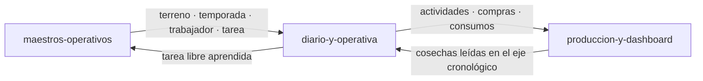

---
modulo: diario-y-operativa
owner: "@andres"
estado: activo
version: "v0.6.0-hito-f"
sla: "el del servicio (99.9%) — ver ../../05-infraestructura/observabilidad.md"
actualizado_en: "2026-08-08"
---

# Módulo: Diario y operativa diaria

> **Owner**: @andres
> **SLA**: el módulo no tiene SLO propio; comparte el del servicio (monolito modular, [ADR-0002](../../02-arquitectura/decisiones/ADR-0002--arquitectura-monolito-modular-online-first.md))
> **Estado**: activo

---

## Qué es

Lo que se registra **cada día**: actividades (quién hizo qué, dónde y en cuánto tiempo), compras de
material y su imputación a terrenos. Y la vista que lo unifica, el **Diario de campo**, que mezcla en
un solo eje cronológico actividades, compras, consumos y cosechas (`RN-033`).

Es la vista principal del producto y el arranque de la aplicación desde `MVP-703`, porque es donde
el usuario pasa el tiempo: el panel se consulta, el diario se usa.

---

## Scope

**Responsabilidades de este módulo:**

- Registro, edición y borrado de actividades, con tarea, responsable, tiempo y coste manual
  (`RN-002`, `RN-003`, `RN-025`).
- Registro de compras con material libre y sugerencias desde el histórico de compras **y** de
  consumos (`RN-031`).
- Imputación de compras a terrenos y consumo sin compra previa, sin recálculo histórico
  (`RN-032`), con aviso no bloqueante si el consumo es anterior a su compra (`RN-043`).
- Diario cronológico unificado, con paginación, filtros y borrado con confirmación explícita
  (`RN-033`, `RN-037`).

**Fuera del scope de este módulo:**

- La cosecha: se registra en [`produccion-y-dashboard`](../produccion-y-dashboard/README.md) aunque
  **aparezca** en el diario. El diario la lee; no la valida ni la escribe.
- El cálculo económico de la campaña, que agrega estos datos pero vive en el panel.
- Los maestros que la captura consume.

---

## Conceptos clave

> Ver también [`../../99-glosario/glosario.md`](../../99-glosario/glosario.md).

| Término | Descripción |
| ------- | ----------- |
| Actividad | Trabajo realizado en un terreno, con tarea, responsable, tiempo y coste manual |
| Compra | Adquisición de material, con cantidad y coste totales |
| Consumo (imputación) | Parte de una compra aplicada a un terreno; la suma no puede exceder la compra |
| Consumo sin compra previa | Imputación de material que no se registró como compra, admitida por `RN-032` |
| Diario de campo | Vista cronológica unificada de actividades, compras, consumos y cosechas |
| Coste manual | En el MVP el coste lo escribe la persona; no hay tarifas ni cálculo automático (`RN-003`) |

---

## Superficie entregada

| Capa | Elementos |
| ---- | --------- |
| API | `/api/v1/activities`, `/api/v1/purchases`, `/api/v1/purchases/{id}/consumptions`, `/api/v1/consumptions`, `/api/v1/diary` |
| Backend | `Application/{Activities,Purchases,Consumptions,Materials,Diary}`, `Domain/{Activities,Purchases,Consumptions,Materials,Diary}`, repositorios homónimos |
| Frontend | `components/{diary,purchases}`, `types/{activity,purchase,consumption,diary}.types.ts` |
| Datos | `activities`, `purchases`, `purchase_consumptions` |

---

## Relaciones con otros módulos

| Módulo | Tipo de relación | Descripción |
| ------ | ---------------- | ----------- |
| [`maestros-operativos`](../maestros-operativos/README.md) | depende de | Consume los cuatro catálogos y devuelve tareas libres al catálogo (`RN-026`) |
| [`produccion-y-dashboard`](../produccion-y-dashboard/README.md) | bidireccional | El diario **lee** cosechas; el panel **lee** actividades, compras y consumos para el valor de campaña |
| [`identidad-y-workspaces`](../identidad-y-workspaces/README.md) | depende de | Ámbito de Workspace en todo registro |
| [`plataforma-de-aplicacion`](../plataforma-de-aplicacion/README.md) | depende de | Cliente HTTP, contrato de error, `If-Match` y confirmación de borrado |

---

## Documentación de referencia

> Esta ficha **no duplica** los diseños técnicos: cada historia mantiene el suyo.

| Documento | Contenido |
| --------- | --------- |
| [MVP-301](../../09-desarrollos/epicas/MVP-003--diario-y-operativa-diaria/MVP-301--registro-y-edicion-de-actividades/tech-design.md) | Registro y edición de actividades |
| [MVP-302](../../09-desarrollos/epicas/MVP-003--diario-y-operativa-diaria/MVP-302--guardado-de-tarea-libre-en-catalogo/tech-design.md) | Guardado de tarea libre en el catálogo |
| [MVP-303](../../09-desarrollos/epicas/MVP-003--diario-y-operativa-diaria/MVP-303--registro-de-compras-operativas/tech-design.md) | Registro de compras operativas |
| [MVP-304](../../09-desarrollos/epicas/MVP-003--diario-y-operativa-diaria/MVP-304--imputacion-de-compras-y-consumo-sin-compra-previa/tech-design.md) | Imputación y consumo sin compra previa |
| [MVP-305](../../09-desarrollos/epicas/MVP-003--diario-y-operativa-diaria/MVP-305--diario-cronologico-unificado-y-borrado-con-confirmacion/tech-design.md) | Diario unificado y borrado con confirmación |
| [MVP-506](../../09-desarrollos/epicas/MVP-005--endurecimiento-y-salida-a-mvp/MVP-506--navegacion-y-escala-del-diario/tech-design.md) | Navegación y escala del diario |
| [MVP-703](../../09-desarrollos/epicas/MVP-007--ajustes-mvp-01/MVP-703--arranque-en-el-diario-y-definicion-de-sesion-activa/tech-design.md) | El diario como arranque de la aplicación |
| [Reglas de negocio](../../01-producto/reglas-de-negocio.md) · [Contratos de API](../../02-arquitectura/contratos-api.md) | `RN-025`, `RN-031`–`RN-033`, `RN-037`, `RN-043` y contrato, mantenidos de forma central |

---

## Contacto y escalación

- **Owner técnico**: @andres
- **Runbooks**: [`../../05-infraestructura/runbooks/`](../../05-infraestructura/runbooks/)
- **Incidentes**: [`../../08-procesos/gestion-incidentes.md`](../../08-procesos/gestion-incidentes.md)
