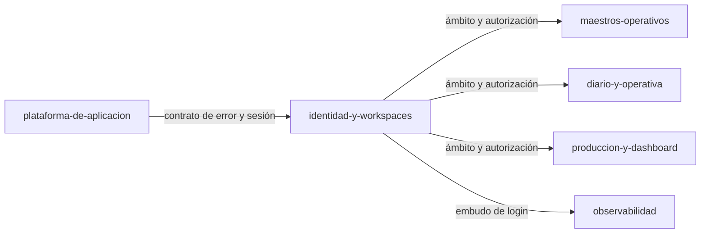

# Módulo: Identidad y Workspaces

> **Owner**: @andres
> **SLA**: el módulo no tiene SLO propio; comparte el del servicio (monolito modular, [ADR-0002](../../02-arquitectura/decisiones/ADR-0002--arquitectura-monolito-modular-online-first.md))
> **Estado**: activo

---

## Qué es

Decide **quién entra** y **en nombre de qué explotación**. Cubre el login con Google, la sesión,
el alta y ciclo de vida del Workspace, las invitaciones, la membresía y la baja de cuenta.

Es el módulo del que dependen todos los demás: sin Workspace resuelto no hay dato operativo que
consultar, porque toda entidad del sistema lleva `workspace_id` y se autoriza por el contexto activo
(principio _Workspace-first_ de [`vision-general.md`](../../02-arquitectura/vision-general.md)).

---

## Scope

**Responsabilidades de este módulo:**

- Autenticación por Google OIDC con PKCE, emisión y refresco de sesión (`RN-036`, `RN-018`).
- Alta, renombrado, baja lógica, reapertura y traspaso de propiedad del Workspace (`RN-038`–`RN-040`).
- Invitaciones por email y por enlace, con token de un solo uso (`RN-035`).
- Membresía, selector de Workspace activo y permisos planos por Workspace (`RN-034`).
- Baja de cuenta con anonimización inmediata y purga a plazo (`RN-041`).

**Fuera del scope de este módulo:**

- Los datos operativos del Workspace: los gestionan los módulos de maestros, diario y producción.
- El maestro de trabajadores. La persona invitada aparece como trabajador, pero esa proyección
  la construye [`maestros-operativos`](../maestros-operativos/README.md) (`RN-027`).
- Roles y permisos finos: el MVP tiene permisos planos por decisión de producto (`RN-034`).

---

## Conceptos clave

> Ver también [`../../99-glosario/glosario.md`](../../99-glosario/glosario.md).

| Término | Descripción |
| ------- | ----------- |
| Workspace | Unidad de aislamiento y de autorización. Toda entidad operativa pertenece a uno |
| Workspace activo | El que el usuario tiene seleccionado; se persiste en `users.active_workspace_id` |
| Membresía | Relación usuario–Workspace con estado `invitado`/`activo`/`revocado` |
| Invitación | Ofrecimiento de acceso con token de un solo uso, por email o por enlace |
| Baja lógica | Cierre del Workspace sin borrar datos (`deleted_at`), reversible por quien lo cerró |
| Anonimización | Sustitución de la PII del usuario al darse de baja, conservando el rastro operativo |

---

## Superficie entregada

| Capa | Elementos |
| ---- | --------- |
| API | `/api/v1/auth`, `/api/v1/account`, `/api/v1/workspaces`, `/api/v1/workspaces/invitations`, `/api/v1/workspaces/reactivations`, `/api/v1/workspace-members`, `/api/v1/invitations` |
| Backend | `Application/{Auth,Workspaces,Invitations,Account,Retention}`, `Domain/{Users,Workspaces}`, `Infrastructure/{Auth,Invitations,Email,Tokens,Retention}`, `Common/{Auth,Workspaces}` |
| Frontend | `components/{auth,onboarding,invitations,notifications,members,workspace,settings}`, `contexts/{AuthContext,WorkspaceContext,DataScopeContext}`, `routes/{ProtectedRoute,RequireWorkspace}` |
| Datos | `users`, `refresh_tokens`, `workspaces`, `workspace_members`, `workspace_invitations`, `workspace_reactivation_requests` |

---

## Relaciones con otros módulos

| Módulo | Tipo de relación | Descripción |
| ------ | ---------------- | ----------- |
| [`maestros-operativos`](../maestros-operativos/README.md) | es consumido por | Le da el ámbito de Workspace y la proyección de miembros como trabajadores |
| [`diario-y-operativa`](../diario-y-operativa/README.md) | es consumido por | Mismo ámbito; todo registro lleva `workspace_id` |
| [`produccion-y-dashboard`](../produccion-y-dashboard/README.md) | es consumido por | Mismo ámbito |
| [`observabilidad`](../observabilidad/README.md) | es consumido por | Emite los hitos del embudo de login |
| [`plataforma-de-aplicacion`](../plataforma-de-aplicacion/README.md) | depende de | Le aporta el cliente HTTP, el contrato de error y el shell |
| Google OIDC | dependencia externa | Único proveedor de identidad del MVP (`RN-036`) |
| SMTP transaccional | dependencia externa | Invitaciones y avisos de ciclo de vida ([ADR-0010](../../02-arquitectura/decisiones/ADR-0010--envio-de-email-transaccional-por-smtp.md)) |

---

## Documentación de referencia

> Este módulo **no duplica** los diseños técnicos: cada historia mantiene el suyo y esta ficha es el
> índice de entrada.

| Documento | Contenido |
| --------- | --------- |
| [MVP-101](../../09-desarrollos/epicas/MVP-001--identidad-y-contexto-seguro/MVP-101--google-oidc-y-sesion-base/tech-design.md) | Google OIDC, PKCE y sesión base |
| [MVP-102](../../09-desarrollos/epicas/MVP-001--identidad-y-contexto-seguro/MVP-102--creacion-de-workspace-y-primer-acceso/tech-design.md) | Alta de Workspace y primer acceso |
| [MVP-103](../../09-desarrollos/epicas/MVP-001--identidad-y-contexto-seguro/MVP-103--invitaciones-por-email-y-enlace/tech-design.md) · [MVP-107](../../09-desarrollos/epicas/MVP-001--identidad-y-contexto-seguro/MVP-107--invitaciones-no-bloqueantes-y-notificaciones/tech-design.md) | Invitaciones y notificaciones no bloqueantes |
| [MVP-104](../../09-desarrollos/epicas/MVP-001--identidad-y-contexto-seguro/MVP-104--membresia-y-selector-de-workspace-activo/tech-design.md) | Membresía y selector de Workspace activo |
| [MVP-105](../../09-desarrollos/epicas/MVP-001--identidad-y-contexto-seguro/MVP-105--autorizacion-por-workspace-y-trazabilidad-minima/tech-design.md) | Autorización por Workspace y trazabilidad |
| [MVP-106](../../09-desarrollos/epicas/MVP-001--identidad-y-contexto-seguro/MVP-106--correcciones-de-acceso-login-y-landing/tech-design.md) | Correcciones de acceso, login y landing |
| [MVP-206](../../09-desarrollos/epicas/MVP-002--maestros-operativos-y-onboarding/MVP-206--ciclo-de-vida-del-workspace/tech-design.md) | Ciclo de vida del Workspace y no-orfandad |
| [MVP-502](../../09-desarrollos/epicas/MVP-005--endurecimiento-y-salida-a-mvp/MVP-502--hardening-de-seguridad-y-validacion-de-pii/tech-design.md) | Hardening y validación de PII |
| [MVP-701](../../09-desarrollos/epicas/MVP-007--ajustes-mvp-01/MVP-701--coherencia-de-contexto-workspace-y-temporada/tech-design.md) | Coherencia del contexto activo |
| [Contratos de API](../../02-arquitectura/contratos-api.md) · [Modelo de datos](../../02-arquitectura/modelo-de-datos.md) | Contrato y esquema, mantenidos de forma central |
| [Autenticación y autorización](../../07-seguridad/autenticacion-autorizacion.md) · [Privacidad](../../07-seguridad/privacidad-datos.md) | Perímetro de seguridad y tratamiento de PII |

---

## Contacto y escalación

- **Owner técnico**: @andres
- **Runbooks**: [`../../05-infraestructura/runbooks/`](../../05-infraestructura/runbooks/)
- **Incidentes**: [`../../08-procesos/gestion-incidentes.md`](../../08-procesos/gestion-incidentes.md)
