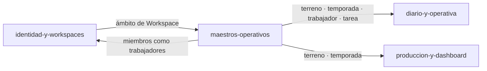

# Módulo: Maestros operativos

> **Owner**: @andres
> **SLA**: el módulo no tiene SLO propio; comparte el del servicio (monolito modular, [ADR-0002](../../02-arquitectura/decisiones/ADR-0002--arquitectura-monolito-modular-online-first.md))
> **Estado**: activo

---

## Qué es

Los cuatro catálogos con los que se describe la explotación antes de poder registrar nada:
**terrenos**, **temporadas**, **trabajadores** y **tareas**. Incluye el onboarding, que es la
secuencia por la que un Workspace recién creado llega a tenerlos poblados.

Van juntos y no como cuatro módulos porque comparten el mismo papel en el sistema —ser el
vocabulario cerrado que la captura diaria consume— y porque separarlos produciría cuatro fichas
que dirían lo mismo. El precedente lo fijó `MVP-202`: no se crea un módulo por historia.

---

## Scope

**Responsabilidades de este módulo:**

- Maestro de terrenos con alta mínima (`RN-028`) y detalle con histórico por terreno.
- Maestro de temporadas: estado derivado de fechas y cierre, y **temporada de trabajo por usuario**
  (`RN-021`, `RN-022`, `RN-024`).
- Maestro de trabajadores, con los miembros del Workspace expuestos como trabajadores (`RN-027`).
- Catálogo de tareas por Workspace con aprendizaje local desde la captura (`RN-025`, `RN-026`).
- Onboarding: alta de la primera temporada y checklist «Prepara tu explotación».

**Fuera del scope de este módulo:**

- Quién puede editarlos: lo resuelve
  [`identidad-y-workspaces`](../identidad-y-workspaces/README.md) con permisos planos (`RN-034`).
- El registro operativo que los usa: es
  [`diario-y-operativa`](../diario-y-operativa/README.md) y
  [`produccion-y-dashboard`](../produccion-y-dashboard/README.md).
- El catálogo de productos y destinos de cosecha, cerrado en backend y propiedad de producción.

---

## Conceptos clave

> Ver también [`../../99-glosario/glosario.md`](../../99-glosario/glosario.md).

| Término | Descripción |
| ------- | ----------- |
| Terreno | Parcela identificable; unidad base de todo registro operativo (`RN-001`) |
| Temporada | Campaña con fechas de inicio y fin; su **estado** se deriva, no se declara |
| Temporada de trabajo | La que cada usuario tiene seleccionada, en `workspace_members.active_season_id` |
| Trabajador | Persona imputable en una actividad; puede ser un miembro del Workspace o alguien externo |
| Tarea | Entrada del catálogo de trabajos; se puede crear desde la propia captura y queda aprendida |
| Alta mínima | Política de crear un maestro con el dato imprescindible y completarlo después |

---

## Superficie entregada

| Capa | Elementos |
| ---- | --------- |
| API | `/api/v1/plots`, `/api/v1/seasons`, `/api/v1/workers`, `/api/v1/tasks` |
| Backend | `Application/{Plots,Seasons,Workers,Tasks}`, `Domain/{Plots,Seasons,Workers,Tasks}`, repositorios homónimos |
| Frontend | `components/{plots,seasons,workers,tasks,onboarding,home}`, `contexts/SeasonContext`, `lib/season-scope.ts` |
| Datos | `plots`, `seasons`, `workers`, `tasks` |

---

## Relaciones con otros módulos

| Módulo | Tipo de relación | Descripción |
| ------ | ---------------- | ----------- |
| [`identidad-y-workspaces`](../identidad-y-workspaces/README.md) | depende de | Ámbito de Workspace y roster de miembros (`RN-027`) |
| [`diario-y-operativa`](../diario-y-operativa/README.md) | es consumido por | Cada actividad referencia terreno, temporada, trabajador y tarea |
| [`produccion-y-dashboard`](../produccion-y-dashboard/README.md) | es consumido por | Cosechas y filtros del panel se apoyan en terreno y temporada |
| [`plataforma-de-aplicacion`](../plataforma-de-aplicacion/README.md) | depende de | Cliente HTTP, contrato de error y concurrencia optimista |

---

## Documentación de referencia

> Esta ficha **no duplica** los diseños técnicos: cada historia mantiene el suyo.

| Documento | Contenido |
| --------- | --------- |
| [MVP-201](../../09-desarrollos/epicas/MVP-002--maestros-operativos-y-onboarding/MVP-201--onboarding-inicial-y-primera-temporada/tech-design.md) | Onboarding inicial y primera temporada |
| [MVP-202](../../09-desarrollos/epicas/MVP-002--maestros-operativos-y-onboarding/MVP-202--maestro-de-terrenos-con-alta-minima/tech-design.md) | Maestro de terrenos con alta mínima |
| [MVP-203](../../09-desarrollos/epicas/MVP-002--maestros-operativos-y-onboarding/MVP-203--maestro-de-temporadas-y-unica-activa/tech-design.md) · [MVP-209](../../09-desarrollos/epicas/MVP-002--maestros-operativos-y-onboarding/MVP-209--estado-temporada-y-temporada-de-trabajo-por-usuario/tech-design.md) | Temporadas: modelo inicial y su rediseño en estado + temporada de trabajo |
| [MVP-204](../../09-desarrollos/epicas/MVP-002--maestros-operativos-y-onboarding/MVP-204--maestro-de-trabajadores-y-miembros-del-workspace/tech-design.md) | Trabajadores y miembros del Workspace |
| [MVP-205](../../09-desarrollos/epicas/MVP-002--maestros-operativos-y-onboarding/MVP-205--catalogo-de-tareas-por-workspace/tech-design.md) · [MVP-302](../../09-desarrollos/epicas/MVP-003--diario-y-operativa-diaria/MVP-302--guardado-de-tarea-libre-en-catalogo/tech-design.md) | Catálogo de tareas y su aprendizaje desde la captura |
| [MVP-207](../../09-desarrollos/epicas/MVP-002--maestros-operativos-y-onboarding/MVP-207--correcciones-de-cierre-de-maestros/tech-design.md) · [MVP-208](../../09-desarrollos/epicas/MVP-002--maestros-operativos-y-onboarding/MVP-208--identidad-del-responsable-y-correcciones-finales/tech-design.md) | Correcciones de cierre de la épica de maestros |
| [MVP-407](../../09-desarrollos/epicas/MVP-004--produccion-y-dashboard-mvp/MVP-407--detalle-de-terreno-con-historico/spec.md) | Detalle de terreno con histórico |
| [Reglas de negocio](../../01-producto/reglas-de-negocio.md) · [Modelo de datos](../../02-arquitectura/modelo-de-datos.md) | `RN-021`–`RN-028` y esquema, mantenidos de forma central |

---

## Contacto y escalación

- **Owner técnico**: @andres
- **Runbooks**: [`../../05-infraestructura/runbooks/`](../../05-infraestructura/runbooks/)
- **Incidentes**: [`../../08-procesos/gestion-incidentes.md`](../../08-procesos/gestion-incidentes.md)
