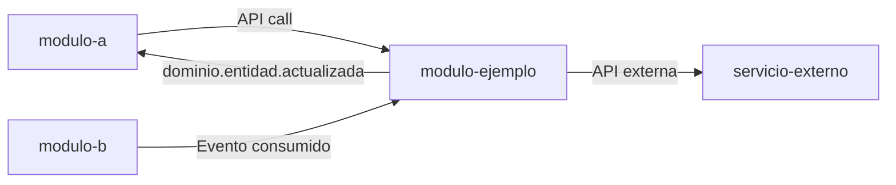

---
modulo: modulo-ejemplo
owner: "@equipo-modulo"
estado: activo
version: "2.0.0"
sla: "99.9%"
actualizado_en: "2026-07-16"
---

# Modulo: Ejemplo neutro

> **Ejemplo de plantilla**: este directorio existe solo para mostrar la estructura documental de un módulo.
> No representa un módulo real del proyecto, no debe usarse como contexto funcional y debe eliminarse cuando se cree el primer módulo real.
> **Owner**: @equipo-modulo
> **SLA**: 99.9% de disponibilidad
> **Estado**: activo

---

## Qué es

Este modulo documenta una estructura de referencia para cualquier dominio funcional.
No representa procesos ni entidades reales de ningun proyecto en particular.

---

## Scope

**Responsabilidades de este módulo:**

- Implementar el flujo principal del dominio
- Gestionar el estado del ciclo de vida de la entidad principal
- Integrar con servicios externos mediante puertos y adaptadores
- Emitir eventos de negocio al bus de eventos

**Fuera del scope de este módulo:**

- Autenticacion y autorizacion transversal
- Gestion de catalogos globales
- Reporteria avanzada multi-modulo

---

## Conceptos clave

| Término | Descripción |
|---------|-------------|
| Entidad principal | Objeto de negocio central del modulo |
| Estado | Fase del ciclo de vida de la entidad |
| Operacion | Accion relevante aplicada sobre la entidad |
| Integracion externa | Servicio de terceros necesario para el flujo |
| Evento de dominio | Mensaje publicado tras un cambio de estado |
| Conciliacion | Verificacion entre estado interno y estado externo |

---

## Relaciones con otros módulos

| Módulo | Tipo de relación | Descripción |
|--------|-----------------|-------------|
| `modulo-a` | Consumidor de la API | Inicia operaciones y consume eventos |
| `modulo-b` | Consumidor de eventos | Reacciona a cambios de estado |
| `servicio-externo` | Dependencia | Proveedor externo para parte del flujo |

---

## Documentación del módulo

| Documento | Contenido |
|-----------|-----------|
| [modelo-dominio.md](./modelo-dominio.md) | Entidades, agregados, reglas de negocio |
| [arquitectura.md](./arquitectura.md) | Diseño interno y patrones |
| [api-referencia.md](./api-referencia.md) | Endpoints expuestos |
| [eventos.md](./eventos.md) | Eventos emitidos y consumidos |
| [modelo-datos.md](./modelo-datos.md) | Esquema de base de datos |
| [integraciones.md](./integraciones.md) | Servicios externos y contratos |
| [decisiones/](./decisiones/) | ADRs del módulo |

---

## Contacto y escalación

- **Owner tecnico**: @equipo-modulo
- **Canal de soporte**: #modulo-support
- **Runbooks**: `../../05-infraestructura/runbooks/`
- **On-call**: ver `../../08-procesos/gestion-incidentes.md`
