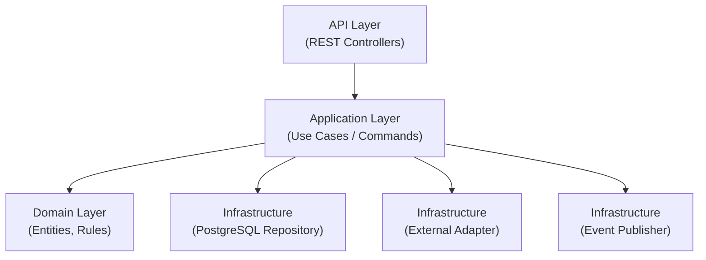
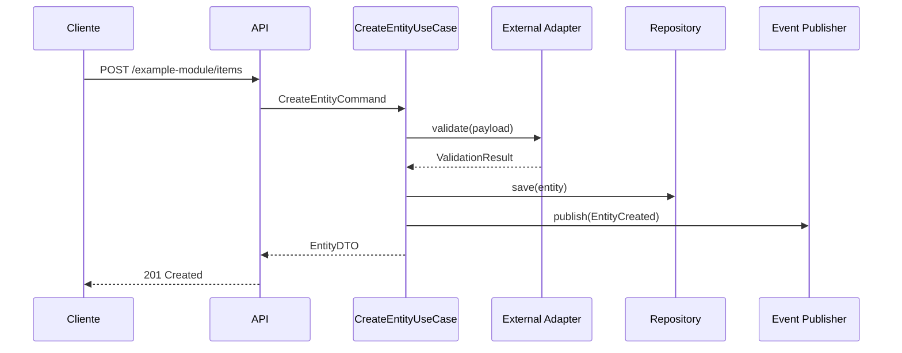

---
modulo: modulo-ejemplo
documento: arquitectura
actualizado_en: "2026-07-16"
---

# Modulo de ejemplo — Arquitectura Interna

> Documento de ejemplo. No describe arquitectura real del proyecto.

---

## Diagrama de componentes

---

## Patrón arquitectural

### Arquitectura hexagonal (Ports & Adapters)

- **Domain layer**: entidades y reglas de negocio puras, sin dependencias externas
- **Application layer**: casos de uso / comandos, orquesta el dominio
- **Infrastructure layer**: adaptadores para DB, servicios externos y bus de eventos

**Justificación**: ver `decisiones/ADR-0001--arquitectura-hexagonal.md`

---

## Flujo principal: procesar una operacion

---

## Decisiones técnicas relevantes

| ADR | Decisión |
|-----|----------|
| [ADR-0001](./decisiones/ADR-0001--arquitectura-hexagonal.md) | Arquitectura hexagonal |

---

## Configuración y variables de entorno

| Variable | Descripción | Requerida |
|----------|-------------|-----------|
| `EXAMPLE_PROVIDER` | Proveedor externo activo | Si |
| `EXAMPLE_API_KEY` | Credencial de integracion externa | Si |
| `EXAMPLE_WEBHOOK_SECRET` | Secreto para validar webhooks | Si |
| `EXAMPLE_EXPIRY_HOURS` | Horas hasta expirar entidades pendientes | No (default: 24) |
