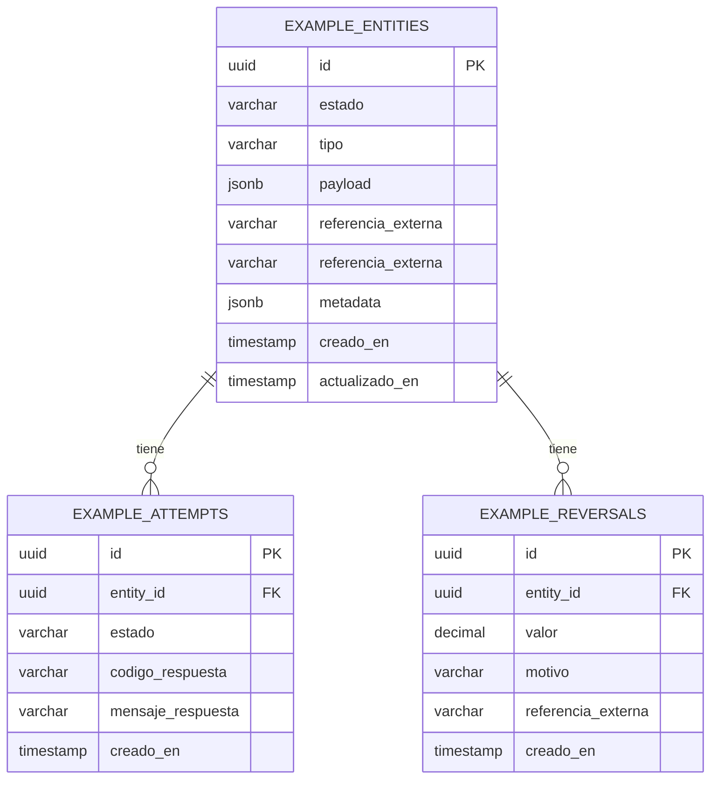

---
modulo: modulo-ejemplo
documento: modelo-datos
actualizado_en: "2026-07-16"
---

# Modulo de ejemplo — Modelo de Datos

> Documento de ejemplo. No describe el modelo de datos real del proyecto.

---

## Diagrama

---

## Tablas

### `example_entities`

| Columna | Tipo | Nullable | Descripción |
|---------|------|---------|-------------|
| `id` | UUID | No | PK, generado en aplicación |
| `estado` | VARCHAR(30) | No | Estado actual de la transacción |
| `tipo` | VARCHAR(50) | No | Tipo de entidad |
| `payload` | JSONB | No | Datos principales de la entidad |
| `referencia_externa` | VARCHAR(255) | Si | ID externo de trazabilidad |
| `metadata` | JSONB | Sí | Datos adicionales |
| `creado_en` | TIMESTAMP | No | |
| `actualizado_en` | TIMESTAMP | No | |

**Indices**: `estado`, `referencia_externa`, `creado_en`

---

### `example_attempts`

Registro de cada intento de comunicacion con un servicio externo (auditoria y reintentos).

### `example_reversals`

Registro de reversiones asociadas a una entidad.

---

## Migraciones

Las migraciones estan en `src/example-module/infrastructure/migrations/`.
Se ejecutan automáticamente en el pipeline de CI/CD.
Ver proceso en `../../05-infraestructura/ci-cd.md`.
