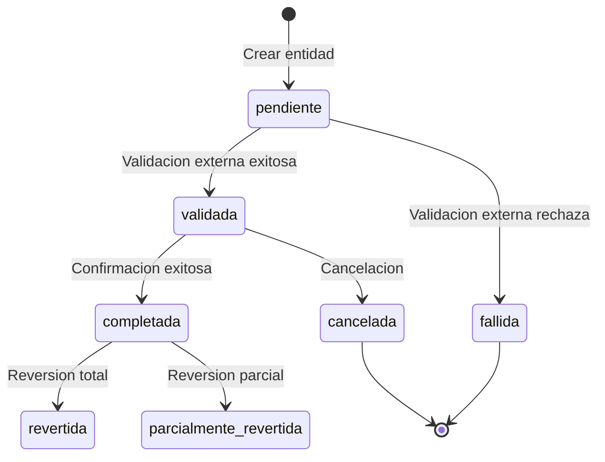

---
modulo: modulo-ejemplo
documento: modelo-dominio
actualizado_en: "2026-07-16"
---

# Modulo de ejemplo — Modelo de Dominio

> Documento de ejemplo. No describe el dominio real del proyecto.

---

## Agregados y entidades

### Agregado: ExampleEntity (raiz)

El agregado central del modulo. Representa una operacion completa del flujo principal.

| Campo | Tipo | Descripción |
|-------|------|-------------|
| `id` | UUID | Identificador único |
| `estado` | enum | Estado actual (ver ciclo de vida) |
| `tipo` | string | Tipo de entidad |
| `payload` | object | Datos de la operacion |
| `referencia_externa` | string | Referencia en servicio externo |
| `creado_en` | timestamp | |
| `actualizado_en` | timestamp | |

**Entidades dentro del agregado:**

- `OperationAttempt` — cada intento de procesar la operacion
- `Reversal` — reversa asociada a la entidad

### Value Object: DomainValue

```text
DomainValue {
  valor: Decimal (precision definida por el dominio)
  unidad: string
}
```

---

## Ciclo de vida de una entidad



---

## Reglas de negocio del módulo

| ID | Regla | Impacto |
|----|-------|---------|
| `EX-RN-001` | Solo se puede revertir una entidad en estado `completada` | Validacion en dominio |
| `EX-RN-002` | El valor de la reversion no puede superar el valor original | Validacion en dominio |
| `EX-RN-003` | Una entidad expirada (>24h en `pendiente`) pasa a `fallida` automaticamente | Job periodico |
| `EX-RN-004` | Toda operacion critica requiere validacion de proveedor externo | Obligatorio |

---

## Ubiquitous Language

Términos que deben usarse de forma consistente en el código, documentación y conversaciones:

| Término en el dominio | NO usar | Descripción |
|----------------------|---------|-------------|
| `ExampleEntity` | `item`, `registro` | Entidad principal del sistema |
| `validar` | `chequear` | Primera fase del flujo |
| `completar` | `cerrar` | Segunda fase del flujo |
| `revertir` | `deshacer` | Reversion de una operacion |
| `external-provider` | `servicio externo` | Integracion externa principal |
