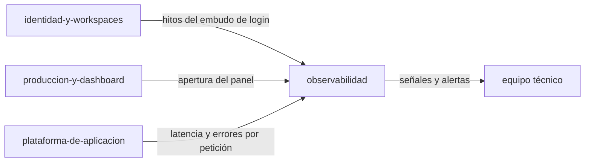

# Módulo: Observabilidad

> **Owner**: @andres
> **SLA**: el módulo no tiene SLO propio; comparte el del servicio (monolito modular, [ADR-0002](../../02-arquitectura/decisiones/ADR-0002--arquitectura-monolito-modular-online-first.md))
> **Estado**: activo · **tipo**: módulo de soporte

---

## Qué es

Lo que permite saber si el producto **funciona** y si **se usa**: el embudo de login, las métricas
de uso, los tres SLO del MVP, la sonda de salud y las alertas.

Es un módulo de soporte y no una sección de infraestructura porque tiene modelo, contrato y
persistencia propios: los contadores diarios son una tabla del sistema y `/api/v1/ops/signals` es un
endpoint del producto, no del proveedor. La configuración del entorno donde corre sí vive en
[`../../05-infraestructura/observabilidad.md`](../../05-infraestructura/observabilidad.md).

---

## Scope

**Responsabilidades de este módulo:**

- Telemetría del embudo de login, con la trazabilidad de abandono que exige `RN-020`.
- Telemetría de uso: sesión activa —la que **llega al área operativa**— y apertura del panel.
- Agregación en contadores diarios, con volcado periódico en vez de escritura por evento.
- Señales operativas y SLO en `/api/v1/ops/signals`, tras llave de servicio.
- Evaluación de alertas sobre ventanas deslizantes y notificación de degradación.
- Sonda de salud (`/api/v1/health`) para el arranque y el balanceador.

**Fuera del scope de este módulo:**

- El significado de negocio de los KPI: se define en
  [`../../01-producto/kpis.md`](../../01-producto/kpis.md).
- Provisión y configuración de la plataforma de observabilidad
  ([ADR-0008](../../02-arquitectura/decisiones/ADR-0008--infraestructura-y-observabilidad-mvp-fase-c.md)).
- Trazas distribuidas y APM: fuera del MVP.
- PII en las señales: por diseño, ninguna métrica lleva datos personales.

---

## Conceptos clave

> Ver también [`../../99-glosario/glosario.md`](../../99-glosario/glosario.md).

| Término | Descripción |
| ------- | ----------- |
| Embudo de login | Secuencia de hitos desde el intento de acceso hasta la sesión establecida |
| Sesión activa | La que llega al área operativa; definida así en `MVP-703` y usada como divisor de KPI |
| Contador diario | Fila agregada por día y dimensión; evita una escritura por evento |
| SLO | Objetivo de servicio medido sobre ventana deslizante (disponibilidad, latencia, error) |
| Alerta | Umbral sobre una señal, con estado propio para no repetir el aviso mientras dura |
| Llave de servicio | `X-Ops-Key`; autentica al equipo, no a un usuario, y sin ella el endpoint no existe |

---

## Superficie entregada

| Capa | Elementos |
| ---- | --------- |
| API | `/api/v1/health`, `/api/v1/telemetry/usage`, `/api/v1/auth/telemetry/login`, `/api/v1/ops/signals` |
| Backend | `Infrastructure/Telemetry` (incluye `Alerts`, `Summary`), `Application/Ops`, `Common/Http/RequestMetricsMiddleware`, `Common/Http/LandingViewMiddleware`, `TelemetryFlushWorker` |
| Frontend | `lib/{login-telemetry,usage-telemetry,use-usage-telemetry}.ts`, `services/telemetry.service.ts` |
| Datos | `telemetry_daily_counters` |

---

## Relaciones con otros módulos

| Módulo | Tipo de relación | Descripción |
| ------ | ---------------- | ----------- |
| [`identidad-y-workspaces`](../identidad-y-workspaces/README.md) | depende de | Recibe los hitos del embudo; la señal de sesión se emite al entrar al área operativa |
| [`produccion-y-dashboard`](../produccion-y-dashboard/README.md) | depende de | Recibe la apertura del panel, numerador del KPI de adopción |
| [`plataforma-de-aplicacion`](../plataforma-de-aplicacion/README.md) | depende de | El middleware de métricas mide todas las peticiones sin que ningún módulo lo pida |

---

## Documentación de referencia

> Esta ficha **no duplica** los diseños técnicos: cada historia mantiene el suyo.

| Documento | Contenido |
| --------- | --------- |
| [MVP-601](../../09-desarrollos/epicas/MVP-006--observabilidad-inicial/MVP-601--telemetria-minima-del-embudo-de-login/tech-design.md) | Telemetría mínima del embudo de login |
| [MVP-602](../../09-desarrollos/epicas/MVP-006--observabilidad-inicial/MVP-602--metricas-de-uso-del-dashboard/tech-design.md) | Métricas de uso del dashboard |
| [MVP-603](../../09-desarrollos/epicas/MVP-006--observabilidad-inicial/MVP-603--alertas-basicas-y-senales-de-degradacion/tech-design.md) | Alertas básicas y señales de degradación |
| [MVP-699](../../09-desarrollos/epicas/MVP-006--observabilidad-inicial/MVP-699--revision-epica/tech-design.md) | Correcciones de cierre de la épica |
| [MVP-703](../../09-desarrollos/epicas/MVP-007--ajustes-mvp-01/MVP-703--arranque-en-el-diario-y-definicion-de-sesion-activa/tech-design.md) | Definición de sesión activa y ruptura de serie del KPI |
| [MKT-101](../../09-desarrollos/epicas/MKT-100--posicionamiento-organico-inicial/MKT-101--resumen-operativo-por-email-diario-y-semanal/tech-design.md) | Resumen operativo por email diario y semanal |
| [MKT-106](../../09-desarrollos/epicas/MKT-100--posicionamiento-organico-inicial/MKT-106--trazabilidad-por-landing-y-conversion-completa/tech-design.md) | Trazabilidad por landing y conversión completa |
| [Observabilidad](../../05-infraestructura/observabilidad.md) · [KPIs](../../01-producto/kpis.md) | SLO, señales y métricas de producto, mantenidos de forma central |
| [Revisión operativa](../../05-infraestructura/runbooks/revision-operativa.md) | Runbook de la revisión periódica de señales |

---

## Contacto y escalación

- **Owner técnico**: @andres
- **Runbooks**: [`../../05-infraestructura/runbooks/`](../../05-infraestructura/runbooks/)
- **Incidentes**: [`../../08-procesos/gestion-incidentes.md`](../../08-procesos/gestion-incidentes.md)
