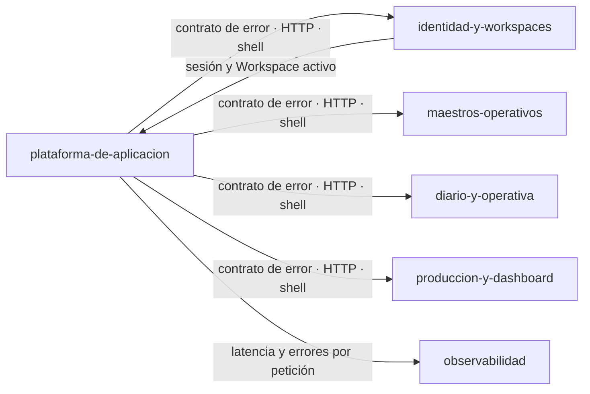

---
modulo: plataforma-de-aplicacion
owner: "@andres"
estado: activo
version: "v0.6.0-hito-f"
sla: "el del servicio (99.9%) — ver ../../05-infraestructura/observabilidad.md"
actualizado_en: "2026-08-08"
---

# Módulo: Plataforma de aplicación

> **Owner**: @andres
> **SLA**: el módulo no tiene SLO propio; comparte el del servicio (monolito modular, [ADR-0002](../../02-arquitectura/decisiones/ADR-0002--arquitectura-monolito-modular-online-first.md))
> **Estado**: activo · **tipo**: módulo de soporte

---

## Qué es

El chasis que comparten todos los demás: el contrato de error de la API, la concurrencia optimista,
las cabeceras de seguridad, el acceso a datos, el cliente HTTP del frontend, el shell de la
aplicación (cabecera, lateral, rutas) y la presencia pública —landing y páginas legales—.

Existe como módulo porque **su código existe**, no cabe en ninguno de los otros cinco y es lo que
más se toca: `MVP-406`, `MVP-505` y buena parte de `MVP-007` viven aquí. Repartirlo entre los
módulos funcionales lo dejaría sin dueño y volvería a pasar lo que pasó antes de esta ficha: nadie
sabría dónde está descrito.

---

## Scope

**Responsabilidades de este módulo:**

- Contrato de error uniforme (`ApiError`, catálogo de `ErrorCodes`, traducción de `ModelState`).
- Concurrencia optimista por `If-Match`/versión, con `409` explícito
  ([ADR-0005](../../02-arquitectura/decisiones/ADR-0005--concurrencia-online-bloqueo-optimista.md)).
- Cabeceras de seguridad y `X-Request-Id` en toda respuesta (`P-005`, `P-006`).
- Acceso a datos y migraciones EF Core
  ([ADR-0004](../../02-arquitectura/decisiones/ADR-0004--acceso-datos-ef-core-mvp-evolucion-dapper.md)).
- Cliente HTTP único del frontend, con reacción centralizada a los errores de sesión y de ámbito.
- Shell del área operativa: cabecera, lateral, navegación, 404 dentro y fuera del shell, y la
  decisión de arranque en `HomeView`.
- Presencia pública: landing y páginas legales de privacidad y términos.
- Identidad del producto fuera de su propia pantalla (`MVP-710`): iconos de marca, `manifest.webmanifest`,
  `theme-color` y las etiquetas sociales del documento, todo **autoalojado** por `RN-042`.

**Fuera del scope de este módulo:**

- Cualquier regla de negocio: aquí no hay dominio, solo el soporte común.
- El contenido legal en sí, que responde a
  [`../../07-seguridad/privacidad-datos.md`](../../07-seguridad/privacidad-datos.md).
- Entornos, CI/CD y despliegue: son [`../../05-infraestructura/`](../../05-infraestructura/entornos.md).
- Captura offline y sincronización diferida: fuera del MVP por decisión de arquitectura.

---

## Conceptos clave

> Ver también [`../../99-glosario/glosario.md`](../../99-glosario/glosario.md).

| Término | Descripción |
| ------- | ----------- |
| Contrato de error | Forma única de los errores de la API: código estable, mensaje y detalle por campo |
| Código de error | Identificador estable (`AUTH_WORKSPACE_SCOPE_REQUIRED`, …) sobre el que reacciona el cliente |
| Concurrencia optimista | Edición con versión: si otro cambió el registro antes, la API responde `409` |
| Shell | Marco persistente del área operativa: cabecera, lateral y contenido |
| Guarda de ruta | Comprobación previa a renderizar: hay sesión, hay Workspace, hay temporada |
| Presencia pública | Lo que se ve sin sesión: landing, login y páginas legales |

---

## Superficie entregada

| Capa | Elementos |
| ---- | --------- |
| Backend | `Common/Errors`, `Common/Http` (`RequestId`, `SecurityHeaders`, `RequestMetrics`, `IfMatchHeader`, `PartialUpdateBody`), `Infrastructure/Data` |
| Frontend | `lib/http-client.ts`, `contexts/{ApiContext,DataScopeContext}`, `routes/`, `components/{layout,home,errors,common,marketing,legal}`, `config/legal-entity.ts`, `index.html`, `public/` (iconos, manifest e imagen social) y `scripts/generar-iconos.mjs` |
| Datos | Ninguna tabla propia: gestiona el `DbContext` y las migraciones de todo el esquema |

---

## Relaciones con otros módulos

| Módulo | Tipo de relación | Descripción |
| ------ | ---------------- | ----------- |
| Todos los módulos funcionales | es consumido por | Contrato de error, concurrencia, cliente HTTP y shell |
| [`identidad-y-workspaces`](../identidad-y-workspaces/README.md) | bidireccional | Las guardas de ruta y el cliente HTTP dependen de la sesión y del Workspace activo |
| [`observabilidad`](../observabilidad/README.md) | es consumido por | El middleware de métricas mide todas las peticiones |

---

## Documentación de referencia

> Esta ficha **no duplica** los diseños técnicos: cada historia mantiene el suyo.

| Documento | Contenido |
| --------- | --------- |
| [MVP-105](../../09-desarrollos/epicas/MVP-001--identidad-y-contexto-seguro/MVP-105--autorizacion-por-workspace-y-trazabilidad-minima/tech-design.md) | Cabeceras de seguridad y `X-Request-Id` |
| [MVP-202](../../09-desarrollos/epicas/MVP-002--maestros-operativos-y-onboarding/MVP-202--maestro-de-terrenos-con-alta-minima/tech-design.md) | Cliente HTTP común y reacción centralizada a los errores de ámbito |
| [MVP-406](../../09-desarrollos/epicas/MVP-004--produccion-y-dashboard-mvp/MVP-406--navegacion-del-area-operativa/tech-design.md) | Navegación del área operativa y 404 |
| [MVP-502](../../09-desarrollos/epicas/MVP-005--endurecimiento-y-salida-a-mvp/MVP-502--hardening-de-seguridad-y-validacion-de-pii/tech-design.md) | Endurecimiento del borde y validación de entrada |
| [MVP-505](../../09-desarrollos/epicas/MVP-005--endurecimiento-y-salida-a-mvp/MVP-505--cumplimiento-funcional-de-salida/tech-design.md) | Páginas legales públicas y panel de privacidad |
| [MVP-703](../../09-desarrollos/epicas/MVP-007--ajustes-mvp-01/MVP-703--arranque-en-el-diario-y-definicion-de-sesion-activa/tech-design.md) | Decisión de arranque en `HomeView` |
| [MVP-710](../../09-desarrollos/epicas/MVP-007--ajustes-mvp-01/MVP-710--identidad-de-marca-y-presencia-del-producto/tech-design.md) | Iconos de marca, manifest y tarjeta social, todo autoalojado |
| [Contratos de API](../../02-arquitectura/contratos-api.md) · [Componentes](../../02-arquitectura/componentes.md) | Convenciones de contrato y despiece C4, mantenidos de forma central |
| [Estándares de código](../../04-ingenieria/estandares-codigo.md) | Convenciones que este chasis impone al resto |

---

## Contacto y escalación

- **Owner técnico**: @andres
- **Runbooks**: [`../../05-infraestructura/runbooks/`](../../05-infraestructura/runbooks/)
- **Incidentes**: [`../../08-procesos/gestion-incidentes.md`](../../08-procesos/gestion-incidentes.md)
