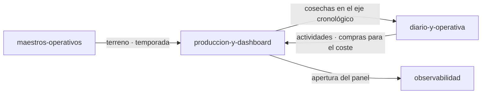

# Módulo: Producción y dashboard

> **Owner**: @andres
> **SLA**: el módulo no tiene SLO propio; comparte el del servicio (monolito modular, [ADR-0002](../../02-arquitectura/decisiones/ADR-0002--arquitectura-monolito-modular-online-first.md))
> **Estado**: activo

---

## Qué es

El **resultado** de la campaña: el registro de cosechas y la Visión General que las agrega en
kilos por destino, kilos por terreno, evolución del rendimiento y valor económico.

Cosecha y panel van en el mismo módulo porque el panel no es una capa de lectura genérica: sus
widgets están definidos contra el modelo de cosecha (`RN-009`) y cualquier cambio en la regla de
captura —el catálogo de destinos, la exclusión rendimiento/litros— cambia lo que el panel puede
calcular. Separarlos obligaría a mantener dos veces la misma regla.

---

## Scope

**Responsabilidades de este módulo:**

- Registro y edición de cosechas con `kgs` obligatorio y exclusión mutua rendimiento/litros
  (`RN-004`, `RN-014`, `RN-016`).
- Catálogo cerrado de productos y destinos, versionado en backend, con destino `desconocido`
  (`RN-012`, `RN-030`).
- Los cuatro widgets mínimos del panel y el valor económico de la campaña (`RN-009`).
- Filtros del panel, su persistencia en la URL y el tratamiento de datos incompletos
  (`RN-007`, `RN-008`, `RN-010`, `RN-011`).

**Fuera del scope de este módulo:**

- Actividades y compras: se capturan en
  [`diario-y-operativa`](../diario-y-operativa/README.md). El panel las **lee** para el coste; no
  las valida.
- Comparativas históricas multi-campaña más allá de lo previsto en `RN-015`.
- Exportación e informes: fuera del MVP.

---

## Conceptos clave

> Ver también [`../../99-glosario/glosario.md`](../../99-glosario/glosario.md).

| Término | Descripción |
| ------- | ----------- |
| Cosecha | Recolección registrada sobre un terreno y una temporada, con `kgs` obligatorio |
| Destino | Salida de la cosecha, dentro de un catálogo cerrado en backend |
| Destino desconocido | Categoría explícita para lo no clasificado; entra en los KPI, no se oculta (`RN-012`) |
| Rendimiento | Litros por cada 100 kg, unidad canónica del MVP (`RN-013`) |
| Regla XOR | `rendimiento` y `litros` son opcionales, pero no se informan los dos a la vez |
| Dato incompleto | Terreno sin árboles u otras faltas: se excluye del cálculo y se marca, nunca se inventa |

---

## Superficie entregada

| Capa | Elementos |
| ---- | --------- |
| API | `/api/v1/harvests`, `/api/v1/dashboard/{summary,kg-by-destination,kg-by-plot,yield-evolution,kg-by-season,economics}` |
| Backend | `Application/{Harvests,Dashboard}`, `Domain/Harvests` (incluye `HarvestCatalogs`), `HarvestRepository` |
| Frontend | `components/{harvests,dashboard}`, `services/{harvest,dashboard}.service.ts` |
| Datos | `harvests` (el panel agrega, no tiene tablas propias) |

---

## Relaciones con otros módulos

| Módulo | Tipo de relación | Descripción |
| ------ | ---------------- | ----------- |
| [`maestros-operativos`](../maestros-operativos/README.md) | depende de | Terreno y temporada como ejes de captura y de filtro |
| [`diario-y-operativa`](../diario-y-operativa/README.md) | bidireccional | Le aporta cosechas al eje cronológico y le toma el coste para el valor de campaña |
| [`identidad-y-workspaces`](../identidad-y-workspaces/README.md) | depende de | Ámbito de Workspace en cosechas y agregaciones |
| [`observabilidad`](../observabilidad/README.md) | es consumido por | Emite la señal de uso del panel, base del KPI de adopción |

---

## Documentación de referencia

> Esta ficha **no duplica** los diseños técnicos: cada historia mantiene el suyo.

| Documento | Contenido |
| --------- | --------- |
| [MVP-401](../../09-desarrollos/epicas/MVP-004--produccion-y-dashboard-mvp/MVP-401--registro-y-edicion-de-cosechas/tech-design.md) | Registro y edición de cosechas |
| [MVP-402](../../09-desarrollos/epicas/MVP-004--produccion-y-dashboard-mvp/MVP-402--reglas-de-produccion-catalogo-y-destinos/tech-design.md) | Reglas de producción, catálogo y destinos |
| [MVP-403](../../09-desarrollos/epicas/MVP-004--produccion-y-dashboard-mvp/MVP-403--dashboard-resumen-y-kg-por-destino/tech-design.md) · [MVP-404](../../09-desarrollos/epicas/MVP-004--produccion-y-dashboard-mvp/MVP-404--dashboard-kg-por-terreno-y-evolucion/tech-design.md) | Los cuatro widgets del panel |
| [MVP-405](../../09-desarrollos/epicas/MVP-004--produccion-y-dashboard-mvp/MVP-405--filtros-persistencia-y-datos-incompletos/tech-design.md) | Filtros, persistencia y datos incompletos |
| [MVP-706](../../09-desarrollos/epicas/MVP-007--ajustes-mvp-01/MVP-706--comportamiento-de-la-vision-general/tech-design.md) | Comportamiento de la Visión General |
| [MVP-707](../../09-desarrollos/epicas/MVP-007--ajustes-mvp-01/MVP-707--valor-economico-de-la-campana/tech-design.md) | Valor económico de la campaña |
| [ADR-0006](../../02-arquitectura/decisiones/ADR-0006--contratos-rest-v1-y-reglas-cosecha-mvp.md) | Contratos REST v1 y reglas de cosecha |
| [Reglas de cálculo de KPIs](../../02-arquitectura/vision-general.md) · [KPIs de producto](../../01-producto/kpis.md) | Fórmulas y métricas, mantenidas de forma central |

---

## Contacto y escalación

- **Owner técnico**: @andres
- **Runbooks**: [`../../05-infraestructura/runbooks/`](../../05-infraestructura/runbooks/)
- **Incidentes**: [`../../08-procesos/gestion-incidentes.md`](../../08-procesos/gestion-incidentes.md)
