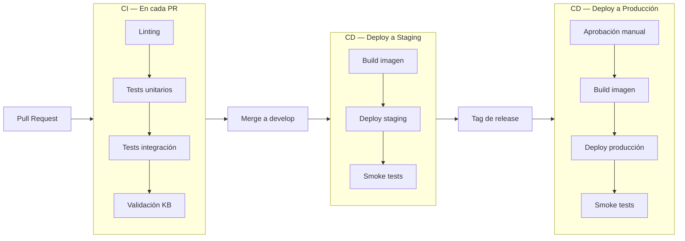

---
bloque: 05-infraestructura
documento: ci-cd
actualizado_en: "2026-07-13"
---

# Pipeline de CI/CD

---

## Diagrama del pipeline



---

## Stages del pipeline

### CI (Pull Request)

| Stage | Herramienta | Falla el PR si... |
|-------|------------|------------------|
| Linting | TODO | Hay errores de linting |
| Tests unitarios | TODO | Algún test falla o cobertura < 80% |
| Tests de integración | TODO | Algún test falla |
| Validación de KB | `validar_kb.py --validar` | Frontmatter inválido o estructura rota |
| Linting de Markdown | markdownlint | Errores de formato en `docs/` |

### CD — Staging

Trigger: merge a `develop`

1. Build de imagen Docker con tag del commit SHA
2. Push a registry
3. Deploy a staging via TODO (Helm / ArgoCD / etc.)
4. Smoke tests automáticos

### CD — Producción

Trigger: PR aprobado de `develop` a `main`

1. Revisión manual requerida (puede ser auto-revisión si no hay otro revisor disponible)
2. Merge de `develop` a `main`
3. Build de imagen con tag de release
4. Deploy a producción con canary / blue-green (TODO)
5. Smoke tests
6. Rollback automático si los smoke tests fallan

---

## Rollback

En caso de incidente post-deploy:

```bash
# Rollback al deployment anterior
TODO: comando de rollback
```

Ver proceso completo en `../08-procesos/proceso-release.md`.

---

## Artefactos

| Artefacto | Dónde se almacena | Retención |
|-----------|------------------|-----------|
| Imágenes Docker | TODO (ECR / GCR / etc.) | 30 días los no productivos |
| Logs de CI | TODO | 90 días |
| Reportes de cobertura | TODO | 30 días |
