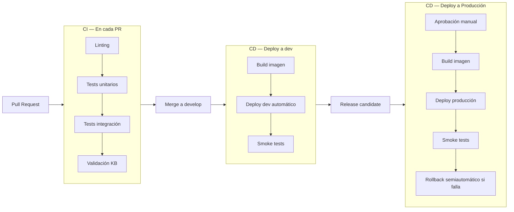

---
bloque: 05-infraestructura
documento: ci-cd
actualizado_en: "2026-07-18"
---

# Pipeline de CI/CD

---

## Diagrama del pipeline (fase A)



---

## Stages del pipeline

### CI (Pull Request)

| Stage | Herramienta | Falla el PR si... |
|-------|------------|------------------|
| Linting | ESLint / analyzers | Hay errores de linting |
| Tests unitarios | xUnit | Algún test falla o cobertura < 80% |
| Tests de integración | xUnit + Testcontainers | Algún test falla |
| Validación de KB | `validar_kb.py --validar` | Frontmatter inválido o estructura rota |
| Linting de Markdown | markdownlint | Errores de formato en `docs/` |

### CD — dev

Trigger: merge a `develop`

1. Build de imagen Docker con tag del commit SHA
2. Push a registry
3. Deploy automático a `dev`
4. Smoke tests automáticos

### CD — Producción

Trigger: PR aprobado de `develop` a `main`

1. Revisión manual requerida (puede ser auto-revisión si no hay otro revisor disponible)
2. Merge de `develop` a `main`
3. Build de imagen con tag de release
4. Deploy a producción
5. Smoke tests obligatorios (gate de calidad)
6. Rollback semiautomático vía script/pipeline si los smoke tests fallan

---

## Rollback

En caso de incidente post-deploy:

```bash
# Rollback al deployment anterior (ejemplo)
./scripts/release/rollback-prod.ps1
```

Ver proceso completo en `../08-procesos/proceso-release.md`.

---

## Artefactos

| Artefacto | Dónde se almacena | Retención |
|-----------|------------------|-----------|
| Imágenes Docker | Registry del proveedor cloud | 30 días no productivos |
| Logs de CI | GitHub Actions | 90 días |
| Reportes de cobertura | Artefactos de CI | 30 días |

## Reglas operativas

1. Pipeline único por servicio.
2. Deploy automático a `dev`.
3. Deploy a `prod` solo con gate manual.
4. Migraciones de esquema con ejecución manual aprobada.

## Trazabilidad KB

1. Flujo Git y promoción: `../04-ingenieria/flujo-git.md`
2. Reglas de release: `../08-procesos/proceso-release.md`
3. Gate de testing: `../04-ingenieria/estrategia-testing.md`
