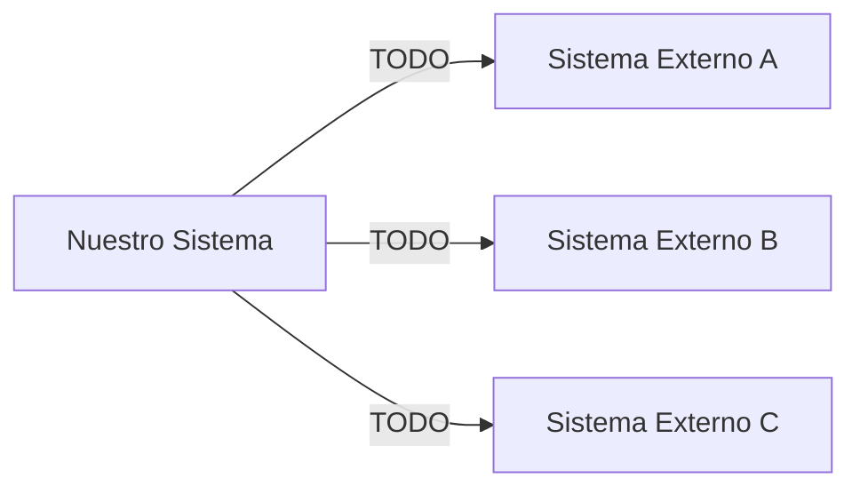

---
bloque: 06-integraciones
documento: vision-general
actualizado_en: ""
---

# Integraciones Externas — Visión General

> Este bloque documenta todas las integraciones con sistemas externos.
> Cada integración tiene su propia subcarpeta con especificación y manejo de errores.
>
> Las integraciones específicas de un módulo también se documentan en
> `../03-modulos/{modulo}/integraciones.md`.
> Esta plantilla no incluye integraciones reales del proyecto.
> Crea la primera integración real usando las plantillas de `../00-meta/plantillas/` y actualiza este documento.

---

## Mapa de integraciones

---

## Catálogo de integraciones

| Sistema | Propósito | Módulo owner | Estado | Ruta |
|---------|-----------|-------------|--------|------|
| _(añadir integraciones)_ | | | | |

---

## Principios para nuevas integraciones

> Antes de añadir una nueva integración externa:
>
> 1. Crear su documentación en esta carpeta usando `../00-meta/plantillas/integracion-especificacion.md` y `../00-meta/plantillas/integracion-gestion-errores.md`
> 2. Actualizar este documento con la nueva integración
> 3. Verificar que cumple `../07-seguridad/modelo-seguridad.md`
> 4. Documentar el manejo de errores y el plan de fallback

---

## Plan de fallback general

| Integración | Si falla | Impacto | Fallback |
|------------|---------|---------|---------|
| TODO | | | |
