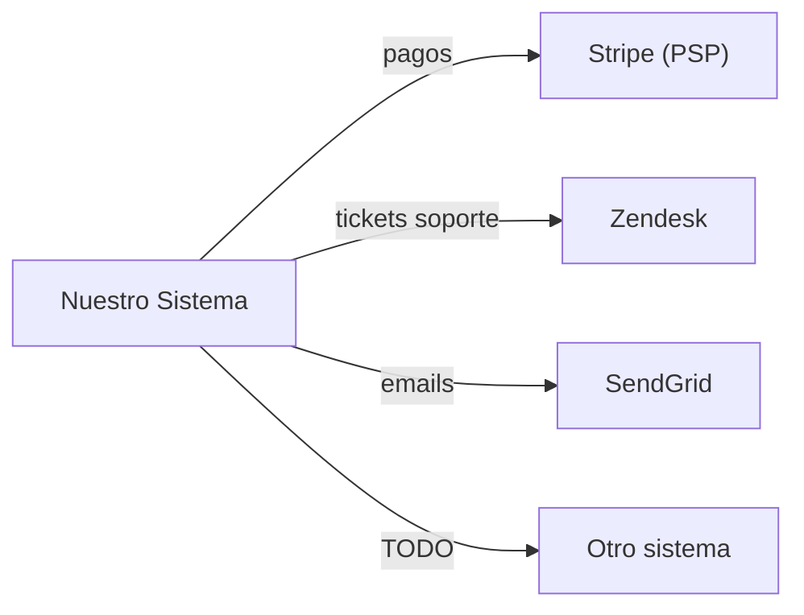

---
bloque: 06-integraciones
documento: vision-general
actualizado_en: ""
---

# Integraciones Externas — Visión General

> Este bloque documenta todas las integraciones con sistemas externos.
> Cada integración tiene su propia subcarpeta con especificación y manejo de errores.
>
> Las integraciones específicas de un módulo también se documentan en
> `../03-modulos/{modulo}/integraciones.md`.

---

## Mapa de integraciones

---

## Catálogo de integraciones

| Sistema | Propósito | Módulo owner | Estado | Ruta |
|---------|-----------|-------------|--------|------|
| `stripe` | Procesamiento de pagos | payments | activo | [stripe/](./stripe/especificacion.md) |
| _(añadir integraciones)_ | | | | |

---

## Principios para nuevas integraciones

> Antes de añadir una nueva integración externa:
>
> 1. Crear su documentación en esta carpeta (ver plantillas en `../00-meta/plantillas/`)
> 2. Actualizar este documento con la nueva integración
> 3. Verificar que cumple `../07-seguridad/modelo-seguridad.md`
> 4. Documentar el manejo de errores y el plan de fallback

---

## Plan de fallback general

| Integración | Si falla | Impacto | Fallback |
|------------|---------|---------|---------|
| TODO | | | |
