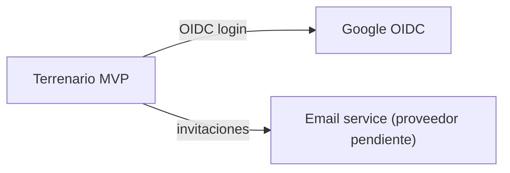

---
bloque: 06-integraciones
documento: vision-general
actualizado_en: "2026-07-24"
---

# Integraciones Externas — Visión General

> Este bloque documenta todas las integraciones con sistemas externos.
> Cada integración tiene su propia subcarpeta con especificación y manejo de errores.
>
> Las integraciones específicas de un módulo también se documentan en
> `../03-modulos/{modulo}/integraciones.md`.

---

## Mapa de integraciones

```mermaid
flowchart LR
    sistema["Terrenario MVP"] -->|"OIDC login"| google["Google OIDC"]
    sistema -->|"invitaciones"| email["Email service (proveedor pendiente)"]
```

---

## Catálogo de integraciones

| Sistema | Propósito | Módulo owner | Estado | Ruta |
|---------|-----------|-------------|--------|------|
| `google-oidc` | Autenticación social de acceso | seguridad | activo | `../07-seguridad/autenticacion-autorizacion.md` |
| `email-service` | Envío de invitaciones a Workspace | workspaces | pendiente de proveedor | `../09-desarrollos/epicas/MVP-001--identidad-y-contexto-seguro/MVP-103--invitaciones-por-email-y-enlace/tech-design.md` |

> `email-service`: MVP-103 deja el puerto `IInvitationEmailSender` implementado con un adaptador de
> traza. Al contratar proveedor hay que crear su documentación en esta carpeta y sustituir solo el
> adaptador; el caso de uso no cambia.

---

## Principios para nuevas integraciones

> Antes de añadir una nueva integración externa:
>
> 1. Crear su documentación en esta carpeta (ver plantillas en `../00-meta/plantillas/`)
> 2. Actualizar este documento con la nueva integración
> 3. Verificar que cumple `../07-seguridad/modelo-seguridad.md`
> 4. Documentar el manejo de errores y el plan de fallback

---

## Plan de fallback general

| Integración | Si falla | Impacto | Fallback |
|------------|---------|---------|---------|
| Google OIDC | No se puede completar login | Bloquea acceso de usuarios no autenticados | Mostrar error controlado, reintento y canal de soporte; trazar evento `login_google_error` |
| Email service | La invitación no llega por correo | La persona invitada no recibe el enlace | La invitación queda emitida y válida; la API devuelve `email_sent: false` y la UI ofrece el enlace para compartirlo por otro medio |
