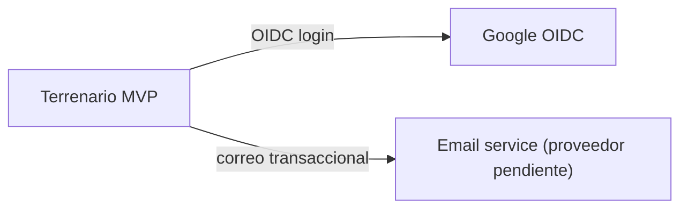

---
bloque: 06-integraciones
documento: vision-general
actualizado_en: "2026-08-08"
---

# Integraciones Externas — Visión General

> Este bloque documenta todas las integraciones con sistemas externos.
> Cada integración tiene su propia subcarpeta con especificación y manejo de errores.
>
> Las integraciones específicas de un módulo también se documentan en
> `../03-modulos/{modulo}/integraciones.md`.

---

## Mapa de integraciones

```mermaid
flowchart LR
    sistema["Terrenario MVP"] -->|"OIDC login"| google["Google OIDC"]
    sistema -->|"correo transaccional"| email["Email service (proveedor pendiente)"]
```

---

## Catálogo de integraciones

| Sistema | Propósito | Módulo owner | Estado | Ruta |
|---------|-----------|-------------|--------|------|
| `google-oidc` | Autenticación social de acceso | seguridad | activo | `../07-seguridad/autenticacion-autorizacion.md` |
| `email-service` | Envío del correo transaccional del producto | workspaces | implementado (SMTP), cuenta pendiente de provisionar | `./correos-del-producto.md` |

> `email-service`: el envío es **SMTP genérico** ([ADR-0010](../02-arquitectura/decisiones/ADR-0010--envio-de-email-transaccional-por-smtp.md)),
> así que la misma configuración vale para Google Workspace, Brevo, Amazon SES, SendGrid o un
> servidor corporativo. Lo que falta es **provisionar la cuenta** (`Email:*` en
> `../05-infraestructura/entornos.md`) y decidir el dominio remitente. Mientras no exista cuenta, el
> entorno arranca con un warning y las invitaciones se comparten por enlace.
>
> El inventario de los correos que salen, con su disparador y su destinatario, y la plantilla común
> que los maqueta están en [correos-del-producto.md](./correos-del-producto.md) (`MVP-715`).

---

## Principios para nuevas integraciones

> Antes de añadir una nueva integración externa:
>
> 1. Crear su documentación en esta carpeta (ver plantillas en `../00-meta/plantillas/`)
> 2. Actualizar este documento con la nueva integración
> 3. Verificar que cumple `../07-seguridad/modelo-seguridad.md`
> 4. Documentar el manejo de errores y el plan de fallback

---

## Plan de fallback general

| Integración | Si falla | Impacto | Fallback |
|------------|---------|---------|---------|
| Google OIDC | No se puede completar login | Bloquea acceso de usuarios no autenticados | Mostrar error controlado, reintento y canal de soporte; trazar evento `login_google_error` |
| Email service | No hay cuenta configurada o el servidor SMTP falla | La persona invitada no recibe el enlace | La invitación queda emitida y válida; la API devuelve `email_sent: false` y la UI ofrece el enlace para compartirlo por otro medio. Sin cuenta configurada el arranque lo advierte con un warning |
