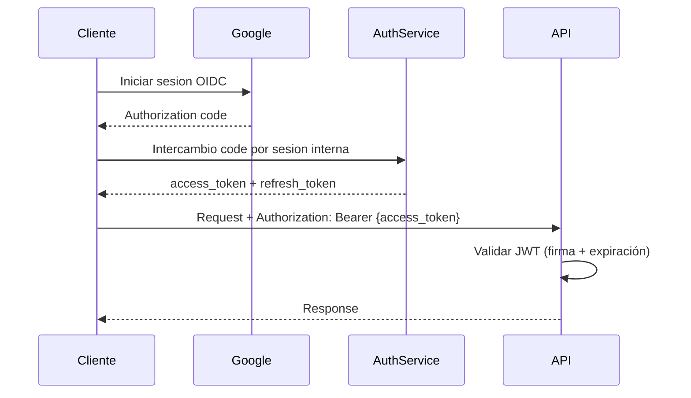

---
bloque: 07-seguridad
documento: autenticacion-autorizacion
actualizado_en: "2026-07-18"
---

# Autenticación y Autorización

---

## Autenticación

## Decisión de producto (MVP y fases)

1. MVP: login principal con Google (OAuth 2.0 + OpenID Connect) como proveedor de identidad de menor friccion.
2. El modelo debe permitir incorporar otros proveedores sociales compatibles con OIDC/OAuth 2.0 si el negocio lo requiere.
3. Fase futura: Passkeys (WebAuthn/FIDO2) como opcion adicional de bajo esfuerzo para el usuario.
4. Durante MVP no se exige password local al usuario final Antonio.

## Modelo de autenticacion

**Metodo externo (entrada)**: Google OIDC.

**Metodo interno (sesion API)**: JWT (JSON Web Tokens) con firma RS256 emitido por el servicio de identidad tras login valido.

| Campo del JWT | Descripción |
|--------------|-------------|
| `sub` | ID del usuario |
| `roles` | Lista de roles asignados |
| `exp` | Expiración (15 min recomendado para `access_token`) |
| `iss` | Issuer (servicio de identidad) |

**Flujo de autenticación**:


```mermaid
sequenceDiagram
    Cliente->>Google: Iniciar sesion OIDC
    Google-->>Cliente: Authorization code
    Cliente->>AuthService: Intercambio code por sesion interna
    AuthService-->>Cliente: access_token + refresh_token
    Cliente->>API: Request + Authorization: Bearer {access_token}
    API->>API: Validar JWT (firma + expiración)
    API-->>Cliente: Response
```

**Renovación**: usar `refresh_token` para obtener nuevo `access_token` sin re-login.

## Trazabilidad obligatoria del embudo de login

Para detectar usuarios que llegan a pantalla de login pero no completan autenticacion, el sistema debe registrar telemetria de embudo con eventos anonimizados/pseudonimizados y sin exponer PII en claro.

Eventos minimos:

1. `login_screen_viewed`
2. `login_google_clicked`
3. `login_google_success`
4. `login_google_error`
5. `login_abandonment` (timeout o salida sin exito)

Campos minimos por evento:

1. `timestamp`
2. `session_id` (aleatorio)
3. `flow_id` (correlacion del intento de login)
4. `channel` (`web`/`mobile`)
5. `error_code` (cuando aplique)

Regla de privacidad:

1. Nunca loguear tokens, emails completos ni identificadores sensibles en texto plano.
2. Si se requiere identificar reincidencia, usar hash irreversible/pseudonimo.

---

## Autorización — Roles y permisos

| Rol | Descripción | Permisos principales |
|-----|-------------|---------------------|
| `workspace_owner` | Usuario creador del Workspace | Lectura/escritura completa en su Workspace |
| `workspace_member` | Miembro invitado y aceptado del Workspace | Lectura/escritura completa en su Workspace |
| `service` | Servicio interno (M2M) | Solo operaciones técnicas explícitamente autorizadas |

Regla MVP:

1. No existen permisos granulares por recurso en esta fase.
2. El control obligatorio es pertenencia al Workspace activo.
3. Cualquier operación fuera del Workspace devuelve `AUTH_WORKSPACE_FORBIDDEN`.

---

## Autenticación M2M (entre servicios)

Los servicios internos se autentican con **API Keys** o **tokens de servicio**:

- Las API Keys de servicio se almacenan en el gestor de secretos
- Se rotan cada 90 días
- Nunca se usan API Keys de usuarios reales para comunicación entre servicios

---

## Headers de seguridad HTTP

Todos los endpoints deben devolver:

```http
Strict-Transport-Security: max-age=31536000; includeSubDomains
X-Content-Type-Options: nosniff
X-Frame-Options: DENY
Content-Security-Policy: default-src 'self'
```

Implementado en `SecurityHeadersMiddleware` (MVP-105, `P-005`).

### La CSP de la API no basta: hace falta la del cliente (MVP-502)

Las respuestas de la API son **JSON**, que no es un contexto de ejecución de scripts: una CSP ahí
apenas protege de nada. Donde la CSP mitiga XSS de verdad es en el **documento HTML de la
aplicación**, y hasta `MVP-502` no había ninguna. Importa especialmente en este producto porque el
token de acceso vive en `sessionStorage`: un script inyectado podría leerlo.

La política del SPA se inyecta en el `index.html` durante el **build de producción** (plugin
`terrenario-csp` en `vite.config.ts`) y declara exactamente lo que la aplicación usa:

```http
default-src 'self'; script-src 'self';
style-src 'self' 'unsafe-inline' https://fonts.googleapis.com;
font-src 'self' https://fonts.gstatic.com;
img-src 'self' data:; connect-src 'self' {VITE_API_BASE_URL};
frame-ancestors 'none'; base-uri 'self'; form-action 'self'; object-src 'none'
```

Notas de por qué es así:

- **Solo en producción.** En desarrollo, Vite necesita scripts en línea (preámbulo de React Refresh)
  y un WebSocket para el HMR; una política estricta rompería el arranque sin proteger nada, porque el
  servidor de desarrollo no se expone.
- **`connect-src` incluye el origen de la API** porque front y back no comparten origen.
- **`style-src` admite `'unsafe-inline'`** por el enlace de Google Fonts y por los estilos calculados
  de las barras del dashboard. Es la única concesión de la política.
- **Destino final**: lo correcto es que la emita como cabecera quien sirva el estático. Mientras esa
  capa no exista, el `meta` deja la política aplicada y versionada con el código, no pendiente.

---

## Sesiones y cookies

Si se usan cookies (para la web app):

- `HttpOnly: true`
- `Secure: true`
- `SameSite: Strict`
- Duración máxima: 30 dias para refresh token (ajustable por riesgo)

## Evolucion planificada (fuera de MVP)

1. Incorporar Passkeys como segundo metodo de autenticacion de alta usabilidad.
2. Mantener Google Login como camino principal mientras sea el metodo con menor friccion para publico senior.
