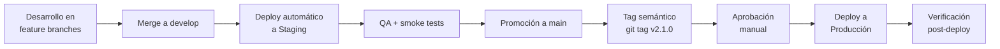

---
bloque: 08-procesos
documento: proceso-release
actualizado_en: ""
---

# Proceso de Release

---

## Versionado

Seguimos **Semantic Versioning** (semver):

```text
v{MAJOR}.{MINOR}.{PATCH}

MAJOR: cambio incompatible en la API o comportamiento (breaking change)
MINOR: nueva funcionalidad compatible hacia atrás
PATCH: corrección de bugs compatible hacia atrás
```

---

## Flujo de release



---

## Checklist pre-release

- [ ] Todos los tickets del hito están en estado `completado`
- [ ] Tests de staging pasando (incluyendo E2E)
- [ ] `docs/10-releases/v{version}.md` creado con el changelog
- [ ] `docs/00-meta/changelog.md` actualizado si hay cambios estructurales en la KB
- [ ] Módulos afectados tienen documentación actualizada en `docs/03-modulos/`
- [ ] No hay CVEs críticas o altas sin parchear en las dependencias
- [ ] SLOs de staging estables durante las últimas 24h

---

## Procedimiento de release

```bash
# 1. Asegurarse de que develop contiene el conjunto validado
git checkout develop && git pull

# 2. Promover develop a main
git checkout main && git pull
git merge --ff-only develop

# 3. Crear el tag
git tag -a v2.1.0 -m "Release v2.1.0 — [descripción breve]"

# 4. Push de main y del tag (activa el pipeline de producción)
git push origin main
git push origin v2.1.0
```

---

## Rollback

Si los smoke tests de producción fallan tras el deploy:

1. El pipeline hace rollback automático al deployment anterior
2. Si el rollback automático falla: usar un runbook real de `../05-infraestructura/runbooks/` o crear el procedimiento desde `../00-meta/plantillas/runbook.md`
3. Notificar en `#incidents` con severidad apropiada

---

## Hotfix

Para bugs críticos en producción que no pueden esperar al próximo release:

```text
main → hotfix/PROJ-XXX--descripcion → main → tag v2.1.1
                           └──────→ back-merge a develop
```

El hotfix sigue el mismo proceso de PR, pero la aprobación externa solo será obligatoria si el equipo la exige explícitamente.

---

## Comunicación del release

- **Interno**: update en el canal del equipo con enlace al changelog
- **Usuarios** (si hay cambios visibles): TODO (email / in-app / status page)
