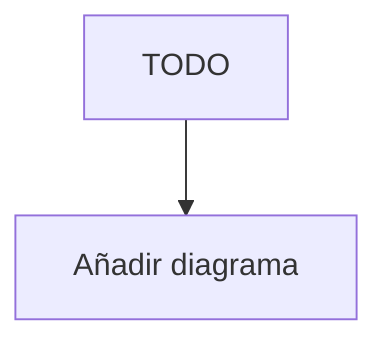

---
id: ""
tipo: feature
titulo: "TDD: {Título}"
estado: borrador
tickets: []
epica: ""
responsable: ""
revisores: []
ai_context:
  dominios: []
  modulo_path: ""
  componentes: []
  etiquetas: []
  nivel_riesgo: bajo
creado_en: ""
actualizado_en: ""
---

# TDD: {ID_DESARROLLO} — {Título}

> **Referencia al spec**: [spec.md](./spec.md)

## Resumen técnico

> Una o dos frases describiendo el enfoque técnico elegido.

TODO

## Diagrama de arquitectura / flujo

## Componentes afectados

| Componente | Tipo de cambio     | Descripción |
| ---------- | ------------------ | ----------- |
| TODO       | nuevo / modificado |             |

## Diseño detallado

### Modelo de datos

TODO: Cambios en el esquema, nuevas entidades, migraciones.

### API / Contratos

TODO: Endpoints nuevos o modificados.

### Lógica de negocio

TODO: Flujo principal, reglas aplicadas.

### Manejo de errores

TODO: Errores esperados y cómo se propagan.

## Alternativas descartadas

| Alternativa | Por qué se descartó |
| ----------- | ------------------- |
| TODO        |                     |

## Riesgos e impacto

| Riesgo | Probabilidad | Mitigación |
| ------ | ------------ | ---------- |
| TODO   | media        | TODO       |

## Plan de testing

- [ ] Tests unitarios: TODO
- [ ] Tests de integración: TODO
- [ ] Tests E2E: TODO (si aplica)

## Checklist de implementación

- [ ] Diseño técnico revisado y aprobado
- [ ] Tests escritos y pasando
- [ ] Módulo afectado actualizado en `docs/03-modulos/`
- [ ] Sin `TODO` sin resolver en este documento
