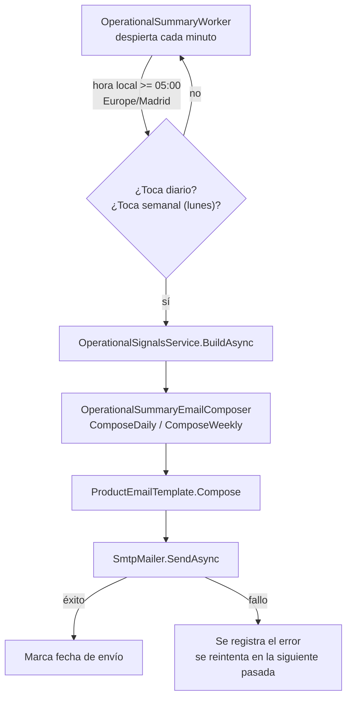

# TDD: MKT-101 — Resumen operativo por email diario y semanal

> **Referencia al spec**: [spec.md](./spec.md)

## Resumen técnico

Un `BackgroundService` más (`OperationalSummaryWorker`), con el mismo patrón que `AlertMonitor` y
`TelemetryFlushWorker`: despierta cada minuto y decide si toca enviar, en vez de programar un
temporizador exacto. Reutiliza `OperationalSignalsService` (la misma fuente que `GET
/api/v1/ops/signals`) para los datos, y `SmtpMailer` + `ProductEmailTemplate` (ADR-0010, MVP-715) para
el transporte y la composición. No se añade infraestructura, ni cuenta de envío, ni destinatario nuevo.

## Diagrama de arquitectura / flujo

## Componentes afectados

| Componente | Tipo de cambio | Descripción |
| ---------- | ------------------------------ | ----------------- |
| `Infrastructure/Telemetry/Summary/OperationalSummaryWorker.cs` | nuevo | `BackgroundService` que decide y dispara los envíos |
| `Infrastructure/Telemetry/Summary/OperationalSummaryEmailComposer.cs` | nuevo | Compone el contenido diario y semanal sobre `ProductEmailTemplate` |
| `Infrastructure/Telemetry/OpsOptions.cs` | modificado | Nuevo flag `SummaryEnabled` (mismo criterio que `AlertsEnabled`) |
| `Program.cs` | modificado | Registro del `BackgroundService` y aviso de arranque sin destinatario |
| `appsettings.json` / `appsettings.Development.json` | modificado | `Ops:SummaryEnabled` (activo en producción, desactivado en desarrollo) |
| `Terrenario.Api.Tests/Emails/ProductEmailCatalog.cs` | modificado | Añade los dos correos nuevos al inventario ejecutable |
| `Terrenario.Api.Tests/Emails/ProductEmailInventoryTests.cs` | modificado | Actualiza el recuento de correos del producto (6 → 8) |
| `Terrenario.Api.Tests/Integration/TerrenarioApiFactory.cs` | modificado | Desactiva el worker en los tests de API |
| `Terrenario.Api.Tests/Telemetry/Summary/OperationalSummaryWorkerTests.cs` | nuevo | Cobertura de cadencia y de CA-3 |
| `docs/06-integraciones/correos-del-producto.md` | modificado | Inventario en prosa actualizado |
| `docs/03-modulos/observabilidad/README.md` | modificado | Enlace al tech-design de esta historia |

## Diseño detallado

### Modelo de datos

Ninguno. No se añade tabla ni migración: se reutiliza `telemetry_daily_counters` a través de
`OperationalSignalsService`, que ya la consulta para `GET /api/v1/ops/signals`.

### API / Contratos

Ninguno nuevo. No se expone ningún endpoint: el resumen sale por email, no por API.

### Lógica de negocio

- **Cadencia**: el worker despierta cada minuto (igual que `AlertMonitor.Interval`). En cada pasada
  calcula la hora local en `Europe/Madrid` y decide:
  - **Diario**: toca si son las 05:00 o más tarde (hora local) y no se ha enviado ya hoy
    (`_lastDailySentOn`).
  - **Semanal**: toca si además es lunes y no se ha enviado ya esta semana (`_lastWeeklySentOn`).
  - La marca de "ya enviado" es una fecha en memoria, no persistida: un reinicio del proceso en mitad
    del día puede, en el peor caso, reenviar el resumen de ese día. Se acepta este riesgo menor por
    ser el mismo criterio que ya usa `TelemetryFlushWorker` para su poda diaria.
- **Contenido**:
  - **Diario**: sesiones, acceso a login, login exitoso, tasa de conversión y alertas activas del día
    anterior (`OperationalSignals.Daily[0]`, pidiendo `dailyDays: 2` para tener el día completo más
    reciente).
  - **Semanal**: los mismos agregados sobre 7 días (`LoginFunnel7d`, `ProductUsage7d`), más la tasa de
    error 7d frente al objetivo (`SloSignals`), y alertas activas.
  - **"Visitas a landing"**: el spec la pedía como métrica mínima, pero la telemetría de landing
    (`landing_view`) no existe todavía — la introduce `MKT-106`, que **no** es una dependencia
    declarada de esta historia. Decisión acordada con el PO: no bloquear MKT-101 por esto. El
    resumen se envía sin esa métrica y con una nota explícita (`Notes`) de que llegará con MKT-106.

    > **Actualización (`MKT-106`)**: la telemetría de landing ya existe. El resumen semanal incluye
    > desde entonces el top de landings por conversión; el diario mantiene la nota (esa serie solo se
    > calcula sobre 7 días). Detalle en el tech-design de `MKT-106`.
- **Destinatario**: `Ops:AlertEmail`, el mismo que las alertas de operación. Sin cambios de
  configuración nuevos más allá de `Ops:SummaryEnabled`.
- **Envío**: mismo transporte (`SmtpMailer`) y misma plantilla (`ProductEmailTemplate`) que el resto
  de correos del producto. Sin destinatario configurado o sin cuenta de envío, el intento se da por
  "gestionado" (mismo criterio que `AlertNotifier`: no finge un envío que no puede ocurrir) y no se
  reintenta cada minuto.

### Manejo de errores (CA-3)

- Un fallo al consultar las señales (`OperationalSignalsService.BuildAsync`) o al enviar
  (`SmtpMailer.SendAsync`) se captura, se registra con `ILogger` (sin propagar la excepción) y **no se
  marca la fecha como enviada**: la siguiente pasada (un minuto después) vuelve a intentarlo, dentro
  de la misma ventana horaria del día. El proceso de la API nunca se ve afectado.

## Alternativas descartadas

| Alternativa | Por qué se descartó |
| ----------- | -------------------------- |
| Temporizador exacto a las 05:00 (`Task.Delay` calculado hasta el instante objetivo) | Añade complejidad de cálculo de próxima ocurrencia y de reprogramación tras un envío fallido, sin beneficio sobre el patrón ya usado por `AlertMonitor` (tick corto + guarda de estado) |
| Nueva tabla de estado para persistir la última fecha de envío | Sobre-ingeniería para el riesgo real: un reinicio en la ventana de envío es un evento raro y su peor consecuencia es un correo duplicado, no una pérdida de datos |
| Endpoint HTTP para disparar el resumen manualmente | Fuera de alcance del spec (`out-of-scope`: "UI de configuración en frontend") |

## Riesgos e impacto

| Riesgo | Probabilidad | Mitigación |
| ------ | ------------ | ---------- |
| Reinicio del proceso justo en la ventana de envío duplica un correo | baja | Aceptado; mismo criterio que otros workers del proyecto |
| Ausencia de telemetría de landing deja el resumen incompleto frente al spec original | media | Nota explícita en el correo y en el spec; se resuelve con `MKT-106` |
| Envíos reales durante desarrollo local | baja | `Ops:SummaryEnabled=false` en `appsettings.Development.json`, igual que `AlertsEnabled` |

## Plan de testing

- [x] Tests unitarios: `OperationalSummaryWorkerTests` (cadencia diaria/semanal, no-op antes de la
  hora, no duplica envíos el mismo día, no propaga excepciones de CA-3 y reintenta en la siguiente
  pasada).
- [x] Tests de inventario de correos: `ProductEmailCatalog` y `ProductEmailInventoryTests` cubren pie
  legal, motivo del envío, versión en texto plano y ausencia de recursos remotos para los dos correos
  nuevos, igual que el resto del inventario.
- [ ] Tests de integración: no aplica (no hay endpoint ni cambio de esquema; el worker se desactiva en
  `TerrenarioApiFactory`, igual que `AlertsEnabled`).
- [ ] Tests e2e: no aplica.

## Checklist de implementación

- [x] Diseño técnico revisado y aprobado
- [x] Migraciones de base de datos preparadas — no aplica, sin cambios de esquema
- [x] Tests escritos y pasando
- [x] Documentación de API actualizada — no aplica, sin endpoint nuevo
- [x] Módulo afectado actualizado en `docs/03-modulos/`
- [x] Sin `TODO` sin resolver en este documento
