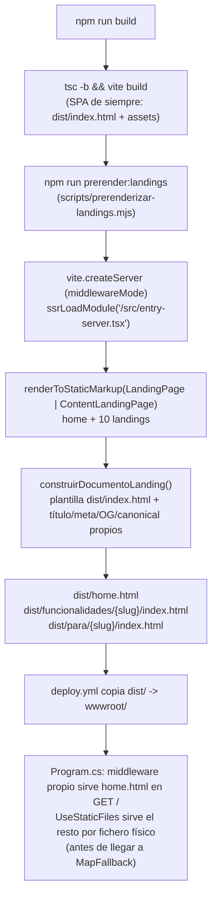

# TDD: MKT-102 — Landings publicas P0 de funcionalidades y casos

> **Referencia al spec**: [spec.md](./spec.md)
> **Decisión de arquitectura**: [ADR-0012](../../../../02-arquitectura/decisiones/ADR-0012--prerenderizado-estatico-landings-publicas-mkt-102.md)

## Resumen técnico

Las 10 landings se implementan como páginas de contenido puro (`ContentLandingPage`), pre-renderizadas
a HTML estático en el `build` del frontend (`scripts/prerenderizar-landings.mjs`, `ADR-0012`) y
servidas por la API como ficheros estáticos, sin tocar el backend ni el bundle de la SPA existente.

La home pública (`/`) se trata como **una landing más**: se pre-renderiza con el mismo mecanismo a un
fichero propio (`dist/home.html`, distinto de `dist/index.html`) y un middleware explícito en
`Program.cs` la sirve solo para `GET /`. Es la única pieza que sí toca el backend, y de forma
acotada: `index.html` sigue siendo el shell vacío que `MapFallback` sirve para el resto de rutas de
la SPA, sin cambios.

## Diagrama de arquitectura / flujo



## Componentes afectados

| Componente | Tipo de cambio | Descripción |
| ---------- | --------------- | ------------ |
| `src/content/landings.ts` | nuevo | Contenido tipado de las 10 landings (`relatedSlugs`, CA-2) y metadatos mínimos de la home (`HOME_META`) |
| `src/components/marketing/ContentLandingPage.tsx` | nuevo | Componente presentacional sin estado ni `react-router`, reutilizado por las 10 landings |
| `src/components/marketing/LandingPage.tsx` | modificado | Home (`/`): pierde la dependencia de `react-router` (enlaces planos, igual que `ContentLandingPage`) para poder pre-renderizarse; añade el hub de enlazado (CA-3) |
| `src/entry-server.tsx` | nuevo | Punto de entrada de `renderToStaticMarkup` para el script de pre-renderizado, tanto de la home como de las 10 landings |
| `scripts/prerenderizar-landings.mjs` | nuevo | Genera `dist/home.html` y el HTML estático de cada landing tras `vite build`, reutilizando la plantilla de `dist/index.html` |
| `package.json` | modificado | `build` encadena `prerender:landings` tras `vite build` |
| `Program.cs` | modificado | Middleware propio: sirve `wwwroot/home.html` para `GET /`, antes de `UseDefaultFiles`/`UseStaticFiles`; si no existe, cae al comportamiento anterior |
| `deploy.yml` | sin cambio | Ya copia `dist/` completo a `wwwroot/`, incluidas las carpetas y ficheros nuevos |

## Diseño detallado

### Modelo de datos

Sin cambios de esquema: esta historia no toca ninguna tabla ni entidad de dominio. El contenido de
las landings es estático y vive en código (`src/content/landings.ts`), no en base de datos.

### API / Contratos

Sin endpoints nuevos ni modificados. La home y las 10 URLs de landings son rutas públicas servidas
como ficheros estáticos:

```text
GET /                                           -> 200, text/html (dist/home.html, via middleware propio)
GET /funcionalidades/gestion-terrenos           -> 200, text/html (dist/funcionalidades/gestion-terrenos/index.html)
GET /funcionalidades/diario-de-campo            -> 200, text/html
GET /funcionalidades/control-cosechas           -> 200, text/html
GET /funcionalidades/compras-y-consumos         -> 200, text/html
GET /funcionalidades/dashboard-campana          -> 200, text/html
GET /funcionalidades/workspaces-colaboracion    -> 200, text/html
GET /funcionalidades/trabajadores-y-tareas      -> 200, text/html
GET /para/agricultor-particular                 -> 200, text/html
GET /para/explotacion-familiar                  -> 200, text/html
GET /para/gestion-multiterreno                  -> 200, text/html
```

### Lógica de negocio

No hay lógica de negocio de dominio: es contenido y enlazado. Las únicas reglas son las del propio
`spec.md` (CA-1, CA-2, CA-3), verificadas por los tests de contenido (`landings.test.ts`) y de
componente (`ContentLandingPage.test.tsx`, `LandingPage.test.tsx`).

`relatedSlugs` conecta funcionalidades que se usan en el mismo flujo operativo, siguiendo el mapa de
relaciones entre módulos de `docs/03-modulos/_vision-general.md` (p. ej. `gestion-terrenos` enlaza a
`diario-de-campo`, `control-cosechas` y `dashboard-campana`, que son las funcionalidades que
consumen el terreno como eje). Los tres perfiles (`/para/*`) enlazan a las funcionalidades que mejor
resuelven su caso de uso concreto.

### Manejo de errores

Sin cambios: una URL de landing que no exista sigue cayendo en el 404 de dominio que ya sirve
`MapFallback` (`ErrorCodes.ResourceNotFound`), porque no hay fichero físico que la intercepte antes.

## Alternativas descartadas

> Detalle completo en [ADR-0012](../../../../02-arquitectura/decisiones/ADR-0012--prerenderizado-estatico-landings-publicas-mkt-102.md).

| Alternativa | Por qué se descartó |
| ----------- | -------------------- |
| Rutas cliente de la SPA sin cambios | No resuelve `CA-3`: un rastreador sin JS ve el `index.html` vacío |
| Framework SSR/SSG (Next.js, Astro...) | Sustituiría la base de `ADR-0007` para toda la app por 10 páginas públicas |
| Servicio externo de pre-renderizado | Depende de un tercero, incompatible con `ADR-0011` y la CSP `default-src 'self'` |

## Riesgos e impacto

| Riesgo | Probabilidad | Mitigación |
| ------ | ------------- | ----------- |
| El script de pre-renderizado falla en CI y bloquea el `build` del frontend | baja | `prerenderizar-landings.test.ts` prueba la función pura de construcción del documento; el `build` completo se ejecutó en local antes de abrir el PR |
| Un enlace a una landing o a la home usa `<Link>` de `react-router` por error y cae en el 404 de la SPA | media | `LandingPage` y `ContentLandingPage` no importan `react-router`; revisado a mano que todos los enlaces a `/`, `/funcionalidades/*` y `/para/*` son `<a href>` |
| El middleware de `Program.cs` sirve `home.html` también para rutas que no son `/` | baja | La condición compara `context.Request.Path == "/"` exacto; cualquier otra ruta sigue el flujo de siempre |
| `home.html` no existe en el entorno (build de frontend no ejecutado) | baja | El middleware cae a `next()` si el fichero no existe: el comportamiento vuelve a ser el de antes de `MKT-102` (`index.html` vía `UseDefaultFiles`) |
| Resolución de ruta sin barra final (`/funcionalidades/gestion-terrenos`) por `UseDefaultFiles`/`UseStaticFiles` | baja | El comportamiento de `DefaultFilesMiddleware` no depende de la barra final para localizar el `index.html` de la carpeta; a validar con una comprobación manual en el entorno de revisión antes de promocionar a producción |
| Un contenido nuevo o corregido no se publica porque alguien edita el HTML generado en `dist/` en vez de `src/content/landings.ts` o `LandingPage.tsx` | baja | `dist/` está en `.gitignore`; el único origen editable es el código fuente |

## Plan de testing

> Ver `docs/04-ingenieria/estrategia-testing.md`.

- [x] Tests unitarios: `src/content/landings.test.ts` (10 URLs del plan P0, sin slugs/rutas duplicadas, `relatedSlugs` válidos y no auto-referenciados, título/descripción no vacíos ni repetidos)
- [x] Tests de componente: `ContentLandingPage.test.tsx` (H1, CTA a `/login`, texto de acceso RN-036, enlaces a landings relacionadas, enlaces legales y a home)
- [x] Tests de componente: `LandingPage.test.tsx` amplía la cobertura existente con el hub de enlazado (CA-3) y ya no envuelve el componente en `MemoryRouter` (no lo necesita)
- [x] Test de script de build: `prerenderizar-landings.test.ts` (título/meta/OG/canonical sustituidos, sin bundle de JS, cabecera conservada)
- [x] Verificación manual: `npm run build` ejecutado en local, genera `home.html` y las 10 landings sin bundle de JS y con `<title>`/meta/canonical propios; `dotnet build` y la suite completa de backend (1066 tests) en verde tras el cambio en `Program.cs` (evidencia en el PR)

## Checklist de implementación

- [x] Diseño técnico revisado y aprobado
- [x] Migraciones de base de datos preparadas (no aplica: sin cambios de esquema)
- [x] Tests escritos y pasando
- [x] Documentación de API actualizada (no aplica: sin endpoints nuevos)
- [x] Módulo afectado actualizado en `docs/03-modulos/plataforma-de-aplicacion/README.md`
- [x] Sin `TODO` sin resolver en este documento
