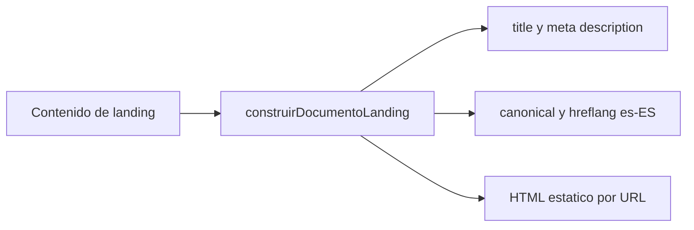

# TDD: MKT-103 - SEO on-page base para landings

> **Referencia al spec**: [spec.md](./spec.md)
> **Decisión de arquitectura**: [ADR-0012](../../../../02-arquitectura/decisiones/ADR-0012--prerenderizado-estatico-landings-publicas-mkt-102.md)

## Resumen técnico

Se completa el pre-renderizado estatico de MKT-102 con una etiqueta `hreflang` autoconsistente para
`es-ES`. Los metadatos de cada URL se siguen tomando de `LANDING_CONTENTS` y `HOME_META`; no se
introducen rutas, APIs ni dependencias nuevas.

## Diagrama de arquitectura / flujo

## Componentes afectados

| Componente | Tipo de cambio | Descripción |
| ---------- | -------------- | ----------- |
| `src/content/landings.ts` | existente | Fuente unica de title, description, ruta y h1 de las landings. |
| `scripts/prerenderizar-landings.mjs` | modificado | Inserta `hreflang="es-ES"` con la misma URL absoluta que el canonical. |
| `components/marketing/LandingPage.tsx` | modificado | Deja un unico `h1` en la home al convertir la marca de cabecera en texto no estructural. |
| Tests de contenido, componentes y pre-renderizado | modificado | Verifican unicidad de metadatos, un h1 por URL y las etiquetas generadas. |

## Diseño detallado

### Modelo de datos

No hay cambios de esquema ni entidades. Las URLs y sus metadatos siguen siendo contenido estatico
versionado en el frontend.

### API / Contratos

No hay endpoints nuevos ni modificados. Cada URL publica ya pre-renderizada incorpora en su
`head` una etiqueta canonical y una alternativa `hreflang="es-ES"` que apuntan a su propia URL
absoluta bajo `https://app.terrenario.com`.

### Lógica de negocio

El pre-renderizador recibe el contenido de una landing o de la home y usa su `path` para construir
ambas URL SEO. La unicidad de title y description se comprueba sobre las once URLs publicas. Los
componentes presentan solo un `h1`: el de intención principal definido para cada landing.

### Manejo de errores

No se añaden errores de ejecucion. Si cambia la plantilla y deja de contener el enlace al manifest,
el test del documento generado detecta la ausencia de las etiquetas SEO esperadas antes del build.

## Alternativas descartadas

| Alternativa | Por qué se descartó |
| ----------- | ------------------- |
| Gestionar metadatos con JavaScript del cliente | Las landings se publican sin bundle de SPA para que el HTML sea indexable sin ejecutar JavaScript. |
| Añadir una libreria SEO o un servicio externo | Duplicaria el pre-renderizador existente o introduciria una dependencia incompatible con ADR-0011. |
| Mantener dos `h1` en la home | La marca de cabecera no es la intención principal y vulnera el criterio de un h1 por landing. |

## Riesgos e impacto

| Riesgo | Probabilidad | Mitigación |
| ------ | ------------ | ---------- |
| Metadatos duplicados al añadir una landing | baja | Test de unicidad para home y las diez landings P0. |
| Canonical y hreflang divergen | baja | Se construyen desde el mismo `path` en la misma función. |
| Regresión semántica en la home | baja | Test de componente para un único `h1` con el titular principal. |

## Plan de testing

- [x] Tests unitarios: unicidad de title y meta description en las once URLs públicas.
- [x] Tests de componente: un solo `h1` en la home y en cada landing de contenido.
- [x] Tests de build: canonical y `hreflang="es-ES"` autoconsistentes en el documento generado.
- [ ] Tests de integración: no aplica, no hay API ni backend afectados.
- [ ] Tests e2e: no aplica, el HTML estatico queda cubierto por build y pruebas unitarias.

## Checklist de implementación

- [x] Diseño técnico revisado y aprobado
- [x] Migraciones de base de datos preparadas (no aplica: no hay cambios de esquema)
- [x] Tests escritos
- [x] Documentación de API actualizada (no aplica: no hay endpoints)
- [x] Módulo afectado actualizado en `docs/03-modulos/`
- [x] Sin pendientes sin resolver en este documento
