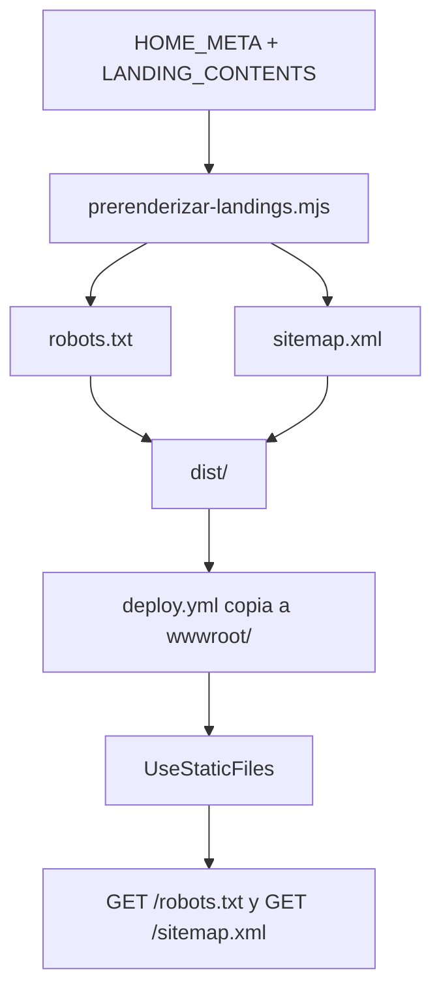

# TDD: MKT-105 - Robots sitemap y validacion de rastreo

> **Referencia al spec**: [spec.md](./spec.md)
> **Decisión de arquitectura**: [ADR-0012](../../../../02-arquitectura/decisiones/ADR-0012--prerenderizado-estatico-landings-publicas-mkt-102.md)

## Resumen técnico

El paso de pre-renderizado existente generará `robots.txt` y `sitemap.xml` en `dist/`, junto con la
home y las landings estáticas. Ambos documentos se derivan de las fuentes de rutas ya publicadas:
`HOME_META` y `LANDING_CONTENTS`. El despliegue ya copia `dist/` completo a `wwwroot`, donde
`UseStaticFiles()` sirve estos ficheros físicos sin incorporar endpoints ni lógica de dominio.

## Diagrama de arquitectura / flujo



## Componentes afectados

| Componente | Tipo de cambio | Descripción |
| ---------- | -------------- | ----------- |
| `scripts/prerenderizar-landings.mjs` | modificado | Genera los dos recursos SEO estáticos desde las rutas públicas existentes. |
| `src/test/prerenderizar-landings.test.ts` | modificado | Verifica el contenido exacto, el origen canónico y la exclusión de rutas no indexables. |
| `docs/03-modulos/plataforma-de-aplicacion/README.md` | modificado | Registra los recursos de rastreo como superficie pública del módulo. |

## Diseño detallado

### Modelo de datos

Sin cambios de esquema, entidades ni migraciones. Las URLs proceden del catálogo estático de
landings de MKT-102 y no se almacenan en la base de datos.

### API / Contratos

No hay endpoints de aplicación. Se añaden dos recursos estáticos públicos:

```text
GET /robots.txt  -> 200, text/plain
GET /sitemap.xml -> 200, application/xml
```

`robots.txt` permitirá el rastreo por defecto, anunciará el sitemap absoluto y excluirá los prefijos
protegidos que declara `App.tsx` (`/app/`, `/onboarding/`, `/invitations/`, `/reactivations/`), el
callback de autenticación (`/auth/callback`) y la superficie de API (`/api/`).

`sitemap.xml` tendrá una única entrada por cada URL pública indexable: la home (`HOME_META.path`) y
las diez rutas de `LANDING_CONTENTS`. Cada entrada solo contendrá `loc`, construido con el origen
canónico `https://app.terrenario.com`. No se emitirán `lastmod`, `changefreq` ni `priority`, porque
la fuente de verdad no define esos valores. Las rutas de login, legales, autenticación, API o área
protegida no se incluirán.

### Lógica de negocio

El script expondrá funciones puras para construir ambos textos, separadas de la escritura a disco.
Una función recibirá la colección de rutas públicas y la otra no recibirá datos variables. `main()`
escribirá los resultados en la raíz de `dist/` después de generar el HTML de las landings. Con ello,
un cambio futuro en el catálogo actualiza el sitemap en el mismo build y no puede crear una segunda
lista manual de URLs.

### Manejo de errores

La escritura se realiza con las mismas operaciones síncronas que el pre-renderizado actual. Un fallo
de lectura, construcción o escritura aborta `npm run build`, por lo que el despliegue no puede
publicar HTML actualizado con recursos de rastreo obsoletos. No se registran datos personales.

## Alternativas descartadas

| Alternativa | Por qué se descartó |
| ----------- | ------------------- |
| Mantener listas manuales de URLs | Duplicaría `LANDING_CONTENTS` y permite que sitemap y contenido publicado diverjan. |
| Generar los documentos por endpoint del backend | Añade trabajo en cada petición cuando el contenido ya es estático por ADR-0012. |
| Añadir `lastmod`, `priority` o frecuencias estimadas | No hay fuente de verdad para esos datos y declararlos sería inventar metadatos. |

## Riesgos e impacto

| Riesgo | Probabilidad | Mitigación |
| ------ | ------------ | ---------- |
| Una landing nueva no aparece en el sitemap | baja | El sitemap consume directamente `LANDING_CONTENTS`; un test compara todas las rutas. |
| Una ruta protegida se publica en el sitemap | baja | El test fija las 11 rutas permitidas y rechaza los prefijos protegidos. |
| El despliegue omite los archivos | baja | El build comprueba que existen en `dist/`; el pipeline ya copia `dist/` completo. |
| Una directiva de robots bloquee páginas públicas | baja | Se prueba que `Allow: /` coexiste solo con exclusiones de prefijos protegidos concretos. |

## Plan de testing

> Ver [estrategia de testing](../../../../04-ingenieria/estrategia-testing.md).

- [x] Tests unitarios: `robots.txt` contiene `Allow: /`, el enlace al sitemap y solo las exclusiones definidas.
- [x] Tests unitarios: `sitemap.xml` contiene exactamente home y las diez rutas P0, todas con el origen canónico y sin rutas privadas o no indexables.
- [x] Test de build: `npm run build` genera ambos ficheros en `dist/`.
- [ ] Test de integración: no aplica; `UseStaticFiles()` ya sirve de forma genérica los archivos físicos de `wwwroot`.
- [ ] Tests e2e: no aplica; no hay flujo de navegador ni estado de aplicación.

## Checklist de implementación

- [x] Diseño técnico revisado antes de implementar
- [x] Migraciones de base de datos preparadas (no aplica: sin cambios de esquema)
- [x] Tests escritos y pasando
- [x] Documentación de API actualizada (no aplica: sin endpoints nuevos)
- [x] Módulo afectado actualizado en `docs/03-modulos/plataforma-de-aplicacion/README.md`
- [x] Sin `TODO` sin resolver en este documento