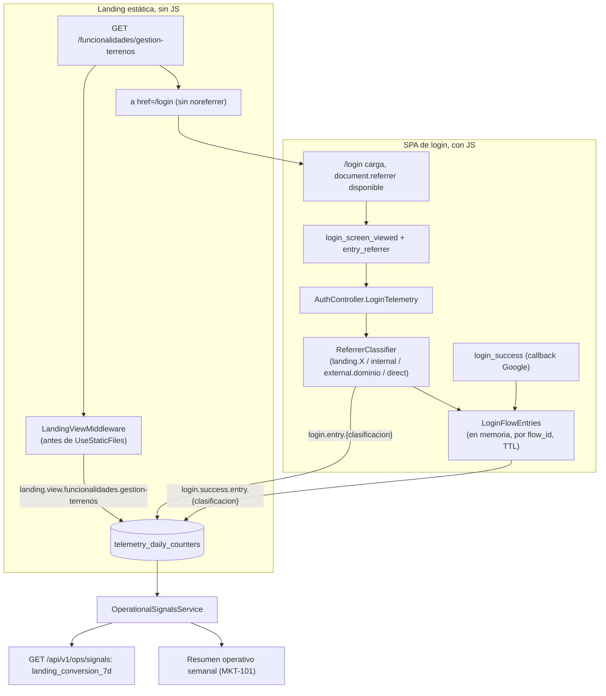

# TDD: MKT-106 — Trazabilidad por landing y conversion completa

> **Referencia al spec**: [spec.md](./spec.md)

## Resumen técnico

Las landings públicas (`MKT-102`) son HTML estático **sin bundle de JavaScript** (`ADR-0012`), así que
no pueden emitir ningún evento de cliente. `landing_view` se cuenta en servidor, contando las
peticiones reales a esas rutas (origen único, sin CDN por delante, así que el servidor ve el 100 % del
tráfico — `Program.cs`). La correlación con el embudo de login reutiliza el `Referer` que el navegador
ya manda hoy en la navegación `landing -> /login` (el enlace no lleva `noreferrer`): la SPA de login lo
clasifica y lo manda como dimensión nueva (`entry_referrer`) en el primer evento del embudo
(`login_screen_viewed`), y la clasificación viaja en memoria (mismo patrón que `LoginFlowTimings`)
hasta `login_success`, para poder calcular conversión por landing sin guardar nada por persona
(`RN-042`).

El catálogo de landings **no es cerrado** (crecerá con cada campaña nueva), así que no se valida
contra una lista fija: se deriva de la ruta servida (para el conteo de vistas) o del `Referer`
saneado con las mismas reglas de forma que el resto de dimensiones del embudo (para la atribución), sin
enumerar landings de antemano.

## Diagrama de arquitectura / flujo



## Componentes afectados

| Componente | Tipo de cambio | Descripción |
| ---------- | -------------- | ------------ |
| `Infrastructure/Telemetry/LandingCatalog.cs` | nuevo | Deriva la clave de landing (`home`, `funcionalidades.{slug}`, `para.{slug}`) de una ruta, comprobando que el fichero físico existe; catálogo abierto |
| `Common/Http/LandingViewMiddleware.cs` | nuevo | Cuenta `landing.view.{clave}` para cada `GET` real a una landing, antes de `UseStaticFiles` |
| `Infrastructure/Telemetry/ReferrerClassifier.cs` | nuevo | Clasifica un `Referer` en `landing.{clave}` / `internal` / `external.{dominio}` / `direct`, saneado y acotado (`MetricMaxLength`) |
| `Infrastructure/Telemetry/LoginFlowEntries.cs` | nuevo | Recuerda la clasificación de entrada por `flow_id` hasta el cierre del intento (mismo patrón y límites que `LoginFlowTimings`) |
| `Infrastructure/Telemetry/TelemetryMetrics.cs` | modificado | `LandingViewFor`, `LoginEntryFor`, `LoginSuccessEntryFor` |
| `Infrastructure/Telemetry/ILoginTelemetry.cs` · `LoginTelemetryService.cs` | modificado | `LoginScreenViewed` acepta la clasificación de entrada; `LoginSuccess` la recupera y suma su contador |
| `Controllers/AuthController.cs` | modificado | `LoginTelemetryRequest` admite `entry_referrer`; se clasifica antes de invocar el servicio |
| `Program.cs` | modificado | Registro de `LandingViewMiddleware` y `LoginFlowEntries` |
| `Application/Ops/OperationalSignalsService.cs` · `Controllers/OpsController.cs` | modificado | Nueva sección `landing_conversion_7d`, descubierta a partir de los prefijos de métrica presentes en el rango, sin lista fija |
| `Infrastructure/Telemetry/Summary/OperationalSummaryEmailComposer.cs` | modificado | El resumen semanal incluye el top de landings por conversión; se retira la nota de ausencia de `MKT-101` |
| `frontend/.../lib/login-telemetry.ts` | modificado | Lee `document.referrer` en el momento de `login_screen_viewed` |
| `frontend/.../services/telemetry.service.ts` | modificado | Envía `entry_referrer` en el cuerpo de `logLoginEvent` |
| `docs/02-arquitectura/contratos-api.md`, `docs/07-seguridad/privacidad-datos.md`, `docs/05-infraestructura/observabilidad.md`, `docs/03-modulos/observabilidad/README.md` | modificado | Contrato, evaluación de privacidad y enlace desde el módulo |

## Diseño detallado

### Modelo de datos

Ninguno nuevo: se reutiliza `telemetry_daily_counters` (`date`, `metric`, `value`), igual que el resto
de la telemetría desde `MVP-601`. Las landings y los orígenes externos son **dimensiones codificadas en
el nombre de la métrica**, no columnas nuevas — es el mismo mecanismo que ya usa
`TelemetryMetrics.LoginErrorFor`/`DashboardWidgetFor`. Al no haber lista fija de landings, el catálogo
se "descubre" leyendo qué prefijos de métrica existen en el rango consultado, no se declara.

### API / Contratos

`POST /api/v1/auth/telemetry/login` gana un campo opcional:

```jsonc
{
  "event": "login_screen_viewed",
  "flow_id": "…",
  "session_id": "…",
  "device_type": "desktop",
  "entry_referrer": "https://terrenario.example/funcionalidades/gestion-terrenos" // opcional
}
```

Reglas: solo se evalúa en `login_screen_viewed` (el primer evento del intento); en el resto de eventos
se ignora si llega. Un valor ausente, vacío o que no tenga forma de URL absoluta **no rechaza el
evento**: se clasifica como `direct`, mismo criterio de degradación que `session_id`/`device_type`
(nunca se pierde la conversión por una dimensión secundaria).

`GET /api/v1/ops/signals` añade `landing_conversion_7d`: lista abierta de
`{ landing, views, login_views, login_success, conversion }`, una entrada por cada landing con al
menos una vista en los últimos 7 días. `conversion = login_success / views` (`null` si `views` es 0,
mismo criterio que el resto de cocientes del informe).

### Lógica de negocio

- **`landing_view` (CA-1)**: `LandingViewMiddleware` se inserta justo antes de `UseStaticFiles`
  (después del middleware que sirve `home.html`). Para cada `GET` cuya ruta sea `/`,
  `/funcionalidades/{slug}` o `/para/{slug}`, `LandingCatalog` comprueba que el fichero físico
  (`home.html` o `{carpeta}/{slug}/index.html`) existe en `wwwroot`; si existe, suma
  `landing.view.{clave}` y sigue la petición normal (`UseStaticFiles` la sirve igual que hoy). Si el
  fichero no existe, no cuenta nada y la petición sigue su curso (acabará en el 404 de siempre). Esto
  cierra a la vez la validación: la clave de landing nunca sale de texto de cliente sin contrastar,
  sale de una ruta para la que de verdad existe contenido.
- **Clasificación del origen (`ReferrerClassifier`)**: dado el `Referer` (o `document.referrer` que
  manda el cliente) y el host de la petición:
  - vacío o sin forma de URL absoluta → `direct`.
  - mismo host que la petición y ruta reconocida por `LandingCatalog` → `landing.{clave}` (misma
    clave que usa el contador de vistas, para poder cruzar ambas series).
  - mismo host, cualquier otra ruta → `internal` (navegación dentro de la propia SPA).
  - host distinto → `external.{dominio}`, saneando el dominio (minúsculas, sin `www.`, solo
    `[a-z0-9.-]`) y truncando a `TelemetryDimensions.MetricMaxLength` menos el prefijo, igual que
    `LoginErrorFor` sanea el código de error: el dominio es texto que no controla el servidor, así que
    no puede convertirse en un nombre de métrica sin acotar.
- **Propagación al embudo**: `LoginScreenViewed` guarda la clasificación en `LoginFlowEntries` (en
  memoria, indexado por `flow_id`, mismo límite de tamaño/edad que `LoginFlowTimings` —
  `MaxTrackedFlows`/`MaxAge` — para que no crezca sin límite) y suma
  `login.entry.{clasificacion}`. `LoginSuccess` recupera la clasificación (si sigue viva) y suma
  `login.success.entry.{clasificacion}`. `LoginError`/`LoginAbandoned` la descartan, igual que hacen
  hoy con `LoginFlowTimings`.
- **Conversión por landing (CA-2)**: `OperationalSignalsService` ya carga todas las filas de
  `telemetry_daily_counters` del rango (`store.GetRangeAsync`); se agrupan las que empiezan por
  `landing.view.`, `login.entry.landing.` y `login.success.entry.landing.` por la clave de landing
  que comparten, y se calcula el cociente. No hace falta enumerar landings de antemano (punto 3 del PO):
  la lista sale de lo que de verdad se observó esa semana.
- **Primera parte y sin perfilado (CA-3)**: no se persiste el `Referer` en crudo en ningún sitio — ni
  en `telemetry_daily_counters` (son contadores, no filas de evento) ni más allá de la vida del
  intento en `LoginFlowEntries`. Un dominio externo agregado (`external.google.com`) no identifica a
  ninguna persona, igual que hoy no lo hace `device_type`; sigue encajando en el supuesto de
  `ADR-0011`/`RN-042` (medición propia, agregada, sin seguimiento entre sitios).

### Manejo de errores

- `entry_referrer` mal formado o ausente → `direct`, nunca `400` (igual que el resto de dimensiones
  secundarias del embudo).
- Un `Referer` cuyo host coincide pero cuya ruta no resuelve a una landing real → `internal`, no se
  inventa una landing que no existe.
- Fallo al leer `wwwroot` (build de frontend no ejecutado, mismo caso que `ADR-0012` ya contempla) →
  `LandingCatalog` no encuentra el fichero, no cuenta nada; ninguna landing pública se ve afectada
  porque el middleware nunca sirve el fichero, solo cuenta.

## Alternativas descartadas

| Alternativa | Por qué se descartó |
| ----------- | -------------------- |
| Píxel de imagen (``) en la landing para contar la vista | Reabriría y tocaría `ContentLandingPage.tsx`/`LandingPage.tsx`/el pre-renderizador ya cerrados en `MKT-102`, sin aportar nada que el conteo en servidor no dé ya (origen único, sin CDN) |
| Query param explícito en el CTA (`/login?landing=slug`) para la correlación | Más preciso que el `Referer` en algunos casos, pero no generaliza a "de qué sitio externo viene" (lo que pidió el PO) y también tocaría el CTA ya cerrado de `MKT-102`; se descarta a favor del `Referer`, que ya viaja sin cambiar la landing |
| Catálogo cerrado de landings validado en servidor | El PO confirmó que crecerá con cada campaña; un catálogo cerrado exigiría desplegar el backend por cada landing nueva de marketing |
| Cookie/identificador de primera parte para correlacionar la visita concreta a la landing con el login | Añadiría un identificador que sobrevive a la navegación — más «seguimiento» del permitido por `RN-042`/`ADR-0011` para esta fase; el `Referer` da la misma respuesta agregada sin persistir nada por visita |

## Riesgos e impacto

| Riesgo | Probabilidad | Mitigación |
| ------ | ------------ | ---------- |
| El `Referer`/`document.referrer` no llega (navegadores con protección de rastreo, o el sitio externo que enlaza usa una política de referrer estricta) | media | Aceptado y documentado: la visita cae en `direct`/`unknown`, es un suelo y no un techo de medición, mismo criterio de "peor UX analítica" que ya acepta `ADR-0011` |
| Tráfico de rastreadores SEO infla `landing.view.*` | media | Aceptado: `ADR-0012` se diseñó explícitamente para ser rastreado; separar bots de personas queda fuera de alcance |
| Cardinalidad de `external.{dominio}` crece con cada sitio que enlace | baja | Acotado por `MetricMaxLength` y saneado de caracteres, igual que `LoginErrorFor`; sigue siendo agregado, no una fila por visitante |
| Un cliente manda un `entry_referrer` fabricado con ruta `/funcionalidades/algo-inventado` | baja | `ReferrerClassifier` solo asigna `landing.{clave}` si `LandingCatalog` confirma que el fichero existe; si no, cae a `internal` |

## Plan de testing

- [x] Tests unitarios: `LandingCatalogTests` (rutas válidas/no válidas, ficheros ausentes), `ReferrerClassifierTests` (mismo origen/landing, mismo origen/interno, externo saneado, vacío/mal formado → `direct`), `LoginFlowEntriesTests` (TTL y tamaño, igual que `LoginFlowTimings`)
- [x] Tests de integración: `LandingViewMiddlewareTests` (cuenta solo landings existentes), `AuthControllerTelemetryTests` (ampliados con `entry_referrer`), `OperationalSignalsServiceTests` (`landing_conversion_7d` con y sin datos)
- [x] Tests frontend: `login-telemetry.test.ts`/`telemetry.service.test.ts` (envío de `entry_referrer` desde `document.referrer`)
- [x] Verificación manual: `dotnet build` y suite completa de backend en verde; `npm run build`/`npm test` en verde

## Checklist de implementación

- [x] Diseño técnico revisado y aprobado
- [x] Migraciones de base de datos preparadas — no aplica, reutiliza `telemetry_daily_counters`
- [x] Tests escritos y pasando
- [x] Documentación de API actualizada
- [x] Módulo afectado actualizado en `docs/03-modulos/observabilidad/README.md`
- [x] Sin `TODO` sin resolver en este documento
