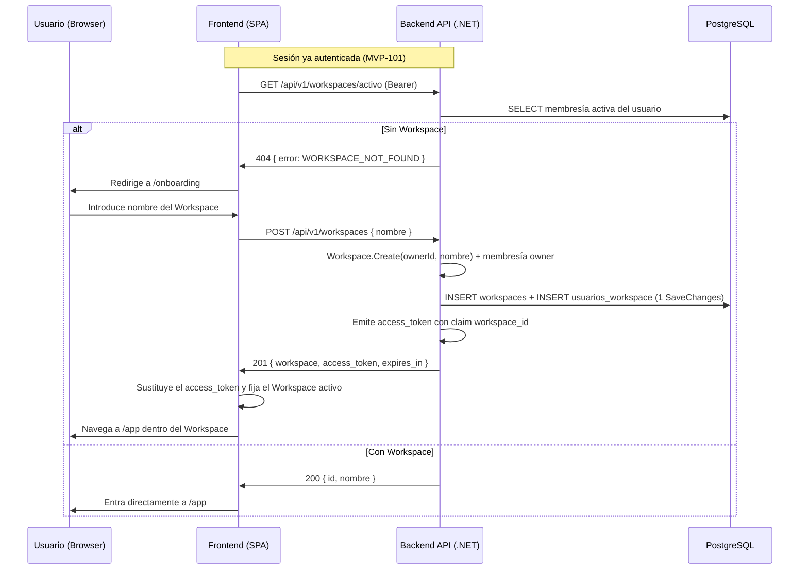

---
id: "MVP-102"
tipo: feature
titulo: "TDD: Creación de Workspace y primer acceso guiado"
estado: en-progreso
tickets: []
epica: "MVP-001--identidad-y-contexto-seguro"
responsable: "@andres"
revisores: []
ai_context:
  dominios: ["workspaces", "onboarding"]
  modulo_path: "03-modulos/"
  componentes: ["workspaces", "onboarding", "workspace-ui"]
  etiquetas: ["mvp", "workspace", "onboarding"]
  nivel_riesgo: medio
creado_en: "2026-07-24"
actualizado_en: "2026-07-24"
---

# TDD: MVP-102 — Creación de Workspace y primer acceso guiado

> **Referencia al spec**: [spec.md](./spec.md)

## Resumen técnico

Se añade el agregado `Workspace` y su membresía (`usuarios_workspace`) sobre la base de identidad
de MVP-101. Un usuario autenticado sin Workspace es enviado a un onboarding de un solo paso; al
crearlo, el backend persiste Workspace + membresía activa del creador en una única transacción y
reemite el `access_token` con el claim `workspace_id`, de modo que la sesión queda situada en el
nuevo contexto sin re-login ni paso manual de selección.

El Workspace activo se resuelve siempre en servidor (`ActiveWorkspaceResolver`), nunca se acepta
como dato de entrada del cliente. Esto deja preparado el enforcement de ámbito de MVP-105 sin
implementarlo todavía.

## Diagrama de arquitectura / flujo



## Componentes afectados

| Componente | Tipo de cambio | Descripción |
| ---------- | -------------- | ----------- |
| `src/backend/.../Domain/Workspaces/Workspace.cs` | nuevo | Agregado con las invariantes de nombre y propietario |
| `src/backend/.../Domain/Workspaces/WorkspaceMember.cs` | nuevo | Membresía del usuario en el Workspace |
| `src/backend/.../Domain/Workspaces/IWorkspaceRepository.cs` | nuevo | Puerto de persistencia del agregado |
| `src/backend/.../Application/Workspaces/CreateWorkspaceHandler.cs` | nuevo | Caso de uso de creación + reemisión de sesión |
| `src/backend/.../Application/Workspaces/ActiveWorkspaceResolver.cs` | nuevo | Resolución en servidor del Workspace activo |
| `src/backend/.../Controllers/WorkspacesController.cs` | nuevo | `POST /workspaces` y `GET /workspaces/activo` |
| `src/backend/.../Infrastructure/Data/Repositories/WorkspaceRepository.cs` | nuevo | Adaptador EF Core |
| `src/backend/.../Infrastructure/Data/Migrations/*_AddWorkspacesAndMemberships.cs` | nuevo | Tablas `workspaces` y `usuarios_workspace` |
| `src/backend/.../Common/Auth/ClaimsPrincipalExtensions.cs` | nuevo | Lectura tipada de `sub`, `name` y `workspace_id` |
| `src/backend/.../Infrastructure/Auth/JwtService.cs` | modificado | Claim opcional `workspace_id` en el access token |
| `src/backend/.../Application/Auth/ExchangeGoogleCodeHandler.cs` | modificado | El login resuelve y devuelve el Workspace activo |
| `src/backend/.../Application/Auth/RefreshTokenHandler.cs` | modificado | La renovación conserva el contexto de Workspace |
| `src/backend/.../Program.cs` | modificado | Registro de servicios y contrato de error en validación de modelo |
| `src/frontend/.../contexts/WorkspaceContext.tsx` | nuevo | Estado del Workspace activo en la SPA |
| `src/frontend/.../components/onboarding/CreateWorkspacePage.tsx` | nuevo | Pantalla de alta guiada |
| `src/frontend/.../routes/RequireWorkspace.tsx` | nuevo | Guarda de rutas operativas |
| `src/frontend/.../services/workspace.service.ts` | nuevo | Cliente HTTP de Workspaces |
| `src/frontend/.../App.tsx` | modificado | Ruta `/onboarding` y guarda de `/app` |

## Diseño detallado

### Modelo de datos

Alineado con `docs/02-arquitectura/modelo-de-datos.md` (entidades `WORKSPACE` y `USUARIO_WORKSPACE`).

```sql
CREATE TABLE workspaces (
    id              UUID PRIMARY KEY,
    owner_id        UUID NOT NULL REFERENCES usuarios(id) ON DELETE RESTRICT,
    nombre          VARCHAR(120) NOT NULL,
    creado_en       TIMESTAMPTZ NOT NULL,
    actualizado_en  TIMESTAMPTZ NOT NULL
);

CREATE INDEX idx_workspaces_owner_id ON workspaces(owner_id);

CREATE TABLE usuarios_workspace (
    id            UUID PRIMARY KEY,
    workspace_id  UUID NOT NULL REFERENCES workspaces(id) ON DELETE CASCADE,
    usuario_id    UUID NOT NULL REFERENCES usuarios(id) ON DELETE CASCADE,
    rol           VARCHAR(50) NOT NULL,
    activo        BOOLEAN NOT NULL,
    unido_en      TIMESTAMPTZ NOT NULL
);

CREATE UNIQUE INDEX idx_usuarios_workspace_ws_usuario
    ON usuarios_workspace(workspace_id, usuario_id);
CREATE INDEX idx_usuarios_workspace_usuario_id ON usuarios_workspace(usuario_id);
```

Notas:

- `owner_id` usa `ON DELETE RESTRICT` para no dejar Workspaces huérfanos si se borrase un usuario.
- El índice único `(workspace_id, usuario_id)` impide membresías duplicadas, base para MVP-103.
- `rol` almacena los valores de `docs/07-seguridad/autenticacion-autorizacion.md`
  (`workspace_owner`, `workspace_member`). En MVP es informativo por RN-034.
- El límite de 120 caracteres del nombre es una decisión de esta historia; la KB no fijaba longitud.

### API / Contratos

```yaml
# POST /api/v1/workspaces
# Crea el Workspace del usuario autenticado y lo deja como contexto activo de la sesión
request:
  headers:
    Authorization: Bearer <access_token>
  body:
    nombre: string        # obligatorio, 1..120 caracteres (se normaliza con trim)

responses:
  201:
    body:
      workspace:
        id: uuid
        nombre: string
      access_token: string   # nuevo JWT, ahora con claim workspace_id
      expires_in: 900
    headers:
      Location: /api/v1/workspaces/activo
  400:
    body: { error: { code: "VALIDATION_REQUIRED_WORKSPACE_NOMBRE", message: "..." } }
  400:
    body: { error: { code: "VALIDATION_WORKSPACE_NOMBRE_LENGTH", message: "..." } }
  401:
    body: { error: { code: "AUTH_UNAUTHENTICATED", message: "..." } }

# GET /api/v1/workspaces/activo
# Devuelve el Workspace activo de la sesión; el cliente lo usa para decidir onboarding vs. operativa
request:
  headers:
    Authorization: Bearer <access_token>
responses:
  200:
    body: { id: uuid, nombre: string }
  404:
    body: { error: { code: "WORKSPACE_NOT_FOUND", message: "..." } }
  401:
    body: { error: { code: "AUTH_UNAUTHENTICATED", message: "..." } }
```

Cambios aditivos sobre los contratos de MVP-101:

```yaml
# POST /api/v1/auth/google/callback → 200
# POST /api/v1/auth/refresh         → 200
# Ambos incorporan el contexto de Workspace de la sesión
workspace: { id: uuid, nombre: string } | null
```

### Lógica de negocio

**Creación del Workspace (CA-1, CA-2, CA-3):**

1. El identificador del creador se toma del claim `sub`; nunca del cuerpo de la petición.
2. `Workspace.Create` normaliza el nombre (`trim`) y valida obligatoriedad y longitud.
3. El propio agregado emite la membresía del creador (`CreateOwnerMembership`), de forma que
   no puede persistirse un Workspace sin miembro activo.
4. Workspace y membresía se guardan con un único `SaveChangesAsync`, por lo que EF Core los
   escribe dentro de la misma transacción implícita.
5. Se reemite el `access_token` con el claim `workspace_id`, dejando la sesión situada en el
   Workspace recién creado sin exigir un `refresh` adicional.

**Resolución del Workspace activo:**

- Si la sesión trae `workspace_id`, se valida que siga existiendo membresía activa del usuario
  en ese Workspace antes de aceptarlo.
- Si no lo trae, o el Workspace ya no es accesible, se cae a la membresía activa más reciente.
- Si no hay ninguna, la respuesta es "sin Workspace" y el cliente entra al onboarding.

**Primer acceso guiado (frontend):**

- `WorkspaceProvider` carga el Workspace activo en cuanto la sesión está autenticada.
- `RequireWorkspace` protege `/app`: sin Workspace activo redirige a `/onboarding`.
- `/onboarding` redirige a `/app` si ya existe Workspace, evitando altas duplicadas por navegación
  manual a la URL.

### Manejo de errores

| Situación | Código HTTP | Código de error | Nota |
| --------- | ----------- | --------------- | ---- |
| Nombre vacío o solo espacios | 400 | `VALIDATION_REQUIRED_WORKSPACE_NOMBRE` | Validado en el agregado y en el DTO |
| Nombre de más de 120 caracteres | 400 | `VALIDATION_WORKSPACE_NOMBRE_LENGTH` | El input del cliente ya limita a 120 |
| Cuerpo ausente o mal formado | 400 | `VALIDATION_REQUIRED` | Vía `InvalidModelStateResponseFactory` |
| Token ausente, inválido o sin `sub` | 401 | `AUTH_UNAUTHENTICATED` | Igual que el resto de endpoints protegidos |
| El usuario no tiene ningún Workspace | 404 | `WORKSPACE_NOT_FOUND` | Señal de "entra al onboarding", no es un fallo |

Se añade `InvalidModelStateResponseFactory` en `Program.cs` para que los errores de validación de
modelo respeten el contrato `{ error: { code, message } }` de `docs/02-arquitectura/contratos-api.md`
en lugar del `ProblemDetails` por defecto de ASP.NET Core.

## Alternativas descartadas

| Alternativa | Por qué se descartó |
| ----------- | ------------------- |
| Persistir el Workspace activo en una columna de `usuarios` | Introduce un campo fuera del modelo de datos canónico para un dato que es de sesión, no de identidad |
| Aceptar `workspace_id` como parámetro del cliente en cada llamada | El cliente podría apuntar a un Workspace ajeno; la pertenencia debe resolverla el servidor |
| Crear el Workspace automáticamente al primer login | El spec pide un flujo explícito y comprensible (CA-1); un alta implícita deja nombres genéricos |
| Crear también la primera temporada en este flujo | Es alcance explícito de MVP-201; MVP-102 debe limitarse a crear contexto |
| Devolver la lista completa de Workspaces del usuario | Es alcance de MVP-104 (selector y membresías) |

## Riesgos e impacto

| Riesgo | Probabilidad | Mitigación |
| ------ | ------------ | ---------- |
| El cliente conserva un token sin `workspace_id` tras crear el Workspace | media | La creación devuelve un token nuevo y el frontend lo sustituye en el acto |
| Doble envío del formulario crea dos Workspaces | media | El botón se deshabilita durante el envío y `/onboarding` redirige si ya existe contexto |
| Sesión larga apuntando a una membresía ya revocada (a partir de MVP-103) | baja | El resolver revalida la membresía activa en cada resolución |
| Deriva entre nombres de tabla y el modelo de datos canónico | baja | Mapeo explícito a `workspaces` y `usuarios_workspace` en el `DbContext` |

## Plan de testing

> Referencia: `docs/04-ingenieria/estrategia-testing.md`

- [x] Tests unitarios:
  - `Workspace`: alta válida, normalización de nombre, nombre vacío, nombre demasiado largo,
    propietario inválido y creación de la membresía del propietario
  - `CreateWorkspaceHandler`: persistencia de Workspace + membresía vinculada, emisión del token
    con Workspace activo y no persistencia ante nombre inválido
  - `ActiveWorkspaceResolver`: sin Workspaces, Workspace por defecto, preferencia de la sesión y
    caída al valor por defecto cuando la membresía ya no es accesible
  - `ExchangeGoogleCodeHandler` y `RefreshTokenHandler`: sesión con y sin contexto de Workspace
- [ ] Tests de integración: `POST /api/v1/workspaces` y `GET /api/v1/workspaces/activo` contra
  PostgreSQL, pendientes junto al resto de tests de integración de la épica (MVP-501)
- [ ] Tests E2E: flujo login → onboarding → área operativa, pendiente del sprint final

Resultado local: `dotnet test` en verde (30 tests) y `npm run build` sin errores de TypeScript.

## Checklist de implementación

- [x] Diseño técnico revisado y aprobado
- [x] Migraciones de base de datos preparadas (tablas `workspaces` y `usuarios_workspace`)
- [x] Tests escritos y pasando
- [x] Documentación de API actualizada en este documento
- [ ] Módulo de Workspaces documentado en `docs/03-modulos/` (se creará al consolidar el módulo
  con MVP-103 y MVP-104, que completan membresías e invitaciones)
- [x] Sin `TODO` sin resolver en este documento
