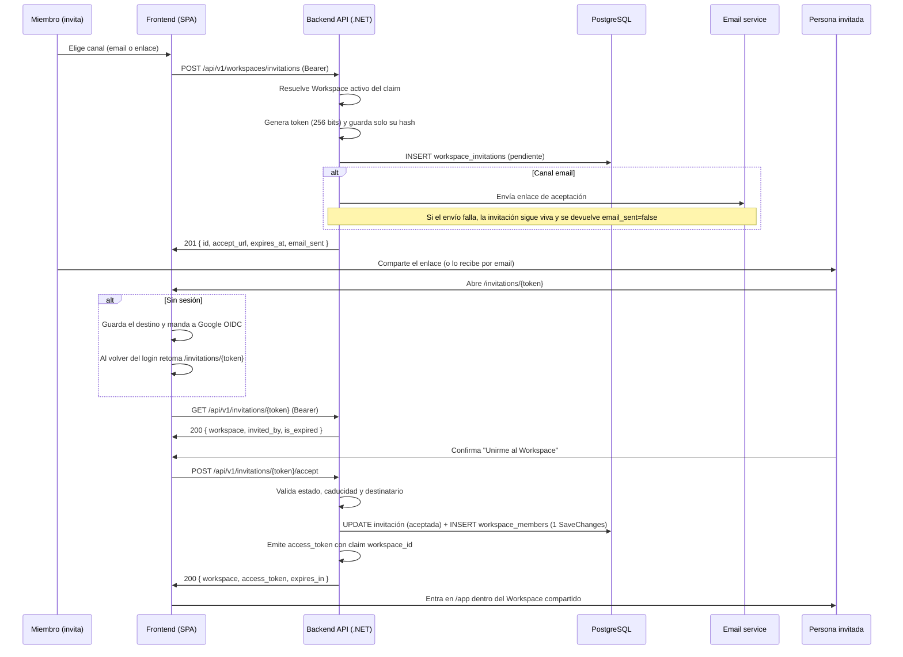

---
id: "MVP-103"
tipo: feature
titulo: "TDD: Invitaciones por email y enlace"
estado: en-progreso
tickets: []
epica: "MVP-001--identidad-y-contexto-seguro"
responsable: "@andres"
revisores: []
ai_context:
  dominios: ["workspaces", "invitaciones", "multiusuario"]
  modulo_path: "03-modulos/"
  componentes: ["invitaciones", "workspace-members", "email-service"]
  etiquetas: ["mvp", "invite", "workspace"]
  nivel_riesgo: medio
creado_en: "2026-07-24"
actualizado_en: "2026-07-24"
---

# TDD: MVP-103 — Invitaciones por email y enlace

> **Referencia al spec**: [spec.md](./spec.md)

## Resumen técnico

Se añade el agregado `WorkspaceInvitation` sobre la membresía de MVP-102. Cualquier miembro del
Workspace activo emite una invitación por email o por enlace; la invitación se materializa en un
token aleatorio de 256 bits del que solo se persiste el hash SHA-256, igual que los refresh tokens
de MVP-101. Quien recibe el enlace lo abre, inicia sesión con Google si aún no la tiene y acepta:
en ese momento se crea su `workspace_members` activa y se reemite el `access_token` con el claim
`workspace_id`, de modo que entra directamente en el Workspace compartido (RN-035).

El Workspace de origen no viaja nunca en la petición: se resuelve en servidor con
`ActiveWorkspaceResolver`, como en MVP-102. Los permisos siguen siendo planos (RN-034), así que
invitar no exige un rol concreto y la membresía creada es `workspace_member` a título informativo.

## Diagrama de arquitectura / flujo



## Componentes afectados

| Componente | Tipo de cambio | Descripción |
| ---------- | -------------- | ----------- |
| `src/backend/.../Domain/Workspaces/WorkspaceInvitation.cs` | nuevo | Agregado con las invariantes de canal, destinatario, caducidad y aceptación |
| `src/backend/.../Domain/Workspaces/InvitationChannels.cs` | nuevo | Catálogo cerrado `invitation_channel` |
| `src/backend/.../Domain/Workspaces/InvitationStatuses.cs` | nuevo | Catálogo cerrado `invitation_status` |
| `src/backend/.../Domain/Workspaces/InvitationException.cs` | nuevo | Error de dominio con el código del contrato de API |
| `src/backend/.../Domain/Workspaces/IWorkspaceInvitationRepository.cs` | nuevo | Puerto de persistencia del agregado |
| `src/backend/.../Domain/Workspaces/WorkspaceMember.cs` | modificado | Factoría `CreateMember` para la membresía derivada de una invitación |
| `src/backend/.../Domain/Workspaces/IWorkspaceRepository.cs` | modificado | `FindByIdAsync`, `HasActiveMembershipAsync` y `AddMemberAsync` |
| `src/backend/.../Domain/Users/IUserRepository.cs` | modificado | `FindByEmailAsync` para detectar a quien ya es miembro |
| `src/backend/.../Application/Invitations/CreateInvitationHandler.cs` | nuevo | Caso de uso de emisión (CA-1) |
| `src/backend/.../Application/Invitations/AcceptInvitationHandler.cs` | nuevo | Caso de uso de aceptación (CA-2, CA-3) |
| `src/backend/.../Application/Invitations/PreviewInvitationHandler.cs` | nuevo | Datos que se muestran antes de aceptar |
| `src/backend/.../Application/Invitations/ListWorkspaceInvitationsHandler.cs` | nuevo | Invitaciones pendientes del Workspace activo |
| `src/backend/.../Controllers/WorkspaceInvitationsController.cs` | nuevo | `POST` y `GET /workspaces/invitations` |
| `src/backend/.../Controllers/InvitationsController.cs` | nuevo | `GET /invitations/{token}` y `POST /invitations/{token}/accept` |
| `src/backend/.../Common/Errors/InvitationErrorMapper.cs` | nuevo | Traducción de código de dominio a código HTTP |
| `src/backend/.../Infrastructure/Invitations/InvitationTokenService.cs` | nuevo | Generación del token y su hash |
| `src/backend/.../Infrastructure/Invitations/SmtpInvitationEmailSender.cs` | nuevo | Adaptador SMTP del `email-service` (ADR-0010) |
| `src/backend/.../Infrastructure/Invitations/InvitationEmailComposer.cs` | nuevo | Composición del correo, separada del transporte para poder probarla |
| `src/backend/.../Infrastructure/Invitations/EmailOptions.cs` | nuevo | Cuenta de envío: servidor, seguridad, credenciales y remitente |
| `src/backend/.../Infrastructure/Invitations/InvitationOptions.cs` | nuevo | Vigencia y base pública del enlace de aceptación |
| `src/backend/.../Infrastructure/Data/Repositories/WorkspaceInvitationRepository.cs` | nuevo | Adaptador EF Core |
| `src/backend/.../Infrastructure/Data/Migrations/*_AddWorkspaceInvitations.cs` | nuevo | Tabla `workspace_invitations` |
| `src/backend/.../Infrastructure/Data/TerrenarioDbContext.cs` | modificado | Mapeo de `workspace_invitations` |
| `src/backend/.../Program.cs` | modificado | Registro de servicios y opciones de invitación |
| `src/frontend/.../components/workspace/InvitePeoplePage.tsx` | nuevo | Pantalla de invitación (HU-1) |
| `src/frontend/.../components/invitations/AcceptInvitationPage.tsx` | nuevo | Pantalla de aceptación (HU-2) |
| `src/frontend/.../services/invitation.service.ts` | nuevo | Cliente HTTP de invitaciones |
| `src/frontend/.../types/invitation.types.ts` | nuevo | Contratos de invitación en el cliente |
| `src/frontend/.../lib/post-login-redirect.ts` | nuevo | Retoma el enlace de invitación después del login |
| `src/frontend/.../contexts/WorkspaceContext.tsx` | modificado | `acceptInvitation` adopta la sesión reemitida |
| `src/frontend/.../routes/ProtectedRoute.tsx` | modificado | Recuerda el destino antes de mandar al login |
| `src/frontend/.../components/auth/OAuthCallback.tsx` | modificado | Vuelve al destino guardado tras autenticarse |
| `src/frontend/.../App.tsx` | modificado | Rutas `/invitations/:token` y `/app/invitations` |

## Diseño detallado

### Modelo de datos

Añade la entidad `WORKSPACE_INVITATION` al modelo canónico
(`docs/02-arquitectura/modelo-de-datos.md`). `workspace_members` no cambia: la membresía derivada
de una invitación nace activa con rol `workspace_member`, y el catálogo completo de estados
(`invitado`, `activo`, `revocado`) sigue siendo alcance de MVP-104.

```sql
CREATE TABLE workspace_invitations (
    id                  UUID PRIMARY KEY,
    workspace_id        UUID NOT NULL REFERENCES workspaces(id) ON DELETE CASCADE,
    invited_by_user_id  UUID NOT NULL REFERENCES users(id) ON DELETE RESTRICT,
    channel             VARCHAR(20) NOT NULL,
    email               VARCHAR(320) NULL,
    token_hash          TEXT NOT NULL,
    status              VARCHAR(20) NOT NULL,
    expires_at          TIMESTAMPTZ NOT NULL,
    created_at          TIMESTAMPTZ NOT NULL,
    accepted_at         TIMESTAMPTZ NULL,
    accepted_by_user_id UUID NULL REFERENCES users(id) ON DELETE RESTRICT
);

CREATE UNIQUE INDEX idx_workspace_invitations_token_hash ON workspace_invitations(token_hash);
CREATE INDEX idx_workspace_invitations_ws_status ON workspace_invitations(workspace_id, status);
```

Notas:

- `token_hash` guarda el SHA-256 en hexadecimal del token; el valor en claro nunca se persiste ni
  se registra en logs. El índice único además impide colisiones.
- `email` solo se informa en el canal `email`. El enlace compartible no tiene destinatario, así que
  se guarda `NULL` aunque la petición traiga un email.
- La caducidad no es un estado persistido: se deriva comparando `expires_at` con el momento de la
  aceptación, lo que evita un proceso en segundo plano para marcar invitaciones vencidas.
- `accepted_by_user_id` da la trazabilidad de quién entró por qué invitación sin añadir columnas a
  `workspace_members`, que no está en el modelo canónico.
- Los **valores** de `channel` y `status` van en español por ser vocabulario de dominio
  (ADR-0009); el nombre del catálogo va en inglés.

### API / Contratos

```yaml
# POST /api/v1/workspaces/invitations
# Emite una invitación al Workspace activo de la sesión
request:
  headers:
    Authorization: Bearer <access_token>
  body:
    channel: string       # obligatorio: "email" | "enlace"
    email: string|null    # obligatorio si channel = "email"; ignorado si channel = "enlace"

responses:
  201:
    body:
      id: uuid
      channel: string
      email: string|null
      status: "pendiente"
      accept_url: string          # única vez que el enlace existe en claro
      expires_at: timestamptz
      email_sent: boolean         # false si el proveedor de email falló
  400:
    body: { error: { code: "VALIDATION_INVITATION_CHANNEL_INVALID", message: "..." } }
  400:
    body: { error: { code: "VALIDATION_REQUIRED_INVITATION_EMAIL", message: "..." } }
  400:
    body: { error: { code: "VALIDATION_INVITATION_EMAIL_INVALID", message: "..." } }
  401:
    body: { error: { code: "AUTH_UNAUTHENTICATED", message: "..." } }
  403:
    body: { error: { code: "AUTH_WORKSPACE_SCOPE_REQUIRED", message: "..." } }
  422:
    body: { error: { code: "BUSINESS_RULE_INVITATION_ALREADY_MEMBER", message: "..." } }

# GET /api/v1/workspaces/invitations
# Invitaciones pendientes del Workspace activo. No devuelve el enlace: solo existe su hash
responses:
  200:
    body:
      data:
        - { id: uuid, channel: string, email: string|null, status: string,
            expires_at: timestamptz, created_at: timestamptz }
      meta: { total: integer }

# GET /api/v1/invitations/{token}
# Lo que ve quien abre el enlace antes de decidir. Exige sesión iniciada
responses:
  200:
    body:
      id: uuid
      channel: string
      status: string
      workspace: { id: uuid, name: string }
      invited_by: string|null
      expires_at: timestamptz
      is_expired: boolean
  404:
    body: { error: { code: "INVITATION_NOT_FOUND", message: "..." } }

# POST /api/v1/invitations/{token}/accept
# Convierte la invitación en membresía y sitúa la sesión en ese Workspace
responses:
  200:
    body:
      workspace: { id: uuid, name: string }
      access_token: string        # nuevo JWT con claim workspace_id
      expires_in: 900
      already_member: boolean
  403:
    body: { error: { code: "AUTH_INVITATION_EMAIL_MISMATCH", message: "..." } }
  404:
    body: { error: { code: "INVITATION_NOT_FOUND", message: "..." } }
  422:
    body: { error: { code: "BUSINESS_RULE_INVITATION_EXPIRED", message: "..." } }
  422:
    body: { error: { code: "BUSINESS_RULE_INVITATION_ALREADY_ACCEPTED", message: "..." } }
```

### Lógica de negocio

**Emisión de la invitación (CA-1):**

1. El emisor sale del claim `sub` y el Workspace del claim `workspace_id`, revalidado contra la
   membresía activa. Sin Workspace activo la respuesta es `403 AUTH_WORKSPACE_SCOPE_REQUIRED`.
2. `WorkspaceInvitation.Create` valida el canal contra el catálogo, normaliza el email (trim y
   minúsculas) y comprueba su formato, y fija `expires_at` a `Invitations:LifetimeDays` (7 días).
3. En el canal `email` se rechaza invitar a alguien que ya es miembro activo
   (`BUSINESS_RULE_INVITATION_ALREADY_MEMBER`); la comprobación solo mira el Workspace propio, así
   que no revela nada sobre cuentas ajenas.
4. La invitación se persiste con estado `pendiente` y el envío del email ocurre **después** del
   commit. Ni la ausencia de cuenta de envío ni un fallo del proveedor invalidan nada: se devuelve
   `email_sent: false` y quien invita comparte el `accept_url` por su cuenta.

**Cuenta de envío (ADR-0010):**

El correo sale por SMTP genérico con MailKit, configurado en la sección `Email`
(`Host`, `Port`, `SecurityMode`, `Username`, `Password`, `FromAddress`, `FromName`,
`TimeoutSeconds`). **La identidad de la cuenta completa vive fuera del repositorio**, no solo la
contraseña: `Host`, `Username` y `FromAddress` van a User Secrets en local y al Secret Manager por
entorno, porque este repositorio es público y una cuenta commiteada queda en el historial de git
para siempre. En `appsettings.json` esas claves se quedan vacías, documentando la forma de la
sección sin fijar valores; así ningún entorno hereda por descuido la cuenta de otro. Detalle en
`docs/05-infraestructura/entornos.md` y en ADR-0010.

Mientras `Email:Host` o `Email:FromAddress` estén vacíos, `IInvitationEmailSender.IsEnabled` es
`false`: el arranque emite un warning, no se intenta ningún envío y `email_sent` es `false`. Esto
es deliberado —**el sistema no da por enviado un correo que nunca salió**— y mantiene el MVP usable
por enlace mientras la cuenta no esté provisionada. El nombre del Workspace y el de quien invita se
escapan al componer el HTML: los escriben personas.

**Aceptación de la invitación (CA-2, CA-3):**

1. El token se busca por hash. Si no existe, `404 INVITATION_NOT_FOUND`; no se distingue entre
   token inexistente y token mal formado.
2. `Accept` valida en el agregado: que no esté ya aceptada, que no haya caducado y —solo en el
   canal `email`— que la cuenta autenticada sea la destinataria. Un correo reenviado no sirve para
   que entre un tercero; el enlace compartible sí acepta a cualquier usuario autenticado, que es
   justo su propósito.
3. Si el usuario ya tenía membresía activa, la invitación se consume igualmente y no se crea una
   segunda fila: el índice único `(workspace_id, user_id)` de MVP-102 lo prohibiría. La respuesta
   lo indica con `already_member: true`.
4. Invitación y membresía se escriben con un único `SaveChangesAsync`. Ambos repositorios comparten
   el `DbContext` de la petición, así que EF Core los envía en la misma transacción implícita.
5. Se reemite el `access_token` con el claim `workspace_id`, igual que en el alta de Workspace de
   MVP-102, de modo que la persona invitada entra sin `refresh` ni re-login.

**Flujo en el cliente:**

- `/invitations/:token` está bajo `ProtectedRoute` pero fuera de `RequireWorkspace`: la persona
  invitada normalmente no tiene ningún Workspace todavía, y esta es justo su vía de entrada.
- Como el enlace suele abrirse sin sesión, `ProtectedRoute` guarda el destino antes de mandar al
  login y `OAuthCallback` lo retoma al volver de Google. Solo se aceptan rutas internas.
- La pantalla de invitación muestra el enlace una única vez y avisa de ello: al no guardar el token
  en claro, la API no puede volver a mostrarlo.

### Manejo de errores

| Situación | Código HTTP | Código de error | Nota |
| --------- | ----------- | --------------- | ---- |
| Canal fuera del catálogo | 400 | `VALIDATION_INVITATION_CHANNEL_INVALID` | Validado en el agregado |
| Canal `email` sin email | 400 | `VALIDATION_REQUIRED_INVITATION_EMAIL` | El cliente ya lo exige antes de enviar |
| Email con formato no válido | 400 | `VALIDATION_INVITATION_EMAIL_INVALID` | Incluye el límite de 320 caracteres |
| Token ausente o inválido | 401 | `AUTH_UNAUTHENTICATED` | Igual que el resto de endpoints protegidos |
| Sesión sin Workspace activo | 403 | `AUTH_WORKSPACE_SCOPE_REQUIRED` | No se puede invitar sin contexto |
| Invitación por email abierta con otra cuenta | 403 | `AUTH_INVITATION_EMAIL_MISMATCH` | Protege el reenvío del correo |
| Token desconocido | 404 | `INVITATION_NOT_FOUND` | Sin distinguir inexistente de mal formado |
| El Workspace de la invitación ya no existe | 404 | `WORKSPACE_NOT_FOUND` | Borrado del Workspace tras invitar |
| Invitación caducada | 422 | `BUSINESS_RULE_INVITATION_EXPIRED` | Derivado de `expires_at` |
| Invitación ya utilizada | 422 | `BUSINESS_RULE_INVITATION_ALREADY_ACCEPTED` | Las invitaciones son de un solo uso |
| Ya es miembro del Workspace | 422 | `BUSINESS_RULE_INVITATION_ALREADY_MEMBER` | Solo en el canal `email` |

`InvitationErrorMapper` concentra la traducción de código de dominio a código HTTP, de forma que el
dominio no conoce el transporte y el contrato `{ error: { code, message } }` se respeta en todos
los endpoints de invitaciones.

## Alternativas descartadas

| Alternativa | Por qué se descartó |
| ----------- | ------------------- |
| Guardar el token en claro para poder reenviar el enlace | Convierte la tabla en un almacén de credenciales reutilizables; el hash basta para validar y el emisor ya recibe el enlace |
| Enlace de uso múltiple con cupo de aceptaciones | Es "gestión compleja" que el spec deja fuera; un enlace por persona mantiene el rastro de quién entró con qué invitación |
| Permitir que cualquiera acepte una invitación dirigida por email | Un correo reenviado abriría el Workspace a un tercero; el canal `enlace` ya cubre el caso de compartir libremente |
| Crear la membresía como `invitado` y activarla en un segundo paso | Los estados completos de membresía y su flujo son alcance de MVP-104; aquí sobra un paso intermedio |
| Aceptar la invitación sin sesión y crear la cuenta al vuelo | El spec exige que el enlace no abra acceso fuera del flujo autenticado; Google OIDC es el único proveedor del MVP (RN-036) |
| Enviar el email dentro de la misma transacción | Una caída del proveedor tumbaría la emisión de la invitación; el envío va después del commit y se reporta con `email_sent` |
| Integrar la API HTTP de un proveedor concreto | Exige contratar la cuenta antes de poder desarrollar y ata el código a ese proveedor; SMTP sirve para todos y el puerto permite el cambio (ADR-0010) |
| Dejar solo un adaptador de traza sin envío real | Devolvía `email_sent: true` sin enviar nada: la API mentía y ningún entorno avisaba de que faltaba la cuenta |
| Usar `System.Net.Mail.SmtpClient` para no añadir dependencia | Microsoft lo desaconseja para desarrollo nuevo y su manejo de STARTTLS da problemas con proveedores modernos |
| Revocar invitaciones desde la UI | No está en el alcance del spec; la caducidad de 7 días limita la exposición mientras llega MVP-104 |

## Riesgos e impacto

| Riesgo | Probabilidad | Mitigación |
| ------ | ------------ | ---------- |
| El token viaja en la URL y puede acabar en historiales o logs de proxies | media | Un solo uso, caducidad de 7 días, solo el hash en base de datos y ningún log del enlace ni del email completo |
| Reenvío del correo de invitación a un tercero | media | El canal `email` valida que la cuenta autenticada sea la destinataria |
| El MVP sale sin cuenta de envío provisionada y las invitaciones por email no llegan | alta | `IsEnabled` es `false`, el arranque avisa con un warning, la API responde `email_sent: false` y la UI ofrece el enlace para compartirlo por otro medio |
| Las invitaciones acaban en spam por remitente sin SPF/DKIM | alta | El remitente definitivo está pendiente de decisión; ADR-0010 y `entornos.md` fijan SPF, DKIM y DMARC como requisito para producción |
| Un rebote pasa inadvertido: el SMTP acepta y el buzón no existe | media | Sin webhooks no hay acuse; el enlace compartible es la vía alternativa y ADR-0010 deja la API del proveedor como evolución |
| Doble clic en "Unirme" genera dos membresías | baja | El botón se deshabilita durante el envío y la segunda llamada choca con `BUSINESS_RULE_INVITATION_ALREADY_ACCEPTED` |
| Invitaciones pendientes acumuladas sin gestión | baja | Solo se listan las pendientes y caducan solas; la administración llega con MVP-104 |
| La persona invitada pierde el enlace al pasar por el login de Google | media | El destino se guarda antes de redirigir y se retoma en `OAuthCallback` |

## Plan de testing

> Referencia: `docs/04-ingenieria/estrategia-testing.md`

- [x] Tests unitarios:
  - `WorkspaceInvitation`: alta por email y por enlace, normalización del email, email obligatorio
    y con formato inválido, canal fuera de catálogo, aceptación válida, aceptación desde otra
    cuenta, invitación caducada e invitación ya usada
  - `CreateInvitationHandler`: persistencia con token hasheado, envío del enlace por email,
    `email_sent: false` sin cuenta configurada, invitación viva cuando el proveedor falla, rechazo
    de quien ya es miembro y no persistencia ante canal inválido
  - `InvitationEmailComposer`: remitente, asunto y enlace del correo, y escapado del HTML cuando el
    nombre del Workspace lleva marcado
  - `AcceptInvitationHandler`: creación de la membresía y reemisión de la sesión, marcado de la
    invitación como aceptada, no duplicar membresía cuando ya era miembro, token inexistente,
    invitación caducada y Workspace inexistente
- [ ] Tests de integración: los cuatro endpoints contra PostgreSQL, pendientes junto al resto de
  tests de integración de la épica (MVP-501)
- [ ] Tests E2E: flujo invitar → recibir enlace → login → aceptar, pendiente del sprint final

- [ ] Prueba manual de envío real: pendiente de que exista cuenta SMTP provisionada. Con un
  servidor SMTP de pruebas local queda cubierta según `docs/05-infraestructura/desarrollo-local.md`

Resultado local: `dotnet test` en verde (59 tests, 29 nuevos), `npm run build` sin errores de
TypeScript y `npm run lint` sin advertencias nuevas.

## Checklist de implementación

- [x] Diseño técnico revisado y aprobado
- [x] Migraciones de base de datos preparadas (`AddWorkspaceInvitations`)
- [x] Tests escritos y pasando
- [x] Documentación de API actualizada en este documento y en `docs/02-arquitectura/contratos-api.md`
- [ ] Módulo de Workspaces documentado en `docs/03-modulos/` (se creará al consolidar el módulo con
  MVP-104, que cierra membresías y selector de contexto)
- [x] Sin `TODO` sin resolver en este documento
