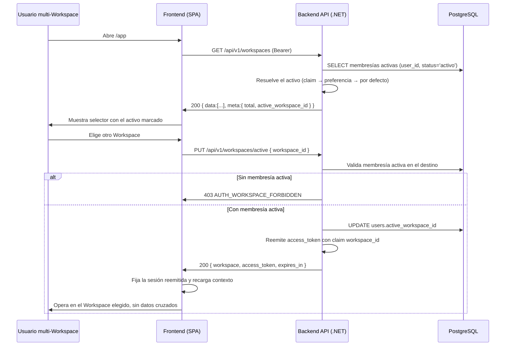

---
id: "MVP-104"
tipo: feature
titulo: "TDD: Membresía y selector de Workspace activo"
estado: en-progreso
tickets: []
epica: "MVP-001--identidad-y-contexto-seguro"
responsable: "@andres"
revisores: []
ai_context:
  dominios: ["workspaces", "membresia", "contexto-activo"]
  modulo_path: "03-modulos/"
  componentes: ["workspace-members", "workspace-selector", "ui-shell"]
  etiquetas: ["mvp", "workspace", "membership"]
  nivel_riesgo: medio
creado_en: "2026-07-24"
actualizado_en: "2026-07-24"
---

# TDD: MVP-104 — Membresía y selector de Workspace activo

> **Referencia al spec**: [spec.md](./spec.md)

## Resumen técnico

Esta historia cierra el modelo de membresía y hace operativo el cambio de Workspace activo sobre
la base de MVP-102 (creación) y MVP-103 (invitaciones). Se introducen dos piezas:

1. **Estado de membresía como catálogo cerrado.** `workspace_members` deja de guardar un booleano
   `is_active` y pasa a guardar `status` del catálogo `worker_member_status`
   (`invitado`, `activo`, `revocado`), la fuente única de verdad sobre si la membresía da acceso.
   Solo `activo` resuelve contexto y aparece en el selector. El agregado gana `Revoke()` para
   retirar acceso sin borrar el vínculo, preservando la trazabilidad de quién estuvo dentro.
2. **Selector de Workspace activo.** Un endpoint lista las membresías vigentes del usuario y otro
   cambia el Workspace activo. El cambio **reemite la sesión** con el claim `workspace_id`, igual
   que el alta de Workspace y la aceptación de invitación: el contexto activo nunca viaja como
   parámetro de negocio (RN-034, coherente con MVP-102/103). Además se persiste el último
   Workspace activo en `users.active_workspace_id` para que la sesión renovada —donde el claim ya
   no viaja— no pierda el contexto elegido (CA-3).

La autorización real por ámbito de Workspace en cada operación de negocio es alcance de MVP-105;
aquí se deja el contexto activo **visible y persistente**, que es la condición práctica para que
los módulos siguientes sean Workspace-first.

## Diagrama de arquitectura / flujo



## Componentes afectados

| Componente | Tipo de cambio | Descripción |
| ---------- | -------------- | ----------- |
| `src/backend/.../Domain/Workspaces/WorkspaceMemberStatuses.cs` | nuevo | Catálogo cerrado `worker_member_status` (`invitado`, `activo`, `revocado`) |
| `src/backend/.../Domain/Workspaces/WorkspaceMember.cs` | modificado | `Status` sustituye a `is_active`; `IsActive` pasa a derivarse; añade `Revoke()` |
| `src/backend/.../Domain/Workspaces/WorkspaceMembership.cs` | nuevo | Proyección de lectura membresía + Workspace para el selector |
| `src/backend/.../Domain/Workspaces/WorkspaceAccessDeniedException.cs` | nuevo | Error de dominio al activar un Workspace sin membresía |
| `src/backend/.../Domain/Workspaces/IWorkspaceRepository.cs` | modificado | Añade `ListActiveMembershipsAsync` |
| `src/backend/.../Domain/Users/User.cs` | modificado | `ActiveWorkspaceId` + `SetActiveWorkspace()` para persistir la preferencia |
| `src/backend/.../Application/Workspaces/Commands/WorkspaceContextCommands.cs` | nuevo | Query/command y resultados del listado y del cambio de activo |
| `src/backend/.../Application/Workspaces/ListUserWorkspacesHandler.cs` | nuevo | Caso de uso del listado (CA-1) |
| `src/backend/.../Application/Workspaces/SwitchActiveWorkspaceHandler.cs` | nuevo | Caso de uso del cambio de activo (CA-2, CA-3) |
| `src/backend/.../Application/Workspaces/ActiveWorkspaceResolver.cs` | modificado | Incluye la preferencia persistida en el orden de resolución |
| `src/backend/.../Application/Workspaces/CreateWorkspaceHandler.cs` | modificado | Persiste el Workspace nuevo como activo |
| `src/backend/.../Application/Invitations/AcceptInvitationHandler.cs` | modificado | Persiste el Workspace aceptado como activo |
| `src/backend/.../Controllers/WorkspacesController.cs` | modificado | `GET /workspaces` y `PUT /workspaces/active` |
| `src/backend/.../Infrastructure/Data/Repositories/WorkspaceRepository.cs` | modificado | Filtra por `status`; implementa el listado de membresías |
| `src/backend/.../Infrastructure/Data/TerrenarioDbContext.cs` | modificado | Mapea `status` y `active_workspace_id`; índice `(user_id, status)` |
| `src/backend/.../Infrastructure/Data/Migrations/*_AddMembershipStatusAndActiveWorkspace.cs` | nuevo | Migración con backfill de `is_active` a `status` |
| `src/backend/.../Program.cs` | modificado | Registro de los dos handlers nuevos |
| `src/frontend/.../types/workspace.types.ts` | modificado | Tipos de membresía, listado y cambio de Workspace |
| `src/frontend/.../services/workspace.service.ts` | modificado | `listWorkspaces` y `switchWorkspace` |
| `src/frontend/.../contexts/WorkspaceContext.tsx` | modificado | Expone `workspaces`, `switchWorkspace` y `refreshWorkspaces` |
| `src/frontend/.../components/workspace/WorkspaceSwitcher.tsx` | nuevo | Selector visible de Workspace activo (HU-1, HU-2) |
| `src/frontend/.../App.tsx` | modificado | Integra el selector en el shell de `/app` |

## Diseño detallado

### Modelo de datos

No se añaden entidades nuevas al modelo canónico; se ajusta `WORKSPACE_MEMBER` y se añade una
columna a `USER`.

```sql
-- workspace_members: el estado sustituye al booleano is_active
ALTER TABLE workspace_members ADD COLUMN status VARCHAR(20) NOT NULL DEFAULT 'activo';
UPDATE workspace_members SET status = CASE WHEN is_active THEN 'activo' ELSE 'revocado' END;
ALTER TABLE workspace_members DROP COLUMN is_active;
CREATE INDEX idx_workspace_members_user_status ON workspace_members(user_id, status);

-- users: recuerda el último Workspace activo entre sesiones
ALTER TABLE users ADD COLUMN active_workspace_id UUID NULL
    REFERENCES workspaces(id) ON DELETE SET NULL;
```

Notas:

- El **valor** de `status` va en español por ser vocabulario de dominio (ADR-0009); el nombre del
  catálogo (`worker_member_status`) va en inglés.
- Se conserva el índice único `(workspace_id, user_id)` de MVP-102: un usuario no tiene dos
  membresías del mismo Workspace, y una membresía revocada y luego re-invitada reutiliza la fila.
- `active_workspace_id` es `ON DELETE SET NULL`: si el Workspace preferido desaparece, la sesión
  vuelve a resolver por defecto en lugar de apuntar a un contexto inexistente.
- La migración **preserva datos**: rellena `status` desde `is_active` antes de eliminar la columna,
  en lugar del drop+add que generaría el scaffolder por defecto.

### API / Contratos

```yaml
# GET /api/v1/workspaces
# Workspaces a los que el usuario puede alternar y cuál está activo (HU-1)
request:
  headers:
    Authorization: Bearer <access_token>
responses:
  200:
    body:
      data:
        - id: uuid
          name: string
          role: string             # workspace_owner | workspace_member (informativo, RN-034)
          status: string           # worker_member_status; hoy solo se listan las activas
          is_active: boolean       # true en el Workspace que ejecuta las operaciones ahora
          joined_at: timestamptz
      meta:
        total: integer
        active_workspace_id: uuid|null   # null solo si el usuario no tiene ningún Workspace
  401:
    body: { error: { code: "AUTH_UNAUTHENTICATED", message: "..." } }

# PUT /api/v1/workspaces/active
# Cambia el Workspace activo y reemite la sesión situada en él (HU-2)
request:
  headers:
    Authorization: Bearer <access_token>
  body:
    workspace_id: uuid            # obligatorio
responses:
  200:
    body:
      workspace: { id: uuid, name: string }
      access_token: string        # nuevo JWT con claim workspace_id
      expires_in: 900
  400:
    body: { error: { code: "VALIDATION_REQUIRED", message: "..." } }   # falta workspace_id
  401:
    body: { error: { code: "AUTH_UNAUTHENTICATED", message: "..." } }
  403:
    body: { error: { code: "AUTH_WORKSPACE_FORBIDDEN", message: "..." } }  # sin membresía activa
```

`GET /api/v1/workspaces/active` (MVP-102) se mantiene sin cambios: sigue devolviendo el Workspace
activo resuelto en servidor.

### Lógica de negocio

**Listado (CA-1):**

1. `ListActiveMembershipsAsync` devuelve las membresías con `status='activo'` del usuario, unidas a
   su Workspace y ordenadas por nombre. Las revocadas quedan fuera: no dan acceso ni deben verse.
2. El activo se resuelve con `ActiveWorkspaceResolver`, **la misma regla que usa el resto de la
   API**, para que el selector nunca marque un Workspace distinto del que ejecuta las operaciones.

**Cambio de activo (CA-2, CA-3):**

1. Se exige membresía activa en el destino (`FindForMemberAsync`). Un Workspace ajeno, inexistente
   o con la membresía revocada se rechazan **igual**, con `403 AUTH_WORKSPACE_FORBIDDEN`, sin
   filtrar cuál de los tres es: revelarlo delataría la existencia de Workspaces de otras
   explotaciones.
2. Se persiste `users.active_workspace_id` y se reemite el `access_token` con el nuevo
   `workspace_id`. El cliente fija esa sesión, de modo que **cualquier operación posterior queda
   acotada al contexto elegido** y no hay datos cruzados del Workspace anterior (CA-2).

**Orden de resolución del Workspace activo:**

`ActiveWorkspaceResolver` resuelve por preferencia y valida cada candidato contra la membresía
activa, así que una membresía revocada nunca resuelve contexto:

1. `preferredWorkspaceId` del claim `workspace_id` de la sesión (cuando viaja).
2. `users.active_workspace_id`, la preferencia persistida (login y refresh no llevan claim).
3. El Workspace por defecto: la membresía activa más reciente.

Crear un Workspace (MVP-102) y aceptar una invitación (MVP-103) ahora **también** persisten la
preferencia, de modo que ese contexto sobrevive a la siguiente renovación de sesión.

**Flujo en el cliente:**

- `WorkspaceContext` mantiene el activo y la lista de membresías. `switchWorkspace` fija la sesión
  reemitida, actualiza el activo y recarga la lista.
- `WorkspaceSwitcher` es el selector visible del shell de `/app`: muestra el activo, permite abrir
  la lista y alternar. Con un solo Workspace se muestra como insignia no desplegable.

### Manejo de errores

| Situación | Código HTTP | Código de error | Nota |
| --------- | ----------- | --------------- | ---- |
| Falta `workspace_id` en el cambio | 400 | `VALIDATION_REQUIRED` | Validación de modelo del controlador |
| Token ausente o inválido | 401 | `AUTH_UNAUTHENTICATED` | Igual que el resto de endpoints protegidos |
| Activar un Workspace sin membresía activa | 403 | `AUTH_WORKSPACE_FORBIDDEN` | No distingue ajeno / inexistente / revocado |

## Alternativas descartadas

| Alternativa | Por qué se descartó |
| ----------- | ------------------- |
| Mantener `is_active` booleano y añadir aparte un flag de revocado | Dos fuentes de verdad para el mismo hecho; el catálogo `worker_member_status` ya modela los tres estados en un único campo |
| Aceptar el `workspace_id` activo como parámetro en cada operación de negocio | Rompe RN-034 y el patrón de MVP-102/103; el contexto viaja en el claim reemitido, nunca en la petición de negocio |
| Guardar el Workspace activo solo en el cliente (localStorage) | Se pierde entre dispositivos y no sobrevive al refresh sin claim; la preferencia en servidor es la fuente fiable |
| Devolver 404 al activar un Workspace ajeno | Un 404 distinto del 403 permitiría sondear qué Workspaces existen; se responde 403 uniforme |
| Pre-crear la membresía como `invitado` al emitir la invitación | MVP-103 crea la membresía activa al aceptar; el estado `invitado` queda modelado para uso futuro sin forzar aquí un paso intermedio |
| Enforcement de ámbito de Workspace en todas las operaciones ya en esta historia | Es alcance explícito de MVP-105; aquí solo se hace visible y persistente el contexto |

## Riesgos e impacto

| Riesgo | Probabilidad | Mitigación |
| ------ | ------------ | ---------- |
| La migración pierde el estado de membresías existentes | media | El `Up` rellena `status` desde `is_active` antes de eliminar la columna; probado en local |
| El selector marca un activo distinto del que ejecuta las operaciones | media | El listado resuelve el activo con el mismo `ActiveWorkspaceResolver` que el resto de la API |
| Un usuario activa un Workspace que ya no le pertenece | baja | Se revalida la membresía activa en cada cambio; sin ella, 403 uniforme |
| El contexto se pierde al renovar la sesión | media | Se persiste `active_workspace_id` y se incluye en el orden de resolución |
| Datos cruzados tras cambiar de Workspace | media | El cliente recarga el contexto con la sesión reemitida; el enforcement completo llega con MVP-105 |

## Plan de testing

> Referencia: `docs/04-ingenieria/estrategia-testing.md`

- [x] Tests unitarios:
  - `WorkspaceMember`: nace activa (owner e invitado), `Revoke()` retira acceso, validación del
    catálogo `worker_member_status`
  - `ActiveWorkspaceResolver`: usa la preferencia persistida sin claim, la ignora si la membresía
    fue revocada, y cae al Workspace por defecto
  - `ListUserWorkspacesHandler`: lista membresías y marca el activo; lista vacía sin activo
  - `SwitchActiveWorkspaceHandler`: reemite la sesión en el nuevo contexto, persiste la
    preferencia y rechaza el cambio sin membresía activa
- [ ] Tests de integración: `GET /workspaces` y `PUT /workspaces/active` contra PostgreSQL,
  pendientes junto al resto de tests de integración de la épica (MVP-501/199)
- [ ] Tests E2E: login → alternar entre dos Workspaces → verificar contexto, pendiente del sprint
  final

Resultado local: `dotnet test` en verde (75 tests, 16 nuevos), `npm run build` sin errores de
TypeScript y `npm run lint` sin advertencias nuevas.

## Checklist de implementación

- [x] Diseño técnico revisado y aprobado
- [x] Migración de base de datos preparada (`AddMembershipStatusAndActiveWorkspace`) con backfill
- [x] Tests escritos y pasando
- [x] Documentación de API actualizada en este documento y en `docs/02-arquitectura/contratos-api.md`
- [x] Modelo de datos actualizado (`docs/02-arquitectura/modelo-de-datos.md`)
- [x] Módulo de Workspaces documentado en `docs/03-modulos/` — consolidado en `MVP-716` como `identidad-y-workspaces` (se consolidará al cerrar la épica en
  `MVP-199`, junto con el resto del bloque de identidad)
- [x] Sin `TODO` sin resolver en este documento
