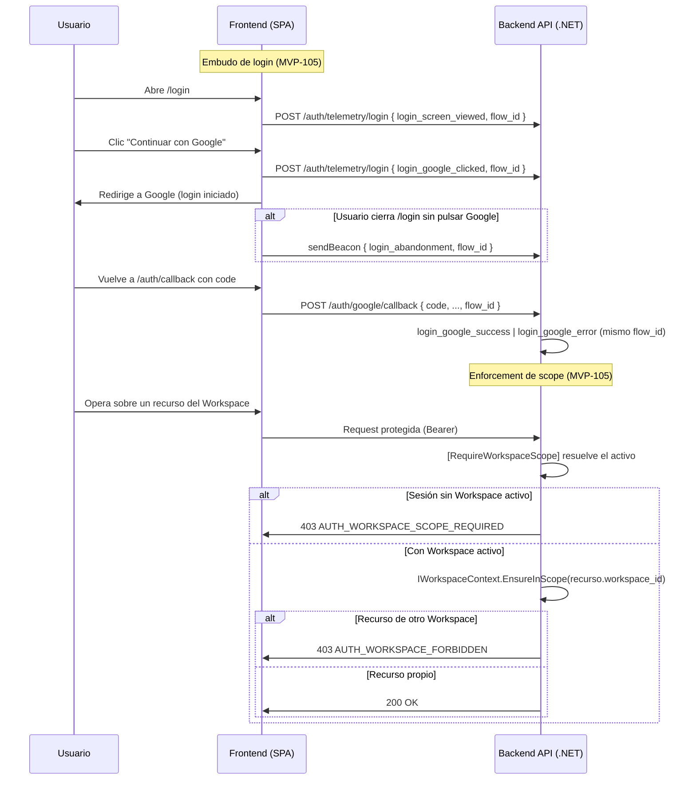

# TDD: MVP-105 — Autorización por Workspace y trazabilidad mínima de login

> **Referencia al spec**: [spec.md](./spec.md)

## Resumen técnico

Esta historia cierra el perímetro de seguridad del Hito A. Aporta dos piezas que el resto del MVP
da por hechas:

1. **Enforcement de ámbito de Workspace como primitiva reutilizable.** Hasta ahora cada controller
   que necesitaba contexto de Workspace resolvía el activo a mano y devolvía el 403 por su cuenta
   (patrón duplicado en `WorkspaceInvitationsController`). Se sustituye por una primitiva de primera
   clase: el atributo `[RequireWorkspaceScope]` resuelve el Workspace activo de la sesión, lo publica
   en `IWorkspaceContext` y corta con `403 AUTH_WORKSPACE_SCOPE_REQUIRED` cuando la sesión no tiene
   ninguno. El rechazo de un recurso ajeno se centraliza en `IWorkspaceContext.EnsureInScope`, que
   lanza un error de dominio traducido de forma uniforme a `403 AUTH_WORKSPACE_FORBIDDEN`. Así, las
   operaciones de negocio de MVP-002/003/004 (terrenos, temporadas, actividades…) heredan el
   enforcement marcando una anotación, sin volver a escribir el chequeo (CA-1, RN-034).
2. **Señal mínima del embudo de login.** El éxito y el error ya se emitían en servidor durante el
   intercambio con Google (MVP-101). Faltaban las señales que solo el cliente conoce: pantalla vista,
   clic en Google y abandono. Se añade un endpoint de ingesta (`POST /api/v1/auth/telemetry/login`)
   y la instrumentación del cliente, correlacionados por un `flow_id` aleatorio que viaja desde que
   se ve la pantalla hasta que el login termina. La traza no contiene PII (CA-2, CA-3, RN-020).

La **explotación** de esa telemetría (dimensiones completas, persistencia, alertado) es alcance
explícito de `MVP-601`; aquí se deja la señal emitida y correlacionable, que es la base de identidad.

## Diagrama de arquitectura / flujo



## Componentes afectados

| Componente | Tipo de cambio | Descripción |
| ---------- | -------------- | ----------- |
| `src/backend/.../Common/Workspaces/IWorkspaceContext.cs` | nuevo | Contrato de lectura del Workspace activo de la petición + `EnsureInScope` |
| `src/backend/.../Common/Workspaces/WorkspaceScopeContext.cs` | nuevo | Implementación scoped; el filtro la rellena, el resto la lee |
| `src/backend/.../Common/Workspaces/WorkspaceScopeFilter.cs` | nuevo | Resuelve el activo y corta con 401/403 antes de la acción |
| `src/backend/.../Common/Workspaces/RequireWorkspaceScopeAttribute.cs` | nuevo | Anotación (`IFilterFactory`) que aplica el filtro a un controller/acción |
| `src/backend/.../Common/Workspaces/WorkspaceAccessExceptionFilter.cs` | nuevo | Traduce `WorkspaceAccessDeniedException` a 403 `AUTH_WORKSPACE_FORBIDDEN` |
| `src/backend/.../Common/Errors/ApiError.cs` | modificado | Factorías `WorkspaceScopeRequired()` y `WorkspaceForbidden()` |
| `src/backend/.../Controllers/WorkspaceInvitationsController.cs` | modificado | Migrado a `[RequireWorkspaceScope]` + `IWorkspaceContext` (elimina el chequeo manual) |
| `src/backend/.../Controllers/WorkspacesController.cs` | modificado | `SetActive` se apoya en el filtro global de excepción (quita el try/catch) |
| `src/backend/.../Infrastructure/Telemetry/LoginFunnelEvents.cs` | nuevo | Nombres canónicos del embudo, allow-list de cliente y validación de `flow_id` |
| `src/backend/.../Infrastructure/Telemetry/LoginTelemetryService.cs` | modificado | Usa las constantes de `LoginFunnelEvents` en vez de literales |
| `src/backend/.../Controllers/AuthController.cs` | modificado | Endpoint de ingesta de telemetría + `flow_id` correlacionado en el callback |
| `src/backend/.../Program.cs` | modificado | Registro del contexto/filtro y del filtro global de excepción |
| `src/frontend/.../lib/login-telemetry.ts` | nuevo | Ciclo de vida del `flow_id` y flags del embudo en `sessionStorage` |
| `src/frontend/.../services/telemetry.service.ts` | nuevo | Emisión fire-and-forget de eventos (fetch keepalive / sendBeacon) |
| `src/frontend/.../components/auth/LoginPage.tsx` | modificado | Emite pantalla vista, clic en Google y abandono |
| `src/frontend/.../components/auth/OAuthCallback.tsx` | modificado | Pasa el `flow_id` al callback y cierra el intento al completar |
| `src/frontend/.../services/auth.service.ts` | modificado | `exchangeGoogleCode` envía `flow_id` |

## Diseño detallado

### Enforcement de ámbito de Workspace (CA-1)

**Primitiva.** El Workspace activo nunca viaja como parámetro de negocio: se resuelve en servidor
desde el claim `workspace_id` de la sesión (RN-034, coherente con MVP-102/103/104). La primitiva
tiene tres partes:

- `[RequireWorkspaceScope]` → `WorkspaceScopeFilter` (un `IAsyncActionFilter`): resuelve el activo con
  el **mismo** `IActiveWorkspaceResolver` que usa el resto de la API, lo deja en `WorkspaceScopeContext`
  y deja pasar. Antes de la acción corta con `401 AUTH_UNAUTHENTICATED` (sesión sin usuario) o
  `403 AUTH_WORKSPACE_SCOPE_REQUIRED` (usuario sin ningún Workspace activo).
- `IWorkspaceContext` (scoped): lo consumen controllers y handlers para leer `WorkspaceId` / `Workspace`
  ya resueltos. Expone `EnsureInScope(resourceWorkspaceId)`, el punto único donde una operación rechaza
  un recurso que no pertenece al Workspace activo.
- `WorkspaceAccessExceptionFilter` (global): traduce `WorkspaceAccessDeniedException` (dominio) a
  `403 AUTH_WORKSPACE_FORBIDDEN` sin que cada controller repita el try/catch.

**Superficie de aplicación hoy.** El MVP todavía no tiene endpoints de recursos operativos (terrenos,
temporadas… llegan en MVP-002+). La primitiva se aplica ya a `WorkspaceInvitationsController`, que
exige Workspace activo, y `EnsureInScope` queda disponible y probado para que esas historias lo usen
sin reescribir el enforcement. `WorkspacesController` (alta, listado y cambio de activo) **no** exige
scope: debe funcionar cuando el usuario aún no tiene Workspace (crear el primero, listar los suyos).

### Telemetría mínima del embudo de login (CA-2, CA-3)

**Eventos.** Se cubren los cinco eventos de la KB:

| Evento | Origen | Cómo |
| ------ | ------ | ---- |
| `login_screen_viewed` | cliente | Al montar `LoginPage` |
| `login_google_clicked` | cliente | Al pulsar "Continuar con Google" |
| `login_abandonment` | cliente | `pagehide` de `LoginPage` sin haber pulsado Google (sendBeacon) |
| `login_google_success` | servidor | Intercambio de código correcto (MVP-101) |
| `login_google_error` | servidor | Fallo del intercambio (MVP-101) |

**Correlación.** El cliente genera un `flow_id` aleatorio (16 bytes hex) al ver la pantalla y lo
guarda en `sessionStorage`. Sobrevive a la redirección a Google y vuelve en el callback, que lo pasa a
`POST /auth/google/callback`; el servidor usa **ese mismo** `flow_id` para `success`/`error`. Así el
embudo entero (visto → clic → éxito/abandono) queda unido bajo un único identificador.

**Autoridad servidor.** El endpoint de ingesta solo acepta los tres eventos de cliente
(`LoginFunnelEvents.ClientIngestable`). `success` y `error` se rechazan: son autoritativos del
servidor, de modo que un cliente no puede falsear conversión ni errores.

**Privacidad (CA-3, RN-020/RN-017).** La traza solo lleva nombre de evento, `flow_id` y `channel`.
Nunca email, token ni identificadores sensibles. El `flow_id` se valida a alfanumérico y longitud
acotada (`IsValidFlowId`): ni es PII ni permite inyectar contenido arbitrario en la traza. El logging
es estructurado (parámetros, no interpolación).

### API / Contratos

```yaml
# POST /api/v1/auth/telemetry/login   (AllowAnonymous)
# Ingesta de la señal de embudo originada en el cliente (MVP-105)
request:
  body:
    event: string      # login_screen_viewed | login_google_clicked | login_abandonment
    flow_id: string    # alfanumérico, <= 64 chars
responses:
  202: {}                                              # aceptado (fire-and-forget)
  400: { error: { code: "VALIDATION_REQUIRED" } }      # evento no ingestable o flow_id inválido

# POST /api/v1/auth/google/callback  — cambio aditivo
# Acepta un flow_id opcional para correlacionar success/error con el embudo del cliente
request:
  body:
    code: string
    redirect_uri: string
    code_verifier: string
    flow_id: string|null   # opcional; si falta, el servidor genera uno
```

Enforcement (transversal, se materializa en las operaciones de negocio de épicas siguientes):

| Situación | HTTP | Código |
| --------- | ---- | ------ |
| Operación que exige Workspace activo y la sesión no tiene ninguno | 403 | `AUTH_WORKSPACE_SCOPE_REQUIRED` |
| Recurso que no pertenece al Workspace activo | 403 | `AUTH_WORKSPACE_FORBIDDEN` |

### Manejo de errores

| Situación | HTTP | Código | Nota |
| --------- | ---- | ------ | ---- |
| Telemetría con `flow_id` inválido o evento no ingestable | 400 | `VALIDATION_REQUIRED` | Validación en el endpoint |
| Sesión sin usuario en una acción con scope | 401 | `AUTH_UNAUTHENTICATED` | Filtro de scope |
| Sesión sin Workspace activo en una acción con scope | 403 | `AUTH_WORKSPACE_SCOPE_REQUIRED` | Filtro de scope |
| Recurso de otro Workspace | 403 | `AUTH_WORKSPACE_FORBIDDEN` | `EnsureInScope` + filtro de excepción |

## Alternativas descartadas

| Alternativa | Por qué se descartó |
| ----------- | ------------------- |
| Repetir el chequeo de scope en cada controller (como hoy en invitaciones) | Duplica la regla de seguridad y se desincroniza; la primitiva la centraliza en un único punto auditable |
| Aceptar el `workspace_id` como parámetro de negocio para validar pertenencia | Rompe RN-034 y el patrón de la épica; el contexto viaja en el claim, nunca en la petición |
| Emitir todo el embudo (incluido éxito) desde el cliente | El cliente podría falsear conversión; éxito/error se mantienen autoritativos en servidor |
| Generar el `flow_id` en servidor | No permitiría correlacionar los eventos previos al callback (pantalla vista, clic, abandono) |
| Persistir y explotar la telemetría aquí | Es alcance explícito de `MVP-601`; MVP-105 solo emite la señal mínima correlacionable |
| Registrar hash de email para medir reincidencia | Innecesario para la señal mínima; se difiere a `MVP-601` con su análisis de privacidad |

## Riesgos e impacto

| Riesgo | Probabilidad | Mitigación |
| ------ | ------------ | ---------- |
| Una operación futura olvida `[RequireWorkspaceScope]` y queda sin ámbito | media | Primitiva única + `EnsureInScope`; se revisa en la guía de code-review de recursos nuevos |
| El abandono no se captura si el usuario cae en la pantalla de Google | baja | Es señal mínima; el abandono post-clic se cubrirá con la explotación completa de `MVP-601` |
| `sendBeacon` no soportado en algún navegador antiguo | baja | Degradación a `fetch` con `keepalive`; el fallo de telemetría nunca afecta al login |
| Fuga de PII en la traza | baja | Solo evento + `flow_id` validado + `channel`; logging estructurado; sin email/token |
| El refactor de invitaciones cambia el contrato | baja | Mismo código de error y flujo; cubierto por los tests existentes de invitaciones |

## Plan de testing

> Referencia: `docs/04-ingenieria/estrategia-testing.md`

- [x] Tests unitarios:
  - `WorkspaceScopeContext`: `EnsureInScope` permite el recurso propio y rechaza el ajeno; lectura
    sin resolver lanza
  - `WorkspaceScopeFilter`: 401 sin usuario, 403 `AUTH_WORKSPACE_SCOPE_REQUIRED` sin Workspace, y
    poblado del contexto + continuación cuando hay activo
  - `WorkspaceAccessExceptionFilter`: mapea el error de dominio a 403 `AUTH_WORKSPACE_FORBIDDEN` e
    ignora el resto de excepciones
  - `LoginFunnelEvents`: validación de `flow_id` y allow-list de cliente (excluye éxito/error)
  - `AuthController.LoginTelemetry`: acepta y emite los eventos de cliente; rechaza evento no
    ingestable y `flow_id` inválido
- [ ] Tests de integración: `POST /auth/telemetry/login` y enforcement de scope contra la app real,
  pendientes junto al resto de tests de integración de la épica (MVP-199)
- [ ] Tests E2E: embudo de login completo (visto → clic → éxito) y rechazo cross-Workspace, pendientes
  del sprint final

Resultado local: `dotnet test` en verde (99 tests, 24 nuevos), `npm run build` sin errores de
TypeScript y `npm run lint` sin advertencias nuevas.

## Checklist de implementación

- [x] Diseño técnico revisado
- [x] Primitiva de enforcement de scope implementada y aplicada a la superficie existente
- [x] Señal mínima del embudo de login emitida y correlacionada por `flow_id`, sin PII
- [x] Tests escritos y pasando
- [x] Documentación de API actualizada en este documento y en `docs/02-arquitectura/contratos-api.md`
- [ ] Módulo de Workspaces documentado en `docs/03-modulos/` (se consolidará al cerrar la épica en
  `MVP-199`, junto con el resto del bloque de identidad)
- [x] Sin `TODO` sin resolver en este documento
- [x] Puntos transversales detectados registrados en `MVP-999`
