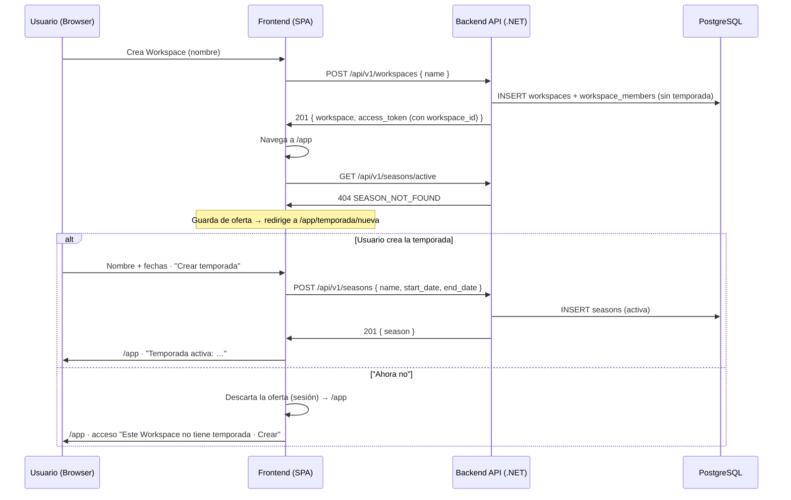

# TDD: MVP-201 — Onboarding inicial del Workspace y primera temporada

> **Referencia al spec**: [spec.md](./spec.md)

## Resumen técnico

Se introduce el agregado `Season` (temporada/campaña) y su tabla `seasons`. **No se crea ninguna
temporada por defecto** (decisión de producto, 2026-07-27): la temporada es siempre un acto
explícito y **cancelable** del usuario. La app la **ofrece** en dos momentos:

1. Justo después de crear un Workspace (primer acceso o Workspace adicional).
2. Al situarse en un Workspace activo que aún no tiene temporada (p. ej. al seleccionarlo).

La oferta se implementa con una **guarda de ruta** en el frontend: si el Workspace activo no tiene
temporada activa y el usuario no ha rechazado la oferta en esa sesión, se le lleva a la pantalla de
creación (con "Ahora no" para entrar sin crear). El backend expone el primer recurso con ámbito de
Workspace de la aplicación: `GET /seasons/active` y `POST /seasons`, protegidos con
`[RequireWorkspaceScope]` (MVP-105); el Workspace activo se resuelve en servidor (RN-034).

La regla de **una sola temporada activa por Workspace** (RN-022) se materializa como índice único
parcial en base de datos. El maestro completo de temporadas (alta de varias, edición, cierre,
listado y la máquina de estados `planificada/activa/cerrada`) es alcance de MVP-203.

## Diagrama de arquitectura / flujo



## Componentes afectados

| Componente | Tipo de cambio | Descripción |
| ---------- | -------------- | ----------- |
| `src/backend/.../Domain/Seasons/Season.cs` | nuevo | Agregado; `Season.Create` (temporada activa) con validaciones |
| `src/backend/.../Domain/Seasons/ISeasonRepository.cs` | nuevo | Puerto (add, temporada activa por Workspace) |
| `src/backend/.../Domain/Seasons/SeasonValidationException.cs` | nuevo | Error de validación de temporada |
| `src/backend/.../Domain/Seasons/SeasonConflictException.cs` | nuevo | Conflicto: ya existe temporada activa (RN-022) |
| `src/backend/.../Infrastructure/Data/Repositories/SeasonRepository.cs` | nuevo | Adaptador EF Core |
| `src/backend/.../Infrastructure/Data/Migrations/*_AddSeasons.cs` | nuevo | Crea `seasons` con el índice único parcial de temporada activa |
| `src/backend/.../Infrastructure/Data/TerrenarioDbContext.cs` | modificado | Mapeo de `Season` (`ux_seasons_workspace_active`) |
| `src/backend/.../Application/Seasons/GetActiveSeasonHandler.cs` | nuevo | Consulta de temporada activa |
| `src/backend/.../Application/Seasons/CreateSeasonHandler.cs` | nuevo | Crea la (primera) temporada activa; 409 si ya hay |
| `src/backend/.../Application/Seasons/Commands/SeasonCommands.cs` | nuevo | `SeasonSummary`, `CreateSeasonCommand` |
| `src/backend/.../Controllers/SeasonsController.cs` | nuevo | `GET /seasons/active`, `POST /seasons` con `[RequireWorkspaceScope]` |
| `src/backend/.../Common/Errors/{ErrorCodes,ApiError}.cs` | modificado | Códigos de temporada (`SEASON_NOT_FOUND`, `BUSINESS_RULE_SEASON_ALREADY_ACTIVE`, `VALIDATION_*_SEASON_*`) |
| `src/backend/.../Program.cs` | modificado | Registro de `ISeasonRepository` y handlers de temporada |
| `src/frontend/.../types/season.types.ts` | nuevo | Tipos de temporada |
| `src/frontend/.../services/season.service.ts` | nuevo | Cliente HTTP (`getActiveSeason`, `createSeason`) |
| `src/frontend/.../contexts/SeasonContext.tsx` | nuevo | Temporada activa del Workspace + oferta cancelable (dismiss por sesión) |
| `src/frontend/.../components/onboarding/SeasonSetupPage.tsx` | nuevo | Pantalla de creación de temporada (oferta cancelable) |
| `src/frontend/.../App.tsx` | modificado | `SeasonProvider`, guarda `RequireSeasonOffer`, ruta `/app/temporada/nueva`; Home queda como bienvenida (el estado de temporada vive en la cabecera) |
| `src/frontend/.../components/layout/AppTopbar.tsx` | modificado | Píldora de temporada activa + Workspace en la cabecera (fiel al `TopNavbar` del prototipo); sin temporada, ofrece crearla |
| `src/frontend/.../components/onboarding/CreateWorkspacePage.tsx` | modificado | Tras crear entra a `/app`; retira el indicador "Paso X de Y" (resuelve P-010) |

## Diseño detallado

### Modelo de datos

Alineado con `docs/02-arquitectura/modelo-de-datos.md` (entidad `SEASON`). La migración crea la tabla
`seasons`:

```sql
CREATE TABLE seasons (
    id           UUID PRIMARY KEY,
    workspace_id UUID NOT NULL REFERENCES workspaces(id) ON DELETE CASCADE,
    name         VARCHAR(120) NOT NULL,
    start_date   DATE NOT NULL,
    end_date     DATE,                 -- estimada, opcional
    is_active    BOOLEAN NOT NULL,
    is_closed    BOOLEAN NOT NULL,
    created_at   TIMESTAMPTZ NOT NULL,
    updated_at   TIMESTAMPTZ NOT NULL
);

-- RN-022 / CA-3 — una sola temporada activa por Workspace, garantizada por la BD
CREATE UNIQUE INDEX ux_seasons_workspace_active ON seasons (workspace_id) WHERE is_active;
```

Notas de diseño:

- **Estados con booleanos canónicos.** El modelo canónico define `is_closed` (RN-024). Para RN-022
  se añade `is_active` (convención `is_`). MVP-203 podrá derivar los estados
  `planificada/activa/cerrada` sobre estos dos booleanos sin cambiar el esquema.
- **`active_crop` diferido.** Reservado para la evolución por cultivo (RU-18/RU-19); en MVP rige
  "una activa por Workspace" (RN-022), así que no se materializa todavía (ver MVP-999, P-017).
- El índice único parcial cubre además la consulta de temporada activa (`workspace_id` + `is_active`).

### API / Contratos

```yaml
# GET /api/v1/seasons/active   [RequireWorkspaceScope]
responses:
  200: { id, name, start_date, end_date, is_active, is_closed }
  403: { error: { code: "AUTH_WORKSPACE_SCOPE_REQUIRED" } }
  404: { error: { code: "SEASON_NOT_FOUND" } }        # el Workspace aún no tiene temporada

# POST /api/v1/seasons   [RequireWorkspaceScope]
request:
  body: { name: string(1..120), start_date: date, end_date: date|null }
responses:
  201: { ...season }                                   # temporada activa creada
  400: { error: { code: "VALIDATION_REQUIRED" | "VALIDATION_SEASON_DATE_RANGE" | "VALIDATION_SEASON_NAME_LENGTH" } }
  403: { error: { code: "AUTH_WORKSPACE_SCOPE_REQUIRED" } }
  409: { error: { code: "BUSINESS_RULE_SEASON_ALREADY_ACTIVE" } }   # ya hay activa (gestionar varias = MVP-203)
```

`POST /api/v1/workspaces` (MVP-102) **no cambia** y **no** crea temporada.

### Lógica de negocio

- **Sin default.** `CreateWorkspaceHandler` no crea temporada; el Workspace nace sin temporada.
- **Creación (oferta).** `CreateSeasonHandler` crea la temporada activa del Workspace activo si aún
  no tiene ninguna; si ya hay una activa, lanza `SeasonConflictException` → 409 (RN-022). Valida
  nombre (obligatorio, ≤120) y `end_date ≥ start_date`.
- **Oferta cancelable (frontend).** `SeasonContext` carga la temporada activa por Workspace.
  `RequireSeasonOffer` redirige a `/app/temporada/nueva` cuando no hay temporada y la oferta no se
  ha rechazado en la sesión. "Ahora no" marca la oferta como descartada (en memoria, por Workspace)
  y entra a `/app`, donde queda un acceso "Este Workspace no tiene temporada · Crear". Esto cubre por
  igual Workspaces nuevos y **Workspaces preexistentes** sin temporada (cierra el hueco sin backfill).
- **Continuidad (CA-2).** El Home muestra la temporada activa; deja listo el terreno para la
  autoselección operativa (RN-021) de MVP-003/004.

### Manejo de errores

| Situación | HTTP | Código | Nota |
| --------- | ---- | ------ | ---- |
| Sesión sin Workspace activo | 403 | `AUTH_WORKSPACE_SCOPE_REQUIRED` | Filtro de scope (MVP-105) |
| Nombre vacío / solo espacios | 400 | `VALIDATION_REQUIRED` | `RequiredAttribute` recorta espacios en el borde de modelo |
| Nombre > 120 | 400 | `VALIDATION_SEASON_NAME_LENGTH` | Dominio; el input del cliente ya limita a 120 |
| `end_date` < `start_date` | 400 | `VALIDATION_SEASON_DATE_RANGE` | Validado en el agregado |
| Workspace sin temporada activa (GET) | 404 | `SEASON_NOT_FOUND` | Señal de "ofrecer creación", no es un fallo |
| Ya existe temporada activa (POST) | 409 | `BUSINESS_RULE_SEASON_ALREADY_ACTIVE` | Gestionar varias es MVP-203 |

## Alternativas descartadas

| Alternativa | Por qué se descartó |
| ----------- | ------------------- |
| Crear una temporada por defecto al crear el Workspace | Decisión de producto: la temporada debe ser un acto explícito y cancelable, no un dato impuesto |
| Backfill de temporada a los Workspaces preexistentes | Innecesario: la misma oferta (al activar un Workspace sin temporada) los cubre, sin datos automáticos |
| Paso 2 fijo del asistente con indicador "Paso X de Y" | La temporada es una oferta cancelable, no un paso obligado; el contador confundía (P-010) |
| `status` enum `planificada/activa/cerrada` ya en MVP-201 | Adelanta la máquina de estados de MVP-203; se usan booleanos canónicos derivables |
| Aceptar `workspace_id`/`season_id` del cliente | El ámbito se resuelve en servidor (MVP-105); el cliente no elige el recurso |

## Riesgos e impacto

| Riesgo | Probabilidad | Mitigación |
| ------ | ------------ | ---------- |
| Doble temporada activa por una regla mal aplicada | baja | Índice único parcial en BD (`ux_seasons_workspace_active`) + 409 en el handler |
| Solape de alcance con MVP-203 (alta/edición de temporadas) | media | `POST /seasons` se limita a crear la primera activa; MVP-203 lo generaliza (MVP-999, P-017) |
| Oferta insistente al recargar tras "Ahora no" | baja | Se reofrece por sesión (aceptable: "ofrecer al seleccionar"); hay acceso manual en el Home |
| Mock que no ve la traducción SQL del índice/consulta | media | Test SQLite real que ejercita la consulta y la invariante de única activa |

## Plan de testing

> Referencia: `docs/04-ingenieria/estrategia-testing.md`

- [x] Tests unitarios:
  - `Season`: creación (activa/abierta), Workspace inválido, normalización de nombre, nombre
    vacío/largo, fecha fin opcional y rango inválido.
  - `CreateSeasonHandler`: crea cuando no hay temporada; 409 si ya hay activa; no persiste ante rango
    inválido.
  - `CreateWorkspaceHandler`: no persiste nada ante nombre de Workspace inválido (sin temporada).
- [x] Tests contra SQLite real (`SeasonRepositorySqliteTests`): consulta de temporada activa e
  **invariante RN-022** (segunda activa rechazada por el índice único parcial).
- [x] Verificación end-to-end real (API en :5127 + PostgreSQL + UI conducida en :5173):
  - `POST /workspaces` **no** crea temporada (`GET /seasons/active` → 404; 0 filas en BD).
  - `POST /seasons` → 201 (nombre acentuado UTF-8 persistido); `POST` de nuevo → 409;
    `end_date < start_date` → 400.
  - UI: crear Workspace → guarda ofrece `/app/temporada/nueva` (sugerencias de cliente) →
    "Crear temporada" → `/app`; "Ahora no" → `/app` sin crear; verificado en BD (Workspace con 0
    temporadas tras "Ahora no").
  - Cabecera (`AppTopbar`): con temporada, píldora verde con punto pulsante «Campaña …» + `•
    Workspace`; sin temporada, píldora "Sin temporada · Crear" que abre la oferta. Verificado por UI
    conducida en ambos estados.
- [ ] Tests de integración contra PostgreSQL de todos los endpoints: pendientes del arnés común (MVP-501).

Resultado local: `dotnet test` en verde (141 tests); `npm run build` y `npm run lint` sin errores nuevos.

## Checklist de implementación

- [x] Diseño técnico revisado
- [x] Migración de base de datos preparada (`AddSeasons`, índice único parcial)
- [x] Tests escritos y pasando
- [x] Documentación de API actualizada en este documento
- [x] Modelo de datos actualizado (`SEASON` con `is_active`; estado de implementación)
- [x] Módulo de Temporadas documentado en `docs/03-modulos/` — consolidado en `MVP-716` dentro de `maestros-operativos`
- [x] Puntos fuera de alcance registrados en MVP-999
- [x] Sin `TODO` sin resolver en este documento
