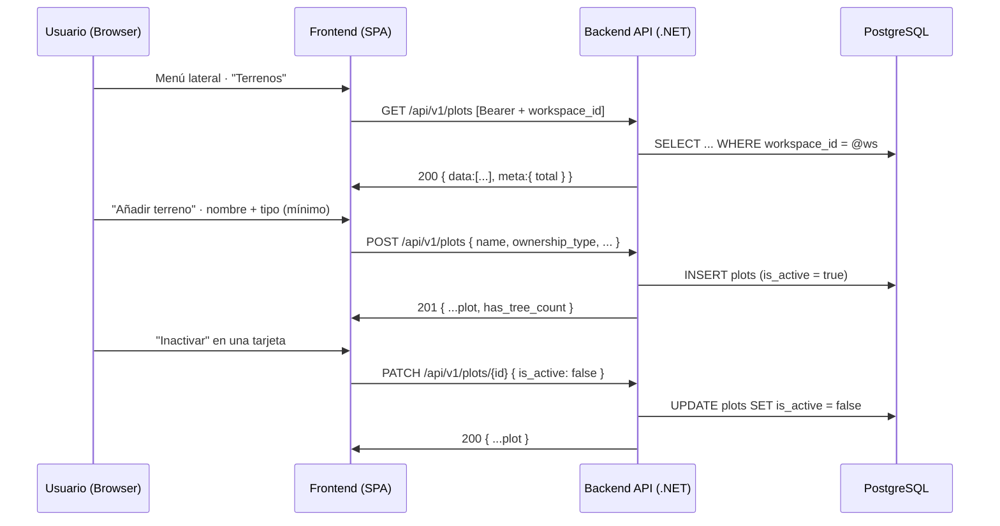

# TDD: MVP-202 — Maestro de terrenos con alta mínima

> **Referencia al spec**: [spec.md](./spec.md)

## Resumen técnico

Se introduce el agregado `Plot` (terreno/parcela) y su tabla `plots`, primer maestro operativo del
producto. El terreno es la unidad base de todo registro operativo del MVP (RN-001). El alta es
**mínima** (RN-028): solo `name` y `ownership_type` son obligatorios; el resto de campos (`alias`,
`owner_name`, `cadastral_reference`, `location`, `tree_count`) son opcionales e informativos y pueden
completarse después sin bloquear el uso del terreno (CA-1/CA-2). La ausencia de `tree_count` no
bloquea nada aquí: se marca como dato incompleto para el dashboard (RN-010).

Los terrenos con histórico se **inactivan**, no se borran (CA-3): la inactivación es un cambio de
estado reversible sobre `is_active`, que preserva la integridad de los registros que en épicas
posteriores referenciarán el terreno.

`plots` es el **primer recurso con ámbito de Workspace consumido con CRUD por la UI**. Por eso esta
historia estrena el **cliente HTTP común** del frontend con manejo centralizado de 401/403 de scope,
deuda que la KB tenía diferida explícitamente a MVP-202 (MVP-999, **P-007** y **P-018**). El endpoint
se protege con `[RequireWorkspaceScope]` (MVP-105): el Workspace activo se resuelve en servidor y
nunca viaja como parámetro (RN-034).

### Decisiones de producto tomadas en esta historia

- **`ownership_type` es un catálogo cerrado `{propia, cedida}`** (decisión con el PO). La visión de
  producto define el terreno como «propio o cedido»; RN-028 lo hace obligatorio pero la KB no tenía
  catálogo formal. Se formaliza `plot_ownership_type` en `contratos-api.md` y se valida en el dominio.
- **Alcance del cliente HTTP común**: se crea el cliente compartido y se usa en el nuevo servicio de
  terrenos y en `season.service` (ambos recursos *scoped*, cerrando P-018). Los servicios de
  auth/workspace/invitation se mantienen (ruta crítica de login) y su migración queda como mejora
  incremental, no como deuda bloqueante.

## Diagrama de flujo



## Componentes afectados

| Componente | Tipo de cambio | Descripción |
| ---------- | -------------- | ----------- |
| `src/backend/.../Domain/Plots/Plot.cs` | nuevo | Agregado; `Create`/`Update`/`SetActive` con validaciones (RN-028) |
| `src/backend/.../Domain/Plots/PlotOwnershipTypes.cs` | nuevo | Catálogo cerrado `{propia, cedida}` |
| `src/backend/.../Domain/Plots/PlotValidationException.cs` | nuevo | Error de validación con código de contrato |
| `src/backend/.../Domain/Plots/FieldUpdate.cs` | nuevo | Presencia de campo para el PATCH parcial (ausente ≠ null) |
| `src/backend/.../Domain/Plots/IPlotRepository.cs` | nuevo | Puerto (add, find-by-id-en-workspace, list con filtros) |
| `src/backend/.../Infrastructure/Data/Repositories/PlotRepository.cs` | nuevo | Adaptador EF Core (aislamiento por Workspace, filtros) |
| `src/backend/.../Infrastructure/Data/Migrations/*_AddPlots.cs` | nuevo | Crea `plots` + índice `(workspace_id, is_active)` |
| `src/backend/.../Infrastructure/Data/TerrenarioDbContext.cs` | modificado | Mapeo de `Plot` + `DbSet` |
| `src/backend/.../Application/Plots/{Create,Update,List}PlotHandler.cs` | nuevo | Casos de uso |
| `src/backend/.../Application/Plots/Commands/PlotCommands.cs` | nuevo | `PlotSummary`, `CreatePlotCommand`, `UpdatePlotCommand` |
| `src/backend/.../Controllers/PlotsController.cs` | nuevo | `GET/POST/PATCH /plots` con `[RequireWorkspaceScope]` |
| `src/backend/.../Common/Errors/{ErrorCodes,ApiError}.cs` | modificado | Códigos de terreno |
| `src/backend/.../Program.cs` | modificado | Registro de `IPlotRepository` y handlers |
| `src/frontend/.../services/http-client.ts` | nuevo | Cliente HTTP común (P-007/P-018): token + 401/403 de scope |
| `src/frontend/.../contexts/ApiContext.tsx` | nuevo | Provee el cliente cableado con las reacciones globales de sesión |
| `src/frontend/.../services/plot.service.ts` | nuevo | Servicio del maestro sobre el cliente común |
| `src/frontend/.../services/season.service.ts` | modificado | Migrado al cliente común (P-018) |
| `src/frontend/.../contexts/SeasonContext.tsx` | modificado | Consume el cliente común |
| `src/frontend/.../components/onboarding/SeasonSetupPage.tsx` | modificado | Captura `HttpError` en vez del error propio del servicio |
| `src/frontend/.../types/plot.types.ts` | nuevo | Tipos de terreno + catálogo de propiedad |
| `src/frontend/.../components/plots/TerrenosView.tsx` | nuevo | Vista maestro: listado, búsqueda, filtro de inactivos |
| `src/frontend/.../components/plots/PlotFormModal.tsx` | nuevo | Alta y edición (refleja el alta mínima) |
| `src/frontend/.../App.tsx` | modificado | `ApiProvider`, ruta `/app/terrenos` |
| `src/frontend/.../components/layout/AppSidebar.tsx` | modificado | Enciende la entrada "Terrenos" del menú |

## Diseño detallado

### Modelo de datos

Alineado con `docs/02-arquitectura/modelo-de-datos.md` (entidad `PLOT`). La migración crea `plots`:

```sql
CREATE TABLE plots (
    id                  UUID PRIMARY KEY,
    workspace_id        UUID NOT NULL REFERENCES workspaces(id) ON DELETE CASCADE,
    name                VARCHAR(150) NOT NULL,
    ownership_type      VARCHAR(20)  NOT NULL,   -- catálogo plot_ownership_type
    alias               VARCHAR(60),
    owner_name          VARCHAR(150),
    cadastral_reference VARCHAR(50),
    location            VARCHAR(200),            -- texto libre (sin coordenadas en MVP)
    tree_count          INTEGER,                 -- opcional (RN-028); ausente = dato incompleto (RN-010)
    is_active           BOOLEAN NOT NULL,
    created_at          TIMESTAMPTZ NOT NULL,
    updated_at          TIMESTAMPTZ NOT NULL
);

CREATE INDEX "IX_plots_workspace_id_is_active" ON plots (workspace_id, is_active);
```

Notas de diseño y **divergencias con el modelo canónico** (documentadas como corrección; ver P-019):

- **`is_active` añadido.** El modelo canónico de `PLOT` no incluía `is_active`, pero CA-3 y el
  contrato (`GET /plots?is_active`) lo exigen. Se añade con la convención `is_` del modelo de datos.
- **`location` (texto libre) en vez de `latitude`/`longitude`.** El spec pide «ubicación» opcional y
  deja fuera de alcance mapas y coordenadas; el contrato de API usa `location?`. Se implementa un
  campo de texto libre y **no** se materializan `latitude`/`longitude` del ER canónico.
- **`soil_metadata` (JSONB) diferido.** No entra en el alta mínima ni en el contrato de `POST /plots`;
  se pospone a una historia posterior (queda en P-019).

### API / Contratos

```yaml
# GET /api/v1/plots   [RequireWorkspaceScope]
query: { search?: string, is_active?: boolean }
responses:
  200: { data: [ { id, workspace_id, name, ownership_type, alias, owner_name,
                   cadastral_reference, location, tree_count, is_active, has_tree_count } ],
         meta: { total } }
  403: { error: { code: "AUTH_WORKSPACE_SCOPE_REQUIRED" } }

# POST /api/v1/plots   [RequireWorkspaceScope]
request: { name*, ownership_type*, alias?, owner_name?, cadastral_reference?, location?, tree_count? }
responses:
  201: { ...plot }
  400: { error: { code: "VALIDATION_REQUIRED" | "VALIDATION_REQUIRED_NAME"
                        | "VALIDATION_PLOT_OWNERSHIP_TYPE_INVALID" | "VALIDATION_RANGE_TREE_COUNT" | ... } }
  403: { error: { code: "AUTH_WORKSPACE_SCOPE_REQUIRED" } }

# PATCH /api/v1/plots/{plotId}   [RequireWorkspaceScope]   (campos parciales)
request: cualquier subconjunto de { name, ownership_type, alias, owner_name,
                                    cadastral_reference, location, tree_count, is_active }
responses:
  200: { ...plot }
  400: { error: { code: "VALIDATION_*" } }
  404: { error: { code: "RESOURCE_NOT_FOUND" } }   # no existe en el Workspace activo (también aislamiento)
```

**PATCH parcial de verdad.** El cuerpo se lee con presencia de campo (`FieldUpdate<T>`): un campo
ausente **conserva** su valor y uno presente (incluido vacío) lo asigna/limpia. Esto evita que un
PATCH que solo cambia `is_active` borre los datos opcionales. `has_tree_count` es una señal derivada
para que la UI marque el dato incompleto de `tree_count` (RN-010) sin lógica de negocio en cliente.

### Lógica de negocio

- **Alta (`CreatePlotHandler`).** Crea el terreno con `Plot.Create`. Solo exige `name` y
  `ownership_type` válido; el resto se normaliza (recorte; cadena vacía ≡ ausente). Nace `is_active`.
- **Edición (`UpdatePlotHandler`).** Busca el terreno acotado al Workspace (`FindByIdAsync`), aplica
  el *merge* parcial contra los valores actuales y persiste. Si no existe en el Workspace → `null` →
  404 (no revela terrenos de otros Workspaces; refuerza el aislamiento además de `EnsureInScope`).
- **Inactivación (CA-3).** `SetActive(false)` vía el mismo PATCH; reversible con `SetActive(true)`.
- **Listado (`ListPlotsHandler`).** Filtra por Workspace, por `is_active` y por texto
  (nombre/alias/ubicación). Orden estable: activos primero y luego por nombre (ordena por columnas
  reales antes de proyectar, lección de P-014).

### Cliente HTTP común (P-007 / P-018)

`createHttpClient` centraliza base URL, cabecera `Authorization` (con el token vigente y su
refresco), parseo del error de contrato y la reacción a errores de ámbito de Workspace:

| Código | HTTP | Reacción global |
| ------ | ---- | --------------- |
| `AUTH_UNAUTHENTICATED` | 401 | Cerrar sesión |
| `AUTH_WORKSPACE_SCOPE_REQUIRED` | 403 | Volver al onboarding (resolver Workspace) |
| `AUTH_WORKSPACE_FORBIDDEN` | 403 | Resincronizar el contexto de Workspace |

`ApiProvider` construye el cliente con esos handlers (bajo `Auth`/`Workspace`/`Router`) y lo expone
con `useApiClient`. Lo consumen `plot.service` y `season.service`.

## Alternativas descartadas

| Alternativa | Por qué se descartó |
| ----------- | ------------------- |
| `ownership_type` como texto libre | Pierde normalización para futuros filtros/KPIs; la visión lo define como binario propio/cedido |
| `latitude`/`longitude` del ER canónico | Fuera de alcance (mapas/coordenadas); el spec y el contrato piden `location` de texto libre |
| Borrado físico de terrenos | El histórico rompería integridad; el MVP inactiva (CA-3) |
| PATCH "PUT-style" (reenviar todo) | **Bug detectado en verificación real**: un PATCH parcial borraba los opcionales. Se implementa PATCH parcial con presencia de campo |
| Migrar ya todos los servicios al cliente común | Toca la ruta crítica de login; se limita a los recursos *scoped* (plots + seasons), que es lo que P-007/P-018 pedían |
| Modal de detalle con histórico (prototipo `TerrenoDetailModal`) | Su contenido (cosechas/labores) depende de datos de MVP-003/004; se difiere (P-019) |

## Riesgos e impacto

| Riesgo | Probabilidad | Mitigación |
| ------ | ------------ | ---------- |
| Fuga de datos entre Workspaces | baja | Todo se filtra por `workspace_id`; `FindByIdAsync` acota por Workspace (404 cruzado); `[RequireWorkspaceScope]` |
| Pérdida de datos en edición parcial | baja | PATCH con presencia de campo + test de regresión + verificación real en BD |
| Mock que no ve la traducción SQL de filtros | media | Tests SQLite reales de listado, filtros y aislamiento (lección P-014) |
| Divergencia con el modelo canónico | media | Corregido y documentado aquí; punto P-019 para reconciliar la doc del ER |

## Plan de testing

> Referencia: `docs/04-ingenieria/estrategia-testing.md`

- [x] Tests unitarios de dominio (`PlotTests`): alta mínima, normalización, nombre vacío/largo, tipo
  vacío/fuera de catálogo, `tree_count` negativo, Workspace inválido, edición e inactivación.
- [x] Tests de handlers (`CreatePlotHandlerTests`, `UpdatePlotHandlerTests`): alta+persistencia, no
  persistir con tipo inválido, 404 fuera de Workspace, edición, y **regresión de PATCH parcial**
  (inactivar no borra los campos omitidos).
- [x] Tests contra SQLite real (`PlotRepositorySqliteTests`): aislamiento por Workspace, filtros de
  estado/búsqueda, orden, y `FindByIdAsync` que no cruza Workspaces.
- [x] Verificación end-to-end real (API :5127 + PostgreSQL + UI conducida :5173):
  - `POST` alta mínima (`name`+`ownership_type`) → 201; alta completa con acentos UTF-8 persistida.
  - Validaciones: sin tipo → 400; tipo fuera de catálogo → `VALIDATION_PLOT_OWNERSHIP_TYPE_INVALID`;
    `tree_count` negativo → `VALIDATION_RANGE_TREE_COUNT`.
  - `PATCH` edición (200), `PATCH { is_active:false }` inactiva **sin borrar** opcionales (verificado
    en BD), `PATCH { alias:"" }` limpia solo el alias, `PATCH` inexistente/cruzado → 404.
  - `GET ?is_active=true` excluye inactivos; `GET ?search=` filtra; orden activos primero.
  - UI conducida: alta desde el formulario (con aviso de dato incompleto por `tree_count`),
    inactivar/reactivar desde la tarjeta y editar (el aviso desaparece al añadir árboles). Sin
    errores de consola.
- [ ] Tests de integración contra PostgreSQL de todos los endpoints: pendientes del arnés común (MVP-501).

Resultado local: `dotnet test` en verde (160 tests); `npm run build` y `npm run lint` sin errores nuevos.

## Checklist de implementación

- [x] Diseño técnico revisado
- [x] Migración de base de datos preparada (`AddPlots`)
- [x] Tests escritos y pasando
- [x] Documentación de API actualizada (contrato + catálogo `plot_ownership_type`)
- [x] Modelo de datos actualizado (`PLOT` con `is_active`; estado de implementación; divergencias)
- [x] Cliente HTTP común (P-007/P-018) implementado y usado por los recursos *scoped*
- [x] Puntos fuera de alcance registrados en MVP-999 (P-007/P-018 resueltos; P-019 nuevo)
- [x] Sin `TODO` sin resolver en este documento
```
