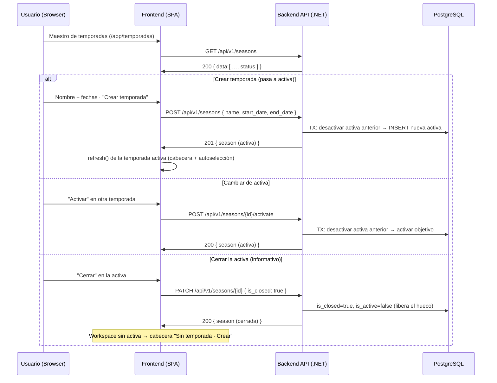

# TDD: MVP-203 — Maestro de temporadas y regla de única activa

> **Referencia al spec**: [spec.md](./spec.md)

## Resumen técnico

MVP-201 introdujo el agregado `Season` con la creación de la (primera) temporada activa. MVP-203 lo
completa como **maestro**: listado, alta de varias, edición, la máquina de estados
`planificada/activa/cerrada` y el **cambio de temporada activa** (RN-022, una sola activa por
Workspace).

No hay **cambio de esquema**: la máquina de estados se **deriva** de los dos booleanos canónicos
`is_active`/`is_closed` de MVP-201 (mapeo ya propuesto en `modelo-de-datos.md`), y la invariante de
una sola activa la siguen garantizando el índice único parcial `ux_seasons_workspace_active` y la
lógica de aplicación. `active_crop` (evolución por cultivo RU-18/RU-19) **permanece diferido** porque
en MVP rige "una activa por Workspace" (decisión (c) de P-017).

Dos decisiones de producto (validadas con el PO) fijan el comportamiento del maestro:

- **Crear cambia la activa.** Una temporada nueva pasa a ser la activa del Workspace, desbancando a la
  anterior (que queda `planificada`). La primera temporada de un Workspace (sin ninguna activa)
  simplemente nace activa, preservando el onboarding de MVP-201. Esto **generaliza** el `POST /seasons`
  de MVP-201, que devolvía `409` si ya había activa: ese `409` **desaparece** (y con él
  `SeasonConflictException` y el código `BUSINESS_RULE_SEASON_ALREADY_ACTIVE`).
- **Cerrar la activa libera el hueco.** Cerrar la temporada activa la marca `cerrada` (informativo,
  RN-024) y la desactiva; el Workspace queda sin temporada activa y la UI ofrece activar otra o crear
  una nueva (coherente con la oferta cancelable de MVP-201). Reabrir devuelve a `planificada`.

RN-023 (fecha de registro fuera del rango de la temporada, permitida con aviso) **no** se materializa
aquí: el maestro solo guarda las fechas con flexibilidad; el aviso no bloqueante pertenece a las
historias operativas (MVP-003/004), como indica el propio spec.

## Diagrama de arquitectura / flujo



## Componentes afectados

| Componente | Tipo de cambio | Descripción |
| ---------- | -------------- | ----------- |
| `Domain/Seasons/Season.cs` | modificado | Estado derivado `Status`; transiciones `UpdateDetails`/`Activate`/`Close`/`Reopen` |
| `Domain/Seasons/SeasonStatus.cs` | nuevo | Enum derivado `planificada/activa/cerrada` |
| `Domain/Seasons/ISeasonRepository.cs` | modificado | `FindByIdAsync`, `ListByWorkspaceAsync`, `ActivateExclusivelyAsync` |
| `Domain/Seasons/SeasonConflictException.cs` | eliminado | El `409` de "ya hay activa" desaparece (crear cambia la activa) |
| `Common/FieldUpdate.cs` | movido | `FieldUpdate<T>` reubicado de `Domain/Plots` a `Common` (helper transversal de PATCH) |
| `Infrastructure/Data/Repositories/SeasonRepository.cs` | modificado | Listado ordenado, búsqueda por id y cambio de activa transaccional |
| `Application/Seasons/ListSeasonsHandler.cs` | nuevo | Listado del maestro |
| `Application/Seasons/UpdateSeasonHandler.cs` | nuevo | Edición parcial + cierre/reapertura |
| `Application/Seasons/ActivateSeasonHandler.cs` | nuevo | Cambio de temporada activa |
| `Application/Seasons/CreateSeasonHandler.cs` | modificado | Crear pasa a activa (desbanca), sin `409` |
| `Application/Seasons/Commands/SeasonCommands.cs` | modificado | `SeasonSummary.Status`, `UpdateSeasonCommand` |
| `Controllers/SeasonsController.cs` | modificado | `GET /seasons`, `PATCH /seasons/{id}`, `POST /seasons/{id}/activate`; `status` en respuesta |
| `Common/Errors/{ErrorCodes,ApiError}.cs` | modificado | Retira `SEASON_ALREADY_ACTIVE`; añade `SeasonNotFoundById` |
| `Program.cs` | modificado | Registro de los handlers `List/Update/Activate` |
| `types/season.types.ts` | modificado | `status`, `SeasonStatus`, `UpdateSeasonPayload`, `SeasonListResponse` |
| `services/season.service.ts` | modificado | `listSeasons`, `updateSeason`, `activateSeason` |
| `contexts/SeasonContext.tsx` | modificado | `refresh()` (resincroniza la activa tras acciones del maestro) |
| `components/seasons/TemporadasView.tsx` | nuevo | Maestro (listado, alta, editar, activar, cerrar/reabrir) |
| `components/seasons/SeasonFormModal.tsx` | nuevo | Alta/edición (avisa del cambio de activa al crear) |
| `App.tsx` | modificado | Ruta `/app/temporadas` dentro del shell pero **fuera** de la guarda de oferta |
| `components/layout/AppSidebar.tsx` | modificado | "Temporadas" pasa de "Pronto" a enlace `/app/temporadas` |
| `components/layout/AppLayout.tsx` | modificado | Título contextual de Temporadas/Terrenos |

## Diseño detallado

### Modelo de datos

Sin migración. El esquema de `seasons` (MVP-201) ya tiene `is_active`/`is_closed` y el índice único
parcial. La máquina de estados es un valor **derivado** (no persistido):

| Estado | Derivación | Semántica |
| ------ | ---------- | --------- |
| `cerrada` | `is_closed` | Informativo (RN-024); no bloquea altas ni ediciones |
| `activa` | `is_active` y no cerrada | La temporada operativa (RN-021/RN-022). Solo una por Workspace |
| `planificada` | ni activa ni cerrada | Preparada pero no en uso |

Las transiciones mantienen la invariante "activa ⇒ no cerrada" (`Close` desactiva; `Activate` reabre),
de modo que los tres estados son mutuamente excluyentes.

### API / Contratos

```yaml
# GET /api/v1/seasons                 [RequireWorkspaceScope]
200: { data: [ { id, workspace_id, name, start_date, end_date, is_active, is_closed, status } ], meta: { total } }

# GET /api/v1/seasons/active          [RequireWorkspaceScope]
200: { ...season }
404: { error: { code: "SEASON_NOT_FOUND" } }        # el Workspace no tiene activa (señal de oferta)

# POST /api/v1/seasons                [RequireWorkspaceScope]
body: { name: string(1..120), start_date: date, end_date: date|null }
201: { ...season }                                   # nace activa; desbanca a la anterior si la había
400: { code: "VALIDATION_REQUIRED" | "VALIDATION_SEASON_DATE_RANGE" | "VALIDATION_SEASON_NAME_LENGTH" }

# PATCH /api/v1/seasons/{id}          [RequireWorkspaceScope]   (campos parciales)
body: { name?, start_date?, end_date?, is_closed? }
200: { ...season }
400: { code: "VALIDATION_*_SEASON_*" }
404: { code: "SEASON_NOT_FOUND" }                    # no existe en el Workspace activo

# POST /api/v1/seasons/{id}/activate  [RequireWorkspaceScope]
200: { ...season (activa) }                          # desbanca a la anterior (RN-022)
404: { code: "SEASON_NOT_FOUND" }
```

El cambio de temporada activa **no** va por `PATCH` (`is_active`): es una acción propia
(`/activate`) porque implica el desbanque atómico de la activa anterior.

### Lógica de negocio: invariante de una sola activa

El punto crítico es no violar el índice único parcial `WHERE is_active`, que PostgreSQL comprueba por
fila y **no admite dos activas ni de forma transitoria**. `SeasonRepository.ActivateExclusivelyAsync`
lo resuelve en **una transacción y dos fases**:

1. **Desactivar** cualquier otra activa del Workspace con un `UPDATE` directo
   (`ExecuteUpdateAsync`, inmediato, no pasa por el rastreador) — tras esta fase no queda ninguna otra
   activa.
2. **Activar** la temporada objetivo (insertar la nueva, o persistir la existente ya marcada activa por
   el dominio) con `SaveChanges`.

Al ser un `DbContext` por petición (ámbito scoped), no hay staleness del identity-map en producción.
Los tests SQLite reproducen ese ámbito usando un `DbContext` nuevo por operación.

### Usabilidad: el maestro siempre accesible

La guarda de oferta de temporada (`RequireSeasonOffer`, MVP-201) redirige a la pantalla de creación
cuando el Workspace activo no tiene temporada. Si el maestro colgara de esa guarda, un Workspace con
temporadas pero **ninguna activa** (p. ej. tras cerrar la activa) no podría llegar al maestro para
activar otra: sería expulsado a "crear la primera". Por eso `/app/temporadas` se sitúa **dentro del
shell (`AppLayout`) pero fuera de `RequireSeasonOffer`**. El resto de operativa (Home, Terrenos…)
sigue bajo la guarda: al quedarse sin activa, ofrecer crear/activar es el comportamiento acordado.

## Alternativas descartadas

| Alternativa | Por qué se descartó |
| ----------- | ------------------- |
| Crear una temporada nueva como `planificada` cuando ya hay activa | Decisión de producto: crear cambia la activa (un paso menos). Se avisa en el modal |
| Cambiar de activa vía `PATCH { is_active }` | La activación desbanca a la anterior; una acción `/activate` lo hace explícito y evita `is_active:false` sin sentido |
| Añadir una columna `status` persistida | Duplica estado ya derivable de `is_active`/`is_closed`; se evita el cambio de esquema |
| `SaveChanges` único para el desbanque + activación | EF no garantiza el orden de los `UPDATE`; el índice único parcial se violaría transitoriamente. Se separa en dos fases transaccionales |
| Materializar `active_crop` en MVP-203 | RN-022 rige "una activa por Workspace"; la evolución por cultivo (RU-18/19) sigue diferida (P-017 (c)) |

## Riesgos e impacto

| Riesgo | Probabilidad | Mitigación |
| ------ | ------------ | ---------- |
| Dos activas por un cambio mal aplicado | baja | Índice único parcial + desbanque transaccional en dos fases; test SQLite del swap |
| Staleness del identity-map por `ExecuteUpdate` | baja | Ámbito `DbContext` por petición; tests con contexto por operación |
| Ruptura del onboarding de MVP-201 (primera temporada) | baja | Sin activa previa, crear sigue dejando una activa; verificado E2E |
| Cerrar la activa deja al Workspace sin activa | media (por diseño) | Decisión de producto; la cabecera ofrece crear/activar; maestro fuera de la guarda |

## Plan de testing

> Referencia: `docs/04-ingenieria/estrategia-testing.md`

- [x] Tests unitarios:
  - `Season`: `Status` derivado; `Close`/`Reopen`/`Activate` (incl. reapertura al activar);
    `UpdateDetails` (normaliza nombre, valida rango) y su rechazo.
  - `CreateSeasonHandler`: crea activa y persiste como única activa; no persiste ante rango inválido.
  - `ActivateSeasonHandler`: activa y persiste como única; `null` (→404) si no existe en el Workspace.
  - `UpdateSeasonHandler`: edición parcial (conserva lo ausente); cierre; `null` (→404) si no existe.
- [x] Tests contra SQLite real (`SeasonRepositorySqliteTests`): consulta de activa, **invariante
  RN-022** (segunda activa directa rechazada por el índice), **cambio de activa exclusivo** (crear y
  reactivar dejan una sola activa, sin excepción) y orden del listado (activa primero).
- [x] Verificación end-to-end real (API en :5127 + PostgreSQL + UI conducida en :5173):
  - `POST /seasons` sin activa → 201 activa (nombre acentuado UTF-8 persistido); con activa → la nueva
    pasa a activa y la anterior a planificada; BD con **una sola activa**.
  - `POST /seasons/{id}/activate` intercambia la activa; `PATCH { is_closed:true }` cierra la activa y
    libera el hueco (`GET /active` → 404); `PATCH { is_closed:false }` reabre a planificada; edición
    parcial conserva los campos ausentes.
  - Validaciones: `end_date < start_date` → 400; nombre vacío → 400; fecha PATCH inválida → 400;
    `activate` de id inexistente → 404.
  - UI: crear desde el maestro (nace activa, píldora de cabecera actualizada por `refresh()`); crear
    con activa (aviso de cambio y auto-desbanque en la lista); activar planificada; cerrar activa
    (cabecera "Sin temporada · Crear"); reabrir. Sidebar "Temporadas" encendido.
- [ ] Tests de integración contra PostgreSQL de todos los endpoints: pendientes del arnés común (MVP-501).

Resultado local: `dotnet test` en verde (173 tests); `npm run build` y `npm run lint` sin errores nuevos.

## Checklist de implementación

- [x] Diseño técnico revisado
- [x] Sin migración (la máquina de estados deriva de los booleanos de MVP-201)
- [x] Tests escritos y pasando
- [x] Documentación de API actualizada en este documento
- [x] Modelo de datos actualizado (estado de implementación de `SEASON`)
- [~] Módulo de Temporadas en `docs/03-modulos/`: diferido como tarea **transversal** (consolidación del catálogo de módulos junto a Terrenos), no por historia; documentado aquí y registrado en MVP-999 (P-020). El `tech-design` hace de documentación de módulo (mismo criterio que MVP-202/Terrenos)
- [x] Puntos fuera de alcance registrados/cerrados en MVP-999 (P-017 resuelto; P-020/P-021 nuevos)
- [x] Sin `TODO` sin resolver en este documento
