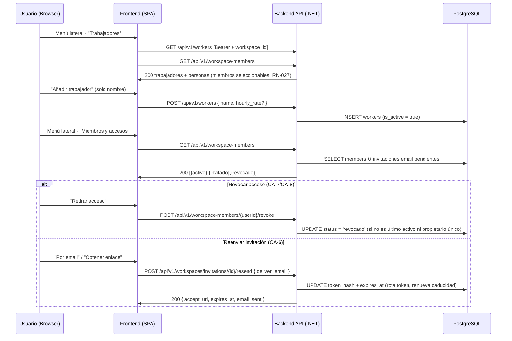

# TDD: MVP-204 — Maestro de trabajadores y miembros del Workspace

> **Referencia al spec**: [spec.md](./spec.md)

## Resumen técnico

Esta historia entrega dos superficies relacionadas pero distintas, que el spec reúne (RN-027):

1. **Maestro de trabajadores** (`workers`, agregado y tabla nuevos). CRUD de trabajadores **sin
   cuenta vinculada** (cuadrilla, jornaleros): alta con solo `name` (CA-2), edición, listado e
   **inactivación** reversible sobre `is_active` (CA-3), más una `hourly_rate` opcional de referencia
   que no automatiza el coste (RN-003). Los endpoints ya estaban contratados en `contratos-api.md §4`.
2. **Administración de personas del Workspace** (P-002 y P-003 de `MVP-999`). Una **vista unificada**
   que combina las membresías reales (`workspace_members`: `activo`/`revocado`) con las invitaciones
   por email pendientes (`workspace_invitations`, proyectadas como `invitado`), la **revocación** de
   acceso (CA-7/CA-8) y el **reenvío** de invitaciones por email o por enlace (CA-6). Reutiliza el
   método de dominio `WorkspaceMember.Revoke()` y el emisor de invitaciones (MVP-103), ya modelados
   pero sin endpoint ni pantalla hasta ahora.

Los **miembros activos** se exponen automáticamente como responsables seleccionables (RN-027/CA-1)
**sin materializarse** como filas de `workers`: viven en `workspace_members` y se combinan en la
vista de personas y en el maestro. Todos los endpoints nuevos son Workspace-first
(`[RequireWorkspaceScope]`, MVP-105): el Workspace activo se resuelve en servidor y nunca viaja como
parámetro (RN-034).

### Decisiones de producto tomadas en esta historia

- **Dos vistas separadas en la UI** (decisión con el PO). El maestro de trabajadores (roster
  operativo) y la administración de accesos (gobernanza de membresía) son dos conceptos con ciclos de
  vida distintos (`is_active` de trabajador vs. estado de membresía). Se entregan como dos entradas de
  menú: **«Trabajadores»** (`/app/trabajadores`) y **«Miembros y accesos»** (`/app/miembros`), cada una
  simple, en vez de mezclarlas en una lista única. Los miembros activos aparecen en ambas, con
  propósito distinto (seleccionables vs. administrables).
- **P-004 (renombrar/eliminar Workspace) queda fuera de MVP-204** (decisión con el PO). Aunque
  `MVP-999` lo enrutó a esta historia, el spec de MVP-204 no lo incluye y es un concern distinto
  (ciclo de vida del Workspace, con reglas de seguridad y confirmación de borrado). Se propone como
  **historia propia** (ver `MVP-999`, P-004 actualizado).
- **Interpretación de «reenviar por email o por enlace» (HU-5).** Es el *método de entrega* del
  reenvío, no un cambio de canal: la invitación sigue siendo de email dirigida a esa persona (por eso
  permanece `invitado`). «Por email» reenvía el correo; «por enlace» solo devuelve el nuevo
  `accept_url` para compartirlo por otro medio. En ambos casos se **rota el token** (un solo uso) y se
  **renueva la caducidad**, igual que la emisión original de MVP-103.
- **Del prototipo `TrabajadoresView` no se portan `rol` ni `teléfono`**: no están en el modelo de datos
  de `WORKER` de la KB. El prototipo es solo referencia visual (la KB es la fuente funcional); se
  respetan estructura, paleta y tipografía, pero los campos son los de la KB (`name`, `hourly_rate`,
  `is_active`).

## Diagrama de flujo



## Componentes afectados

### Backend

| Componente | Tipo de cambio | Descripción |
| ---------- | -------------- | ----------- |
| `Domain/Workers/Worker.cs` | nuevo | Agregado; `Create`/`Update`/`SetActive` con validaciones (nombre obligatorio, tarifa ≥ 0) |
| `Domain/Workers/IWorkerRepository.cs` | nuevo | Puerto (add, find-by-id-en-workspace, list con filtro de estado) |
| `Domain/Workers/WorkerValidationException.cs` | nuevo | Error de validación con código de contrato |
| `Application/Workers/Commands/WorkerCommands.cs` | nuevo | `WorkerSummary`, `CreateWorkerCommand`, `UpdateWorkerCommand` (`FieldUpdate`) |
| `Application/Workers/{Create,Update,List}WorkerHandler.cs` | nuevo | Casos de uso del maestro |
| `Infrastructure/Data/Repositories/WorkerRepository.cs` | nuevo | Adaptador EF Core (aislamiento por Workspace, filtro y orden) |
| `Infrastructure/Data/Migrations/*_AddWorkers.cs` | nuevo | Crea `workers` + índice `(workspace_id, is_active)` |
| `Controllers/WorkersController.cs` | nuevo | `GET/POST/PATCH /workers` con `[RequireWorkspaceScope]` |
| `Domain/Workspaces/WorkspaceMemberDetail.cs` | nuevo | Proyección de lectura de persona con membresía real (miembro + cuenta) |
| `Domain/Workspaces/WorkspaceMemberException.cs` | nuevo | Error de dominio de la revocación (CA-8) |
| `Domain/Workspaces/WorkspaceInvitation.cs` | modificado | `Reissue()`: rota token y renueva caducidad (HU-5) |
| `Domain/Workspaces/IWorkspaceRepository.cs` · `WorkspaceRepository.cs` | modificado | `ListMembersAsync`, `FindActiveMemberAsync`, `CountActive{Members,Owners}Async` |
| `Domain/Workspaces/IWorkspaceInvitationRepository.cs` · repo | modificado | `ListPendingEmailAsync` (personas `invitado`) |
| `Application/Workspaces/Commands/WorkspacePeopleCommands.cs` | nuevo | `WorkspaceInvitedDetail`, `WorkspacePeopleResult` |
| `Application/Workspaces/ListWorkspacePeopleHandler.cs` | nuevo | Vista unificada (miembros ∪ invitaciones email) |
| `Application/Workspaces/RevokeMemberHandler.cs` | nuevo | Revocación con guardas CA-8 |
| `Application/Invitations/ResendInvitationHandler.cs` | nuevo | Reenvío reutilizando token service + email sender |
| `Application/Invitations/Commands/InvitationCommands.cs` | modificado | `ResendInvitationCommand`/`ResendInvitationResult` |
| `Controllers/WorkspaceMembersController.cs` | nuevo | `GET /workspace-members`, `POST {userId}/revoke` |
| `Controllers/WorkspaceInvitationsController.cs` | modificado | `POST {id}/resend` |
| `Common/Errors/{ErrorCodes,ApiError}.cs` | modificado | Códigos de trabajador y de membresía (CA-8) |
| `Infrastructure/Data/TerrenarioDbContext.cs` | modificado | Mapeo de `Worker` + `DbSet` |
| `Program.cs` | modificado | DI de repos y handlers nuevos |

### Frontend

| Componente | Tipo de cambio | Descripción |
| ---------- | -------------- | ----------- |
| `types/worker.types.ts` · `services/worker.service.ts` | nuevo | Tipos y servicio del maestro sobre el cliente común |
| `components/workers/TrabajadoresView.tsx` · `WorkerFormModal.tsx` | nuevo | Roster: miembros seleccionables (CA-1) + cuadrilla sin cuenta (CRUD) |
| `types/member.types.ts` · `services/member.service.ts` | nuevo | Tipos y servicio de personas (listar, revocar, reenviar) |
| `components/members/MiembrosView.tsx` | nuevo | Vista de personas con estado, revocar y reenviar |
| `App.tsx` | modificado | Rutas `/app/trabajadores` y `/app/miembros` (fuera de la guarda de oferta de temporada) |
| `components/layout/AppSidebar.tsx` | modificado | Enciende "Trabajadores" y añade "Miembros y accesos" |
| `components/layout/AppLayout.tsx` | modificado | Títulos de cabecera de las dos rutas |

## Diseño detallado

### Modelo de datos

Alineado con `docs/02-arquitectura/modelo-de-datos.md` (entidad `WORKER`). La migración crea `workers`:

```sql
CREATE TABLE workers (
    id              UUID PRIMARY KEY,
    workspace_id    UUID NOT NULL REFERENCES workspaces(id) ON DELETE CASCADE,
    user_account_id UUID NULL REFERENCES users(id) ON DELETE SET NULL,  -- reservado (ver nota)
    name            VARCHAR(150) NOT NULL,
    hourly_rate     NUMERIC(10,2) NULL,        -- referencia; no automatiza coste (RN-003)
    is_active       BOOLEAN NOT NULL,
    created_at      TIMESTAMPTZ NOT NULL,
    updated_at      TIMESTAMPTZ NOT NULL
);

CREATE INDEX "IX_workers_workspace_id_is_active" ON workers (workspace_id, is_active);
```

- **`user_account_id` es reservado.** El modelo canónico lo prevé para vincular un trabajador a una
  cuenta. En MVP-204 **no se materializa** (los miembros se exponen desde `workspace_members`, no como
  filas de `workers`) y nace `null`. Se declara la columna y la FK opcional para no reabrir el esquema
  cuando se use más adelante.
- No se añaden entidades nuevas para la administración de miembros: se reutilizan `workspace_members`
  (MVP-104) y `workspace_invitations` (MVP-103) **sin cambio de esquema**.

### Representación del estado `invitado` (decisión de diseño del spec)

`workspace_members.user_id` es `NOT NULL` con FK a `users`, y una persona invitada por email puede no
tener cuenta todavía; además el canal `enlace` no tiene destinatario. Por eso el estado `invitado`
**no se materializa** como fila de `workspace_members`. Se implementa la **opción recomendada por el
spec**: una **vista unificada** que combina en el caso de uso las membresías reales
(`activo`/`revocado`) con las invitaciones por email pendientes (`invitado`). Ventajas: no duplica
datos que ya viven en `workspace_invitations`, no reabre el modelo de MVP-103 y al aceptarse una
invitación deja de ser pendiente y aparece como membresía `activo` **sin duplicarse** (CA-5).

### API / Contratos

```yaml
# GET /api/v1/workers            [RequireWorkspaceScope]
query: { is_active?: boolean }
responses:
  200: { data: [ { id, workspace_id, name, hourly_rate, is_active } ], meta: { total } }

# POST /api/v1/workers           [RequireWorkspaceScope]
request: { name*, hourly_rate? }
responses:
  201: { ...worker }
  400: { error: { code: "VALIDATION_REQUIRED_NAME" | "VALIDATION_WORKER_NAME_LENGTH"
                        | "VALIDATION_RANGE_HOURLY_RATE" } }

# PATCH /api/v1/workers/{workerId}   [RequireWorkspaceScope]   (campos parciales)
request: cualquier subconjunto de { name, hourly_rate, is_active }
responses:
  200: { ...worker }
  404: { error: { code: "RESOURCE_NOT_FOUND" } }   # no existe en el Workspace activo

# GET /api/v1/workspace-members      [RequireWorkspaceScope]
responses:
  200:
    data:
      - { kind: "member", status: "activo"|"revocado", user_id, name, email, role,
          joined_at, is_self, can_revoke }
      - { kind: "invitation", status: "invitado", invitation_id, name: null, email,
          invited_at, expires_at, is_expired }
    meta: { total, active, invited, revoked }
    # Orden: activos, luego invitados, luego revocados

# POST /api/v1/workspace-members/{userId}/revoke   [RequireWorkspaceScope]
responses:
  204: {}
  404: { error: { code: "RESOURCE_NOT_FOUND" } }              # no es miembro activo del Workspace
  422: { error: { code: "BUSINESS_RULE_CANNOT_REVOKE_OWNER"
                       | "BUSINESS_RULE_LAST_ACTIVE_MEMBER" } } # CA-8

# POST /api/v1/workspaces/invitations/{invitationId}/resend   [RequireWorkspaceScope]
request: { deliver_email?: boolean = true }   # false = "por enlace"
responses:
  200: { id, email, accept_url, expires_at, email_sent }
  404: { error: { code: "INVITATION_NOT_FOUND" } }   # inexistente, de otro Workspace, canal enlace o no pendiente
```

### Lógica de negocio

- **Maestro de trabajadores.** `Worker.Create` exige solo `name` (normalizado); `hourly_rate` es
  opcional y ≥ 0. La edición es un **PATCH parcial de verdad** (`FieldUpdate<T>`): un campo ausente
  conserva su valor; presente (incluido `null`) lo asigna/limpia. La inactivación (CA-3) es
  `SetActive(false)` por el mismo PATCH, reversible. El listado filtra por Workspace y estado y ordena
  activos primero y luego por nombre (ordena por columnas reales antes de proyectar, lección de P-014).
- **Vista de personas.** `ListWorkspacePeopleHandler` une `ListMembersAsync` (miembros + datos de
  cuenta) con `ListPendingEmailAsync` (invitaciones email pendientes). El controlador ordena
  activos → invitados → revocados y expone `is_self` y `can_revoke` como señales de UI.
- **Revocación (CA-7/CA-8).** `RevokeMemberHandler` localiza la membresía **activa** (si no, 404),
  aplica las guardas y llama a `WorkspaceMember.Revoke()` (transición a `revocado`, sin borrar el
  vínculo ni los registros que ese usuario creó). Guardas CA-8, en orden: (1) si el objetivo es
  `workspace_owner` y es el único propietario activo → `BUSINESS_RULE_CANNOT_REVOKE_OWNER`; (2) si es
  el último miembro activo → `BUSINESS_RULE_LAST_ACTIVE_MEMBER`. El reingreso de un revocado se hace
  por una invitación nueva (MVP-103); no se ofrece reactivación directa.
- **Reenvío (CA-6).** `ResendInvitationHandler` acota la invitación al Workspace activo y exige que
  sea de canal `email` y estado `pendiente` (si no, 404 uniforme para no revelar invitaciones ajenas
  ni el estado de las que ya no son `invitado`). Genera un token nuevo y llama a
  `WorkspaceInvitation.Reissue`, que rota `token_hash` y renueva `expires_at`. Devuelve siempre el
  `accept_url` nuevo; si `deliver_email`, además reenvía el correo (con la misma tolerancia a fallo
  del proveedor que la emisión: `email_sent: false` no invalida el reenvío).

### Cliente (frontend)

`worker.service` y `member.service` son fábricas sobre el **cliente HTTP común** (P-007): el manejo de
401/403 de scope es gratis. **Trabajadores** (`/app/trabajadores`) muestra los miembros activos como
seleccionables (CA-1, en lectura, con enlace a «Miembros y accesos») y la cuadrilla sin cuenta con
CRUD. **Miembros y accesos** (`/app/miembros`) lista a todos con su estado, ofrece revocar (con
confirmación en línea; oculto en uno mismo y en el propietario) y reenviar (por email o por enlace,
con copia del enlace nuevo), más el acceso a invitar (reutiliza el flujo de MVP-103). Ambas rutas van
**fuera de la guarda de oferta de temporada** (como el maestro de temporadas): administrar personas no
debe exigir una temporada activa.

## Alternativas descartadas

| Alternativa | Por qué se descartó |
| ----------- | ------------------- |
| Materializar `invitado` como fila de `workspace_members` (`user_id` nullable + `email`) | Duplica datos que ya viven en `workspace_invitations` y reabre el modelo de MVP-103; el spec la marca como descartada salvo justificación |
| Materializar a los miembros como filas de `workers` | Dos fuentes de verdad del mismo hecho; RN-027 pide exponerlos, no copiarlos. Se combinan en la vista |
| Lista única mezclando trabajadores y miembros | Mezcla dos ciclos de vida (`is_active` de trabajador vs. estado de membresía); se separan en dos vistas (decisión de producto) |
| Reactivación directa de un miembro revocado | Abriría una segunda vía de alta paralela a las invitaciones; el reingreso va por invitación nueva (MVP-103) |
| Reenvío que cambia el canal a `enlace` | El canal `enlace` no tiene destinatario: la persona dejaría de ser `invitado`. El reenvío mantiene el email dirigido y solo cambia la entrega |
| Portar `rol`/`teléfono` del prototipo | No están en el modelo `WORKER` de la KB (fuente funcional); el prototipo es solo referencia visual |
| Incluir renombrar/eliminar Workspace (P-004) aquí | Concern distinto (ciclo de vida del Workspace); fuera del spec de MVP-204. Se propone como historia propia |

## Riesgos e impacto

| Riesgo | Probabilidad | Mitigación |
| ------ | ------------ | ---------- |
| Dejar el Workspace sin propietario o sin miembros activos | baja | Guardas CA-8 en `RevokeMemberHandler` + tests unitarios; contadores por SQL |
| Fuga de datos entre Workspaces | baja | Todo se filtra por `workspace_id`; `FindByIdAsync`/`FindActiveMemberAsync` acotan por Workspace; `[RequireWorkspaceScope]` |
| Pérdida de datos en edición parcial de trabajador | baja | PATCH con presencia de campo (`FieldUpdate<T>`) + test de regresión + verificación real |
| Revelar invitaciones/miembros ajenos al reenviar | baja | 404 uniforme si la invitación no es del Workspace, no es email o no está pendiente |
| Mock que no ve la traducción SQL de los joins/filtros | media | Tests SQLite reales del listado de personas, contadores y del maestro (lección P-014) |
| Impacto en MVP-104 | nulo | El selector solo mira membresías `activo`; las `invitado` no resuelven contexto ni aparecen |

## Impacto en la usabilidad

- **Dos entradas de menú nuevas** («Trabajadores», «Miembros y accesos»), encendidas sobre el shell
  existente (P-016); el resto de módulos pendientes sigue como "Pronto". No se rompe ningún flujo.
- **Separación de conceptos**: el usuario que solo quiere apuntar jornaleros no se topa con la
  gobernanza de accesos, y quien administra accesos tiene una vista de gobernanza limpia.
- **Reenvío sin callejones**: por email reenvía el correo; por enlace entrega un enlace copiable (mismo
  patrón que la emisión de MVP-103), útil cuando el email no llega.
- No se detectan roturas de usabilidad adicionales que requieran decisión.

## Plan de testing

> Referencia: `docs/04-ingenieria/estrategia-testing.md`

- [x] Tests unitarios de dominio (`WorkerTests`): alta mínima, normalización, nombre vacío/largo,
  tarifa negativa, Workspace inválido, edición (incl. limpiar tarifa) e inactivación reversible.
- [x] Tests unitarios de dominio (`WorkspaceInvitationReissueTests`): `Reissue` rota token y renueva
  caducidad manteniendo `pendiente`; rechaza canal `enlace` y una invitación ya aceptada.
- [x] Tests de handlers (NSubstitute): `CreateWorkerHandler`, `UpdateWorkerHandler` (404 fuera de
  Workspace y **regresión de PATCH parcial**: inactivar no borra la tarifa), `RevokeMemberHandler`
  (revoca; guardas CA-8 de propietario único y último activo; 404 si no es miembro activo),
  `ListWorkspacePeopleHandler` (combina miembros ∪ invitaciones y marca caducadas),
  `ResendInvitationHandler` (rota token y reenvía por email/enlace; oculta como 404 la de otro
  Workspace y la de canal enlace).
- [x] Tests contra SQLite real: `WorkerRepositorySqliteTests` (aislamiento, filtro de estado, orden,
  `FindByIdAsync` que no cruza Workspaces) y `WorkspaceMembersRepositorySqliteTests` (listado de
  miembros con join a cuentas ordenado por columna real, contadores de activos/propietarios,
  invitaciones email pendientes excluyendo enlace y no pendientes).
- [x] Verificación end-to-end real (API :5127 + PostgreSQL + UI conducida :5173, con JWT de desarrollo
  firmado con la clave RSA local):
  - Trabajadores: `POST` alta mínima (solo nombre) → 201; alta con tarifa; nombre ausente → 400
    `VALIDATION_REQUIRED_NAME`; tarifa negativa → `VALIDATION_RANGE_HOURLY_RATE`; `PATCH` edición y
    `PATCH { is_active:false }` **conserva la tarifa** (verificado); `GET ?is_active=true` excluye
    inactivos; aislamiento entre Workspaces; UTF-8 con acentos persistido y renderizado en la UI.
  - Personas: `GET /workspace-members` devuelve activos + invitado + revocado ordenados y con
    `is_self`/`can_revoke`; revocar un miembro no propietario → 204 (persistido `revocado`); revocar al
    propietario único → 422 `BUSINESS_RULE_CANNOT_REVOKE_OWNER`; reenvío por enlace → 200 con
    `accept_url` nuevo y `email_sent:false`; por email → 200 `email_sent:true`.
  - UI conducida: «Miembros y accesos» muestra los tres estados y el reenvío por enlace revela el
    enlace copiable; «Trabajadores» muestra la sección de miembros seleccionables (CA-1) y el alta de
    un trabajador desde el modal.
- [ ] Tests de integración contra PostgreSQL de todos los endpoints: pendientes del arnés común (MVP-501).

Resultado local: `dotnet test` en verde (205 tests, 45 nuevos); `npm run build` y `npm run lint` sin
errores nuevos.

## Checklist de implementación

- [x] Diseño técnico revisado
- [x] Migración de base de datos preparada (`AddWorkers`)
- [x] Tests escritos y pasando (dominio + handlers + SQLite real)
- [x] Documentación de API actualizada (contrato: `workers` con `hourly_rate`, `workspace-members`,
  `resend`; códigos de error nuevos)
- [x] Modelo de datos actualizado (`WORKER` implementada; `user_account_id` reservado; vista unificada
  del estado `invitado`)
- [x] Puntos de coherencia registrados en `MVP-999` (P-002/P-003 resueltos; P-004 replanteado como
  historia propia; observaciones nuevas registradas)
- [x] Verificación end-to-end real (API + PostgreSQL + UI conducida)
- [x] Sin `TODO` sin resolver en este documento
