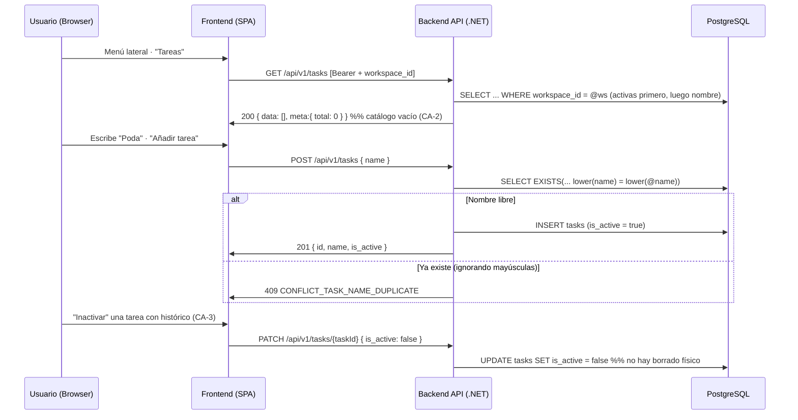

# TDD: MVP-205 — Catálogo de tareas por Workspace

> **Referencia al spec**: [spec.md](./spec.md)

## Resumen técnico

Último maestro operativo de la épica: cada Workspace mantiene su propio **catálogo de tareas**
(`tasks`, agregado y tabla nuevos), **inicialmente vacío** y editable por cualquier miembro (RN-026).
Es la contrapartida de RN-025 —la tarea es obligatoria en una actividad y puede venir del catálogo o
de texto libre— y el prerrequisito de la épica de diario (MVP-003).

El alcance es un CRUD sin borrado físico, calcado del patrón ya asentado en terrenos (MVP-202) y
trabajadores (MVP-204): alta con solo `name` (CA-2), renombrado, listado con filtro de estado e
**inactivación** reversible sobre `is_active` (CA-3). Los endpoints ya estaban contratados en
`contratos-api.md §3`. Todo es Workspace-first (`[RequireWorkspaceScope]`, MVP-105): el Workspace
activo se resuelve en servidor y nunca viaja como parámetro (RN-034), que es exactamente lo que
garantiza CA-1 (el catálogo de un Workspace no afecta al de otro).

La única pieza que no viene calcada es la **prevención de duplicados**, que se adelanta a esta
historia (ver decisiones).

### Decisiones de producto y de diseño tomadas en esta historia

- **La prevención de duplicados se adelanta a MVP-205** (decisión con el PO). `MVP-302` la lleva en
  su alcance («prevención básica de duplicados evidentes dentro del mismo Workspace»), pero la guarda
  pertenece al catálogo, no al flujo que lo alimenta: un maestro que admite «Poda» y «poda» como dos
  tareas distintas contradice el motivo por el que existe (consistencia, RN-026). Además, añadir el
  índice único más tarde obligaría a una migración con limpieza de datos ya creados. Se implementa
  aquí, en dos niveles (aplicación + índice único), y **MVP-302 la reutiliza** en vez de construirla.
- **Nueva entrada «Tareas» en el menú lateral** (decisión con el PO), en `/app/tareas`, con la misma
  mecánica que el resto de maestros. Alternativas descartadas: reestructurar el menú en secciones
  (toca el shell de P-016 y excede el alcance de la historia) y alojarlo bajo «Ajustes» (obligaría a
  encender un módulo sin historia y escondería un maestro de uso diario). La agrupación del menú
  queda registrada en `MVP-999` (P-025) para cuando estén encendidos todos los módulos.
- **Alta y renombrado en línea, sin modal.** Una tarea es **un solo campo**; poblar un catálogo
  consiste en escribir varias seguidas y abrir/cerrar un modal por cada una es fricción pura (el foco
  vuelve al campo tras cada alta). Es una divergencia deliberada del patrón modal de terrenos,
  temporadas y trabajadores, cuyos formularios tienen entre 3 y 6 campos. El resto de la mecánica
  (filtro de inactivas, inactivación reversible, paleta, tipografía e iconos) es idéntica.
- **El catálogo no se auto-siembra.** El estado vacío ofrece sugerencias («Poda», «Riego»…) que solo
  **rellenan el campo**: nada se crea sin que el usuario lo confirme. CA-2 exige que el catálogo
  arranque vacío y se pueble «sin configuración externa adicional», no que traiga contenido.
- **El agregado se llama `TaskItem`, no `Task`.** El glosario fija `Task` como identificador en inglés
  de «Tarea», pero ese nombre colisiona con `System.Threading.Tasks.Task` en todo el backend. La tabla
  (`tasks`), el recurso (`/api/v1/tasks`) y el namespace (`Domain.Tasks`) sí respetan el glosario;
  solo cambia el nombre del tipo C#.

## Diagrama de flujo



## Componentes afectados

### Backend

| Componente | Tipo de cambio | Descripción |
| ---------- | -------------- | ----------- |
| `Domain/Tasks/TaskItem.cs` | nuevo | Agregado; `Create`/`Rename`/`SetActive` y `NormalizeName` (validación sin mutar) |
| `Domain/Tasks/ITaskRepository.cs` | nuevo | Puerto (add, find-by-id-en-workspace, list con filtro, `ExistsWithNameAsync`) |
| `Domain/Tasks/TaskValidationException.cs` | nuevo | Error de validación con código de contrato (400) |
| `Domain/Tasks/TaskConflictException.cs` | nuevo | Nombre duplicado en el Workspace (409) |
| `Application/Tasks/Commands/TaskCommands.cs` | nuevo | `TaskSummary`, `CreateTaskCommand`, `UpdateTaskCommand` (`FieldUpdate`) |
| `Application/Tasks/{Create,Update,List}TaskHandler.cs` | nuevo | Casos de uso del maestro; la guarda de duplicados es compartida |
| `Infrastructure/Data/Repositories/TaskRepository.cs` | nuevo | Adaptador EF Core (aislamiento, filtro, orden, comparación `lower()`) |
| `Infrastructure/Data/Migrations/20260728000514_AddTasks.cs` | nuevo | Crea `tasks`, índice `(workspace_id, is_active)` y `ux_tasks_workspace_name` |
| `Controllers/TasksController.cs` | nuevo | `GET/POST/PATCH /tasks` con `[RequireWorkspaceScope]` |
| `Common/Errors/{ErrorCodes,ApiError}.cs` | modificado | Códigos del catálogo y 404 de tarea |
| `Infrastructure/Data/TerrenarioDbContext.cs` | modificado | Mapeo de `TaskItem` + `DbSet` |
| `Program.cs` | modificado | DI del repositorio y los handlers |

### Frontend

| Componente | Tipo de cambio | Descripción |
| ---------- | -------------- | ----------- |
| `types/task.types.ts` · `services/task.service.ts` | nuevo | Tipos y servicio sobre el cliente HTTP común (P-007) |
| `components/tasks/TareasView.tsx` | nuevo | Catálogo con alta y renombrado en línea, búsqueda, filtro e inactivación |
| `App.tsx` | modificado | Ruta `/app/tareas` (fuera de la guarda de oferta de temporada) |
| `components/layout/AppSidebar.tsx` | modificado | Entrada «Tareas» (icono `checklist`) |
| `components/layout/AppLayout.tsx` | modificado | Título de cabecera de la ruta |

## Diseño detallado

### Modelo de datos

`TASK` **no estaba en el ER canónico** de `docs/02-arquitectura/modelo-de-datos.md` (`ACTIVITY`
declaraba la tarea como un `string task` suelto), pese a que RN-026 exige el catálogo y
`contratos-api.md §3` ya contrataba el recurso. Se **añade la entidad al ER** y se documenta su
relación con `WORKSPACE` y con `ACTIVITY`. La migración crea:

```sql
CREATE TABLE tasks (
    id           UUID PRIMARY KEY,
    workspace_id UUID NOT NULL REFERENCES workspaces(id) ON DELETE CASCADE,
    name         VARCHAR(120) NOT NULL,
    is_active    BOOLEAN NOT NULL,
    created_at   TIMESTAMPTZ NOT NULL,
    updated_at   TIMESTAMPTZ NOT NULL
);

CREATE INDEX "IX_tasks_workspace_id_is_active" ON tasks (workspace_id, is_active);
CREATE UNIQUE INDEX ux_tasks_workspace_name ON tasks (workspace_id, lower(name));
```

- **`ux_tasks_workspace_name` es un índice sobre una expresión**, que EF Core no sabe declarar en el
  modelo: se crea con `migrationBuilder.Sql(...)` y el `DbContext` lo documenta en su lugar. Es la
  invariante de base de datos que respalda la guarda de aplicación, igual que
  `ux_seasons_workspace_active` respalda RN-022 en el maestro de temporadas (MVP-203).
- `name` se acota a **120 caracteres** (como el nombre de temporada; una tarea es una etiqueta corta,
  no una descripción: el detalle de la labor irá en la propia actividad).
- No hay columna de borrado: las tareas con histórico se inactivan (CA-3).

### API / Contratos

```yaml
# GET /api/v1/tasks              [RequireWorkspaceScope]
query: { is_active?: boolean }
responses:
  200: { data: [ { id, workspace_id, name, is_active } ], meta: { total } }
      # Orden: activas primero, luego por nombre

# POST /api/v1/tasks             [RequireWorkspaceScope]
request: { name*, is_active? }
responses:
  201: { ...task }
  400: { error: { code: "VALIDATION_REQUIRED" | "VALIDATION_REQUIRED_TASK_NAME"
                        | "VALIDATION_TASK_NAME_LENGTH" } }
  409: { error: { code: "CONFLICT_TASK_NAME_DUPLICATE" } }

# PATCH /api/v1/tasks/{taskId}   [RequireWorkspaceScope]   (campos parciales)
request: cualquier subconjunto de { name, is_active }
responses:
  200: { ...task }
  400: { error: { code: "VALIDATION_REQUIRED_TASK_NAME" | "VALIDATION_TASK_NAME_LENGTH" } }
  404: { error: { code: "RESOURCE_NOT_FOUND" } }   # no existe en el Workspace activo
  409: { error: { code: "CONFLICT_TASK_NAME_DUPLICATE" } }
```

Dos correcciones al contrato preexistente, aplicadas en `contratos-api.md`:

1. **El acceso a una tarea de otro Workspace responde `404 RESOURCE_NOT_FOUND`, no
   `AUTH_WORKSPACE_FORBIDDEN`.** El contrato de tareas se redactó antes que los maestros; terrenos
   (MVP-202) y trabajadores (MVP-204) ya asentaron el 404 uniforme, que además no revela la
   existencia de recursos ajenos. Se alinea el contrato con la implementación real.
2. **`VALIDATION_REQUIRED_TASK_NAME` no es el único código de «falta el nombre».** Cuando `name`
   falta o llega en blanco en el `POST`, responde antes la validación de modelo de ASP.NET Core con
   el código genérico `VALIDATION_REQUIRED` (y el mensaje específico); el código de dominio aparece
   en el `PATCH`. Es el mismo comportamiento que ya tienen terrenos y trabajadores; se documenta en
   vez de forzar un código distinto.

### Lógica de negocio

- **Alta (CA-2).** `TaskItem.Create` exige solo `name` (recortado y validado) y la tarea nace activa;
  `is_active: false` en el alta se admite por contrato. El catálogo no se siembra: un Workspace nuevo
  responde `{ data: [], meta: { total: 0 } }`.
- **Duplicados.** `CreateTaskHandler.EnsureNameIsFreeAsync` (compartida con la edición) consulta
  `ExistsWithNameAsync` con el nombre **ya normalizado** y lanza `TaskConflictException` → 409. El
  orden es deliberado: primero la validación de formato (400), después el conflicto (409), y solo
  entonces se toca el agregado. Al renombrar se excluye la propia tarea, de modo que cambiar solo las
  mayúsculas de su nombre no es un conflicto consigo misma. Las tareas **inactivas también ocupan su
  nombre**: reactivar es preferible a duplicar (y coherente con «no invalidar el histórico»).
  Si dos altas simultáneas sortean la guarda, choca el índice único y `TaskRepository` traduce esa
  `DbUpdateException` (23505 sobre `ux_tasks_workspace_name`) al mismo 409, no a un 500.
- **Edición e inactivación (CA-3).** `PATCH` parcial de verdad (`FieldUpdate<T>`): un campo ausente
  conserva su valor. La inactivación es `SetActive(false)`, reversible, y no borra nada: los
  registros que ya referencien la tarea siguen siendo válidos.
- **Listado.** Filtra por Workspace y estado y ordena activas primero y luego por nombre, **por
  columnas reales antes de proyectar** para que EF lo traduzca a SQL (lección de P-014). El filtro
  `is_active=true` es el que consumirá el selector de tarea de MVP-301.

### Cliente (frontend)

`task.service` es una fábrica sobre el **cliente HTTP común** (P-007): el manejo de 401/403 de scope
es gratis y el 409 llega con su mensaje del contrato, que la vista muestra tal cual. `/app/tareas`
va **fuera de la guarda de oferta de temporada** (como el resto de maestros de administración):
preparar el catálogo no debe exigir una temporada activa. La vista combina alta en línea (con el foco
de vuelta al campo), renombrado en línea (con `Esc` para cancelar), búsqueda, filtro de inactivas
—solo visible si las hay— e inactivación/reactivación por fila.

## Alternativas descartadas

| Alternativa | Por qué se descartó |
| ----------- | ------------------- |
| Dejar la prevención de duplicados para MVP-302 | La guarda pertenece al catálogo, no al flujo que lo alimenta; añadir el índice único después exigiría migración con limpieza de datos ya creados |
| Solo guarda de aplicación, sin índice único | Dos altas simultáneas crearían el duplicado; la invariante de datos es lo que lo hace imposible |
| Solo índice único, sin guarda de aplicación | El usuario recibiría un 500 en vez de un 409 con mensaje útil en el caso normal |
| Índice único sobre `(workspace_id, name)` sin `lower()` | Admitiría «Poda» y «poda» como tareas distintas, justo el duplicado evidente que se quiere evitar |
| Modal de alta/edición como en el resto de maestros | Un solo campo: abrir y cerrar un modal por tarea es fricción pura al poblar el catálogo |
| Sembrar el catálogo con tareas por defecto | CA-2 exige que arranque vacío; las sugerencias del estado vacío solo rellenan el campo |
| Borrado físico de tareas | Invalidaría registros históricos; la KB fija inactivación (CA-3) |
| Llamar `Task` al agregado (glosario) | Colisiona con `System.Threading.Tasks.Task`; la tabla y el recurso sí mantienen el término |

## Riesgos e impacto

| Riesgo | Probabilidad | Mitigación |
| ------ | ------------ | ---------- |
| Fuga de datos entre Workspaces | baja | Todo se filtra por `workspace_id`; `FindByIdAsync` acota por Workspace; `[RequireWorkspaceScope]` + verificación real con dos Workspaces |
| Duplicados por carrera entre dos altas simultáneas | baja | Índice único `ux_tasks_workspace_name` + traducción de la violación a 409 |
| Discrepancia entre la guarda de aplicación y el índice | baja | Ambos comparan `lower(name)`; test SQLite del criterio y verificación del índice en PostgreSQL real |
| Pérdida de datos en edición parcial | baja | `PATCH` con presencia de campo (`FieldUpdate<T>`) + test de regresión (inactivar no toca el nombre) |
| Mock que no ve la traducción SQL del filtro/orden | media | Tests SQLite reales del listado, el aislamiento y `ExistsWithNameAsync` (lección P-014) |
| `lower()` no normaliza acentos ni diacríticos | media | Alcance declarado: «duplicados **evidentes**». «Poda» y «Podá» conviven; la normalización avanzada está explícitamente fuera de MVP-302 |
| Impacto en MVP-301/302 | nulo | El catálogo queda listo: `GET ?is_active=true` para el selector y la guarda de duplicados para el guardado de tarea libre |

## Impacto en la usabilidad

- **Una entrada de menú nueva** («Tareas»), encendida sobre el shell existente (P-016); ningún flujo
  previo cambia. El menú lateral llega así a **10 entradas, 5 de ellas maestros**: no rompe nada hoy,
  pero se registra en `MVP-999` (P-025) la agrupación por secciones para cuando se enciendan los
  módulos que faltan.
- **Poblar el catálogo es escribir y pulsar Intro**, varias veces seguidas, sin modales. El estado
  vacío explica para qué sirve y ofrece sugerencias de un clic que **rellenan** el campo.
- **El error de duplicado es informativo, no un callejón**: dice qué tarea ya existe y desaparece al
  corregir el texto.
- **La inactivación es visible y reversible**: el filtro «Inactivas (n)» solo aparece si las hay, y
  la nota al pie explica por qué no existe «eliminar».
- No se detectan roturas de usabilidad que requieran decisión adicional.

## Plan de testing

> Referencia: `docs/04-ingenieria/estrategia-testing.md`

- [x] Tests unitarios de dominio (`TaskItemTests`): alta con solo nombre, normalización, alta
  inactiva, nombre vacío/en blanco/largo, Workspace inválido, renombrado sin cambiar estado,
  inactivación reversible y `NormalizeName` sin mutar.
- [x] Tests de handlers (NSubstitute): `CreateTaskHandler` (alta y persistencia; consulta de
  duplicados con el nombre ya normalizado; 409 sin persistir; el 400 de validación va **antes** que
  la consulta de duplicados) y `UpdateTaskHandler` (404 fuera del Workspace; **regresión de PATCH
  parcial**: inactivar no toca el nombre ni consulta duplicados; renombrado excluyendo la propia
  tarea; 409 al renombrar a un nombre existente, dejando la tarea intacta).
- [x] Tests contra SQLite real (`TaskRepositorySqliteTests`): aislamiento entre Workspaces, catálogo
  vacío de inicio, filtro de estado y orden por columnas reales, `FindByIdAsync` que no cruza
  Workspaces y `ExistsWithNameAsync` (ignora mayúsculas, acota por Workspace, excluye la propia tarea
  y ve las inactivas).
- [x] Verificación end-to-end real (API :5127 + PostgreSQL + UI conducida :5173, con JWT de
  desarrollo firmado con la clave RSA local):
  - API: `GET` de un Workspace nuevo → `{ data: [], total: 0 }` (CA-2); `POST` con espacios sobrantes
    → 201 normalizado; duplicado exacto y en mayúsculas → 409 `CONFLICT_TASK_NAME_DUPLICATE`; `POST`
    sin nombre → 400; `PATCH` nombre en blanco → 400 `VALIDATION_REQUIRED_TASK_NAME`; 121 caracteres
    → 400 `VALIDATION_TASK_NAME_LENGTH`; renombrar a una existente → 409; `PATCH { is_active:false }`
    **conserva el nombre** y `GET ?is_active=true` la excluye; reactivación → 200 (CA-3); `PATCH`
    desde otro Workspace → 404; sin token → 401; catálogo del segundo Workspace vacío (CA-1).
  - Datos: `ux_tasks_workspace_name` creado como `UNIQUE (workspace_id, lower(name))` y comprobado
    rechazando un `INSERT` directo de «poda DE mantenimiento» junto a «Poda de mantenimiento»;
    UTF-8 con acentos y guion largo persistido correctamente.
  - UI conducida: alta en línea, aviso de duplicado, renombrado en línea con acentos, inactivación,
    aparición del filtro «Inactivas (1)», reactivación disponible, estado vacío con sugerencias que
    rellenan el campo y aislamiento visible al cambiar de Workspace. Sin errores de consola.
- [ ] Tests de integración contra PostgreSQL de todos los endpoints: pendientes del arnés común
  (MVP-501). Tests unitarios de frontend: pendientes de P-012/P-023.

Resultado local: `dotnet test` en verde (230 tests, 25 nuevos); `npm run build` y `npm run lint` sin
errores nuevos.

## Checklist de implementación

- [x] Diseño técnico revisado
- [x] Migración de base de datos preparada y aplicada en local (`AddTasks`)
- [x] Tests escritos y pasando (dominio + handlers + SQLite real)
- [x] Documentación de API actualizada (`tasks` con reglas de contexto, 409 de duplicado y
  corrección del 404)
- [x] Modelo de datos actualizado (entidad `TASK` añadida al ER y documentada)
- [x] Puntos de coherencia registrados en `MVP-999` (P-025 agrupación del menú, P-026 duplicados
  adelantados y resueltos aquí, P-027 los `PATCH` parciales y los cuerpos no UTF-8, P-028
  reconciliación de la tarea en `ACTIVITY`)
- [x] Verificación end-to-end real (API + PostgreSQL + UI conducida)
- [x] Sin `TODO` sin resolver en este documento
