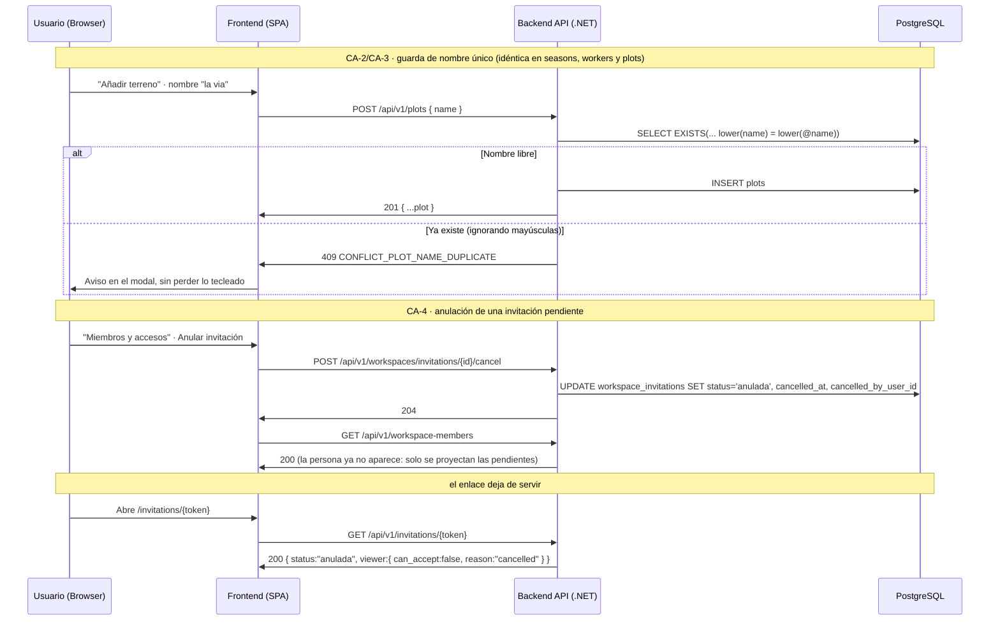

# TDD: MVP-207 — Correcciones de cierre de la épica de maestros

> **Referencia al spec**: [spec.md](./spec.md)

## Resumen técnico

Historia de **corrección**, no de alcance nuevo: cierra los cinco defectos de lo ya entregado que
detectó la revisión de cierre `MVP-299` (hallazgos R-05, R-06, R-08, R-09 y R-10). No introduce
ninguna entidad nueva ni cambia ningún flujo existente; alinea entre sí los cuatro maestros de la
épica y su contrato publicado, antes de que MVP-003 y MVP-004 empiecen a generar histórico encima.

Las cinco correcciones y su naturaleza:

| CA | Corrección | Naturaleza |
| --- | --- | --- |
| CA-1 | Contrato de temporadas reconciliado con la API entregada | Solo documentación (`contratos-api.md`) |
| CA-2 / CA-3 | Guarda de nombre único por Workspace en `seasons`, `workers` y `plots` | Backend + migración + UI |
| CA-4 | Anulación de una invitación pendiente | Backend + migración + UI |
| CA-5 | `/app/terrenos` fuera de la guarda de oferta de temporada | Solo routing (frontend) |
| CA-6 | Home que conduce a los maestros pendientes | Frontend |

La pieza con más superficie (CA-2/CA-3) **no inventa patrón**: replica exactamente el de MVP-205
(P-026), que ya estaba implementado y verificado en el catálogo de tareas. Lo único nuevo es la
limpieza de duplicados preexistentes en la migración, que MVP-205 no necesitó (la tabla `tasks` nacía
vacía).

### Decisiones de producto y de diseño tomadas en esta historia

- **`/app/terrenos` sale de la guarda de oferta de temporada** (decisión del PO, CA-5). Es la
  dirección que ya proponía el spec y la coherente con MVP-203/204/205: un maestro se administra
  aunque el Workspace no tenga temporada. La alternativa —meter todos los maestros dentro de la
  guarda— haría que preparar la explotación exigiera crear antes una temporada, en contra de la
  decisión de MVP-201 de que la temporada sea un acto **cancelable**. La guarda sigue cubriendo el
  Home y la operativa (`/app/invitations` y lo que llegue en MVP-003/004).
- **La migración renombra los duplicados preexistentes; no los borra ni los inactiva** (decisión del
  PO, CA-3). Se conserva intacto el registro más antiguo de cada grupo y el resto recibe un sufijo
  «&nbsp;(2)», «&nbsp;(3)»… por orden de `created_at`. Alternativas descartadas: **inactivarlos** no resuelve
  nada (la guarda cubre todo el maestro, así que las filas inactivas también ocupan su nombre) y
  **fallar la migración** rompería el arranque de la API —que migra sola— en cualquier entorno con
  datos sucios. Nada se pierde: el usuario renombra o inactiva después desde la UI.
- **La anulación no se limita al canal `email`**, a diferencia del reenvío. Un enlace compartible que
  se ha ido de las manos es justo el caso en el que hace falta retirarlo. La UI solo expone hoy las
  invitaciones por email porque son las únicas que aparecen como «persona» en la lista (el canal
  `enlace` no tiene destinatario), pero el endpoint cubre las dos.
- **`anulada` es un estado propio, no una reutilización de `rechazada`.** Ambas dejan la invitación
  inservible, pero las fija gente distinta y la acción de recuperación es distinta: `rechazada` la
  fija la persona invitada (MVP-107) y `anulada` el Workspace emisor. Distinguirlas es lo que permite
  que el preview del enlace diga «quien te invitó la ha anulado» en vez de un genérico.
- **El Home no se convierte en dashboard.** El bloque «Prepara tu explotación» responde solo a «¿qué
  me falta para empezar a registrar?» y sale de contar registros de los maestros. La Visión General
  con métricas reales sigue siendo alcance de MVP-004; aquí no se inventa ninguna métrica.
- **Se corrige de paso el catálogo cerrado `invitation_status`**, que seguía diciendo
  `pendiente, aceptada`: MVP-107 añadió `rechazada` y no lo actualizó. Es la misma clase de deriva
  que R-05 y estaba en la misma tabla que había que tocar para añadir `anulada`.

## Diagrama de flujo



## Componentes afectados

### Backend

| Componente | Tipo de cambio | Descripción |
| ---------- | -------------- | ----------- |
| `Domain/{Seasons,Workers,Plots}/*ConflictException.cs` | nuevo | Conflicto de nombre duplicado por recurso (409) |
| `Domain/Seasons/Season.cs` · `Workers/Worker.cs` · `Plots/Plot.cs` | modificado | `NormalizeName` público y estático (valida sin mutar), como en `TaskItem` |
| `Domain/{Seasons,Workers,Plots}/I*Repository.cs` | modificado | Puerto `ExistsWithNameAsync(workspaceId, name, excludeId)` |
| `Infrastructure/Data/Repositories/{Season,Worker,Plot}Repository.cs` | modificado | Comparación `lower()`, nombre del índice y traducción de la violación única a 409 |
| `Application/{Seasons,Workers,Plots}/Create*Handler.cs` | modificado | `EnsureNameIsFreeAsync` compartida con la edición |
| `Application/{Seasons,Workers,Plots}/Update*Handler.cs` | modificado | Guarda al renombrar, excluyendo el propio registro |
| `Controllers/{Seasons,Workers,Plots}Controller.cs` | modificado | `catch` del conflicto → `409` |
| `Domain/Workspaces/InvitationStatuses.cs` | modificado | Estado `anulada` |
| `Domain/Workspaces/WorkspaceInvitation.cs` | modificado | `Cancel()`, columnas de trazabilidad y guarda en `Accept`/`Reject`/`Reissue` |
| `Application/Invitations/CancelInvitationHandler.cs` | nuevo | Anulación acotada al Workspace activo (404 uniforme) |
| `Application/Invitations/PreviewInvitationHandler.cs` | modificado | Motivo de aptitud `cancelled` |
| `Controllers/WorkspaceInvitationsController.cs` | modificado | `POST /workspaces/invitations/{id}/cancel` → 204 |
| `Common/Errors/ErrorCodes.cs` | modificado | Tres códigos de conflicto + `BUSINESS_RULE_INVITATION_CANCELLED` |
| `Infrastructure/Data/TerrenarioDbContext.cs` | modificado | Columnas de anulación, FK y documentación de los tres índices únicos |
| `Migrations/…_AddMasterNameUniqueIndexesAndInvitationCancellation.cs` | nuevo | Limpieza de duplicados + 3 índices únicos + columnas de anulación |
| `Program.cs` | modificado | DI de `CancelInvitationHandler` |

### Frontend

| Componente | Tipo de cambio | Descripción |
| ---------- | -------------- | ----------- |
| `components/home/HomeView.tsx` | nuevo | Home con checklist de preparación y copy corregido (CA-6) |
| `App.tsx` | modificado | `/app/terrenos` fuera de la guarda de oferta (CA-5); `AppHome` sustituido por `HomeView` |
| `components/members/MiembrosView.tsx` | modificado | Acción «Anular invitación» con confirmación en línea (CA-4) |
| `services/member.service.ts` | modificado | `cancelInvitation` |
| `types/invitation.types.ts` · `lib/invitation-ui.ts` | modificado | Estado `anulada`, motivo `cancelled` y su mensaje |

## Diseño detallado

### Modelo de datos

Sin entidades nuevas. Dos cambios de esquema, ambos aditivos:

```sql
-- CA-3 · una guarda por maestro, con el mismo criterio que ux_tasks_workspace_name (MVP-205)
CREATE UNIQUE INDEX ux_seasons_workspace_name ON seasons (workspace_id, lower(name));
CREATE UNIQUE INDEX ux_workers_workspace_name ON workers (workspace_id, lower(name));
CREATE UNIQUE INDEX ux_plots_workspace_name   ON plots   (workspace_id, lower(name));

-- CA-4 · trazabilidad de la anulación
ALTER TABLE workspace_invitations
    ADD COLUMN cancelled_at          timestamptz NULL,
    ADD COLUMN cancelled_by_user_id  uuid NULL REFERENCES users(id) ON DELETE RESTRICT;
```

Son índices **sobre una expresión**, que EF Core no sabe declarar en el modelo: se crean con
`migrationBuilder.Sql(...)` y el `DbContext` los documenta en su lugar, igual que en MVP-205.

**Limpieza de duplicados preexistentes.** El índice no se puede crear sobre una tabla que ya los
contenga, así que la migración renombra antes (ver decisiones). El renombrado va en un bucle porque
un nombre generado puede chocar con uno que ya existía —«Poda» duplicado junto a un «Poda (2)»
previo—; converge en una o dos vueltas y un contador de guarda evita cualquier bucle infinito. El
`Down` retira los índices pero **no** deshace el renombrado: no hay forma de distinguir los nombres
originales de los que el usuario haya elegido después.

### API / Contratos

```yaml
# Los tres maestros añaden el mismo 409 a POST y PATCH
POST  /api/v1/{seasons|workers|plots}
PATCH /api/v1/{seasons|workers|plots}/{id}
  409: { error: { code: "CONFLICT_SEASON_NAME_DUPLICATE"
                      | "CONFLICT_WORKER_NAME_DUPLICATE"
                      | "CONFLICT_PLOT_NAME_DUPLICATE" } }

# POST /api/v1/workspaces/invitations/{invitationId}/cancel   [RequireWorkspaceScope]
responses:
  204: (sin cuerpo)
  404: { error: { code: "INVITATION_NOT_FOUND" } }   # inexistente, de otro Workspace o no pendiente
```

La sección de temporadas de `contratos-api.md` se reescribe entera (CA-1). Lo que decía frente a lo
entregado:

| Contrato publicado (erróneo) | API entregada |
| --- | --- |
| `end_date*` obligatorio | Opcional (fecha de fin **estimada**) |
| `201 { status: "planificada" }` | Nace **activa** (decisión «crear cambia la activa», P-017) |
| `PATCH … status?` | `PATCH … is_closed?` (el estado es derivado, no una columna) |
| `GET /seasons` con `status?` / `include_closed?` | Sin filtros |
| — | Faltaban `GET /seasons/active` y `POST /seasons/{id}/activate` |
| `VALIDATION_DATE_RANGE_INVALID`, `CONFLICT_SEASON_ACTIVE_DUPLICATE` | No existen en `ErrorCodes`; se sustituyen por los reales |

`CONFLICT_SEASON_NAME_DUPLICATE` es el único código de la sección que **sí** existía en la KB y no
estaba implementado: esta historia lo implementa en lugar de retirarlo.

### Lógica de negocio

- **Guarda de duplicados (CA-2).** Idéntica en los tres maestros y calcada de MVP-205: el agregado
  normaliza y valida el nombre primero (400), después se consulta `ExistsWithNameAsync` con el nombre
  **ya normalizado** (409) y solo entonces se toca la entidad. Al renombrar se excluye el propio
  registro, de modo que cambiar solo las mayúsculas de su nombre no es un conflicto consigo mismo. Un
  `PATCH` que no trae `name` no consulta duplicados (inactivar o cerrar no es un renombrado).
- **Ámbito de la guarda.** Cubre **todo** el maestro, no solo lo activo: inactivar un trabajador o
  cerrar una temporada no libera su nombre. Es lo coherente con el motivo por el que se inactiva en
  vez de borrar (no romper el histórico que referencia ese nombre) y lo mismo que ya hacía MVP-205.
- **Carrera entre dos altas simultáneas.** Si dos peticiones sortean la guarda de aplicación, choca
  el índice único y el repositorio traduce esa `DbUpdateException` (23505 sobre el índice del recurso)
  al mismo 409, no a un 500. En `SeasonRepository` la traducción está también en
  `ActivateExclusivelyAsync`, porque el alta de temporada pasa por ahí y no por `SaveChangesAsync`.
- **Anulación (CA-4).** `WorkspaceInvitation.Cancel` exige estado pendiente y es idempotente ante un
  doble clic. `Accept`, `Reject` y `Reissue` rechazan una invitación anulada con
  `BUSINESS_RULE_INVITATION_CANCELLED` (422); el `Reject` la comprueba explícitamente para que un
  rechazo tardío no sobrescriba el estado que fijó el emisor. La persona desaparece de la lista de
  personas sin tocar `ListWorkspacePeopleHandler`: esa vista ya proyectaba solo invitaciones
  `pendiente`.

### Cliente (frontend)

- **CA-5** es un cambio de una línea de routing: `/app/terrenos` pasa del bloque `RequireSeasonOffer`
  al bloque de maestros de administración, junto a temporadas, trabajadores, tareas, miembros y
  ajustes. El comentario del `App.tsx` ya afirmaba esa regla; ahora el código la cumple.
- **CA-2 en la UI** no requiere código nuevo en los formularios: los modales de terreno, temporada y
  trabajador ya mostraban el `errorMessage` que les pasa la vista y ya conservaban lo tecleado (no se
  cierran al fallar el envío). El mensaje del 409 llega del contrato y se muestra tal cual, igual que
  en tareas.
- **CA-4 en la UI** reutiliza la mecánica de confirmación en línea de «Retirar acceso», para que
  retirar a un invitado y a un miembro se hagan igual. La acción vive en la misma fila que el
  reenvío, alineada a la derecha.
- **CA-6**: `HomeView` consulta la temporada activa (del `SeasonContext`, ya cargada) y los tres
  listados de maestros en paralelo. Si la consulta falla, el bloque simplemente no se pinta: es
  información de apoyo, no vale la pena mostrar un error por ella. El bloque cambia de título cuando
  ya no queda nada pendiente, en vez de desaparecer, para no dar la sensación de que algo se ha roto.

## Alternativas descartadas

| Alternativa | Por qué se descartó |
| ----------- | ------------------- |
| Meter todos los maestros dentro de la guarda de temporada (CA-5) | Preparar la explotación exigiría crear antes una temporada, contra la decisión de MVP-201 de que sea cancelable |
| Inactivar los duplicados preexistentes en la migración | No resuelve nada: la guarda cubre todo el maestro, así que las filas inactivas siguen ocupando su nombre y el índice seguiría fallando |
| Hacer fallar la migración si hay duplicados | La API migra al arrancar: cualquier entorno con datos sucios se quedaría sin levantar |
| Un único código `CONFLICT_NAME_DUPLICATE` para los cuatro maestros | El mensaje de la UI debe hablar en los términos del recurso; el código por recurso ya era el patrón de MVP-205 |
| Guarda solo de aplicación, sin índice único | Dos altas simultáneas crearían el duplicado; CA-3 exige la invariante en datos |
| Guarda solo de índice, sin comprobación previa | El usuario recibiría un 500 en vez de un 409 con mensaje útil en el caso normal |
| Normalizar acentos o similitud fonética | Fuera de alcance declarado: la guarda es de igualdad ignorando mayúsculas, igual que en MVP-205 |
| Incluir el `alias` del terreno en la unicidad | El alias es un apodo libre y corto; repetirlo no crea ambigüedad en los registros, que referencian el terreno por id |
| Reutilizar `rechazada` para la anulación | Se pierde quién cerró la invitación y con ello el mensaje útil en el enlace |
| Anular borrando la fila de invitación | Rompería la trazabilidad y el 404 uniforme; la KB no borra físicamente en ningún flujo de la épica |
| Convertir el Home en dashboard con métricas | La Visión General es alcance de MVP-004; aquí no se inventan métricas |

## Riesgos e impacto

| Riesgo | Probabilidad | Mitigación |
| ------ | ------------ | ---------- |
| La migración no puede crear el índice por duplicados en un entorno real | media | Limpieza previa en la propia migración, con bucle que converge y contador de guarda; verificada sembrando el caso difícil (tres variantes de mayúsculas más un « (2)» preexistente) |
| Renombrado que desborda el `varchar` de `name` | baja | El sufijo se calcula con `left(name, max_len - length(sufijo))` por tabla (120 en temporadas, 150 en trabajadores y terrenos) |
| Carrera entre dos altas simultáneas | baja | Índice único + traducción de la violación a 409 en los tres repositorios, incluido el camino `ActivateExclusivelyAsync` de temporadas |
| Discrepancia entre la guarda de aplicación y el índice | baja | Ambos comparan `lower(name)`; tests SQLite del criterio y verificación del índice en PostgreSQL real |
| Regresión del `PATCH` parcial al añadir la guarda | baja | Test por maestro: un `PATCH` sin `name` no consulta duplicados y conserva los campos omitidos |
| Sacar Terrenos de la guarda deja al usuario sin temporada al registrar | nula hoy | El registro operativo no existe todavía (MVP-003); cuando llegue, la temporada la exige la propia actividad (RN-021), no el acceso al maestro |
| Un rechazo tardío sobrescribe una invitación anulada | baja | `Reject` comprueba el estado `anulada` antes de la idempotencia; test de dominio |
| El Home añade tres peticiones al arranque | baja | Se lanzan en paralelo y solo en `/app`; si fallan, el bloque no se pinta y la pantalla sigue siendo útil |

## Impacto en la usabilidad

- **Terrenos deja de tener un desvío que ningún otro maestro tiene.** Un Workspace sin temporada
  activa ya no manda a crear una al entrar en Terrenos: los seis destinos de administración se
  comportan igual. Es una fricción menos, no una función menos.
- **El error de duplicado es informativo, no un callejón**: dice qué registro ya existe, el modal
  sigue abierto y lo tecleado se conserva, así que corregir es cambiar una palabra y reenviar.
- **Anular una invitación es simétrico a retirar el acceso**: misma posición, mismo color, misma
  confirmación en línea. Antes, invitar al email equivocado no tenía marcha atrás desde la UI.
- **El Home deja de ser una pantalla muerta.** Antes su único CTA era «Invitar a alguien» y su copy
  contradecía el menú; ahora dice qué falta por poblar y lleva a cada maestro en un clic. Cuando todo
  está preparado el bloque cambia de tono en vez de desaparecer, para que no parezca que algo falla.
- **Ningún flujo previo cambia de forma**: no hay pantallas nuevas, ni entradas de menú nuevas, ni
  cambios en el shell. No se detectan roturas de usabilidad que requieran decisión adicional.

## Plan de testing

> Referencia: `docs/04-ingenieria/estrategia-testing.md`

- [x] Tests de handlers (NSubstitute), tres maestros × cuatro casos: la guarda se consulta con el
  nombre **ya normalizado**; el duplicado lanza el conflicto propio del recurso **sin persistir**; el
  400 de validación va **antes** que la consulta de duplicados; y el renombrado a un nombre existente
  deja el agregado intacto. Más dos regresiones por maestro: excluir el propio registro al renombrar
  y no consultar duplicados en un `PATCH` que no trae `name`.
- [x] Tests contra SQLite real (`{Season,Worker,Plot}RepositorySqliteTests`): `ExistsWithNameAsync`
  ignora mayúsculas, acota por Workspace, excluye el propio registro y **ve los inactivos y las
  cerradas**; en terrenos, además, que el `alias` no entra en la comparación.
- [x] Tests de dominio de la invitación: anular impide aceptar y rechazar (422
  `BUSINESS_RULE_INVITATION_CANCELLED`), no se puede anular una ya aceptada, es idempotente ante un
  segundo intento y se permite anular una caducada.
- [x] Tests del `CancelInvitationHandler`: anula y persiste con trazabilidad; cubre también el canal
  `enlace`; oculta como 404 la inexistente, la de otro Workspace y la ya aceptada.
- [x] Verificación end-to-end real (API :5127 + PostgreSQL + UI conducida :5173, con JWT de
  desarrollo firmado con la clave RSA local):
  - Migración: sembrados a mano tres «Matorral/matorral/MATORRAL» **junto a un «Matorral (2)»
    preexistente**, tres «Juan Perez» y dos «2025/2026»; tras migrar, el más antiguo de cada grupo
    queda intacto y el resto pasa a « (2)»/« (3)», incluido el caso de colisión, que da
    «Matorral (2) (2)». Los tres índices se crean como `UNIQUE (workspace_id, lower(name))`.
  - API: duplicado exacto, en mayúsculas y con espacios sobrantes → 409 con el código del recurso en
    terrenos, trabajadores y temporadas; alta con nombre libre → 201 normalizado; renombrar a un
    existente → 409 dejando el registro intacto; renombrar cambiando solo las mayúsculas → 200;
    `PATCH { is_active:false }` conserva el nombre; **reutilizar el nombre de un registro inactivo →
    409**; nombre en blanco → 400 antes que el 409; el mismo nombre en **otro** Workspace → 201
    (CA-1 de la épica); UTF-8 con acentos persistido correctamente.
  - Anulación: `POST …/cancel` → 204; el preview del enlace pasa de `pendiente/can_accept:true` a
    `anulada/can_accept:false/reason:"cancelled"`; aceptar por ese enlace → 422
    `BUSINESS_RULE_INVITATION_CANCELLED`; reenviar o volver a anular → 404; anular desde otro
    Workspace → 404; sin token → 401; la persona desaparece de `GET /workspace-members`
    (`invited: 1` → `invited: 0`).
  - UI conducida: `/app/terrenos` **carga** en un Workspace sin temporada activa (antes desviaba a
    `/app/temporada/nueva`); el modal de terreno muestra «Ya existe un terreno «la via» en este
    Workspace», sigue abierto y conserva nombre y propietario tecleados, y al corregir el nombre crea
    y cierra; el Home muestra «Prepara tu explotación · 2/4» con CTA a los pendientes y navega al
    maestro correcto; «Anular invitación» pide confirmación y la persona desaparece de la lista. Sin
    errores de consola.
  - Entorno restaurado: los registros sembrados para la prueba se eliminaron y la invitación
    preexistente se devolvió a `pendiente`.
- [ ] Tests de integración contra PostgreSQL de todos los endpoints: pendientes del arnés común
  (MVP-501). Tests unitarios de frontend: pendientes de P-012/P-023.

Resultado local: `dotnet test` en verde (322 tests, 32 nuevos); `npm run build` y `npm run lint` sin
errores nuevos.

## Checklist de implementación

- [x] Diseño técnico revisado
- [x] Migración de base de datos preparada y aplicada en local
  (`AddMasterNameUniqueIndexesAndInvitationCancellation`), incluida la limpieza de duplicados
- [x] Tests escritos y pasando (dominio + handlers + SQLite real)
- [x] Documentación de API actualizada: sección de temporadas reescrita (CA-1), 409 de duplicado en
  terrenos y trabajadores, endpoint de anulación y catálogo `invitation_status` corregido
- [x] Modelo de datos actualizado (tres índices únicos, columnas de anulación y estados de la
  invitación)
- [x] Puntos de coherencia registrados en `MVP-999`
- [x] Verificación end-to-end real (API + PostgreSQL + UI conducida)
- [x] Sin `TODO` sin resolver en este documento
