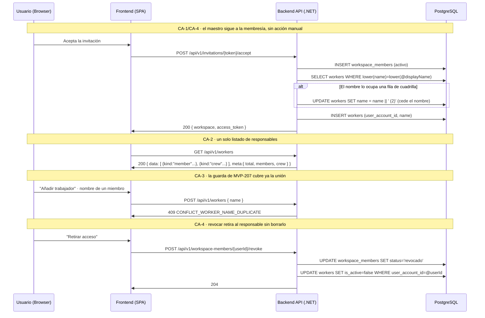

# TDD: MVP-208 — Identidad del responsable y correcciones finales de la épica de maestros

> **Referencia al spec**: [spec.md](./spec.md)

## Resumen técnico

Dos piezas de naturaleza distinta bajo la misma historia:

1. **Identidad del responsable** (`P-034`, CA-1..CA-5). Es un cambio de **modelo** sobre un maestro ya
   entregado y con datos: los miembros del Workspace pasan a ser filas de `workers`, vinculadas por el
   `user_account_id` que `MVP-204` dejó reservado. A partir de aquí `workers` es **el** maestro de
   responsables y cualquiera de ellos se identifica con un `workers.id`, que es lo que permite que
   `ACTIVITY.worker_id` (MVP-301) siga siendo una FK simple. Cierra el CA-3 de la épica.
2. **Correcciones de lo entregado** (CA-6..CA-10), del mismo tipo que las de `MVP-207`: superficie de
   invitaciones, oferta de temporada, contrato publicado y checklist del Home.

| CA | Corrección | Naturaleza |
| --- | --- | --- |
| CA-1 / CA-5 | Miembros materializados como `workers` + backfill | Dominio + migración |
| CA-2 | `GET /workers` devuelve el maestro completo con `kind` | Backend + UI |
| CA-3 | Sin duplicados a través de la frontera miembro/cuadrilla | **Sin código nuevo**: el índice de MVP-207 pasa a cubrir la unión |
| CA-4 | El maestro sigue a la membresía; nombre y disponibilidad no editables | Backend + UI |
| CA-6 / CA-7 | Anular un enlace y superficie única de pendientes | Backend + UI |
| CA-8 | Oferta de temporada honesta, con opción de activar | Frontend (+ contexto) |
| CA-9 | Contrato de los cuatro maestros: alta frente a edición | Solo documentación |
| CA-10 | Checklist del Home coherente con RN-027 | Frontend (coherente **por construcción** tras CA-1) |

**CA-3 no tiene implementación propia**, y esa es justamente la razón de elegir esta opción: al ser
los miembros filas del maestro, el índice `ux_workers_workspace_name` ya entregado por `MVP-207` cubre
la unión que RN-027 define como maestro de responsables, y el hallazgo `R-16` desaparece sin guarda
adicional.

### Decisiones de producto y de diseño tomadas en esta historia

- **Opción (a) de `P-034`: materializar la fila, no un responsable polimórfico.** Mantiene un único
  espacio de identificadores para el diario (MVP-003) y el dashboard (MVP-004), no reabre el contrato
  de actividades y hace que la guarda de duplicados ya entregada cubra la unión. La opción (b)
  (`worker_id?` XOR `member_user_id?`) obligaría a duplicar la lógica en cada consumidor.
- **El nombre de un miembro no se edita en el maestro y se resincroniza desde Google** (punto que el
  spec pedía cerrar antes de implementar, RN-036). La resincronización se dispara en el **login**, y
  solo cuando el nombre de display cambia de verdad: en un login normal no hay nada que hacer. Se
  propaga a todos los Workspaces de la cuenta a la vez, porque el nombre es de la cuenta, no del
  Workspace.
- **Desempate de nombres asimétrico.** Si el nombre que trae una cuenta lo ocupa una fila de
  **cuadrilla**, la cuadrilla se renombra con el primer sufijo libre (« (2)», « (3)»…) y el miembro
  conserva el suyo: no es renombrable. Si lo ocupa **otro miembro** —dos cuentas de Google homónimas
  en el mismo Workspace, caso que el spec no contemplaba— ninguno de los dos es renombrable, así que
  el sufijo lo toma quien llega después. Sin esa salida, la materialización chocaría con el índice
  único y **la persona no podría entrar en el Workspace**, que es un daño mucho mayor que un nombre
  con sufijo. Queda propuesto en `MVP-999` un desempate más informativo que el ordinal (`P-047`).
- **Un miembro no se inactiva a mano** (RN-027): `PATCH { is_active }` sobre su fila responde 422. La
  vía de retirarlo es revocar su acceso, que inactiva la fila sin borrarla. Su tarifa horaria **sí**
  es editable: es dato operativo del Workspace, no parte de su identidad.
- **La superficie única de invitaciones pendientes es «Miembros y accesos»** (CA-7, decisión abierta
  en `R-21`). Es la que ya tenía las acciones, y la que el contrato de `MVP-204` define como lista
  unificada de personas con su estado; mover las acciones a `/app/invitations` habría deshecho ese
  diseño y sacado a la persona invitada de la lista donde se la administra. Se extiende con el canal
  `enlace` —presentado como lo que es, un acceso sin destinatario— y `/app/invitations` se queda solo
  con el alta y un enlace a la administración.
- **La reemisión se abre al canal `enlace`** (antes 404). Renovar un enlace es exactamente la misma
  operación —rotar el token— y era la mitad que faltaba para que las acciones sean las mismas en los
  dos canales. Lo único que no aplica es el envío del correo: no hay destinatario.
- **La oferta de temporada distingue «no hay ninguna» de «hay pero ninguna activa»** (CA-8). En el
  segundo caso ofrece **activar** una existente como opción principal y crear otra como secundaria, y
  el nombre sugerido salta al primer año libre para no chocar con el 409 de nombre duplicado de
  `MVP-207` (HU-4).
- **El `SeasonContext` pasa a cargar `GET /seasons` en vez de `GET /seasons/active`.** La lista ya
  dice cuál está activa (`is_active`), así que saber las dos cosas no cuesta una petición más y la
  píldora de cabecera puede dejar de prometer «crear» cuando lo que toca es elegir.
- **El paso «Trabajadores» del Home no se retira del checklist** (CA-10). Con la materialización
  siempre está cumplido, pero seguir mostrándolo —hecho, con el recuento— informa de que el roster
  existe y conduce a añadir cuadrilla. Su ayuda («los miembros ya cuentan») pasa a ser cierta, que era
  la contradicción de `R-20`.

## Diagrama de flujo



## Componentes afectados

### Backend

| Componente | Tipo de cambio | Descripción |
| ---------- | -------------- | ----------- |
| `Domain/Workers/Worker.cs` | modificado | `CreateForMember`, `HasAccount`, `UpdateHourlyRate`, `SyncMembership`, `SyncIdentityName`, `RenameWithSuffix`/`WithSuffix`; `Update` y `SetActive` rechazan al miembro |
| `Domain/Workers/WorkerBusinessRuleException.cs` | nuevo | Regla de negocio del maestro → 422 |
| `Domain/Workers/WorkerKinds.cs` | nuevo | Catálogo cerrado `worker_kind` (`member`/`crew`), derivado de `user_account_id` |
| `Domain/Workers/IWorkerRepository.cs` | modificado | `FindByUserAccountAsync`, `ListByUserAccountAsync`, `FindByNameAsync` |
| `Infrastructure/Data/Repositories/WorkerRepository.cs` | modificado | Implementación y consulta por nombre compartida con `ExistsWithNameAsync` |
| `Application/Workers/MemberRosterService.cs` | nuevo | Alta, reactivación, suspensión y resincronización de nombre, con el desempate |
| `Application/Workers/UpdateWorkerHandler.cs` | modificado | Ruta según `HasAccount`: del miembro solo la tarifa |
| `Application/Workers/ListWorkersHandler.cs` · `Commands/WorkerCommands.cs` | modificado | `Kind` y `UserAccountId` en el resumen |
| `Controllers/WorkersController.cs` | modificado | `kind`/`user_account_id` en la respuesta, `meta.members`/`meta.crew`, `catch` del 422 |
| `Application/Workspaces/CreateWorkspaceHandler.cs` | modificado | Siembra al creador en el maestro |
| `Application/Invitations/AcceptInvitationHandler.cs` | modificado | Materializa (o recupera) la fila al aceptar |
| `Application/Workspaces/RevokeMemberHandler.cs` | modificado | Inactiva la fila al revocar |
| `Application/Auth/ExchangeGoogleCodeHandler.cs` | modificado | Resincroniza el nombre si Google devuelve otro (RN-036) |
| `Application/Workspaces/ListWorkspacePeopleHandler.cs` · `Commands/WorkspacePeopleCommands.cs` | modificado | Proyecta los dos canales, con `channel` y `email` nullable |
| `Controllers/WorkspaceMembersController.cs` | modificado | `channel` en la respuesta de invitación |
| `Domain/Workspaces/WorkspaceInvitation.cs` · `IWorkspaceInvitationRepository.cs` | modificado | `Reissue` admite el canal `enlace`; se retira `ListPendingEmailAsync` |
| `Application/Invitations/ResendInvitationHandler.cs` | modificado | Reemite los dos canales; el correo solo sale si hay destinatario |
| `Common/Errors/ErrorCodes.cs` | modificado | `BUSINESS_RULE_WORKER_IDENTITY_MANAGED`, `BUSINESS_RULE_WORKER_MEMBERSHIP_MANAGED` |
| `Infrastructure/Data/TerrenarioDbContext.cs` | modificado | Índice único parcial por cuenta y documentación del vínculo |
| `Migrations/…_AddMemberWorkers.cs` | nuevo | Backfill de miembros con desempate + índice único parcial |
| `Program.cs` | modificado | DI de `MemberRosterService` |

### Frontend

| Componente | Tipo de cambio | Descripción |
| ---------- | -------------- | ----------- |
| `components/workers/TrabajadoresView.tsx` | modificado | Un solo listado; dos secciones con acciones distintas; filtro de inactivos global |
| `components/workers/WorkerFormModal.tsx` | modificado | Modo miembro: nombre en lectura y solo se guarda la tarifa |
| `types/worker.types.ts` · `services/worker.service.ts` | modificado | `kind`, `user_account_id`, `meta` y PATCH parcial |
| `components/members/MiembrosView.tsx` | modificado | Invitaciones por enlace, acciones simétricas y email sin duplicar |
| `components/workspace/InvitePeoplePage.tsx` | modificado | Sin lista de pendientes: recuento y acceso a «Miembros y accesos» |
| `types/member.types.ts` | modificado | `channel`, `email` nullable, `ResendInvitationResult.channel` |
| `contexts/SeasonContext.tsx` | modificado | Carga la lista de temporadas y expone `seasons` y `activateSeason` |
| `components/onboarding/SeasonSetupPage.tsx` | modificado | Activar una existente, copy honesto y nombre sugerido libre |
| `components/layout/AppTopbar.tsx` | modificado | «Sin temporada activa · Elegir» cuando ya hay temporadas |
| `components/home/HomeView.tsx` | modificado | Ayuda del paso de trabajadores y CTA de temporada coherentes |

## Diseño detallado

### Modelo de datos

Sin entidades nuevas. Un cambio de esquema, aditivo, y un backfill:

```sql
-- CA-1 · una cuenta tiene como mucho una fila de responsable por Workspace
CREATE UNIQUE INDEX ux_workers_workspace_user_account
    ON workers (workspace_id, user_account_id)
    WHERE user_account_id IS NOT NULL;
```

**Backfill (CA-5).** Se materializa un `workers` por cada miembro **activo**, con el
`users.display_name` recortado a 150. Los revocados no entran: no hay registros operativos que los
referencien (la operativa diaria es MVP-003), así que no hay nada que preservar. Los Workspaces dados
de baja **sí** entran: la baja es reversible (MVP-206) y al reabrirse deben volver con su maestro
completo.

El desempate va en tres pasos, en este orden:

1. Entre los miembros pendientes homónimos del mismo Workspace, sufijo por `row_number()` sobre
   `(workspace_id, lower(nombre))` ordenado por `joined_at`.
2. Las filas de cuadrilla que ocupan uno de esos nombres se renombran con el **primer ordinal libre**,
   comprobando a la vez el maestro actual y los nombres que van a ocupar los miembros. Es una
   subconsulta sobre `generate_series(2, 99)` y no un bucle: el índice único de `MVP-207` ya existe, así
   que un candidato repetido haría fallar el `UPDATE`.
3. `INSERT` de las filas de miembro.

Política de datos preexistentes idéntica a `MVP-207`: conservar y renombrar, **nunca borrar ni hacer
fallar la migración** —la API migra al arrancar, así que un fallo deja el entorno sin levantar—. El
`Down` retira el índice pero no deshace ni el renombrado ni las filas: son datos de maestro válidos y
borrarlos dejaría sin responsable a lo que ya las referencie.

### API / Contratos

```yaml
GET /api/v1/workers      # ahora es el maestro completo de responsables
  200: { data: [ { id, workspace_id, name, hourly_rate, is_active,
                   kind: "member"|"crew", user_account_id } ],
         meta: { total, members, crew } }

POST /api/v1/workers     # crea siempre cuadrilla; un miembro entra por su membresía
  409: CONFLICT_WORKER_NAME_DUPLICATE   # también contra el nombre de un miembro (CA-3)

PATCH /api/v1/workers/{id}
  422: { error: { code: "BUSINESS_RULE_WORKER_IDENTITY_MANAGED" } }    # renombrar a un miembro
  422: { error: { code: "BUSINESS_RULE_WORKER_MEMBERSHIP_MANAGED" } }  # inactivarlo a mano

GET /api/v1/workspace-members    # incluye los dos canales (CA-7)
  200: { data: [ { kind:"invitation", channel:"enlace", email:null, ... } ] }

POST /api/v1/workspaces/invitations/{id}/resend   # admite el canal enlace (CA-7)
  200: { id, channel, email, accept_url, expires_at, email_sent }
```

`contratos-api.md` se actualiza en cinco puntos: la sección de trabajadores se reescribe entera (deja
de decir que el maestro cubre «solo trabajadores sin cuenta»), las cuatro secciones de maestros
separan los códigos del **alta** de los de la **edición** (CA-9), `workspace-members` documenta el
canal, la reemisión documenta los dos canales y el catálogo `worker_kind` se añade a los cerrados.

### Lógica de negocio

- **`MemberRosterService` no persiste.** Participa en la unidad de trabajo de quien lo llama, que
  comparte el `DbContext` de la petición; así membresía y fila de responsable se escriben en la misma
  transacción implícita de EF Core y no puede quedar una sin la otra.
- **Idempotencia.** `EnsureMemberAsync` crea, reactiva o resincroniza según lo que encuentre: una
  reaceptación no duplica nada y quien vuelve tras una revocación recupera su fila, con lo que los
  registros que ya la referencian siguen valiendo. `SuspendMemberAsync` es un no-op si la persona no
  tiene fila (miembros revocados antes de esta historia).
- **Reserva de nombre.** `ClaimNameAsync` busca al **ocupante**, no solo si el nombre está ocupado:
  la decisión depende de si es cuadrilla (se le aparta) o miembro (el sufijo lo toma quien llega). Los
  dos bucles tienen contador de guarda; convergen en una o dos vueltas.
- **Cambio solo de mayúsculas** en el nombre de Google: se adopta sin disparar el desempate, porque la
  fila ya ocupa ese hueco del índice y compararía consigo misma.
- **`UpdateWorkerHandler`** comprueba `HasAccount` **antes** de consultar duplicados: un renombrado que
  no está permitido no debe costar una consulta. El rechazo lo emite el dominio, así que el mensaje es
  el mismo por cualquier camino.

### Cliente (frontend)

- **`TrabajadoresView`** consume solo `GET /workers` y agrupa en cliente por `kind`. Se mantienen las
  dos secciones visuales porque lo que se puede hacer con cada clase es distinto; lo que desaparece es
  la segunda petición y el segundo espacio de identificadores. En la tarjeta de un miembro,
  «Inactivar» se sustituye por «Gestionar acceso», que lleva a donde esa decisión se toma, en vez de
  ofrecer una acción que respondería 422.
- **`WorkerFormModal`** en modo miembro muestra el nombre en lectura —con el motivo— y envía solo
  `hourly_rate`. Se enseña en vez de ocultarlo para que quede claro a quién se le pone la tarifa.
- **`MiembrosView`** presenta la invitación por enlace como «Invitación por enlace · Enlace
  compartible, sin destinatario», con «Generar enlace nuevo» y «Anular enlace». De paso deja de
  repetir el email de una persona invitada, que salía dos veces (`name ?? email` y otra vez `email`).
- **`SeasonSetupPage`** espera a que el contexto cargue antes de montar el formulario: la pantalla es
  alcanzable directamente desde la píldora, no solo por la guarda, y decidir qué ofrecer con la lista
  aún vacía calcularía mal el modo y el nombre sugerido.

## Alternativas descartadas

| Alternativa | Por qué se descartó |
| ----------- | ------------------- |
| Responsable polimórfico en `ACTIVITY` (`worker_id?` XOR `member_user_id?`) | Reabre el contrato de actividades y obliga a duplicar la lógica en el diario y en el dashboard; la guarda de duplicados seguiría sin cubrir la unión |
| Guarda adicional de duplicados contra `workspace_members` | Resuelve `R-16` pero no `P-034`: el miembro seguiría sin ser direccionable como `worker_id` |
| Materializar también a los miembros revocados en el backfill | Nada los referencia todavía y llenaría el maestro de inactivos desde el primer arranque |
| Hacer fallar la migración si un nombre choca | La API migra al arrancar: un entorno con datos así se quedaría sin levantar |
| Renombrar al miembro en lugar de a la cuadrilla | Su nombre es el de su cuenta (RN-036): renombrarlo lo desalinearía de «Miembros y accesos» en cuanto se mire |
| Rechazar la entrada de una segunda cuenta homónima | Deja a una persona fuera del Workspace por un nombre repetido; el sufijo es molesto, no bloqueante |
| Resincronizar el nombre en cada petición | El nombre solo cambia en Google; hacerlo en el login, y solo si cambió, cuesta cero en el caso normal |
| Permitir inactivar a un miembro en el maestro | Contradice RN-027 y deja maestro y membresía diciendo cosas distintas; su disponibilidad ya tiene una vía (revocar) |
| Hacer de `/app/invitations` la superficie única | Deshace la lista unificada de personas de `MVP-204` y saca a la persona invitada de donde se la administra |
| Ocultar las invitaciones por enlace y anularlas desde otro sitio | Es el statu quo que produjo `R-15`: el caso de mayor riesgo sin ninguna pantalla desde la que retirarlo |
| Retirar el paso «Trabajadores» del Home | Deja de informar de que el roster existe y de conducir a añadir cuadrilla; el problema era el texto, no el paso |
| Corregir en esta historia los códigos de validación del alta | Es el borde de transporte de **toda** la API, no de los maestros: `MVP-999` (`P-043`, con `P-027`) |

## Riesgos e impacto

| Riesgo | Probabilidad | Mitigación |
| ------ | ------------ | ---------- |
| El backfill no puede insertar por un nombre ya ocupado | media | Desempate en tres pasos que comprueba a la vez el maestro y los nombres pendientes; verificado sembrando el caso difícil (cuadrilla con el nombre exacto del miembro **más** una fila que ya ocupaba el sufijo « (2)» **más** dos cuentas homónimas en el mismo Workspace) |
| Dos nombres largos distintos que truncan al mismo texto | muy baja | Solo a partir de 147 caracteres; el `UPDATE` fallaría de forma visible en vez de corromper datos. Registrado como límite conocido |
| Una migración fallida deja la API sin arrancar | baja | Política de «conservar y renombrar»: ninguna rama del backfill aborta |
| Un consumidor esperaba que `GET /workers` fuese solo cuadrilla | baja | El único consumidor es la propia UI, que se cambia en la misma historia; el contrato se reescribe y `MVP-301` aún no existe |
| Quedan filas huérfanas si falla parte de la operación | baja | El servicio de roster no persiste por su cuenta: comparte la transacción implícita de EF Core con la membresía |
| El cambio de `SeasonContext` rompe la guarda de oferta | baja | `activeSeason` conserva su semántica (la de `is_active`); verificado el desvío a la oferta, la activación y la vuelta al Home |
| Reemitir un enlace invalida el que ya se compartió | media | Es el comportamiento correcto (token de un solo uso) y la UI lo dice: «El enlace anterior deja de servir» |
| Dos miembros homónimos quedan « (2)» sin más pista | baja | Aceptado para no bloquear la entrada; propuesto un desempate más informativo en `MVP-999` (`P-047`) |

## Impacto en la usabilidad

- **El maestro de Trabajadores deja de mentir por omisión.** Antes mostraba a los miembros como
  «chips» de lectura que la operativa diaria no habría podido guardar; ahora son responsables de
  primera clase, con su tarifa editable, y la lista es una sola.
- **Ninguna acción nueva falla.** Donde un miembro no admite una acción (renombrar, inactivar) la UI
  no la ofrece: en su tarjeta, «Inactivar» es «Gestionar acceso» y lleva a «Miembros y accesos», que
  es donde esa decisión se toma de verdad. El 422 queda como red de seguridad de la API, no como
  experiencia normal.
- **Un enlace de invitación se puede retirar.** Era el caso de mayor riesgo —un enlace anónimo
  filtrado, vivo siete días— y el único sin ninguna pantalla desde la que actuar.
- **Un concepto, una pantalla.** Las invitaciones pendientes dejan de vivir en dos sitios con reglas
  distintas. `/app/invitations` sigue siendo donde se invita, y dice cuántas hay y dónde se
  administran.
- **La oferta de temporada deja de proponer lo imposible.** Con temporadas cerradas y ninguna activa,
  proponía «crear tu primera temporada» y el nombre sugerido chocaba con el 409 de nombre repetido.
  Ahora ofrece activar la que ya existe, y si se crea una, el nombre sugerido está libre.
- **Riesgo de usabilidad asumido y señalado**: dos personas con el mismo nombre de Google en el mismo
  Workspace se distinguen por un « (2)». Es poco informativo, pero la alternativa era impedir que la
  segunda entrase. Queda propuesto en `MVP-999` (`P-047`) usar un discriminador con significado.
- **Cambio visible para quien ya usaba la aplicación**: quien tuviera dado de alta a mano como
  cuadrilla a alguien que también es miembro verá esa fila renombrada con « (2)». Es la política de
  datos que el PO ya aprobó en `MVP-207` y no se pierde ningún dato; puede inactivar la fila sobrante.

## Plan de testing

> Referencia: `docs/04-ingenieria/estrategia-testing.md`

- [x] Tests de dominio (`WorkerTests`): `CreateForMember` nace activo y vinculado; `Update` y
  `SetActive` rechazan al miembro con su código propio sin mutarlo; `UpdateHourlyRate` y
  `SyncMembership` sí; `WithSuffix` recorta para no desbordar la columna.
- [x] Tests del `MemberRosterService` (NSubstitute): materializa, reactiva sin duplicar, aparta a la
  cuadrilla que ocupaba el nombre, busca el **primer sufijo libre** cuando el « (2)» ya existe, sufija
  al que llega cuando el ocupante es otro miembro, suspende sin borrar, es no-op sin fila, propaga el
  nombre a todos los Workspaces de la cuenta y no desempata ante un cambio solo de mayúsculas.
- [x] Tests del `UpdateWorkerHandler`: 422 al renombrar y al inactivar a un miembro —sin gastar la
  consulta de duplicados—, y 200 al editar su tarifa devolviéndolo como `member`.
- [x] Tests contra SQLite real (`WorkerRepositorySqliteTests`): `ExistsWithNameAsync` **ve a los
  miembros** (CA-3), `FindByUserAccountAsync` acota por Workspace, `ListByUserAccountAsync` devuelve
  solo sus filas, `FindByNameAsync` identifica al ocupante y el índice único impide dos filas para la
  misma cuenta.
- [x] Tests de los tres puntos de enganche: `CreateWorkspaceHandler` y `AcceptInvitationHandler`
  materializan (y recuperan la fila de un revocado que vuelve), `RevokeMemberHandler` la inactiva sin
  borrarla.
- [x] Tests de invitaciones: `Reissue` rota el token también en el canal `enlace`; el handler lo
  reemite **sin** enviar correo; `ListWorkspacePeopleHandler` proyecta los dos canales y el repositorio
  contra SQLite real devuelve el enlace y excluye lo no pendiente.
- [x] Verificación end-to-end real (API :5127 + PostgreSQL + UI conducida :5173, con JWT de desarrollo
  firmado con la clave RSA local):
  - **Migración**, sembrando el caso difícil en un Workspace real: cuadrilla «Andrés Gilabert»,
    cuadrilla «Andrés Gilabert (2)» y una **segunda cuenta** con el mismo nombre de display. Resultado:
    el miembro más antiguo conserva «Andrés Gilabert», la segunda cuenta queda «Andrés Gilabert (2)»,
    la cuadrilla pasa a «Andrés Gilabert (3)» y «Andrés Gilabert (2) (2)» conservando tarifa y estado,
    y «Juan Pérez» intacto. Índice `ux_workers_workspace_user_account` creado.
  - **Alta de Workspace**: `POST /workspaces` con una sesión sin Workspace crea «Prueba MVP-208» y
    siembra en el acto la fila de responsable de su creador (`user_account_id` no nulo, activa), que
    es el otro punto de entrada de CA-1 además de la aceptación de invitación.
  - **API**: `GET /workers` devuelve el maestro con `kind` y `meta:{total,members,crew}`; `POST` con el
    nombre de un miembro, en mayúsculas y con espacios sobrantes → `409
    CONFLICT_WORKER_NAME_DUPLICATE`; nombre libre → `201`; `PATCH {name}` sobre un miembro → `422
    BUSINESS_RULE_WORKER_IDENTITY_MANAGED`; `PATCH {is_active:false}` → `422
    BUSINESS_RULE_WORKER_MEMBERSHIP_MANAGED`; `PATCH {hourly_rate}` → `200`; revocar el acceso →
    `204` y su fila queda `is_active=false` y fuera de `GET /workers?is_active=true`.
  - **Invitaciones**: `GET /workspace-members` incluye la invitación de canal `enlace` con
    `channel:"enlace"` y `email:null`; reemitirla → `200` con token rotado (el enlace anterior pasa a
    `404`) y `email_sent:false`; anularla → `204`, el preview del enlace nuevo pasa a
    `anulada/can_accept:false/reason:"cancelled"` y desaparece de pendientes.
  - **UI conducida**: `/app/trabajadores` se pinta desde un solo listado, con «MIEMBRO», «Editar
    tarifa» y «Gestionar acceso» en los miembros y el filtro de inactivos cubriendo a los dos grupos;
    guardar la tarifa de un miembro funciona y el nombre se muestra bloqueado con su motivo; el alta
    con el nombre de un miembro muestra «Ya existe un trabajador «ANDRÉS GILABERT» en este Workspace»
    sin cerrar el modal ni perder lo tecleado. «Miembros y accesos» muestra la invitación por enlace
    con «Generar enlace nuevo» y «Anular enlace», la anulación pide confirmación y la fila desaparece;
    el email de una persona invitada ya no sale dos veces. Con dos temporadas y ninguna activa, la
    oferta dice «tiene 2 temporadas, pero ninguna activa», permite **activar** cualquiera, sugiere
    «Campaña 2027» al crear (porque «Campaña 2026» ya existe) y la píldora dice «Sin temporada activa ·
    Elegir»; tras activar, el Home muestra «Trabajadores (6)» **hecho**. Sin errores de consola.
  - **Entorno restaurado**: se eliminaron los registros sembrados (cuadrilla, temporadas, segunda
    cuenta e invitación de prueba) y las tarifas de prueba; quedan solo las filas de responsable que la
    historia materializa legítimamente.
- [ ] Tests de integración contra PostgreSQL de todos los endpoints: pendientes del arnés común
  (MVP-501). Tests unitarios de frontend: pendientes de P-012/P-023.

Resultado local: `dotnet test` en verde (350 tests, 28 nuevos); `npm run build` y `npm run lint` sin
errores nuevos.

## Checklist de implementación

- [x] Diseño técnico revisado
- [x] Migración de base de datos preparada y aplicada en local (`AddMemberWorkers`), incluido el
  backfill con desempate
- [x] Tests escritos y pasando (dominio + servicio de roster + handlers + SQLite real)
- [x] Documentación de API actualizada: sección de trabajadores reescrita, códigos de alta frente a
  edición en los cuatro maestros (CA-9), canal en `workspace-members` y en la reemisión, catálogo
  `worker_kind`
- [x] Modelo de datos actualizado (`user_account_id` materializado, índice único parcial, política de
  desempate y relación `USER → WORKER`)
- [x] Puntos de coherencia registrados en `MVP-999` (`P-034` y `P-022` resueltos aquí; `P-047` nuevo)
- [x] Verificación end-to-end real (API + PostgreSQL + UI conducida)
- [x] Sin `TODO` sin resolver en este documento
