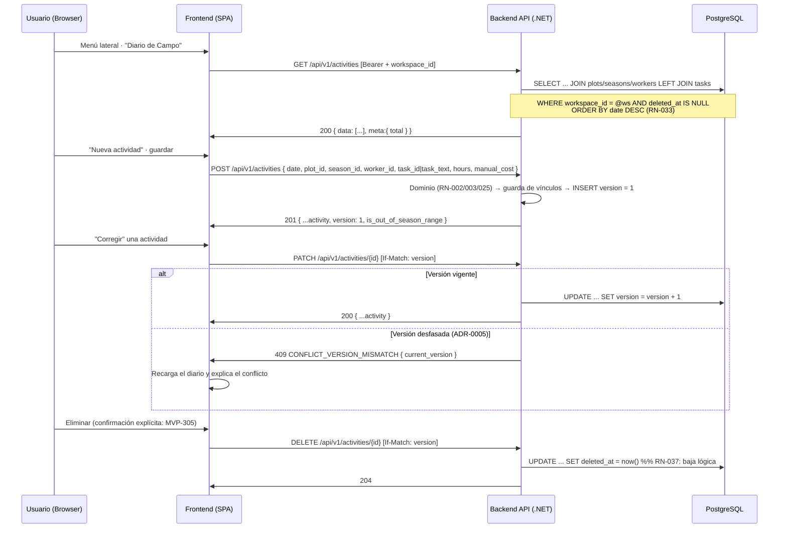

# TDD: MVP-301 — Registro y edición de actividades

> **Referencia al spec**: [spec.md](./spec.md)

## Resumen técnico

Primera **entidad operativa** del producto: `ACTIVITY` (`activities`, agregado y tabla nuevos) con
terreno, temporada, responsable, tarea, horas y coste manual (RN-001, RN-002, RN-003, RN-021,
RN-025). Los endpoints ya estaban contratados en `contratos-api.md` §5.

Además del CRUD, esta historia estrena tres piezas **transversales** que el resto de la épica hereda
sin volver a construirlas:

1. **Concurrencia optimista** (`ADR-0005`): `version` en el registro, `If-Match` obligatorio en
   `PATCH`/`DELETE`, `409 CONFLICT_VERSION_MISMATCH` y manejo del conflicto en el cliente.
2. **Eliminación lógica** (`RN-037`): `deleted_at`, con el filtro de «vivo» en el puerto del
   repositorio, no en un filtro global de EF.
3. **Guarda de vínculos** (`FOREIGN_KEY_WORKSPACE_MISMATCH`): los maestros referenciados deben ser del
   Workspace activo.

Todo es Workspace-first (`[RequireWorkspaceScope]`, MVP-105): el Workspace se resuelve en servidor y
nunca viaja como parámetro (RN-034).

### Decisiones de producto y de diseño tomadas en esta historia

- **`P-028` cerrado: la tarea de `ACTIVITY` es `task_id?` + `task_text?`, excluyentes.** El ER
  declaraba un `string task` suelto, anterior al catálogo de MVP-205, mientras el contrato ya preveía
  los dos campos. Se materializan ambos: FK opcional a `tasks` (`ON DELETE RESTRICT`) más texto libre
  acotado a la **misma longitud** que el nombre del catálogo (120), para que una tarea escrita al
  vuelo siempre quepa al guardarse en él (MVP-302). El dominio exige **exactamente uno**: guardar los
  dos permitiría que divergieran y el diario no sabría cuál mostrar. La respuesta añade `task`, ya
  resuelto, para que ningún cliente rehaga ese `??`.
- **El diario vive en `/app/diario`, no sustituye al Home** (decisión del PO, 2026-07-29). RN-033 lo
  define como «la vista principal del MVP», pero `P-040` asignó a `MVP-004` la decisión de qué pasa
  con el Home cuando llegue la Visión General. Se enciende como sección propia del menú y el Home
  pasa a conducir a él con un CTA primario; el checklist «Prepara tu explotación» de MVP-207 se queda
  como está. Alternativas descartadas: convertir `/app` en el diario (adelanta una decisión de
  MVP-004 y toca una entrega ya validada) y redirigir condicionalmente desde `/app` (comportamiento
  condicional difícil de explicar).
- **La captura no usa el modal único con pestañas del prototipo** (decisión del PO). El
  `ActivityModal` del prototipo mezcla Labor/Riego/Cosecha/Compra; en la KB del MVP no existe
  «riego», la cosecha es de `MVP-401` y las compras tienen su propia superficie. El diario abre un
  formulario **de actividad**, y compras y consumos se capturan en `/app/compras` (MVP-303/304). Ver
  «Impacto en la usabilidad».
- **`If-Match` ausente responde `400 VALIDATION_REQUIRED_IF_MATCH`**, no `428`. El contrato exige la
  cabecera pero su tabla de errores estándar no contempla `428 Precondition Required`; añadir un
  código a la familia `VALIDATION_*` que ya existe es coherente con el resto de la API y no obliga a
  que el cliente maneje un status nuevo. Se acepta la versión en las tres formas que un cliente HTTP
  correcto puede enviar (`3`, `"3"`, `W/"3"`) y se rechaza `*`, que significa «cualquier versión»:
  justo lo que el bloqueo optimista existe para impedir.
- **El `409` lleva `current_version` en el cuerpo.** El contrato solo fija el código; devolver además
  la versión vigente es lo que permite al cliente resolver el conflicto refrescando en vez de dejar
  al usuario en un callejón (CA-4).
- **El aviso de fecha fuera de rango (RN-023) se calcula en lectura, no se persiste.** La respuesta
  incluye `is_out_of_season_range`, derivado de la fecha y del rango de la temporada. Así el aviso
  sigue siendo correcto si la temporada se edita después, y el diario puede marcarlo sin pedir el
  maestro. En el formulario se calcula también en cliente para que aparezca mientras se escribe.
- **El coste nunca se calcula en servidor** (RN-003, CA-3). La tarifa horaria del responsable
  (`workers.hourly_rate`, MVP-204) se usa solo para ofrecer un **cálculo de un clic** en la UI que
  rellena el campo; el valor que se persiste lo escribe siempre la persona.
- **Los maestros inactivos siguen siendo referenciables.** La UI ofrece solo los activos para
  registros nuevos (CA-3 de MVP-202/204/205), pero la guarda de vínculos no filtra por `is_active`:
  corregir una actividad antigua que referencia un terreno ya inactivado no puede obligar a
  reactivarlo. Inactivar deja de ofrecer, no invalida el histórico.

## Diagrama de flujo



## Componentes afectados

### Backend

| Componente | Tipo de cambio | Descripción |
| ---------- | -------------- | ----------- |
| `Domain/Activities/Activity.cs` | nuevo | Agregado; `Create`/`Update`/`Delete`/`EnsureVersion`, reglas RN-001..RN-025 y el par excluyente de tarea |
| `Domain/Activities/IActivityRepository.cs` | nuevo | Puerto + `ActivityFilter` + `ActivityView` (proyección de lectura con `IsOutOfSeasonRange`) |
| `Domain/Activities/ActivityValidationException.cs` | nuevo | Error de validación con código de contrato (400) |
| `Domain/Operations/ConcurrencyConflictException.cs` | nuevo | **Transversal**: colisión de versión (409) para todas las entidades operativas críticas |
| `Common/Http/IfMatchHeader.cs` | nuevo | **Transversal**: lectura de `If-Match` (entero, `"n"`, `W/"n"`; rechaza `*`) |
| `Application/Activities/Commands/ActivityCommands.cs` | nuevo | `CreateActivityCommand`, `UpdateActivityCommand` (`FieldUpdate`), `DeleteActivityCommand` |
| `Application/Activities/ActivityLinkResolver.cs` | nuevo | Guarda de `FOREIGN_KEY_WORKSPACE_MISMATCH` sobre los cuatro vínculos |
| `Application/Activities/{Create,Update,Delete,List}ActivityHandler.cs` | nuevo | Casos de uso |
| `Infrastructure/Data/Repositories/ActivityRepository.cs` | nuevo | Adaptador EF Core (filtro de vivos, proyección con `JOIN`, orden, traducción del conflicto) |
| `Infrastructure/Data/Migrations/20260729063116_AddActivities.cs` | nuevo | Crea `activities`, índice parcial `ix_activities_live_by_date` e índices de filtro |
| `Controllers/ActivitiesController.cs` | nuevo | `GET/POST/PATCH/DELETE /activities` con `[RequireWorkspaceScope]` |
| `Common/Errors/{ErrorCodes,ApiError}.cs` | modificado | Códigos de actividad, `VALIDATION_REQUIRED_IF_MATCH`, `FOREIGN_KEY_WORKSPACE_MISMATCH`, `CONFLICT_VERSION_MISMATCH` |
| `Infrastructure/Data/TerrenarioDbContext.cs` | modificado | Mapeo de `Activity` + `DbSet` + token de concurrencia |
| `Program.cs` | modificado | DI del repositorio, el resolutor de vínculos y los handlers |

### Frontend

| Componente | Tipo de cambio | Descripción |
| ---------- | -------------- | ----------- |
| `types/activity.types.ts` · `services/activity.service.ts` | nuevo | Tipos y servicio sobre el cliente HTTP común (P-007), con `If-Match` |
| `services/http-client.ts` | modificado | `RequestOptions.headers` (no puede sobrescribir `Authorization`) |
| `components/diary/DiarioView.tsx` | nuevo | Muro cronológico, filtros, alta/corrección y manejo del 409 |
| `components/diary/ActivityFormModal.tsx` | nuevo | Formulario con autoselección de temporada, aviso RN-023 y sugerencia de coste |
| `App.tsx` | modificado | Ruta `/app/diario` (fuera de la guarda de oferta de temporada) |
| `components/layout/AppSidebar.tsx` | modificado | «Diario de Campo» deja de estar en «Pronto» |
| `components/layout/AppLayout.tsx` | modificado | Título de cabecera de la ruta |
| `components/home/HomeView.tsx` | modificado | CTA primario al diario y copy actualizado |

## Diseño detallado

### Modelo de datos

```sql
CREATE TABLE activities (
    id           UUID PRIMARY KEY,
    workspace_id UUID NOT NULL REFERENCES workspaces(id) ON DELETE CASCADE,
    plot_id      UUID NOT NULL REFERENCES plots(id)      ON DELETE RESTRICT,
    season_id    UUID NOT NULL REFERENCES seasons(id)    ON DELETE RESTRICT,
    worker_id    UUID NOT NULL REFERENCES workers(id)    ON DELETE RESTRICT,
    date         DATE NOT NULL,
    hours        NUMERIC(5,2)  NOT NULL,
    task_id      UUID NULL     REFERENCES tasks(id)      ON DELETE RESTRICT,
    task_text    VARCHAR(120) NULL,
    manual_cost  NUMERIC(10,2) NOT NULL,
    description  VARCHAR(500) NULL,
    created_by   UUID NOT NULL,
    created_at   TIMESTAMPTZ NOT NULL,
    updated_by   UUID NOT NULL,
    updated_at   TIMESTAMPTZ NOT NULL,
    version      BIGINT NOT NULL,
    deleted_at   TIMESTAMPTZ NULL
);

CREATE INDEX ix_activities_live_by_date
    ON activities (workspace_id, date) WHERE deleted_at IS NULL;
```

- **`ix_activities_live_by_date` es parcial** porque el 100% de las lecturas filtra por «vivo», igual
  que `ix_workspaces_live` en MVP-206. Los índices de filtro `(workspace_id, plot_id)` y
  `(workspace_id, season_id)` los generará también el dashboard de MVP-004.
- **Los maestros se referencian con `RESTRICT`.** No se borran (se inactivan), así que la semántica
  correcta es impedir que un borrado futuro deje operativa huérfana. En `task_id`, `SET NULL`
  degradaría la actividad a «sin tarea», que RN-025 prohíbe.
- **`version` es token de concurrencia de EF** además de incrementarse en el dominio: la guarda de
  aplicación cubre el caso normal y el token cubre dos escrituras simultáneas que partan de la misma
  versión (se traduce a 409, no a 500).
- **No hay `deleted_by`**: el ER no lo declara para `ACTIVITY` y `updated_by` ya registra quién
  ejecutó la baja.

### API / Contratos

```yaml
# GET /api/v1/activities            [RequireWorkspaceScope]
query: { from?, to?, plot_id?, season_id?, worker_id? }   # fechas YYYY-MM-DD
responses:
  200: { data: [ {...activity} ], meta: { total } }   # orden: date DESC, created_at DESC
  400: { error: { code: "VALIDATION_REQUIRED" } }     # from/to mal formados

# POST /api/v1/activities           [RequireWorkspaceScope]
request: { date*, plot_id*, season_id*, worker_id*, task_id? | task_text?, hours*, manual_cost*, description? }
responses:
  201: { ...activity, version: 1 }
  400: VALIDATION_ACTIVITY_REQUIRED_FIELDS | VALIDATION_ACTIVITY_TASK_REQUIRED
     | VALIDATION_ACTIVITY_TASK_TEXT_LENGTH | VALIDATION_ACTIVITY_HOURS_RANGE
     | VALIDATION_ACTIVITY_COST_RANGE | VALIDATION_ACTIVITY_DESCRIPTION_LENGTH
     | FOREIGN_KEY_WORKSPACE_MISMATCH

# PATCH /api/v1/activities/{id}     [RequireWorkspaceScope]   If-Match: <version>
request: cualquier subconjunto de { date, plot_id, season_id, worker_id, task_id, task_text, hours, manual_cost, description }
responses:
  200: { ...activity }
  400: VALIDATION_REQUIRED_IF_MATCH | (mismos códigos del alta)
  404: RESOURCE_NOT_FOUND            # inexistente, de otro Workspace o ya eliminada
  409: CONFLICT_VERSION_MISMATCH { current_version }

# DELETE /api/v1/activities/{id}    [RequireWorkspaceScope]   If-Match: <version>
responses: 204 | 400 VALIDATION_REQUIRED_IF_MATCH | 404 | 409 CONFLICT_VERSION_MISMATCH
```

Representación de una actividad:
`{ id, workspace_id, date, plot_id, plot_name, season_id, season_name, worker_id, worker_name,
task_id, task_name, task_text, task, hours, manual_cost, description, is_out_of_season_range,
version, created_at, updated_at }`.

Los nombres de los maestros llegan resueltos en la misma consulta para que el diario no tenga que
pedirlos por separado; `task` y `is_out_of_season_range` son derivados, no columnas.

### Lógica de negocio

- **Alta (CA-1).** El dominio valida forma y reglas **antes** de consultar los maestros, para que una
  petición mal formada no gaste cuatro consultas. `manual_cost = 0` es válido (labor propia sin coste
  imputado); lo que se rechaza es el negativo. Horas y coste se **redondean en el dominio** a la
  precisión persistida (`decimal(5,2)` y `decimal(10,2)`), para que lo leído coincida con lo escrito.
- **Tarea (RN-025).** Exactamente uno de `task_id`/`task_text`. En el `PATCH`, si viene **cualquiera**
  de los dos se sustituye la pareja completa y el ausente pasa a nulo: enviar solo `task_id` sobre una
  actividad con texto libre dejaría los dos informados y el dominio lo rechazaría, sin que el cliente
  pudiera hacer nada razonable.
- **Fecha fuera de rango (CA-2).** No hay validación: el agregado no conoce la temporada. El aviso se
  deriva en lectura y **nunca bloquea** (RN-023).
- **Concurrencia (CA-4).** `EnsureVersion` se comprueba antes de mutar y antes de resolver vínculos.
  El cliente, ante un 409, cierra el formulario, recarga el diario y explica qué ha pasado.
- **Borrado (RN-037).** `Delete` marca `deleted_at` y sube la versión; es idempotente en el dominio,
  pero el caso de uso responde 404 si ya estaba eliminada, para que el diario no muestre dos veces la
  misma baja. El filtro de vivos vive en el repositorio.
- **Listado.** Filtros y orden se aplican **sobre columnas reales antes de proyectar** (lección de
  `P-014`): sobre el registro ya proyectado, `OrderBy(v => v.Date)` no es traducible porque
  `ActivityView` no es una entidad mapeada. El desempate por fecha de captura se reaplica en memoria
  porque EF+SQLite no traduce `ORDER BY` sobre `DateTimeOffset` (`P-031`).

### Cliente (frontend)

`activity.service` es una fábrica sobre el cliente HTTP común (P-007), extendido con `headers` para
poder enviar `If-Match`. `/app/diario` va **fuera** de la guarda de oferta de temporada, como el resto
del shell: quien entra sin temporada activa ve qué le falta y un enlace al maestro, en vez de un
desvío que no explica nada (misma lección que `P-038`).

## Alternativas descartadas

| Alternativa | Por qué se descartó |
| ----------- | ------------------- |
| Mantener `task` como un único `string` (ER original) | Rompería la reutilización del catálogo de MVP-205 y dejaría `MVP-302` sin nada que guardar |
| Guardar `task_id` **y** `task_text` a la vez | Pueden divergir; RN-025 dice «del catálogo **o** en texto libre» |
| Borrado físico | Contradice RN-037 reformulada y el modelo de datos (`deleted_at`) |
| Filtro global de EF para la baja lógica | El puerto lo hace explícito y no sorprende a quien escriba una consulta nueva; misma decisión que MVP-206 |
| `428 Precondition Required` para `If-Match` ausente | No está en la tabla de errores estándar del contrato; obliga al cliente a manejar un status nuevo sin ganar nada |
| Aceptar `If-Match: *` | Significa «cualquier versión»: anula el bloqueo optimista |
| Persistir el aviso de fecha fuera de rango | Quedaría obsoleto al editar la temporada |
| Calcular el coste desde la tarifa horaria | RN-003: el coste es manual y no se recalcula. La tarifa solo sugiere |
| Filtrar los vínculos por `is_active` | Impediría corregir una actividad que referencia un maestro ya inactivado |
| Diario como pantalla `/app` | Adelanta a MVP-003 una decisión que `P-040` asignó a MVP-004 |
| Modal único con pestañas del prototipo | Mezcla tipos que en el MVP no existen (riego) o no tocan aquí (cosecha, MVP-401) |

## Riesgos e impacto

| Riesgo | Probabilidad | Mitigación |
| ------ | ------------ | ---------- |
| Fuga de datos entre Workspaces | baja | Todo filtra por `workspace_id`; la guarda de vínculos rechaza ids ajenos con 400; verificado con dos Workspaces reales |
| Dos personas pisándose una corrección | media | `version` + `If-Match` + 409, con token de concurrencia de EF como última línea; verificado end-to-end en la UI |
| Pérdida de datos por borrado accidental | baja | Baja lógica (RN-037); la fila permanece en base de datos |
| Pérdida de datos en edición parcial | baja | `FieldUpdate<T>` + test de regresión (cambiar horas no toca tarea ni coste) |
| Mock que no ve la traducción SQL de la proyección | media | Tests SQLite reales del `JOIN`, el `LEFT JOIN` del catálogo, el filtro de vivos, los filtros y el orden (`P-014`) |
| Actividad huérfana si se borrara un maestro | baja | FKs `RESTRICT`; los maestros se inactivan, no se borran |
| El diario crece sin paginación | media | Fuera de alcance del MVP; el contrato ya define el patrón `?page=&limit=`. Registrado en `MVP-999` (`P-051`) |

## Impacto en la usabilidad

- **Una entrada de menú que deja de estar en «Pronto»** («Diario de Campo»). El shell no cambia.
- **El Home conduce al diario** con un CTA primario, y su copy deja de anunciar el diario como
  pendiente. El checklist «Prepara tu explotación» (MVP-207, CA-6) se mantiene intacto.
- **Registrar exige tres maestros poblados** (terreno, responsable y temporada). En vez de ofrecer un
  formulario que fallaría al guardar, el diario dice qué falta y enlaza a cada maestro, y el botón de
  alta queda deshabilitado con su explicación.
- **La temporada se autoselecciona pero queda visible y cambiable** (RN-021): registrar una labor de
  la campaña anterior es un caso real, no una excepción.
- **El aviso de fecha fuera de temporada aparece mientras se escribe** y se repite como etiqueta en la
  tarjeta del diario, sin bloquear en ningún momento (RN-023).
- **La tarea se preselecciona del catálogo** si lo hay, y solo cae al texto libre si está vacío: es
  para lo que existe el catálogo (RN-026). Al corregir manda lo que tenga la actividad.
- **El conflicto de edición no es un callejón**: se recarga el diario, se ve el cambio de la otra
  persona y se explica qué hacer.
- **En esta historia el diario no ofrece eliminar**: el borrado con confirmación explícita es alcance
  de `MVP-305` (la ruta y la semántica ya están entregadas aquí). Es una limitación deliberada de la
  rebanada, no un olvido.
- No se detectan roturas de usabilidad que requieran decisión adicional más allá de las dos que ya
  resolvió el PO (ubicación del diario y forma de la captura).

## Plan de testing

> Referencia: `docs/04-ingenieria/estrategia-testing.md`

- [x] Tests unitarios de dominio (`ActivityTests`): alta completa, tarea del catálogo, tarea ausente,
  tarea duplicada (catálogo + texto), texto de tarea demasiado largo, horas fuera de rango, coste
  negativo frente a coste 0, vínculos vacíos, descripción larga, incremento de versión,
  `EnsureVersion` (acepta la vigente, rechaza la desfasada con `current_version`), borrado lógico
  idempotente y redondeo a la precisión persistida.
- [x] Tests de handlers (NSubstitute) (`ActivityHandlersTests`): alta y persistencia; rechazo de
  terreno y de tarea de otro Workspace sin persistir; validación de dominio **antes** de consultar los
  maestros; 404 fuera del Workspace; 409 con versión desfasada sin guardar; **regresión de `PATCH`
  parcial** (cambiar horas no toca tarea ni coste); sustitución del par de tarea completo; borrado
  lógico; 404 al borrar lo ya borrado; 409 al borrar con versión vieja.
- [x] Tests contra SQLite real (`ActivityRepositorySqliteTests`): resolución de los nombres de los tres
  maestros, `LEFT JOIN` del catálogo con tarea libre, aislamiento entre Workspaces, exclusión de las
  eliminadas (con la fila aún en base de datos), orden por fecha de negocio, los cinco filtros,
  `is_out_of_season_range` y traducción de la colisión de versión a `ConcurrencyConflictException`.
- [x] Tests de la cabecera (`IfMatchHeaderTests`): formas válidas (`3`, `"3"`, `W/"3"`, con espacios) y
  rechazo de ausente/vacía/`*`/no numérica/negativa.
- [x] Verificación end-to-end real (API :5127 + PostgreSQL + UI conducida :5173, con JWT de desarrollo
  firmado con la clave RSA local):
  - API: diario vacío de un Workspace nuevo; alta con tarea libre (texto normalizado); alta con tarea
    del catálogo (`task_name` resuelto); `PATCH` sin `If-Match` → 400 `VALIDATION_REQUIRED_IF_MATCH`;
    `PATCH` con versión vieja → 409 con `current_version`; `PATCH` parcial que **conserva** tarea,
    coste y descripción; fecha fuera de rango → 201 con `is_out_of_season_range: true` (RN-023); sin
    tarea → 400; tarea duplicada → 400; horas 0 → 400; coste negativo → 400; terreno de otro Workspace
    → 400 `FOREIGN_KEY_WORKSPACE_MISMATCH`; `DELETE` sin `If-Match` → 400, con versión → 204,
    repetido → 404; listado tras el borrado sin la eliminada; filtros por rango de fechas y por
    terreno; fecha de filtro inválida → 400; sin token → 401; `PATCH` desde otro Workspace → 404 y
    diario del otro Workspace vacío.
  - Datos: la fila eliminada **sigue en `activities`** con `deleted_at` informado y `version = 2`
    (RN-037).
  - UI conducida: alta desde el formulario con temporada autoseleccionada y tarea del catálogo
    preseleccionada; aviso de fecha fuera de rango visible al cambiar la fecha; orden cronológico
    correcto tras el alta; apertura del formulario de corrección con los valores actuales (incluida
    la tarea libre); **conflicto de versión provocado desde la API mientras el formulario estaba
    abierto** → el diario se recarga, muestra el cambio de la otra persona y explica el conflicto;
    corrección posterior aplicada. Sin errores de consola.
- [ ] Tests de integración contra PostgreSQL de todos los endpoints: pendientes del arnés común
  (`MVP-501`). Tests unitarios de frontend: pendientes de `P-012`/`P-023`.

Resultado local: `dotnet test` en verde (399 tests, 30 nuevos); `npm run build` y `npm run lint` sin
errores nuevos.

> **Incidencia de entorno detectada durante la verificación** (no es un defecto del código): el
> servidor de desarrollo de Vite que estaba levantado servía `index.css` **sin las utilidades de
> Tailwind** (`w-64`, `bg-white`… no se generaban), así que la aplicación se veía sin estilos. El
> build de producción sí las incluye. Se resolvió reiniciando el proceso; queda anotado por si vuelve
> a aparecer.

## Checklist de implementación

- [x] Diseño técnico revisado
- [x] Migración de base de datos preparada y aplicada en local (`AddActivities`)
- [x] Tests escritos y pasando (dominio + handlers + SQLite real + cabecera)
- [x] Documentación de API actualizada (`contratos-api.md` §5 con `If-Match`, códigos, derivados y orden)
- [x] Modelo de datos actualizado (`ACTIVITY` con `task_id`/`task_text`, cierre de `P-028`)
- [x] Puntos de coherencia registrados en `MVP-999` (`P-028` resuelto; `P-051` paginación del diario,
  `P-052` filtros del diario no viajan al servidor)
- [x] Verificación end-to-end real (API + PostgreSQL + UI conducida)
- [x] Sin `TODO` sin resolver en este documento
