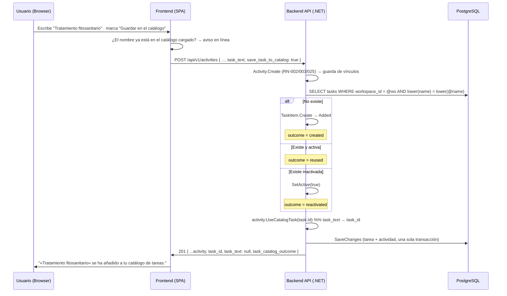

# TDD: MVP-302 — Guardado de tarea libre en catálogo

> **Referencia al spec**: [spec.md](./spec.md)

## Resumen técnico

Una tarea escrita a mano al registrar una actividad (RN-025) puede guardarse en el **catálogo del
Workspace** (RN-026) para no volver a escribirla. Sin entidades nuevas ni migración: la historia une
dos piezas que ya existen —el catálogo de `MVP-205` y la actividad de `MVP-301`— con un servicio de
aplicación y un campo de petición.

`POST /api/v1/activities` y `PATCH /api/v1/activities/{id}` aceptan `save_task_to_catalog`. Cuando
llega, la tarea se resuelve o se crea en el catálogo y la actividad pasa a referenciarla por
`task_id`, todo en la **misma unidad de trabajo**. La respuesta añade `task_catalog_outcome`
(`created` · `reused` · `reactivated`).

### Decisiones de producto y de diseño tomadas en esta historia

- **La guarda de duplicados se reutiliza, no se reconstruye** (`P-026`, cerrado en `MVP-205`; hallazgo
  `R-14` de `MVP-299`). El detalle importante es **cómo** se reutiliza: en vez de intentar crear y
  tratar el `409 CONFLICT_TASK_NAME_DUPLICATE`, se consulta **la misma comparación** —
  `FindByNameAsync` con el criterio de `lower(name)` del índice único `ux_tasks_workspace_name`— para
  **resolver** el nombre. Motivo: en este flujo el 409 no es accionable. Al dar de alta una tarea en
  el maestro, «ya existe» es información útil y el usuario decide; al registrar una labor, un 409 le
  diría «no puedes apuntar esto» por algo que no tiene que arreglar. Lo que quiere es que la labor
  quede apuntada y la tarea disponible, y las dos cosas se cumplen reutilizando la existente (CA-1).
  El `409` sigue existiendo en `POST /tasks`, que es donde tiene sentido.
- **Una tarea inactivada se reactiva, no se duplica.** `MVP-205` (CA-3) ya fijó que las inactivas
  siguen ocupando su nombre y que «se reactivan, no se duplican». Volver a escribir esa labor es
  precisamente la señal de que se quiere disponible otra vez. Se informa con
  `task_catalog_outcome: "reactivated"` para que la UI lo diga y el efecto no sea invisible.
- **La orquestación vive en el servidor, no en el cliente.** La alternativa era que el modal creara la
  tarea (`POST /tasks`), tratara el 409, buscara la existente y luego creara la actividad. Se
  descartó por tres motivos: son tres viajes con una carrera en medio; obligaría a **replicar en el
  cliente** la comparación `lower(trim())` del servidor, que es exactamente la clase de regla que
  acaba divergiendo; y no habría forma de probarla, porque el frontend sigue sin arnés de tests
  (`P-012`). En servidor es un solo viaje, atómico y cubierto por tests.
- **Atomicidad: una sola unidad de trabajo** (CA-3). `TaskCatalogPromoter` **no persiste**; el caso de
  uso de la actividad hace un único `SaveChanges` sobre el mismo `DbContext`. Si la actividad falla,
  la tarea no queda creada; si la tarea no se puede normalizar, la actividad no se guarda. Verificado:
  un alta rechazada por `FOREIGN_KEY_WORKSPACE_MISMATCH` deja el catálogo intacto.
- **La misma ruta sirve para promocionar una actividad ya registrada** (CA-3).
  `PATCH { save_task_to_catalog: true }` **a secas** usa el `task_text` que la actividad ya tiene, sin
  obligar a reescribirlo. Se descartó un endpoint propio (`POST /activities/{id}/task/...`): el
  `PATCH` con `If-Match` ya es la vía de edición y la sustitución del par de tarea que documenta
  `MVP-301` estaba pensada justo para esto.
- **La versión sube una sola vez.** `Activity.UseCatalogTask` sustituye el par sin tocar `version`: en
  el alta forma parte del mismo registro y en la edición `Update` ya la ha movido. Contar dos cambios
  donde el usuario hizo uno rompería el bloqueo optimista de quien tuviera la actividad abierta.
- **Pedirlo sobre una tarea que ya viene del catálogo responde `400`**
  (`VALIDATION_ACTIVITY_TASK_NOT_FREE_TEXT`), no se ignora en silencio: quien lo pide cree que está
  haciendo algo y hay que decirle que no hay nada que guardar.
- **La oferta nunca se marca sola.** RN-026 dice que el sistema «puede **ofrecer** guardar una tarea
  libre»: la casilla nace desmarcada y se reinicia en cada apertura del formulario.
- **El catálogo se carga entero en el diario** (activas e inactivas). El selector sigue ofreciendo
  solo las activas (`MVP-205`, CA-3), pero el aviso de «esta tarea ya está en tu catálogo» tiene que
  ver también las inactivadas, porque siguen ocupando su nombre.

## Diagrama de flujo



## Componentes afectados

### Backend

| Componente | Tipo de cambio | Descripción |
| ---------- | -------------- | ----------- |
| `Application/Tasks/TaskCatalogPromoter.cs` | nuevo | Resuelve o crea la tarea del catálogo; devuelve el `TaskCatalogOutcome`. No persiste |
| `Domain/Tasks/ITaskRepository.cs` | modificado | `FindByNameAsync`: **cuál** es la tarea que ocupa el nombre, no solo si está ocupado |
| `Infrastructure/Data/Repositories/TaskRepository.cs` | modificado | Implementación con el mismo criterio `lower(name)` que la guarda de duplicados |
| `Domain/Activities/Activity.cs` | modificado | `UseCatalogTask(taskId)`: sustituye el par de tarea sin mover la versión |
| `Application/Activities/Commands/ActivityCommands.cs` | modificado | `SaveTaskToCatalog` en alta y edición; `ActivitySaveResult` |
| `Application/Activities/{Create,Update}ActivityHandler.cs` | modificado | Promoción compartida, después de validar y de comprobar vínculos |
| `Controllers/ActivitiesController.cs` | modificado | `save_task_to_catalog` en el cuerpo, `task_catalog_outcome` en la respuesta y traducción de `TaskValidationException` |
| `Common/Errors/ErrorCodes.cs` | modificado | `VALIDATION_ACTIVITY_TASK_NOT_FREE_TEXT` |
| `Program.cs` | modificado | DI del promotor |

### Frontend

| Componente | Tipo de cambio | Descripción |
| ---------- | -------------- | ----------- |
| `types/activity.types.ts` | modificado | `save_task_to_catalog`, `task_catalog_outcome` y los mensajes de cada resultado |
| `services/activity.service.ts` | modificado | `saveTaskToCatalog(activityId, version)` para promocionar una actividad ya registrada |
| `components/diary/ActivityFormModal.tsx` | modificado | Casilla de la oferta, aviso en línea de tarea existente y selector acotado a las activas |
| `components/diary/DiarioView.tsx` | modificado | Catálogo completo, aviso del resultado y acción por tarjeta de tarea libre |

## Diseño detallado

### Modelo de datos

**Sin cambios de esquema ni migración.** La historia usa `tasks` (MVP-205) y la pareja
`activities.task_id` / `activities.task_text` (MVP-301) tal cual están.

### API / Contratos

```yaml
# POST /api/v1/activities        (campo nuevo)
request: { ..., task_text*, save_task_to_catalog?: boolean }
responses:
  201: { ...activity, task_id, task_text: null, task_catalog_outcome: "created"|"reused"|"reactivated" }
  400: VALIDATION_ACTIVITY_TASK_NOT_FREE_TEXT   # la tarea ya viene del catálogo
     | VALIDATION_REQUIRED_TASK_NAME | VALIDATION_TASK_NAME_LENGTH   # códigos del catálogo (MVP-205)

# PATCH /api/v1/activities/{id}  (campo nuevo)   If-Match: <version>
request: { save_task_to_catalog: true }          # a secas: promociona el task_text actual
responses: 200 { ...activity, task_catalog_outcome } | 400 | 404 | 409
```

`task_catalog_outcome` es `null` en las lecturas y cuando no se pidió guardar nada. Los códigos de
validación del nombre son **los del catálogo** (`MVP-205`), no unos nuevos: la tarea la valida quien
la gobierna.

### Lógica de negocio

- **Resolución del nombre.** `TaskItem.NormalizeName` (recorte y longitud) y después
  `FindByNameAsync`. Tres salidas: `Created`, `Reused` y `Reactivated`. La comparación insensible a
  mayúsculas vive en el repositorio, que es donde está el criterio del índice único: aplicación y base
  de datos no pueden discrepar. **No hay normalización de acentos** —«Poda» y «Podá» conviven—, igual
  que en `MVP-205`; sigue fuera de alcance en las dos historias.
- **Orden en el caso de uso.** Validación de dominio → guarda de vínculos → promoción → `SaveChanges`.
  La promoción va la última porque la tarea que crea todavía no está en base de datos y la guarda de
  vínculos la daría por inexistente.
- **Longitudes.** `activities.task_text` está acotado a 120 caracteres, la misma cota que
  `tasks.name` (decisión de `MVP-301`), así que una tarea escrita al vuelo **siempre** cabe en el
  catálogo: el guardado no puede fallar por longitud.

### Cliente (frontend)

Dos puntos de entrada, uno por cada momento en que aparece la necesidad:

1. **Durante la captura** (CA-1): casilla «Guardar esta tarea en el catálogo del Workspace» bajo el
   campo de texto libre, con un aviso en línea que cambia según lo que se escribe («Así podrás
   elegirla la próxima vez» · «Ya está en tu catálogo: se reutilizará…» · «Está inactivada: se
   reactivará…»). El aviso se calcula contra el catálogo ya cargado; el servidor manda igualmente.
2. **Sobre una actividad ya registrada** (CA-3): icono `playlist_add` en las tarjetas cuya tarea es
   texto libre (`task_id === null`). Desaparece en cuanto la tarea pasa al catálogo, que es la señal
   de que ha funcionado.

En ambos casos, al terminar se muestra un aviso con **lo que ha pasado de verdad** (creada,
reutilizada o reactivada), no un «guardado» genérico que mentiría en dos de los tres casos.

## Alternativas descartadas

| Alternativa | Por qué se descartó |
| ----------- | ------------------- |
| Orquestar en el cliente (`POST /tasks` → tratar 409 → `POST /activities`) | Tres viajes con carrera, replica la regla `lower(trim())` del servidor y no es testable sin arnés de frontend (`P-012`) |
| Devolver `409 CONFLICT_TASK_NAME_DUPLICATE` desde el flujo de actividad | El usuario no tiene nada que arreglar: lo que quiere es apuntar la labor. CA-1 pide reutilizar, no rechazar |
| Reconstruir la guarda de duplicados aquí | `P-026` la adelantó a `MVP-205` justamente para no duplicarla |
| Crear una segunda tarea cuando la existente está inactivada | Contradice `MVP-205` (CA-3): las inactivas ocupan su nombre y se reactivan |
| Endpoint propio para promocionar (`POST /activities/{id}/task/...`) | El `PATCH` con `If-Match` ya es la vía de edición y la sustitución del par estaba prevista |
| Subir la versión también en `UseCatalogTask` | Contaría dos cambios donde el usuario hizo uno y rompería el `If-Match` de quien tuviera la actividad abierta |
| Marcar la casilla por defecto | RN-026 lo plantea como una oferta; poblar el catálogo sin pedirlo es un efecto lateral |
| Ignorar en silencio la petición sobre una tarea de catálogo | Quien la pide cree que está haciendo algo |
| Normalizar acentos al comparar | Fuera de alcance declarado en `MVP-205` y en esta historia |

## Riesgos e impacto

| Riesgo | Probabilidad | Mitigación |
| ------ | ------------ | ---------- |
| Duplicados en el catálogo | baja | Se resuelve por el mismo criterio del índice único; verificado que «abonado» reutiliza «Abonado» |
| Tarea creada sin actividad (o al revés) | baja | Una sola unidad de trabajo; verificado que un alta rechazada deja el catálogo intacto |
| Reactivación sorprendente de una tarea inactivada | media | Se avisa **antes** en el formulario y **después** en el diario, con el texto de lo ocurrido |
| Fuga entre Workspaces | baja | `FindByNameAsync` acota por `workspace_id`; verificado que el catálogo del otro Workspace sigue vacío |
| Carrera entre dos altas del mismo nombre | baja | El índice único sigue en pie y `TaskRepository` traduce la violación a 409 |
| El aviso en línea del cliente diverge del servidor | baja | Es informativo: la decisión la toma siempre el servidor, que reutiliza igual aunque el aviso no salte |
| Sin tests automáticos de la UI | media | Toda la lógica de decisión está en el backend y cubierta; la UI solo pinta el resultado (`P-012`) |

## Impacto en la usabilidad

- **No hay pantalla nueva ni entrada de menú nueva.** La oferta aparece donde nace la necesidad, sin
  sacar a nadie del flujo de captura (CA-1).
- **El aviso en línea evita la sorpresa**: antes de guardar ya se sabe si se va a crear, reutilizar o
  reactivar.
- **La acción sobre una actividad ya registrada da señal de que ha funcionado**: el icono desaparece
  y el aviso dice qué ha pasado. Sin eso, pulsar «guardar en el catálogo» no tendría efecto visible.
- **El desplegable de tarea sigue mostrando solo las activas**, salvo la que la propia actividad
  referencia si está inactivada: si no, corregir cualquier otro campo la cambiaría sin querer.
- No se detectan roturas de usabilidad que requieran decisión adicional.

## Plan de testing

> Referencia: `docs/04-ingenieria/estrategia-testing.md`

- [x] Tests del servicio (`TaskCatalogPromoterTests`): alta cuando el nombre está libre; búsqueda con
  el nombre ya normalizado; reutilización sin crear una segunda; reactivación de la inactivada;
  código de error **del catálogo** ante nombre vacío; y que **no persiste** (la atomicidad la aporta
  el caso de uso).
- [x] Tests de handlers (`ActivityHandlersTests`, nuevos): el alta guarda la tarea y la actividad la
  referencia por id con `task_text` a nulo, con **un solo** `SaveChanges`; reutilización de la
  existente; rechazo con `VALIDATION_ACTIVITY_TASK_NOT_FREE_TEXT` cuando la tarea ya viene del
  catálogo; y promoción de una actividad **ya registrada** con la versión subiendo **una sola vez**.
- [x] Tests contra SQLite real (`TaskRepositorySqliteTests`, nuevos): `FindByNameAsync` ignora
  mayúsculas, acota por Workspace y ve las inactivas.
- [x] Verificación end-to-end real (API :5127 + PostgreSQL + UI conducida :5173):
  - API: alta con `save_task_to_catalog` y espacios sobrantes → `created` con el nombre normalizado;
    alta escribiendo «abonado» → `reused` sobre «Abonado» **sin duplicar** el catálogo; tras
    inactivar «Abonado», volver a escribirla → `reactivated` y la tarea vuelve a estar activa;
    petición sobre una tarea de catálogo → `400 VALIDATION_ACTIVITY_TASK_NOT_FREE_TEXT`;
    `PATCH { save_task_to_catalog: true }` a secas sobre una actividad registrada → promociona el
    texto existente, deja `task_text: null` y sube la versión **una sola vez**; repetirlo → 400; sin
    `If-Match` → 400; catálogo del otro Workspace intacto (CA-3).
  - Atomicidad (CA-3): un alta rechazada por `FOREIGN_KEY_WORKSPACE_MISMATCH` pidiendo guardar la
    tarea **no** crea la fila (`SELECT count(*) = 0` en `tasks`).
  - UI conducida: la casilla nace desmarcada; escribir «abonado» muestra «Ya está en tu catálogo: se
    reutilizará «Abonado»»; escribir un nombre nuevo muestra la ayuda genérica; al guardar aparece el
    aviso con el resultado real; el icono de promoción solo sale en las tarjetas de tarea libre y
    desaparece tras usarlo; las cinco tareas guardadas desde el diario se ven en `/app/tareas` sin
    duplicados (CA-2). Sin errores de consola en carga limpia.
- [ ] Tests unitarios de frontend: pendientes de `P-012`/`P-023`. Integración contra PostgreSQL:
  `MVP-501`.

Resultado local: `dotnet test` en verde (411 tests, 12 nuevos); `npm run build` y `npm run lint` sin
errores nuevos.

## Checklist de implementación

- [x] Diseño técnico revisado
- [x] Sin migración: la historia no toca el esquema
- [x] Tests escritos y pasando (servicio + handlers + SQLite real)
- [x] Documentación de API actualizada (`contratos-api.md` §3 y §5)
- [x] Modelo de datos revisado (`TASK` documenta la reutilización desde la operativa)
- [x] Puntos de coherencia registrados en `MVP-999` (`P-026` cerrado también por el lado consumidor)
- [x] Verificación end-to-end real (API + PostgreSQL + UI conducida)
- [x] Sin `TODO` sin resolver en este documento
